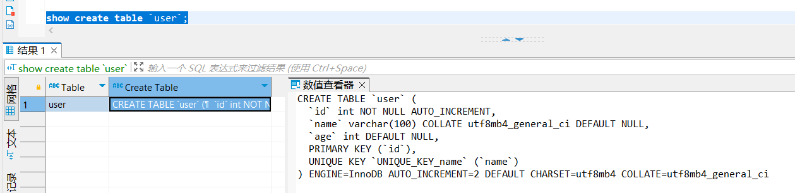
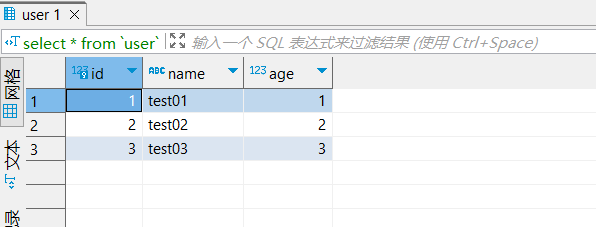
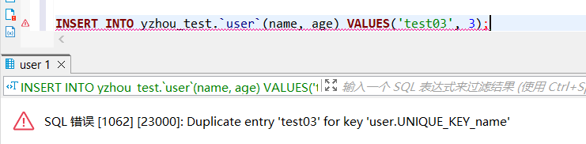
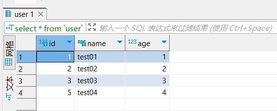
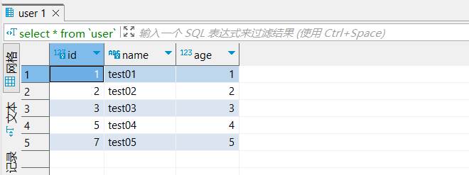
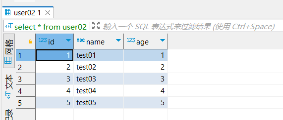
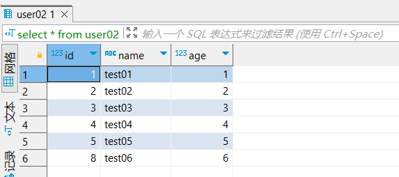

## 导致MySQL自增值不连续的原因

### 引言
在很多开发者一开始接入MySQL的认知中，MySQL的递增主键ID是连续的(博主以前也是这么认为的)，MySQL 中默认的 AUTO_INCREMENT 属性保证了大多数情况下主键的连续性。我们可以通过 show create table 命令在表定义中看到 AUTO_INCREMENT 属性的当前值，当我们向当前表插入数据时，它会使用这个属性的值作为插入记录的主键，并且它每次我们得到值时都会加一。但是我们在和MySQL打交道的过程中遇到两个问题：   
* 一是记录的主键不连续
* 可能会创建多条主键相同的记录。

下面从两个角度来回答MySQL主键不连续的原因：

### 自增值保存在哪儿
在这个user表里面执行`INSERT INTO `user`(name, age) VALUES('test01', 1);` 插入一行数据，再执行 show create table user 命令，就可以看到如下图所示的结果：


可以看到，表定义里面出现了一个AUTO_INCREMENT=2，表示下一次插入数据时，如果需要自动生成自增值，会生成 id=2。 

其实，这个输出结果容易引起这样的误解:自增值是保存在表结构定义里的。实际上，表的结构定义存放在后缀名为.frm的文件中，但是并不会保存自增值。   

不同的引擎对于自增值的保存策略不同。     
* MylSAM引擎的自增值保存在数据文件中。   
* InnoDB引擎的自增值，其实是保存在了内存里，并且到了MySQL 8.0版本后，才有了“自增值持久化”的能力，也就是才实现了“如果发生重启，表的自增值可以恢复为MySQL重启前的值”，具体情况是:      
    1.在MySQL 5.7及之前的版本，自增值保存在内存里，并没有持久化。每次重启后，第一次打开表的时候，都会去找自增值的最大值max(id)，然后将 max(id)+1作为这个表当前的自增值。  

    举例来说，如果一个表当前数据行里最大的 id是10，AUTO_INCREMENT=11。这时候，我们删除id=10的行，AUTO_INCREMENT还是11。但如果马上重启实例，重启后这个表的AUTO_INCREMENT就会变成10。 
    也就是说，MySQL重启可能会修改一个表的AUTO_INCREMENT 的值。.

    2.在MySQL 8.0版本，将自增值的变更记录在了redo log中，重启的时候依靠redo log 恢复重启之前的值。

理解了MySQL对自增值的保存策略以后，我们再看看自增值修改机制。

### 自增值修改机制

在 MySQL里面，如果字段 id 被定义为 AUTO_INCREMENT，在插入一行数据的时候，自增值的行为如下： 
1. 如果插入数据时 id 字段指定为 0、null 或未指定值，那么就把这个表当前的 AUTO_INCREMENT 值填到自增字段；    
2. 如果插入数据时 id 字段指定了具体的值，就直接使用语句里指定的值。     
根据要插入的值和当前自增值的大小关系，自增值的变更结果也会有所不同。假设，某次要插入的值是 X，当前的自增值是 Y。   
1. 如果X<Y，那么这个表的自增值不变;     
2. 如果X≥Y，就需要把当前自增值修改为新的自增值。        
**新的自增值生成算法是**:从auto_increment_offset开始，以auto_increment_increment为步长，持续叠加，直到找到第一个大于X的值，作为新的自增值。

其中,auto increment offset和auto_increment_increment是两个系统参数，分别用来表示自增的初始值和步长，默认值都是1。   

>备注:在一些场景下，使用的就不全是默认值。比如，双M的主备结构里要求双写的时候，我们就可能会设置成auto_increment_increment=2，让一个库的自增id都是奇数，另一个库的自增id都是偶数，避免两个库生成的主键发生冲突。 

当auto_increment_offset和auto_increment_increment都是1的时候，新的自增值生成逻辑很简单，就是:   
1. 如果准备插入的值>=当前自增值，新的自增值就是“准备插入的值+1”;    
2. 否则，自增值不变。   
这就引入了我们文章开头提到的问题，在这两个参数都设置为1的时候，自增主键id却不能保证是连续的，这是什么原因呢?    


### 导致自增值不连续原因
`Table示例SQL`
```sql
CREATE TABLE `user` (
  `id` int NOT NULL AUTO_INCREMENT,
  `name` varchar(100) COLLATE utf8mb4_general_ci DEFAULT NULL,
  `age` int DEFAULT NULL,
  PRIMARY KEY (`id`)
) ENGINE=InnoDB DEFAULT CHARSET=utf8mb4 COLLATE=utf8mb4_general_ci;
```

`初始化数据`
```sql
INSERT INTO `user`(name, age) VALUES('test01', 1);
INSERT INTO `user`(name, age) VALUES('test02', 2);
INSERT INTO `user`(name, age) VALUES('test03', 3);
```


#### 唯一键冲突

**检查数据**
```shell
select * from `user`;
```


**插入name=test03数据**
为了模拟“唯一键冲突”，此时将name增加`唯一约束`  
```shell
ALTER TABLE `user` ADD CONSTRAINT UNIQUE_KEY_name UNIQUE KEY (name);
```
此时，往`user`表中添加name=test03的数据,执行结构报错，提示test03已存在
```sql
INSERT INTO yzhou_test.`user`(name, age) VALUES('test03', 3);
```


**插入name=test04数据**
若此时插入name=test04时，那么id会被如何赋值？
```sql
INSERT INTO yzhou_test.`user`(name, age) VALUES('test04', 4);
```


当插入name=test04时，此时的id被赋值为5， 这样便出现了递增id不连续现象。


#### 事务回滚
开启一个事务插入name=test05的数据，第一次的插入SQL再提交事务之后执行的是回滚，而第二次插入的SQL提交事务后是执行，那name=test05的id是多少呢？
```sql
begin;
INSERT INTO yzhou_test.`user`(name, age) VALUES('test05', 5);
rollback;

begin;
INSERT INTO yzhou_test.`user`(name, age) VALUES('test05', 5);
COMMIT;
```



当执行第二个SQL时，id=7，这样便出现了递增id不连续现象。

#### 批量插入
创建`user02`表,此时注意 user02表的id从1开始，所以1开始递增，故user表与user02表的递增id不一致。
```sql
drop table user02;
create table user02 like user;
INSERT INTO yzhou_test.`user02`(name, age) select name,age from `user`;
```


那如果我们现在插入一个name=test06，那id是几呢？ 
```sql
INSERT INTO yzhou_test.`user02`(name, age) VALUES('test06', 6);
```



当执行插入name=test06时，id=8，这样便出现了递增id不连续的现象，这又是为什么呢？


在生产上，尤其是有insert ... select这种批量插入数据的场景时，从并发插入数据性能的角度考虑，建议设置: innodb_autoinc_lock_ mode=2，并且 binlog_format=row.这样做，既能提升并发性，又不会出现数据一致性问题。 

需要注意的是，说的批量插入数据，包含的语句类型是insert ... select、replace ... select和load data语句。  

但是，在普通的insert语句里面包含多个value值的情况下，即使innodb_autoinc_lock_mode设置为1，也不会等语句执行完成才释放锁。因为这类语句在申请自增id 的时候，是可以精确计算出需要多少个id 的，然后一次性申请，申请完成后锁就可以释放了。    

也就是说，批量插入数据的语句，之所以需要这么设置，是因为“不知道要预先申请多少个id”。    

既然预先不知道要申请多少个自增id，那么一种直接的想法就是需要一个时申请一个。但如果一个select ... insert语句要插入10万行数据，按照这个逻辑的话就要申请10万次。显然，这种申请自增id 的策略，在大批量插入数据的情况下，不但速度慢，还会影响并发插入的性能。    
因此，对于批量插入数据的语句，MySQL有一个批量申请自增id 的策略:     
1. 语句执行过程中，第—次申请自增id，会分配1个;  
2. 1个用完以后，这个语句第二次申请自增id，会分配2个; 
3. 2个用完以后，还是这个语句，第三次申请自增id，会分配4个;   
4. 依此类推，同一个语句去申请自增id，每次申请到的自增id个数都是上一次的两倍。    


refer
1. https://www.sobyte.net/post/2021-12/whys-the-design-mysql-auto-increment/
2. https://www.bilibili.com/video/BV1JM41157cr/?spm_id_from=333.880.my_history.page.click&vd_source=89b3f4bd088c6355f40a00df74cf8ffd
3. https://time.geekbang.org/column/article/80531?utm_source=pinpaizhuanqu&utm_medium=geektime&utm_campaign=guanwang&utm_term=guanwang&utm_content=0511