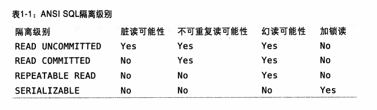

# Mysql 事务

## 事务介绍

事务是一组原子性的SQL查询，或者说一个独立的工作单元。如果数据库引擎能够成功地对数据库应用该组查询的全部语句，那么就执行该组查询。如果其中任何一条语句因为崩溃或其他原因无法执行，那么所有的语句都不会执行。也就是说，事务内的语句，要么全部成功，要么全部执行失败。         

银行应用是解释事务必要性的一个经典例子。假设一个银行的数据库有两张表：支票(checking)表和储蓄(savings)表。现在要从用户Jane的支票账户转移200美元到她的存储账户，那么需要至少三个步骤：        
1. 检查支票账户的余额高于200美元    
2. 从支票账户余额中减去200美元  
3. 从储蓄账户余额中增加200美元  
上述三个步骤的操作必须打包在一个事务中，任何一个步骤失败，则必须回滚所有的步骤。        
可以用START TRANSACTION语句开始一个事务，然后要么使用COMMIT提交事务将修改的数据持久保留，要么使用ROLLBACK撤销所有的修改。事务SQL的样本如下：    
```sql
1 STRAT TRANSACTION
2  SELECT balance FROM checking WHERE customer_id = 10233276;
3 UPDATE checking SET balance = balance - 200.00 WHERE customer_id = 10233276;
4 UPDATE savings SET balance = balance + 200.00 WHERE customer_id = 10233276;
5 COMMIT;
```
单纯的事务概念并不是故事的全部。试想一下，如果执行到第四条语句时服务器崩溃了，会发生什么？ 天知道，用户可能会损失200美元。再假如，在执行到第三条语句和第四条语句之间时，另外一个进程要删除支票账户的所有余额，那么结果可能就是银行在不知道的这个逻辑的情况下白白给了Jane200美元。       
除非系统通过严格的ACID测试，否则空谈事务的概念是不够的。ACID表示原子性(atomicity)、一致性(consistency)、隔离性(isolation)和持久性(durability)。一个运行良好的事务处理系统，必须具备这些标准特征。

## ACID

### 原子性(atomicity)
一个事务必须被视为一个不可分割的最小工作单元，整个事务中的所有操作要么全部提交成功，要么全部失败回滚，对于一个事务来说，不可能只执行其中的一部分操作，这就是事务的原子性。      
### 一致性(consistency)
数据库总是从一个一致性的状态转换到另外一个一致性的状态。在前面的例子中，一致性确保了，即使在执行第三、四条语句之间时系统崩溃，支票账户中也不会损失200美元，因为事务最终没有提交，所以事务中所做的修改也不会保存到数据库中。 
### 隔离性(isolation)       
通常来说，一个事务所做的修改在最终提交以前，对其他事务是不可见的。在前面的例子中，当执行完第三条语句、第四条语句还未开始时，此时有另外一个账户汇总程序开始运行，则其看到的支票账户的余额并没有被减去200美元。后面我们讨论隔离级别(Isolation level)的时候，会发现为什么我们要说“通常来说”是不可见的。        
### 持久性(durability)
一旦事务提交，则其所做的修改就会永久保存到数据库中。此时即使系统崩溃，修改的数据也不会丢失。持久性是个有点模糊的概念，因为实际上持久性也分很多不同的级别。有些持久性策略能够提供非常强的安全保障，而有些则未必。而且不可能有能做到100%的持久性保证的策略(如果数据库本身就能做到真正的持久性，那么备份又怎么能增加持久性呢？)。

## 隔离级别
隔离性其实比想象的要复杂。在SQL标准中定义了四种隔离级别，每一种级别都规定了一个事务中所做的修改，哪些再事务内和事务间是可见，哪些事不可见的。较低级别的隔离通常可以执行更高的并发，系统的开销也更低。

**下面简单地介绍一下四种隔离级别**

### READ UNCOMMITTED(未提交读)
在READ UNCOMMITTED级别，事务中的修改，即使没有提交，对其他事务也都是可见的。事务可以读取未提交的数据，这也被称为`脏读`(Dirty Read)。这个级别会导致很多问题，从性能上来说，READ UNCOMMITTED不会比其他的级别好太多，但却缺乏其他级别的很多好处，除非真的有非常必要的理由，在实际应用中一般都很少使用。    

### READ COMMITTED(提交读)
大多数数据库系统的默认隔离级别都是READ COMMITTED(但Mysql不是)。READ COMMITTED满足前面提到的隔离性的简单定义：一个事务开始时，只能“看见”已经提交的事务所做的修改。换句话说，一个事务从开始直到提交之前，所做的任何修改对其他事务都是不可见的。这个级别有时候也叫做不可重复读(nonrepeatable read),因为两次执行同样的查询，可能会得到不一样的结果。

### REPEATABLE READ(可重复读)
REPEATABLE READ解决了脏读的问题。该级别保证了在同一个事务中多次读取同样记录的结果是一致的。但是理论上，可重复读隔离级别还是无法解决另外一个幻读(Phantom Read)的问题。所谓幻读，指的是当某个事务在读取某个范围内的记录时，另外一个事务又在该范围内插入了新的记录，当之前的事务再次读取该范围的记录时，会产生幻行(Phantom Row)。InnoDB和XtraDB存储引擎通过多版本并发控制(MVCC，Multiversion Concurrency Control)解决了幻读的问题。        
可重复度是Mysql的默认事务隔离级别。     

### SERIALIZABLE
SERIALIZABLE是最高的隔离级别。它通过强制事务串行执行，避免了前面说的幻读的问题。简单来说，SERIALIZABLE会在读取的每一行数据上都加锁，所以可能导致大量的超时和锁争用的问题。实际应用中也很少用到这个隔离级别，只有在非常需要确保数据的一致性而且可以接受没有并发的情况下，才考虑采用该级别。 




# Reference
[1]《高性能Mysql》 第三版
