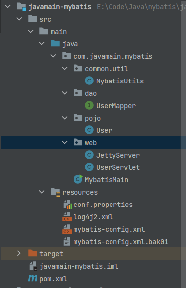

## Mybatis源码环境搭建(3.5.14-SNAPSHOT)

### 1. 准备工作
克隆 `mybatis-3`、`parent`、`spring` 3个项目
```
github clone https://github.com/mybatis/mybatis-3

github clone https://github.com/mybatis/parent

git clone https://github.com/mybatis/spring
```


### 2. 导入Idea
因为 `mybatis-3`、`parent`、`spring`3个项目源码结构并不在一个project中，所以需要单独创建一个空项目，通过源码导入这三个模块。

实现步骤如下：  
**创建空项目**
File ->  New  ->  Project  ->  Empty Project  创建一个空Project：    


**导入模块**
File ->  New  ->  Module from Existing Sources


### 3. 添加测试项目
目前已经将`mybatis-3`、`parent`、`spring`3个项目导入到同一个project中，现在添加测试项目，用来调试mybatis源码

整体结构如下：  


该模块用Jetty Server搭建Rest API服务模拟HTTP请求，用MYbatis查询MySQL USER数据；

>负责初始化Mybatis的SqlSessionFactory和创建JettyServer启动类

**MybatisMain**
```java

public class MybatisMain {
    public static void main(String[] args) throws Exception {

        MybatisUtils.initSqlSession();

        JettyServer jettyServer = new JettyServer();
        jettyServer.start();
    }
}

```


>JettyServer,Userservlet 构建了HTTP接口服务

**JettyServer**
```java
public class JettyServer {

    public void start() throws Exception {
        Server server = new Server(8080);

        ServletContextHandler context = new ServletContextHandler(ServletContextHandler.SESSIONS);
        context.setContextPath("/");
        server.setHandler(context);

        context.addServlet(new ServletHolder(new UserServlet()), "/user");

        server.start();
        server.join();
    }
}
```

**UserServlet**
```java
public class UserServlet extends HttpServlet {
    private Gson gson = new Gson();

    @Override
    protected void doPost(HttpServletRequest req, HttpServletResponse resp) throws ServletException, IOException {
        BufferedReader reader = new BufferedReader(new InputStreamReader(req.getInputStream()));
        User user = gson.fromJson(reader, User.class);

        // Process the user data (e.g., save it to a database or perform some calculations)
        user.setAge(user.getAge() + 1);

        resp.setContentType("application/json");
        resp.setStatus(HttpServletResponse.SC_OK);
        gson.toJson(user, resp.getWriter());
    }

    @Override
    protected void doGet(HttpServletRequest req, HttpServletResponse resp) throws ServletException, IOException {

        User user = null;

        SqlSessionFactory sqlSessionFactory = MybatisUtils.sqlSessionFactory;
        // 2. 从 SqlSessionFactory 中获取 SqlSession
        try (SqlSession sqlSession = sqlSessionFactory.openSession()) {
            // 3. 获取 Mapper 接口的实例
            UserMapper userMapper = sqlSession.getMapper(UserMapper.class);

            // 4. 调用 Mapper 接口的方法执行 SQL 操作
            int userId = Integer.parseInt(req.getParameter("userId"));
            user = userMapper.getUserById(userId);

            // 5. 处理查询结果
            if (user != null) {
                System.out.println("User ID: " + user.getId());
                System.out.println("User Name: " + user.getName());
                System.out.println("User Age: " + user.getAge());
            } else {
                System.out.println("User not found.");
            }
        }

        resp.setContentType("application/json");
        resp.setStatus(HttpServletResponse.SC_OK);
        gson.toJson(user, resp.getWriter());
    }
}
```

**User**
```java
public class User {
    private Integer id;
    private String name;
    private int age;
    
    public Integer getId() {
        return id;
    }

    public void setId(Integer id) {
        this.id = id;
    }

    public String getName() {
        return name;
    }

    public void setName(String name) {
        this.name = name;
    }

    public int getAge() {
        return age;
    }

    public void setAge(int age) {
        this.age = age;
    }
}
```

**UserMapper**
```java
public interface UserMapper {
    @Select("SELECT * FROM User WHERE id = #{id}")
    User getUserById(int id);
}
```

**MybatisUtils**
```java
public class MybatisUtils {

    public static SqlSessionFactory sqlSessionFactory;

    public static void initSqlSession() throws IOException {
        // 1. 从 XML 配置文件中构建 SqlSessionFactory
        String resource = "mybatis-config.xml";
        Reader reader = Resources.getResourceAsReader(resource);
        sqlSessionFactory = new SqlSessionFactoryBuilder().build(reader);
    }
}

**pom.xml**
核心依赖,注意此时的mybatis要依赖mybatis源码中的`版本`,因为接下来调试的project的mybatis，而不是maven中央仓库的代码。

```xml
<dependency>
    <groupId>org.mybatis</groupId>
    <artifactId>mybatis</artifactId>
    <version>3.5.14-SNAPSHOT</version>
</dependency>

<dependency>
    <groupId>org.eclipse.jetty</groupId>
    <artifactId>jetty-server</artifactId>
    <version>9.4.44.v20210927</version>
</dependency>
<dependency>
    <groupId>org.eclipse.jetty</groupId>
    <artifactId>jetty-servlet</artifactId>
    <version>9.4.44.v20210927</version>
</dependency>
<dependency>
    <groupId>com.google.code.gson</groupId>
    <artifactId>gson</artifactId>
    <version>2.8.9</version>
</dependency>

<dependency>
    <groupId>mysql</groupId>
    <artifactId>mysql-connector-java</artifactId>
    <version>8.0.32</version>
</dependency>

```

**User表**
```sql
-- yzhou_test.`user` definition

CREATE TABLE `user` (
  `id` int NOT NULL AUTO_INCREMENT,
  `name` varchar(100) COLLATE utf8mb4_general_ci DEFAULT NULL,
  `age` int DEFAULT NULL,
  PRIMARY KEY (`id`)
) ENGINE=InnoDB AUTO_INCREMENT=2 DEFAULT CHARSET=utf8mb4 COLLATE=utf8mb4_general_ci;

```

>以上代码完成了测试模块的创建，其中重点是“UserServlet.doGet()”方法，它接口一个userId为1的参数，使用Mybatis查询DB User表。


如果已操作到这里，这时启动`MybatisMain`，会报出一个异常
```
Caused by: java.lang.reflect.InvocationTargetException
	at java.base/jdk.internal.reflect.NativeConstructorAccessorImpl.newInstance0(Native Method)
	at java.base/jdk.internal.reflect.NativeConstructorAccessorImpl.newInstance(NativeConstructorAccessorImpl.java:62)
	at java.base/jdk.internal.reflect.DelegatingConstructorAccessorImpl.newInstance(DelegatingConstructorAccessorImpl.java:45)
	at java.base/java.lang.reflect.Constructor.newInstance(Constructor.java:490)
	at org.apache.ibatis.builder.xml.XMLConfigBuilder.newConfig(XMLConfigBuilder.java:431)
	... 7 more
Caused by: java.lang.IllegalStateException: Cannot enable lazy loading because Javassist is not available. Add Javassist to your classpath.
	at org.apache.ibatis.executor.loader.javassist.JavassistProxyFactory.<init>(JavassistProxyFactory.java:53)
	at org.apache.ibatis.session.Configuration.<init>(Configuration.java:142)
	... 12 more
Caused by: java.lang.ClassNotFoundException: Cannot find class: javassist.util.proxy.ProxyFactory
	at org.apache.ibatis.io.ClassLoaderWrapper.classForName(ClassLoaderWrapper.java:226)
	at org.apache.ibatis.io.ClassLoaderWrapper.classForName(ClassLoaderWrapper.java:103)
	at org.apache.ibatis.io.Resources.classForName(Resources.java:322)
	at org.apache.ibatis.executor.loader.javassist.JavassistProxyFactory.<init>(JavassistProxyFactory.java:51)
```

此时请参考 https://github.com/mybatis/mybatis-3/issues/1295 issue， 将mybatis-3模块pom.xml下的ognl，javassist的optional注释掉即可。内容如下:
```xml

<dependency>
    <groupId>ognl</groupId>
    <artifactId>ognl</artifactId>
    <version>3.3.4</version>
    <scope>compile</scope>
<!--      <optional>true</optional>-->
</dependency>
<dependency>
    <groupId>org.javassist</groupId>
    <artifactId>javassist</artifactId>
    <version>3.29.2-GA</version>
    <scope>compile</scope>
<!--      <optional>true</optional>-->

```

再重新执行启动`MybatisMain`类，在本地执行curl会出下以下内容
```shell
 curl http://localhost:8080/user?userId=1
```


