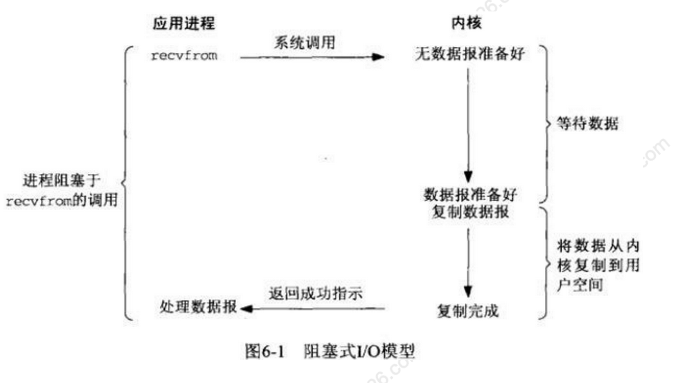
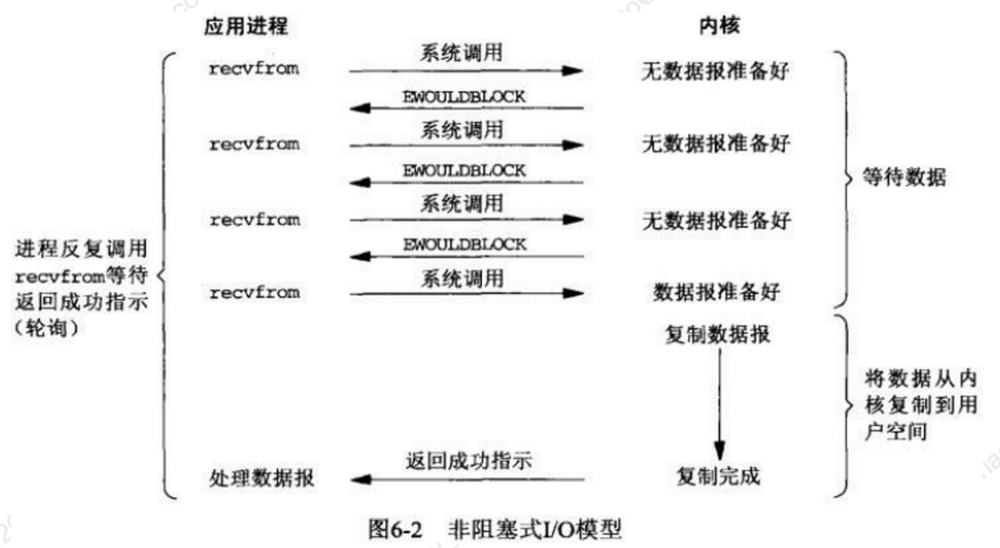
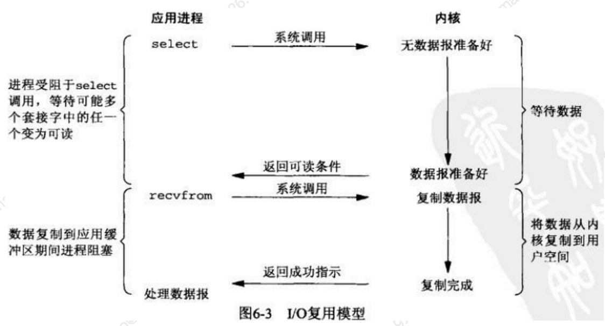

## IO模型

### 同步/异步
同步和异步的概念描述是用户线程与内核的交互方式
* 同步：用户线程发起IO请求后需要等待或者轮询内核IO操作完成后才能继续执行
* 异步：用户线程发起IO请求后仍继续执行，当内核IO操作完成后会通知用户线程，或者调用用户线程注册的回调函数

### 阻塞/非阻塞
阻塞和非阻塞的概念描述的是用户线程调用内核IO操作的方式
* 阻塞：指IO操作要彻底完成之后才返回用户空间
* 非阻塞：IO操作被调用之后立即返回给用户空间状态值，无需等待彻底完成

### 缓存IO
缓存IO又被称作标准IO，大多数文件系统的默认IO操作都是缓存IO。在Linux的缓存IO机制中，操作系统会将IO的数据缓存在文件系统的页缓存（page cache）中，也就是说`数据会先被拷贝到操作系统内核的缓冲区中，然后才会从操作系统内核的缓冲区拷贝到应用程序的地址空间`。
* 缺点： 数据在传输过程中需要在应用程序地址空间和内核进行多次数据拷贝操作，这些数据拷贝操作所带来的cpu以及内核开销是非常大的。

### 什么是IO多路复用
多路复用 IO 模型是目前使用得比较多的模型。Java NIO 实际上就是多路复用 IO。  
在多路复用 IO模型中，会有一个线程不断去轮询多个 socket 的状态，只有当 socket 真正有读写事件时，才真正调用实际的 IO 读写操作。因为在多路复用 IO 模型中，只需要使用一个线程就可以管理多个socket，系统不需要建立新的进程或者线程，也不必维护这些线程和进程，并且只有在真正有socket 读写事件进行时，才会使用 IO 资源，所以它大大减少了资源占用。在 Java NIO 中，是通过 selector.select()去查询每个通道是否有到达事件，如果没有事件，则一直阻塞在那里，因此这种方式会导致用户线程的阻塞。多路复用 IO 模式，通过一个线程就可以管理多个 socket，只有当socket 真正有读写事件发生才会占用资源来进行实际的读写操作。因此，多路复用 IO 比较适合连接数比较多的情况。    

另外多路复用 IO 为何比非阻塞 IO 模型的效率高是因为在非阻塞 IO 中，不断地询问 socket 状态时通过用户线程去进行的，而在多路复用 IO 中，轮询每个 socket 状态是内核在进行的，这个效率要比用户线程要高的多。    

不过要注意的是，多路复用 IO 模型是通过轮询的方式来检测是否有事件到达，并且对到达的事件逐一进行响应。因此对于多路复用 IO 模型来说，一旦事件响应体很大，那么就会导致后续的事件迟迟得不到处理，并且会影响新的事件轮询。    

### IO模型

**同步阻塞IO**
用户线程调用内核IO操作，需要等IO彻底完成后才返回到用户空间，因此是阻塞IO
* 优点：能够及时返回数据，无延迟
* 缺点：对用户来说处于等待就要付出性能的代价了



**同步非阻塞IO**
IO操作被调用后立即返回给用户一个状态值，无需等待IO操作彻底完成，因此是非阻塞。 非阻塞IO中需要用户线程在每个IO通路上，各自不断轮询IO状态，来判断是否可有处理的数据。
* 优点：能够在等待任务完成的时间里干其他事情（包括提交其他任务，也就是“后台”可以有多个任务在同时执行）
* 缺点：任务完成的响应延迟增大了，因为每过一段时间才去轮询一次read操作，而任务可能在两次轮询之间的任意时间完成。这会导致整体数据吞吐量的降低。



**同步IO多路复用**
在非阻塞IO的基础上把一个连接的可读可写事件剥离出来，使用单独的线程来对其进行管理。多个IO通路，都复用这个管理器来管理socket状态。

多路复用在内核中提供了select、poll、epoll三种方式
* select: 只能处理有限（不同系统参数：1024/2048）个socket，select监控socket时不能准确告诉用户是哪个socket有可用数据，需要轮询判断。 


* poll: 与select没区别，采用链表实现，取消了文件个数的限制


* epoll: epoll_wait直接检查链表是不是空就知道是否有文件描述符准备好了，fd上的事件发生时，与它对应的回调函数就会被调用把fd加入链表，其他处于“空闲”状态的则不会被加入epoll从上面链表中获取有事件发生的fd。 `没有最大链接限制`，`可以直接告诉用户程序哪一个，哪个链接有数据了`


IO复用模型图：


### 在Java中如何使用多路复用
```java

public static void main(String[] args) throws IOException {

    int OP_ACCEPT = 1 << 4;
    System.out.println(OP_ACCEPT);

    // 创建NIO ServerSocketChannel
    ServerSocketChannel serverSocket = ServerSocketChannel.open();
    serverSocket.socket().bind(new InetSocketAddress(9001));
    // 设置ServerSocketChannel为非阻塞
    serverSocket.configureBlocking(false);

    // 利用Java Selector IO多路复用

    // 打开Selector处理Channel，即创建epoll
    Selector selector = Selector.open();
    // 把ServerSocketChannel注册到selector上，并且selector对客户端accept连接操作感兴趣
    SelectionKey selectionKey = serverSocket.register(selector, SelectionKey.OP_ACCEPT);
    System.out.println("服务启动成功");

    while (true) {
        // 阻塞等待需要处理的事件发生 已注册事件发生后，会执行后面逻辑
        selector.select();

        // 获取selector中注册的全部事件的 SelectionKey 实例
        Set<SelectionKey> selectionKeys = selector.selectedKeys();
        Iterator<SelectionKey> iterator = selectionKeys.iterator();

        // 遍历SelectionKey对事件进行处理
        while (iterator.hasNext()) {
            SelectionKey key = iterator.next();
            // 如果是OP_ACCEPT事件，则进行连接获取和事件注册
            if (key.isAcceptable()) {
                ServerSocketChannel server = (ServerSocketChannel) key.channel();
                SocketChannel socketChannel = server.accept();
                socketChannel.configureBlocking(false);
                // 这里只注册了读事件，如果需要给客户端发送数据可以注册写事件
                SelectionKey selKey = socketChannel.register(selector, SelectionKey.OP_READ);
                System.out.println("客户端连接成功");
            } else if (key.isReadable()) {  // 如果是OP_READ事件，则进行读取和打印
                SocketChannel socketChannel = (SocketChannel) key.channel();
                ByteBuffer byteBuffer = ByteBuffer.allocate(128);
                int len = socketChannel.read(byteBuffer);
                // 如果有数据，把数据打印出来
                if (len > 0) {
                    System.out.println(Thread.currentThread().getName() +  "接收到消息：" + new String(byteBuffer.array()));
                } else if (len == -1) { // 如果客户端断开连接，关闭Socket
                    System.out.println("客户端断开连接");
                    socketChannel.close();
                }
            }
            //从事件集合里删除本次处理的key，防止下次select重复处理
            iterator.remove();
        }
    }
}


```

