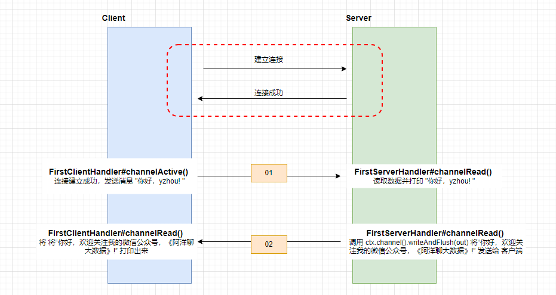
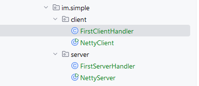

# Netty 开发 Simple 服务端与客户端互相通信        

>该案例完成的是客户端与服务端相互读写数据          
         

## 项目目录结构如下  
  

>代码示例基于之前 blog `Netty 开发 Simple 服务端&客户端应用程序`  

## Server 端改造   

### 创建 FirstServerHandler 处理消息     
`FirstServerHandler#channelRead()`方法打印客户端发送过来的 `msg`,再通过`ctx.channel().writeAndFlush()` 方法回复消息。   

```java
public class FirstServerHandler extends ChannelInboundHandlerAdapter {
    @Override
    public void channelRead(ChannelHandlerContext ctx, Object msg) throws Exception {
        ByteBuf byteBuf = (ByteBuf) msg;
        System.out.println(new Date() + ": 服务端读到数据 -> " + byteBuf.toString(Charset.forName("utf-8")));

        System.out.println(new Date() + ": 服务端写出数据");
        ByteBuf out = getByteBuf(ctx);
        ctx.channel().writeAndFlush(out);
    }

    private ByteBuf getByteBuf(ChannelHandlerContext ctx){
        byte[] bytes = "你好，欢迎关注我的微信公众号，《阿洋聊大数据》!".getBytes(Charset.forName("utf-8"));
        ByteBuf buffer = ctx.alloc().buffer();
        buffer.writeBytes(bytes);
        return buffer;
    }
}
```

### 将 FirstServerHandler 添加到 Server Channel的 消息管道中      
在`ChannelInitializer`的匿名对象中，添加 `FirstServerHandler`，代码：`nioSocketChannel.pipeline().addLast(new FirstServerHandler());`  

```java
public class NettyServer {
    public static void main(String[] args) {
        NioEventLoopGroup bossGroup = new NioEventLoopGroup();
        NioEventLoopGroup workerGroup = new NioEventLoopGroup();

        ServerBootstrap serverBootstrap = new ServerBootstrap();
        serverBootstrap
                .group(bossGroup,workerGroup)
                .channel(NioServerSocketChannel.class)
                .childHandler(new ChannelInitializer<NioSocketChannel>() {
                    @Override
                    protected void initChannel(NioSocketChannel nioSocketChannel) throws Exception {
                        nioSocketChannel.pipeline().addLast(new FirstServerHandler());
                    }
                });
        serverBootstrap.bind(8000);
    }
}
```

## Client 端改造   

### 创建 FirstClientHandler 处理消息     

1.`FirstServerHandler#channelActive()`方法用于处理当连接建立成功后做的一些动作，这里的客户端会通过`ctx.channel().writeAndFlush(buffer);` 发送消息给服务端。      
2.`FirstServerHandler#channelRead()`方法读取服务端发送过来的消息并打印出来。   

```java
public class FirstClientHandler extends ChannelInboundHandlerAdapter {
    @Override
    public void channelActive(ChannelHandlerContext ctx) throws Exception {
        System.out.println(new Date() + ": 客户端写出数据");
        ByteBuf buffer = getByteBuf(ctx);
        ctx.channel().writeAndFlush(buffer);
    }

    private ByteBuf getByteBuf(ChannelHandlerContext ctx){
        ByteBuf buffer = ctx.alloc().buffer();
        byte[] bytes = "你好，yzhou! ".getBytes(StandardCharsets.UTF_8);
        buffer.writeBytes(bytes);
        return buffer;
    }

    @Override
    public void channelRead(ChannelHandlerContext ctx, Object msg) throws Exception {
        ByteBuf byteBuf = (ByteBuf) msg;
        System.out.println(new Date() + ": 客户端读到数据 -> "+ byteBuf.toString(Charset.forName("utf-8")));
    }
}
```

### 将 FirstClientHandler 添加到 Client Channel的 消息管道中      
在`ChannelInitializer`的匿名对象中，添加 `FirstClientHandler`，代码：`socketChannel.pipeline().addLast(new FirstClientHandler());`  

```java
public class NettyClient {
    public static void main(String[] args) {
        NioEventLoopGroup workerGroup = new NioEventLoopGroup();

        Bootstrap bootstrap = new Bootstrap();
        bootstrap
                // 指定线程模型
                .group(workerGroup)
                // 指定 IO 类型为 NIO
                .channel(NioSocketChannel.class)
                // IO 处理逻辑
                .handler(new ChannelInitializer<SocketChannel>() {
                    @Override
                    protected void initChannel(SocketChannel socketChannel) throws Exception {
                        socketChannel.pipeline().addLast(new FirstClientHandler());
                    }
                });

        bootstrap.connect("127.0.0.1",8000).addListener(future -> {
            if (future.isSuccess()){
                System.out.println("连接成功！");
            }else{
                System.out.println("连接失败！");
            }
        });
    }
}
```

## 总结   
FirstClientHandler、FirstServerHandler 继承了`ChannelInboundHandlerAdapter` 来实现某种时刻`生命周期`的行为，例如通过 channelActive() 方法是表示连接建立成功后，channelRead() 方法是读取数据时。      

Client、Server 端都使用 `ctx.channel().writeAndFlush(buffer);` 来回复消息。它并没有固定的范式，可以在 channelActive(),也可以在 channelRead()。    

refer   
1.《跟闪电侠学Netty：Netty即时聊天实战与底层原理》     