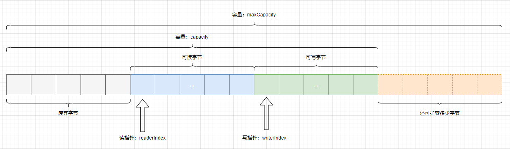

# Netty - 数据载体 ByteBuf       

## 引言   
在之前的 blog `Netty 开发 Simple 服务端&客户端应用程序` 和 `Netty 开发 Simple 服务端与客户端互相通信` 在发送消息时使用`ByteBuf`作为消息内容的载体，示例如下：       
```java
ByteBuf buffer = ctx.alloc().buffer();
byte[] bytes = "你好，yzhou! ".getBytes(StandardCharsets.UTF_8);
buffer.writeBytes(bytes);   
```       

接下来，了解 ByteBuf。在了解 ByteBuf 的同时，也可以了解`JAVA ByteBuffer`, 可访问的blog `Java ByteBuffer讲解` (http://xinzhuxiansheng.com/articleDetail/22)   

## ByteBuf 的结构  
首先，我们来了解一下 ByteBuf 的结构，如下图所示：           
     

从ByteBuf的结构图可以看到：                 
1.ByteBuf是一个字节容器，容器里面的数据分为三部分，第一部分是已经丢弃的字节，这部分数据是无效的；第二部分是可读字节，这部分数据是ByteBuf的主体数据，从ByteBuf里读取的数据都来自这一部分；最后一部分的数据是可写字节，所有写到ByteBuf的数据都会写到这一段。后面的虚线部分表示该ByteBuf最多还能扩容多少容量。    

2.以上三部分内容是被两个指针划分出来的，从左到右依次是读指针（readerIndex）和写指针（writerIndex）。还有一个变量capacity，表示ByteBuf底层内存的总容量。             

3.从ByteBuf中每读取一字节，readerIndex自增1，ByteBuf里总共有writerIndex-readerIndex字节可读。由此可以知道，当readerIndex与writerIndex相等的时候，ByteBuf不可读。            
4.写数据是从writerIndex指向的部分开始写的，每写一字节，writerIndex自增1，直到增到capacity。这个时候，表示ByteBuf已经不可写。        

5.ByteBuf里其实还有一个参数maxCapacity。当向ByteBuf写数据的时候，如果容量不足，则可以进行扩容，直到capacity扩容到maxCapacity，超过maxCapacity就会报错。                     
Netty使用ByteBuf这个数据结构可以有效地区分可读数据和可写数据，读写之间相互没有冲突。   


## ByteBuf 测试示例  
```java
public class ByteBufTest {

    public static void main(String[] args) {
        ByteBuf buffer = ByteBufAllocator.DEFAULT.buffer(9, 100);
        print("allocate ByteBuf(9,100)", buffer);

        // write方法改变写指针，写完之后写指针末到 capacity 的时候，buffer 仍然可写
        buffer.writeBytes(new byte[]{1,2,3,4});
        print("writeBytes(1,2,3,4)",buffer);

        // write方法改变写指针，写完之后写指针末到 capacity 的时候，buffer 仍然可写，写完 int 类型之后，写指针增加4
        buffer.writeInt(12);
        print("writeInt(12)",buffer);

        // write方法改变写指针，写完之后写指针等于capacity的时候，buffer不可写
        buffer.writeBytes(new byte [] {5});
        print("writeBytes(5)", buffer);

        // write方法改变写指针，写的时候发现buffer不可写则开始扩容，扩容之后capacity随即改变
        buffer.writeBytes(new byte [] {6});
        print("writeBytes(6)", buffer);

        // get方法不改变读写指针
        System.out.println("getByte(3) return： " + buffer.getByte(3));
        System.out.println("getShort(3) return： " + buffer.getShort(3));
        System.out.println("getInt(3) return： " + buffer.getInt(3));
        print("getByte()", buffer);

        // set方法不改变读写指针
        buffer.setByte(buffer.readableBytes() + 1, 0);
        print("setByte()", buffer);

        // read方法改变读指针
        byte[] dst = new byte[buffer.readableBytes()];
        buffer.readBytes(dst);
        print("readBytes(" + dst.length + ")", buffer);
    }

    private static void print(String action, ByteBuf buffer) {
        System.out.println("after ===========" + action + "===========");
        System.out.println("capacity(): " + buffer.capacity());
        System.out.println("maxCapacity(): " + buffer.maxCapacity());
        System.out.println("readerIndex(): " + buffer.readerIndex());
        System.out.println("readableBytes(): " + buffer.readableBytes());
        System.out.println("isReadable(): " + buffer.isReadable());
        System.out.println("writerIndex()： " + buffer.writerIndex());
        System.out.println("writableBytes()： " + buffer.writableBytes());
        System.out.println("isWritable()： " + buffer.isWritable());
        System.out.println("maxWritableBytes()： " + buffer.maxWritableBytes());
        System.out.println();
    }
}
```
   
Output log:         
```java
after ===========allocate ByteBuf(9,100)===========
capacity(): 9
maxCapacity(): 100
readerIndex(): 0
readableBytes(): 0
isReadable(): false
writerIndex()： 0
writableBytes()： 9
isWritable()： true
maxWritableBytes()： 100

after ===========writeBytes(1,2,3,4)===========
capacity(): 9
maxCapacity(): 100
readerIndex(): 0
readableBytes(): 4
isReadable(): true
writerIndex()： 4
writableBytes()： 5
isWritable()： true
maxWritableBytes()： 96

after ===========writeInt(12)===========
capacity(): 9
maxCapacity(): 100
readerIndex(): 0
readableBytes(): 8
isReadable(): true
writerIndex()： 8
writableBytes()： 1
isWritable()： true
maxWritableBytes()： 92

after ===========writeBytes(5)===========
capacity(): 9
maxCapacity(): 100
readerIndex(): 0
readableBytes(): 9
isReadable(): true
writerIndex()： 9
writableBytes()： 0
isWritable()： false
maxWritableBytes()： 91

after ===========writeBytes(6)===========
capacity(): 64
maxCapacity(): 100
readerIndex(): 0
readableBytes(): 10
isReadable(): true
writerIndex()： 10
writableBytes()： 54
isWritable()： true
maxWritableBytes()： 90

getByte(3) return： 4
getShort(3) return： 1024
getInt(3) return： 67108864
after ===========getByte()===========
capacity(): 64
maxCapacity(): 100
readerIndex(): 0
readableBytes(): 10
isReadable(): true
writerIndex()： 10
writableBytes()： 54
isWritable()： true
maxWritableBytes()： 90

after ===========setByte()===========
capacity(): 64
maxCapacity(): 100
readerIndex(): 0
readableBytes(): 10
isReadable(): true
writerIndex()： 10
writableBytes()： 54
isWritable()： true
maxWritableBytes()： 90

after ===========readBytes(10)===========
capacity(): 64
maxCapacity(): 100
readerIndex(): 10
readableBytes(): 0
isReadable(): false
writerIndex()： 10
writableBytes()： 54
isWritable()： true
maxWritableBytes()： 90
```
