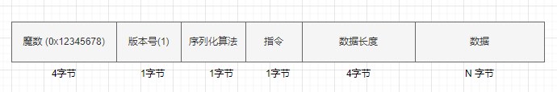
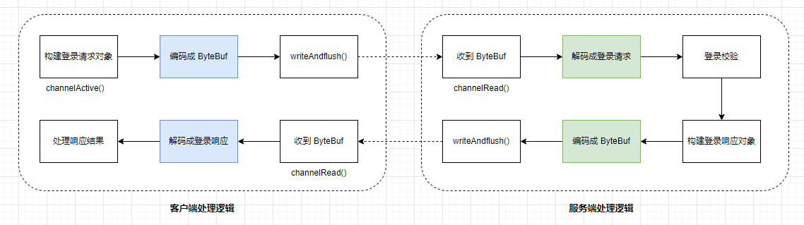
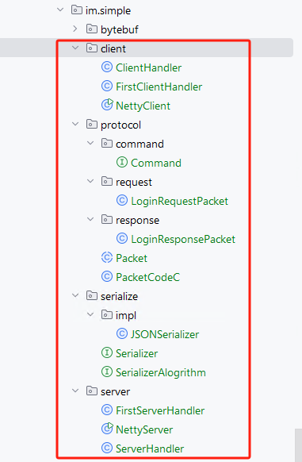
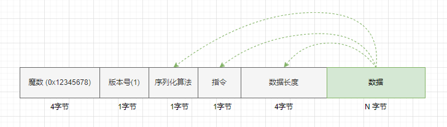
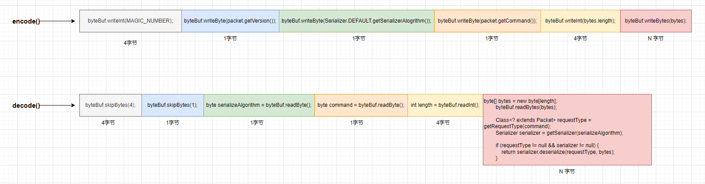

# Netty - 自定义 protocol       

## 引言             
Netty 的客户端与服务端之间数据传输过程中，它们之间数据传输是以`二进制`的编码格式进行的。这点在Spring Boot 开发 API接口时也同样如此，接口的入参、返回都经过序列化与序列化成二进制。如果大家有java web 开发经验的话，在 Spring Boot 是可以配置序列化与反序列JSON 时使用的 jar的，例如配置成 fastjson、jackson等。   

### 示例  
而在 Netty 开发网络通信服务时，大多数都是我们自己定义数据接收、返回时的处理逻辑。例如：       
   

1.第一个字段是魔数，通常情况下为固定的几字节（这里规定为4字节）。为什么需要这个字段，而且还是一个固定的数？假设我们在服务器上开了一个端口，比如80端口，如果没有这个魔数，任何数据包传递到服务器，服务器都会根据自定义协议来进行处理，包括不符合自定义协议规范的数据包。例如，直接通过http://服务器IP来访问服务器（默认为80端口），服务端收到的是一个标准的HTTP协议数据包，但是它仍然会按照事先约定好的协议来处理HTTP协议，显然，这是会解析出错的。而有了这个魔数之后，服务端首先取出前面4字节进行比对，能够在第一时间识别出这个数据包并非是遵循自定义协议的，也就是无效数据包，出于安全考虑，可以直接关闭连接以节省资源。在Java字节码的二进制文件中，开头的4字节为0xcafebabe，用来标识这是一个字节码文件，亦有异曲同工之妙。   

2.接下来的1字节为版本号，通常情况下是预留字段，在协议升级的时候用到，有点类似TCP协议中的一个字段标识是IPV4协议还是IPV6协议。在大多数情况下，这个字段是用不到的，但是为了协议能够支持升级，还是先留着。     

3.第三部分的序列化算法表示如何把Java对象转换为二进制数据及二进制数据如何转换回Java对象，比如Java自带的序列化、JSON、Hessian等序列化方式。      

4.第四部分的字段表示指令，关于指令相关的介绍，我们在前面已经讨论过。服务端或者客户端每收到一种指令，都会有相应的处理逻辑。这里我们用1字节来表示，最高支持256种指令，对于这个即时聊天系统来说已经完全足够了。      

5.第五部分的字段表示数据长度，占4字节。    

6.最后一部分为数据内容，每一种指令对应的数据都是不一样的，比如登录的时候需要用户名和密码，收消息的时候需要用户标识和具体消息内容等         


## 实现客户端登录案例，说明 自定义 protocol       
自定义的 protocol 如下图：  
     

### 登录流程      
     
由上图可以看到，客户端连接上服务端之后：                
1.客户端首先会构建一个登录请求对象，然后通过编码把请求对象编码为ByteBuf，写到服务端。           
2.服务端接收到ByteBuf之后，首先通过解码把ByteBuf解码为登录请求响应，然后进行校验。              
3.服务端校验通过之后，构造一个登录响应对象，依然经过编码，再写回客户端。                
4.客户端接收服务端的响应数据之后，解码ByteBuf，获得登录响应对象，判断是否登录成功                   

### 项目结构        
          

首先，定义实体类 model, 是登录流程，所以定义登录请求参数类`LoginRequestPacket`和登录返回值类`LoginResponsePacket`，相对于上图`自定义 protocol`来说，它们俩对应的是`数据部分`。其余的部分又属于公共部分，那该如何指定呢？         

还没有谈其他部分时候，希望你可以有所感悟，如下图：       
  

>假设，知道`LoginRequestPacket`对象的二进制数组，那可以推导出它的长度、它是哪种序列化、它代表的是啥指令（在该案例中，表达的是登录指令），其实，版本号也可以知道，毕竟我们在 Spring Boot 接口服务的时候，比较喜欢在 url 中添加`接口版本号`，例如 http:localhost:8080\v1\userlogin。    

下面是实体类代码：     
**LoginRequestPacket.java**         
```java
@Data
public class LoginRequestPacket extends Packet {
    private String userId;

    private String username;

    private String password;

    @Override
    public Byte getCommand() {
        return LOGIN_REQUEST;
    }
}
```

**LoginResponsePacket.java**         
```java
@Data
public class LoginResponsePacket extends Packet {
    private boolean success;

    private String reason;


    @Override
    public Byte getCommand() {
        return LOGIN_RESPONSE;
    }
}
```

### 公共部分的定义 
此时，`LoginRequestPacket`、`LoginResponsePacket` 都继承`Packet`,它定义`version` 以及 getCommand()抽象方法。这部分理解起来还不算太难，所有的实体类继承 Packet，`getCommand() 是抽象方法原因是：只有各个子类自己知道自己代表的是什么指令`。       

```java
@Data
public abstract class Packet {
    /**
     * 协议版本
     */
    @JSONField(deserialize = false, serialize = false)
    private Byte version = 1;


    @JSONField(serialize = false)
    public abstract Byte getCommand();
}
```

### 编码与解码   
有了上面的理解，来看 `PacketCodeC.java`的编码 encode() 和解码 decode() 的实现, 这里其实没有多少难度，但特别需要知道的是 ByteBuf 对象如何写入值，如何读取值。        
```java
public class PacketCodeC {

    private static final int MAGIC_NUMBER = 0x12345678;
    public static final PacketCodeC INSTANCE = new PacketCodeC();

    private final Map<Byte, Class<? extends Packet>> packetTypeMap;
    private final Map<Byte, Serializer> serializerMap;


    private PacketCodeC() {
        packetTypeMap = new HashMap<>();
        packetTypeMap.put(LOGIN_REQUEST, LoginRequestPacket.class);
        packetTypeMap.put(LOGIN_RESPONSE, LoginResponsePacket.class);

        serializerMap = new HashMap<>();
        Serializer serializer = new JSONSerializer();
        serializerMap.put(serializer.getSerializerAlogrithm(), serializer);
    }


    public ByteBuf encode(ByteBufAllocator byteBufAllocator, Packet packet) {
        // 1. 创建 ByteBuf 对象
        ByteBuf byteBuf = byteBufAllocator.ioBuffer();
        // 2. 序列化 java 对象
        byte[] bytes = Serializer.DEFAULT.serialize(packet);

        // 3. 实际编码过程
        byteBuf.writeInt(MAGIC_NUMBER);
        byteBuf.writeByte(packet.getVersion());
        byteBuf.writeByte(Serializer.DEFAULT.getSerializerAlogrithm());
        byteBuf.writeByte(packet.getCommand());
        byteBuf.writeInt(bytes.length);
        byteBuf.writeBytes(bytes);

        return byteBuf;
    }


    public Packet decode(ByteBuf byteBuf) {
        // 跳过 magic number
        byteBuf.skipBytes(4);

        // 跳过版本号
        byteBuf.skipBytes(1);

        // 序列化算法
        byte serializeAlgorithm = byteBuf.readByte();

        // 指令
        byte command = byteBuf.readByte();

        // 数据包长度
        int length = byteBuf.readInt();

        byte[] bytes = new byte[length];
        byteBuf.readBytes(bytes);

        Class<? extends Packet> requestType = getRequestType(command);
        Serializer serializer = getSerializer(serializeAlgorithm);

        if (requestType != null && serializer != null) {
            return serializer.deserialize(requestType, bytes);
        }

        return null;
    }

    private Serializer getSerializer(byte serializeAlgorithm) {

        return serializerMap.get(serializeAlgorithm);
    }

    private Class<? extends Packet> getRequestType(byte command) {

        return packetTypeMap.get(command);
    }
}
```

看下图：  
      
编码与解码的步骤必须是协调一致的，多写、少写、多读、少读都是灾难性的问题。  我想到这里，你应该理解自定义 protocol 所注意的事项。当然这里还并没有提到`拆包、粘包`。  

### 定义数据的 serialize   
该案例中使用 fastjson 来对实体类进行序列化，反序列化，这里说的实体类是 `LoginRequestPacket`、`LoginResponsePacket`。`SerializerAlogrithm`枚举类，定义的是`自定义 protocol`中的序列化算法。        

**Serializer.java**   
```java
public interface Serializer {

    Serializer DEFAULT = new JSONSerializer();

    /**
     * 序列化算法
     * @return
     */
    byte getSerializerAlogrithm();

    /**
     * java 对象转换成二进制
     */
    byte[] serialize(Object object);

    /**
     * 二进制转换成 java 对象
     */
    <T> T deserialize(Class<T> clazz, byte[] bytes);

}
```   

**JSONSerializer.java**  
```java
public class JSONSerializer implements Serializer {

    @Override
    public byte getSerializerAlogrithm() {
        return SerializerAlogrithm.JSON;
    }

    @Override
    public byte[] serialize(Object object) {

        return JSON.toJSONBytes(object);
    }

    @Override
    public <T> T deserialize(Class<T> clazz, byte[] bytes) {

        return JSON.parseObject(bytes, clazz);
    }
}
```

**SerializerAlogrithm.java**
```java
public interface SerializerAlogrithm {
    /**
     * json 序列化
     */
    byte JSON = 1;
}
```   

到这里，自定义 protocol就介绍完了。它就像我们写 API 接口时定义的字段名称和字段类型。      
