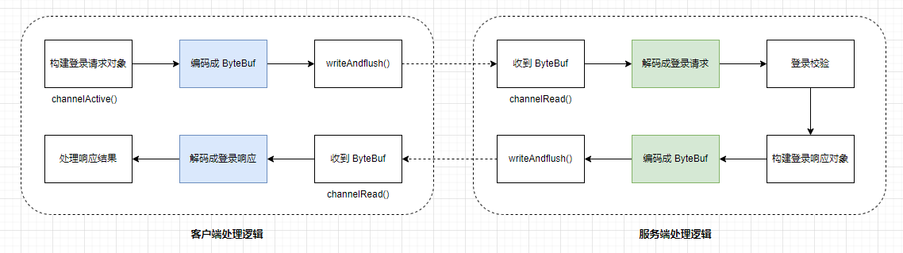

# Netty - 异步连接服务端  

## 引言     
在之前 blog `Netty - 自定义 protocol` 谈到登录流程，如下图所示，可是发送消息是由客户端`ClientHandler#channelActive()`方法触发的，但是它的生命周期是短暂的，当`channel`处于激活状态时执行的，那么要是希望客户端可以持续不断的发送消息给服务端，显然在`ClientHandler#channelActive()`方法内处理是不够的。      
      

所以得另寻他处，接下来，我们开始介绍。                        

## NettyClient 改造   
这个是改造前的`NettyClient`代码：    
```java
public class NettyClient {
    public static void main(String[] args) {
        NioEventLoopGroup workerGroup = new NioEventLoopGroup();

        Bootstrap bootstrap = new Bootstrap();
        bootstrap
                // 指定线程模型
                .group(workerGroup)
                // 指定 IO 类型为 NIO
                .channel(NioSocketChannel.class)
                // IO 处理逻辑
                .handler(new ChannelInitializer<SocketChannel>() {
                    @Override
                    protected void initChannel(SocketChannel socketChannel) throws Exception {
                        //socketChannel.pipeline().addLast(new FirstClientHandler());
                        socketChannel.pipeline().addLast(new ClientHandler());
                    }
                });

        bootstrap.connect("127.0.0.1", 8000).addListener(future -> {
            if (future.isSuccess()) {
                System.out.println("连接成功！");
            } else {
                System.out.println("连接失败！");
            }
        });
    }
}
```      

### 逻辑优化      
我们还得拿这个图来说一下:   
     

`ClientHandler#channelActive()`方法做了编码`LoginRequestPacket`,发送给 Netty Server端，并且将返回值传给客户端，`ClientHandler#channelRead()`读取返回值并解码成`LoginResponsePacket`对象。           

现在我们换个场景，如果你现在在做 Spring Boot 的登录场景，将用户名、密码作为参数请求`http:localhost:8080\v1\userlogin` 登录接口，服务端返回 200 成功码，你会解析 JSON，并且将用户信息持久化到浏览器存储中，如下图
       

后续凡是接口需要携带用户信息，你都会从浏览器存储中获取，再赋值给接口参数传给后端。       

那我们回到主题中来，Netty 的 login 操作也同样如此。 下面是改造后的项目结构：    
   

>红色框需要特别注意的。     

### 改造点 ClientHandler#channelRead() 解析 LoginResponsePacket   
通过`PacketCodeC.INSTANCE.decode(byteBuf);`将自定义 protocol 解析成`LoginResponsePacket`

**ClientHandler.java**   
```java
public class ClientHandler extends ChannelInboundHandlerAdapter {
    @Override
    public void channelActive(ChannelHandlerContext ctx) {
        System.out.println(new Date() + ": 客户端开始登录");

        // 创建登录对象
        LoginRequestPacket loginRequestPacket = new LoginRequestPacket();
        loginRequestPacket.setUserId(UUID.randomUUID().toString());
        loginRequestPacket.setUsername("flash");
        loginRequestPacket.setPassword("pwd");

        // 编码
        ByteBuf buffer = PacketCodeC.INSTANCE.encode(ctx.alloc(), loginRequestPacket);

        // 写数据
        ctx.channel().writeAndFlush(buffer);
    }


    @Override
    public void channelRead(ChannelHandlerContext ctx, Object msg) {
        ByteBuf byteBuf = (ByteBuf) msg;

        Packet packet = PacketCodeC.INSTANCE.decode(byteBuf);

        if (packet instanceof LoginResponsePacket) {
            LoginResponsePacket loginResponsePacket = (LoginResponsePacket) packet;

            if (loginResponsePacket.isSuccess()) {
                System.out.println(new Date() + ": 客户端登录成功");
                LoginUtil.markAsLogin(ctx.channel());
            } else {
                System.out.println(new Date() + ": 客户端登录失败，原因：" + loginResponsePacket.getReason());
            }
        } else if (packet instanceof MessageResponsePacket) {
            MessageResponsePacket messageResponsePacket = (MessageResponsePacket) packet;
            System.out.println(new Date() + ": 收到服务端的消息: " + messageResponsePacket.getMessage());
        }
    }
}
```

解析数据，我们多了一步操作是：`LoginUtil.markAsLogin(ctx.channel());`,看下它的相关代码：   

这里的处理并不复杂，`AttributeKey<T>`是 Netty 提供的一个类型安全的键，用于存储和检索`Channel`的属性，而`Attributes`接口，它并没有太多含义，仅是一个变量集合一样。   

>`这里有个技巧是：我们希望一些值像枚举一样操作，但是又无法真的像枚举那样定义，使用接口定义常用变量是再好不过了，或者像定义静态变量一样`。           

**Attributes.java**
```java
public interface Attributes {
    AttributeKey<Boolean> LOGIN = AttributeKey.newInstance("login");
}
```

**LoginUtil.java**
```java
public class LoginUtil {
    public static void markAsLogin(Channel channel) {
        channel.attr(Attributes.LOGIN).set(true);
    }

    public static boolean hasLogin(Channel channel) {
        Attribute<Boolean> loginAttr = channel.attr(Attributes.LOGIN);

        return loginAttr.get() != null;
    }
}
```

其核心是`channel.attr(Attributes.LOGIN).set(true);`，其目的是将当前`Channel`的`login`属性为 true。   

`LoginUtil#hasLogin()`方法也展示了 channel的属性值如何读取。     

到这里，login 标记就已经存储了，接下来，看我们在哪里使用它。  

### 改造点 bootstrap.connect().addListener()        
估计你也差不多能看出来，我们可以在`if (future.isSuccess())` 做一些事情。`bootstrap.connect()`方法返回了一个`ChannelFuture`对象，它表示一个异步的链接操作,而`addListener()`方法将一个回调函数添加到`ChannelFuture`上。当连接操作完成时（无论成功或失败），`ChannelFuture`会调用该回调。如果我们在这里添加一个`while(true)`的逻辑，那客户端就可以持续不断的输入了。      

下面是改造后的代码：  
```java
public class NettyClient {
    private static final int MAX_RETRY = 5;
    private static final String HOST = "127.0.0.1";
    private static final int PORT = 8000;

    public static void main(String[] args) {
        NioEventLoopGroup workerGroup = new NioEventLoopGroup();

        Bootstrap bootstrap = new Bootstrap();
        bootstrap
                // 指定线程模型
                .group(workerGroup)
                // 指定 IO 类型为 NIO
                .channel(NioSocketChannel.class)
                // IO 处理逻辑
                .handler(new ChannelInitializer<SocketChannel>() {
                    @Override
                    protected void initChannel(SocketChannel socketChannel) throws Exception {
                        //socketChannel.pipeline().addLast(new FirstClientHandler());
                        socketChannel.pipeline().addLast(new ClientHandler());
                    }
                });

//        bootstrap.connect("127.0.0.1", 8000).addListener(future -> {
//            if (future.isSuccess()) {
//                System.out.println("连接成功！");
//            } else {
//                System.out.println("连接失败！");
//            }
//        });


    }

    private static void connect(Bootstrap bootstrap, String host, int port, int retry) {
        bootstrap.connect(host, port).addListener(future -> {
            if (future.isSuccess()) {
                System.out.println(new Date() + ": 连接成功，启动控制台线程……");
                Channel channel = ((ChannelFuture) future).channel();
                startConsoleThread(channel);
            } else if (retry == 0) {
                System.err.println("重试次数已用完，放弃连接！");
            } else {
                // 第几次重连
                int order = (MAX_RETRY - retry) + 1;
                // 本次重连的间隔
                int delay = 1 << order;
                System.err.println(new Date() + ": 连接失败，第" + order + "次重连……");
                bootstrap.config().group().schedule(() -> connect(bootstrap, host, port, retry - 1), delay, TimeUnit
                        .SECONDS);
            }
        });
    }

    private static void startConsoleThread(Channel channel) {
        new Thread(() -> {
            while (!Thread.interrupted()) {
                if (LoginUtil.hasLogin(channel)) {
                    System.out.println("输入消息发送至服务端: ");
                    Scanner sc = new Scanner(System.in);
                    String line = sc.nextLine();

                    MessageRequestPacket packet = new MessageRequestPacket();
                    packet.setMessage(line);
                    ByteBuf byteBuf = PacketCodeC.INSTANCE.encode(channel.alloc(), packet);
                    channel.writeAndFlush(byteBuf);
                }
            }
        }).start();
    }
}
```

`NettyClient#connect()`方法连接成功后，获取当前的`channel`，将它作为形参传入`NettyClient#startConsoleThread()`方法中，它创建了一个线程，并且一直while(true) 读取控制台输入的内容发送给服务端，这部分其实没有太多可介绍的。   


>客户端发送 MessageRequestPacket 指令的消息，那服务端就需要解析它，下面看服务端是如何解析它的。   

## NettyServer 改造    
`ServerHandler#channelRead()`方法是读取客户端传送过来的数据，`PacketCodeC.INSTANCE.decode(requestByteBuf)`方法会根据自定义 protocol 中的指令值，反序列化成相应的对象值。        
```java
public class ServerHandler extends ChannelInboundHandlerAdapter {

    @Override
    public void channelRead(ChannelHandlerContext ctx, Object msg) {
        ByteBuf requestByteBuf = (ByteBuf) msg;

        Packet packet = PacketCodeC.INSTANCE.decode(requestByteBuf);

        if (packet instanceof LoginRequestPacket) {
            System.out.println(new Date() + ": 收到客户端登录请求……");
            // 登录流程
            LoginRequestPacket loginRequestPacket = (LoginRequestPacket) packet;

            LoginResponsePacket loginResponsePacket = new LoginResponsePacket();
            loginResponsePacket.setVersion(packet.getVersion());
            if (valid(loginRequestPacket)) {
                loginResponsePacket.setSuccess(true);
                System.out.println(new Date() + ": 登录成功!");
            } else {
                loginResponsePacket.setReason("账号密码校验失败");
                loginResponsePacket.setSuccess(false);
                System.out.println(new Date() + ": 登录失败!");
            }
            // 登录响应
            ByteBuf responseByteBuf = PacketCodeC.INSTANCE.encode(ctx.alloc(), loginResponsePacket);
            ctx.channel().writeAndFlush(responseByteBuf);
        } else if (packet instanceof MessageRequestPacket) {
            // 客户端发来消息
            MessageRequestPacket messageRequestPacket = ((MessageRequestPacket) packet);

            MessageResponsePacket messageResponsePacket = new MessageResponsePacket();
            System.out.println(new Date() + ": 收到客户端消息: " + messageRequestPacket.getMessage());
            messageResponsePacket.setMessage("服务端回复【" + messageRequestPacket.getMessage() + "】");
            ByteBuf responseByteBuf = PacketCodeC.INSTANCE.encode(ctx.alloc(), messageResponsePacket);
            ctx.channel().writeAndFlush(responseByteBuf);
        }
    }

    private boolean valid(LoginRequestPacket loginRequestPacket) {
        return true;
    }
}
```  

这部分重点是 ` else if (packet instanceof MessageRequestPacket)`, 它负责处理类型为`MessageRequestPacket`的逻辑，并且再返回`MessageResponsePacket`类型的消息，此处就不过多介绍啦。                    

## 总结 
该篇 blog 介绍 channel attr的赋值和取值以及异步连接后的回调函数可以帮助我们处理连接后的相关逻辑。     

>估计看到这里，你可能也会存在担忧，每个指令的消息，如果都使用 if else, 那这个方法会变得无比臃肿。   

