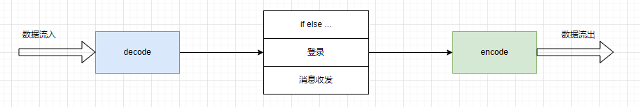
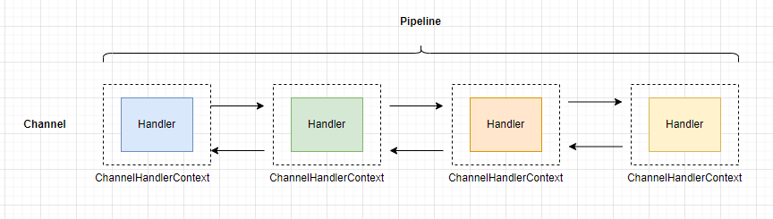
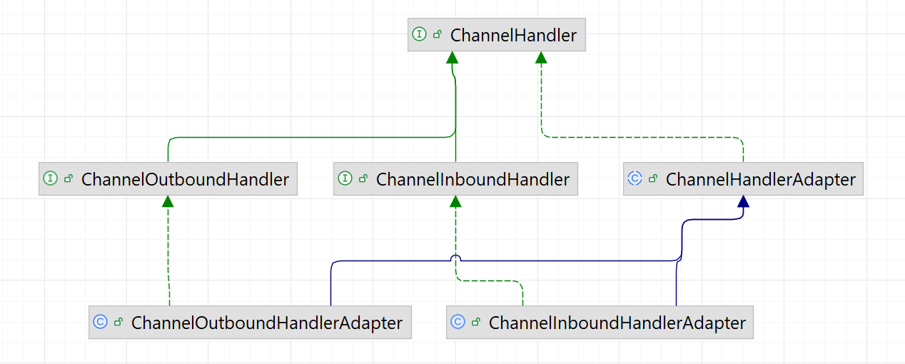
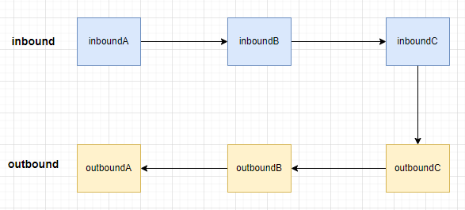
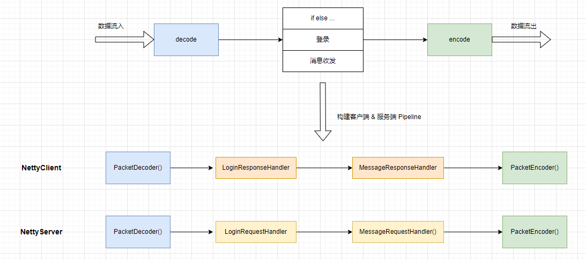

# Netty - 构建客户端与服务端的 Pipeline  

## 引言    
为了引出该篇 Blog 的主旨，我们必须提前介绍 Netty 的两大核心组件:`Pipeline & ChannelHandler`。    

## Pipeline & ChannelHandler  
我们在上一章的最后提出一个问题：如何避免if else泛滥？我们注意到，不管服务端还是客户端，处理流程大致都分为下图所示的几个步骤。       
   

我们把这三类逻辑都写在一个类里，客户端写在ClientHandler，服务端写在ServerHandler，如果要做功能的扩展（比如我们要校验魔数，或者其他特殊逻辑），只能在一个类里修改，这个类就会变得越来越臃肿。                

另外，每次发指令数据包都要手动调用编码器编码成ByteBuf，对于这类场景的编码优化，我们能想到的办法自然是模块化处理，不同的逻辑放置到单独的类中来处理，最后将这些逻辑串联起来，形成一个完整的逻辑处理链。                   

Netty中的Pipeline和ChannelHandler正是用来解决这个问题的。它通过责任链设计模式来组织代码逻辑，并且能够支持逻辑的动态添加和删除，Netty能够支持各类协议的扩展，比如HTTP、Websocket和Redis，靠的就是Pipeline和ChannelHandler。下面我们来介绍这部分内容。    


### Pipeline与ChannelHandler的构成   
无论从服务端来看，还是从客户端来看，在Netty的整个框架里面，一个连接对应着一个Channel。这个Channel的所有处理逻辑都在一个叫作ChannelPipeline的对象里，ChannelPipeline是双向链表结构，它和Channel之间是一对一的关系。              

如下图所示，ChannelPipeline里的每个节点都是一个ChannelHandlerContext对象，这个对象能够获得和Channel相关的所有上下文信息。这个对象同时包含一个重要的对象，那就是逻辑处理器ChannelHandler，每个ChannelHandler都处理一块独立的逻辑。                 
    

我们再来看ChannelHandler有哪些分类。        

### ChannelHandler的分类   
由下图可以看到，ChannelHandler有两大子接口。                
   

第一个子接口是ChannelInboundHandler，从字面意思可以猜到，它是处理读数据的逻辑。比如在一端读到一段数据，首先要解析这段数据，然后对这段数据做一系列逻辑处理，最终把响应写到对端。在组装响应之前的所有处理逻辑，都可以放置在一系列ChannelInboundHandler里处理，它的一个最重要的方法就是channelRead()。读者可以将ChannelInboundHandler的逻辑处理过程与TCP的七层协议解析过程联系起来，把收到的数据一层层地从物理层上升到应用层。             

第二个子接口ChannelOutboundHandler是处理写数据的逻辑，它是定义一端在组装完响应之后把数据写到对端的逻辑。比如，我们封装好一个response对象后，有可能对这个response做一些其他特殊逻辑处理，然后编码成ByteBuf，最终写到对端。它最核心的方法就是write()，读者可以将ChannelOutboundHandler的逻辑处理过程与TCP的七层协议封装过程联系起来。我们在应用层组装响应之后，通过层层协议的封装，直到底层的物理层。                 

这两个子接口分别有对应的默认实现：ChannelInboundHandlerAdapter和ChannelOutboundHandlerAdapter，它们分别实现了两大子接口的所有功能，在默认情况下会把读写事件传播到下一个Handler。              

下面我们就用一个具体的Demo来学习这两大Handler的事件传播机制。    

### ChannelInboundHandler & ChannelOutboundHandler 的事件传播    
关于ChannelInboundHandler，我们用channelRead()作例子，来体验一下Inbound事件的传播。    
我们在服务端的Pipeline添加3个ChannelInboundHandler。    
```java
public class NettyServer {

    private static final int PORT = 8000;

    public static void main(String[] args) {
        NioEventLoopGroup boosGroup = new NioEventLoopGroup();
        NioEventLoopGroup workerGroup = new NioEventLoopGroup();

        final ServerBootstrap serverBootstrap = new ServerBootstrap();
        serverBootstrap
                .group(boosGroup, workerGroup)
                .channel(NioServerSocketChannel.class)
                .option(ChannelOption.SO_BACKLOG, 1024)
                .childOption(ChannelOption.SO_KEEPALIVE, true)
                .childOption(ChannelOption.TCP_NODELAY, true)
                .childHandler(new ChannelInitializer<NioSocketChannel>() {
                    protected void initChannel(NioSocketChannel ch) {
                        // inBound，处理读数据的逻辑链
                        ch.pipeline().addLast(new InBoundHandlerA());
                        ch.pipeline().addLast(new InBoundHandlerB());
                        ch.pipeline().addLast(new InBoundHandlerC());

                        // outBound，处理写数据的逻辑链
                        ch.pipeline().addLast(new OutBoundHandlerA());
                        ch.pipeline().addLast(new OutBoundHandlerB());
                        ch.pipeline().addLast(new OutBoundHandlerC());
                    }
                });


        bind(serverBootstrap, PORT);
    }

    private static void bind(final ServerBootstrap serverBootstrap, final int port) {
        serverBootstrap.bind(port).addListener(future -> {
            if (future.isSuccess()) {
                System.out.println(new Date() + ": 端口[" + port + "]绑定成功!");
            } else {
                System.err.println("端口[" + port + "]绑定失败!");
            }
        });
    }
}
```

**InBoundHandlerA、B、C**
```java
public class InBoundHandlerA extends ChannelInboundHandlerAdapter {

    @Override
    public void channelRead(ChannelHandlerContext ctx, Object msg) throws Exception {
        System.out.println("InBoundHandlerA: " + msg);
        super.channelRead(ctx, msg);
    }
}

public class InBoundHandlerB extends ChannelInboundHandlerAdapter {

    @Override
    public void channelRead(ChannelHandlerContext ctx, Object msg) throws Exception {
        System.out.println("InBoundHandlerB: " + msg);
        super.channelRead(ctx, msg);
    }
}

public class InBoundHandlerC extends ChannelInboundHandlerAdapter {  // 不同于 A、B

    @Override
    public void channelRead(ChannelHandlerContext ctx, Object msg) throws Exception {
        System.out.println("InBoundHandlerC: " + msg);
        ctx.channel().writeAndFlush(msg);                
    }
}
```

在channelRead()方法里，我们打印当前Handler的信息，调用父类的channelRead()方法。而父类的channelRead()方法会自动调用下一个inboundHandler的channelRead()方法，并且会把当前inboundHandler里处理完毕的对象传递到下一个inboundHandler，上述例子中传递的对象都是同一个msg。                

我们通过addLast()方法为Pipeline添加inboundHandler，当然，除了这个方法，还有其他方法，感兴趣的读者可以自行浏览Pipeline的API，这里我们添加的顺序为A ->B->C。   

>这里特别注意：`InBoundHandlerC`, 因为 InBoundHandlerA、B、C 与 OutBoundHandlerA、B、C 是在同一个测试代码中，所以`InBoundHandlerC#channelRead()`方法需要将消息发送给客户端`ctx.channel().writeAndFlush(msg);`,才能触发`OutBoundHandlerA、B、C`的逻辑。    

**OutBoundHandlerA、B、C**
关于ChannelOutboundHandler，我们用write()作例子，来体验一下Outbound事件的传播。             
我们继续在服务端的Pipeline添加3个ChannelOutboundHandler    
```java
public class OutBoundHandlerA extends ChannelOutboundHandlerAdapter {
    @Override
    public void write(ChannelHandlerContext ctx, Object msg, ChannelPromise promise) throws Exception {
        System.out.println("OutBoundHandlerA: " + msg);
        super.write(ctx, msg, promise);
    }
}

public class OutBoundHandlerB extends ChannelOutboundHandlerAdapter {
    @Override
    public void write(ChannelHandlerContext ctx, Object msg, ChannelPromise promise) throws Exception {
        System.out.println("OutBoundHandlerB: " + msg);
        super.write(ctx, msg, promise);
    }
}

public class OutBoundHandlerC extends ChannelOutboundHandlerAdapter {
    @Override
    public void write(ChannelHandlerContext ctx, Object msg, ChannelPromise promise) throws Exception {
        System.out.println("OutBoundHandlerC: " + msg);
        super.write(ctx, msg, promise);
    }
}
```  

调用下一个outboundHandler的write()方法，并且会把当前outboundHandler里处理完毕的对象传递到下一个outboundHandler。
我们通过addLast()方法添加outboundHandler的顺序为A->B->C。    

最后来看一下控制台的输出:    
```bash   
Tue Dec 31 18:48:14 CST 2024: 端口[8000]绑定成功!
InBoundHandlerA: PooledUnsafeDirectByteBuf(ridx: 0, widx: 96, cap: 1024)
InBoundHandlerB: PooledUnsafeDirectByteBuf(ridx: 0, widx: 96, cap: 1024)
InBoundHandlerC: PooledUnsafeDirectByteBuf(ridx: 0, widx: 96, cap: 1024)
OutBoundHandlerC: PooledUnsafeDirectByteBuf(ridx: 0, widx: 96, cap: 1024)
OutBoundHandlerB: PooledUnsafeDirectByteBuf(ridx: 0, widx: 96, cap: 1024)
OutBoundHandlerA: PooledUnsafeDirectByteBuf(ridx: 0, widx: 96, cap: 1024)
```        

outboundHandler的执行顺序与添加的顺序相反，这是为什么呢？这就要说到Pipeline的结构和执行顺序了。    

### Pipeline的结构
不管我们定义的是哪种类型的Handler，最终它们都以双向链表的方式连接。实际链表的节点是ChannelHandlerContext，为了让结构清晰突出，可以直接把节点看作ChannelHandler。    
    

### Pipeline的执行顺序
虽然两种类型的Handler在一个双向链表里，但是这两类Handler的分工是不一样的，inboundHandler的事件通常只会传播到下一个inboundHandler，outboundHandler的事件通常只会传播到下一个outboundHandler，两者相互不受干扰，如下图所示。      
   

### 总结
1.通过前面编写客户端与服务端处理逻辑，引出了Pipeline和ChannelHandler的概念。                    
2.ChannelHandler分为Inbound和Outbound两种类型的接口，分别是处理数据读与数据写的逻辑，可与TCP协议栈处理数据的两个方向联系起来。                  
3.两种类型的Handler均有相应的默认实现，默认会把事件传递到下一个Handler，这里的传递事件其实就是把本Handler的处理结果传递到下一个Handler继续处理。                    
4.inboundHandler的执行顺序与实际的添加顺序相同，而outboundHandler则相反。                       
           
>有了上面 `Pipeline & ChannelHandler` 了解，接下来如何构建 客户端与服务端的 Pipeline。      

## 客户端与服务端的 Pipeline          
我们已经了解了Pipeline和ChannelHandler的基本概念。接下来`使用 Pipeline & ChannelHandler 来重新构建客户端和服务端的Pipeline`，把复杂的逻辑从单独的一个ChannelHandler中抽取出来。          

### ChannelInboundHandlerAdapter与ChannelOutboundHandlerAdapter    
首先是ChannelInboundHandlerAdapter，这个适配器主要用于实现其接口ChannelInboundHandler的所有方法，这样我们在编写自己的Handler时就不需要实现Handler里的每一种方法，而只需要实现我们所关心的方法即可。在默认情况下，对于ChannelInboundHandlerAdapter，我们比较关心的是它的如下方法。               
**ChannelInboundHandlerAdapter.java**    
```java
@Override
public void channelRead(ChannelHandlerContext ctx, Object msg) throws Exception ｛
   ctx.fireChannelRead(msg);
｝
```

它的作用就是接收上一个Handler的输出，这里的msg就是上一个Handler的输出。大家也可以看到，默认情况下的Adapter会通过fireChannelRead()方法直接把上一个Handler的输出结果传递到下一个Handler。         

与ChannelInboundHandlerAdapter类似的类是ChannelOutboundHandlerAdapter，它的核心方法如下。           
**ChannelOutboundHandlerAdapter.java**   
```java
@Override
public void write(ChannelHandlerContext ctx, Object msg, ChannelPromise promise) throws Exception ｛   
    ctx.write(msg, promise);
｝
```

在默认情况下，这个Adapter也会把对象传递到下一个Outbound节点，它的传播顺序与inboundHandler相反，这里不再展开介绍。                   
我们往Pipeline添加的第一个Handler的channelRead()方法中，msg对象其实就是ByteBuf。服务端在接收到数据之后，应该要做的第一步逻辑就是把这个ByteBuf进行解码，然后把解码后的结果传递到下一个Handler，如下所示。                     
```java
@Overridepublic
 void channelRead(ChannelHandlerContext ctx, Object msg) throws Exception ｛
    ByteBuf requestByteBuf = (ByteBuf) msg;
    // 解码
    Packet packet = PacketCodeC.INSTANCE.decode(requestByteBuf);        
    // 解码后的对象传递到下一个Handler        
    ctx.fireChannelRead(packet);         
｝
```

### ByteToMessageDecoder  
通常情况下，无论在客户端还是在服务端，当我们收到数据后，首先要做的就是把二进制数据转换到Java对象，所以Netty很贴心地提供了一个父类，来专门做这个事情。我们看一下如何使用这个类来实现服务端的解码。               
```java
public class PacketDecoder extends ByteToMessageDecoder ｛   
    @Override   
    protected void decode(ChannelHandlerContext ctx, ByteBuf in, List out) ｛
       out.add(PacketCodeC.INSTANCE.decode(in));   
    ｝
｝
```

当继承了ByteToMessageDecoder这个类之后，只需要实现 `decode()` 方法即可。大家可以看到，这里的in传递进来的时候就已经是ByteBuf类型，所以不再需要强转。第三个参数是List类型，我们通过向这个List里面添加解码后的结果对象，就可以自动实现结果向下一个Handler传递，这样就实现了解码的逻辑Handler。    

另外，值得注意的是，对于Netty里的ByteBuf，我们使用4.1.6.Final版本，默认情况下用的是堆外内存。堆外内存需要我们自行释放，在解码的例子中，其实我们已经漏掉了这个操作，这一点是非常致命的。随着程序运行得越来越久，内存泄漏的问题就慢慢暴露出来了，而这里我们`使用ByteToMessageDecoder，Netty会自动进行内存的释放，我们不用操心太多的内存管理方面的逻辑`。               

通过解码器把二进制数据转换到Java对象即指令数据包之后，就可以针对每一种指令数据包编写逻辑了。

### SimpleChannelInboundHandler         
回顾一下前面处理Java对象的逻辑。            
```java
if (packet instanceof LoginRequestPacket) ｛    
    // ...
｝ else if (packet instanceof MessageRequestPacket) ｛    
    // ...
｝ else if ...
```

通过if else分支进行逻辑的处理，当要处理的指令越来越多的时候，代码会显得越来越臃肿，我们可以通过给Pipeline添加多个Handler（ChannelInboundHandlerAdapter的子类）来解决过多的if else问题。         
**XXXHandler.java**     
```java
if
 (packet instanceof XXXPacket) ｛    
    // ...处
；        // 解
码后的对象传递到下一个Handler        ctx.
fireChannelRead(packet)｝
在开始解码之前，我们先来了解一下另外一个特殊的Handler。
12.2　ByteToMessageDecoder
通常情况下，无论在客户端还是在服务端，当我们收到数据后，首先要做的就是把二进制数据转换到Java对象，所以Netty很贴心地提供了一个父类，来专门做这个事情。我们看一下如何使用这个类来实现服务端的解码。
public class
 PacketDecoder extends
 ByteToMessageDecoder ｛   @Override   protected
 void decode(ChannelHandlerContext ctx, ByteBuf in, List out) ｛
       out.add(PacketCodeC.INSTANCE.decode(in))；   ｝｝
当继承了ByteToMessageDecoder这个类之后，只需要实现decode()方法即可。大家可以看到，这里的in传递进来的时候就已经是ByteBuf类型，所以不再需要强转。第三个参数是List类型，我们通过向这个List里面添加解码后的结果对象，就可以自动实现结果向下一个Handler传递，这样就实现了解码的逻辑Handler。
另外，值得注意的是，对于Netty里的ByteBuf，我们使用4.1.6.Final版本，默认情况下用的是堆外内存。在ByteBuf一章中提到，堆外内存需要我们自行释放，在解码的例子中，其实我们已经漏掉了这个操作，这一点是非常致命的。随着程序运行得越来越久，内存泄漏的问题就慢慢暴露出来了，而这里我们使用ByteToMessageDecoder，Netty会自动进行内存的释放，我们不用操心太多的内存管理方面的逻辑。
通过解码器把二进制数据转换到Java对象即指令数据包之后，就可以针对每一种指令数据包编写逻辑了。
12.3　SimpleChannelInboundHandler
回顾一下前面处理Java对象的逻辑。
if
 (packet instanceof
 LoginRequestPacket) ｛    // ...｝ else if
 (packet instanceof
 MessageRequestPacket) ｛    // ...｝ else if
 ...
通过if else分支进行逻辑的处理，当要处理的指令越来越多的时候，代码会显得越来越臃肿，我们可以通过给Pipeline添加多个Handler（ChannelInboundHandlerAdapter的子类）来解决过多的if else问题。
XXXHandler.java
if
 (packet instanceof XXXPacket) ｛    
    // ...处理
｝ else｛
    ctx.fireChannelRead(packet);
｝
```

这样的一个好处就是，每次添加一个指令处理器，其逻辑处理的框架都是一致的。                
但是，大家应该也注意到了，我们编写指令处理Handler的时候，依然编写了一段其实可以不用关心的if else判断，然后手动传递无法处理的对象（XXXPacket）至下一个指令处理器，这也是一段重复度极高的代码。因此，基于这种考虑，Netty抽象出了一个SimpleChannelInboundHandler对象，自动实现了类型判断和对象传递，这样我们的应用代码就可以专注于业务逻辑。               

下面来看如何使用SimpleChannelInboundHandler简化指令处理逻辑。
**LoginRequestHandler.java**            
```java
public class LoginRequestHandler extends SimpleChannelInboundHandler<LoginRequestPacket> {
    @Override
    protected void channelRead0(ChannelHandlerContext ctx, LoginRequestPacket loginRequestPacket) {
        System.out.println(new Date() + ": 收到客户端登录请求……");

        LoginResponsePacket loginResponsePacket = new LoginResponsePacket();
        loginResponsePacket.setVersion(loginRequestPacket.getVersion());
        if (valid(loginRequestPacket)) {
            loginResponsePacket.setSuccess(true);
            System.out.println(new Date() + ": 登录成功!");
        } else {
            loginResponsePacket.setReason("账号密码校验失败");
            loginResponsePacket.setSuccess(false);
            System.out.println(new Date() + ": 登录失败!");
        }

        // 登录响应
        ctx.channel().writeAndFlush(loginResponsePacket);
    }

    private boolean valid(LoginRequestPacket loginRequestPacket) {
        return true;
    }
}
```
从字面意思可以看到，SimpleChannelInboundHandler的使用非常简单。我们在继承这个类的时候，给它传递一个泛型参数，然后在channelRead0()方法里，不用再通过if逻辑来判断当前对象是否是本Handler可以处理的对象，也不用强转，不用往下传递本Handler处理不了的对象，这一切都已经交给父类SimpleChannelInboundHandler来实现，我们只需要专注于我们要处理的业务逻辑即可。        

上面的LoginRequestHandler是用来处理登录的逻辑，同理，我们可以很轻松地编写一个消息处理逻辑处理器。           
**MessageRequestHandler.java**      
```java
public class MessageRequestHandler extends SimpleChannelInboundHandler<MessageRequestPacket> {
    @Override
    protected void channelRead0(ChannelHandlerContext ctx, MessageRequestPacket messageRequestPacket) {
        MessageResponsePacket messageResponsePacket = new MessageResponsePacket();
        System.out.println(new Date() + ": 收到客户端消息: " + messageRequestPacket.getMessage());
        messageResponsePacket.setMessage("服务端回复【" + messageRequestPacket.getMessage() + "】");

        ctx.channel().writeAndFlush(messageResponsePacket);
    }
}
```

### MessageToByteEncoder            
我们已经实现了登录和消息处理逻辑。处理完登录和消息这两类指令之后，我们都会给客户端返回一个响应。在写响应之前，需要把响应对象编码成ByteBuf下, 我们先看下之前的 blog 中的`SererHandler.java`, `ServerHandler#channelRead()`接收客户端请求并返回数据，在发送数据之前，都需要先进行编码，然后调用`writeAndFlush()`将数据写入到客户端。 
****           
```java
public class ServerHandler extends ChannelInboundHandlerAdapter {

    @Override
    public void channelRead(ChannelHandlerContext ctx, Object msg) {
        ByteBuf requestByteBuf = (ByteBuf) msg;

        Packet packet = PacketCodeC.INSTANCE.decode(requestByteBuf);

        if (packet instanceof LoginRequestPacket) {
            System.out.println(new Date() + ": 收到客户端登录请求……");
            // 登录流程
            LoginRequestPacket loginRequestPacket = (LoginRequestPacket) packet;

            LoginResponsePacket loginResponsePacket = new LoginResponsePacket();
            loginResponsePacket.setVersion(packet.getVersion());
            if (valid(loginRequestPacket)) {
                loginResponsePacket.setSuccess(true);
                System.out.println(new Date() + ": 登录成功!");
            } else {
                loginResponsePacket.setReason("账号密码校验失败");
                loginResponsePacket.setSuccess(false);
                System.out.println(new Date() + ": 登录失败!");
            }
            // 登录响应
            ByteBuf responseByteBuf = PacketCodeC.INSTANCE.encode(ctx.alloc(), loginResponsePacket);
            ctx.channel().writeAndFlush(responseByteBuf);
        } else if (packet instanceof MessageRequestPacket) {
            // 客户端发来消息
            MessageRequestPacket messageRequestPacket = ((MessageRequestPacket) packet);

            MessageResponsePacket messageResponsePacket = new MessageResponsePacket();
            System.out.println(new Date() + ": 收到客户端消息: " + messageRequestPacket.getMessage());
            messageResponsePacket.setMessage("服务端回复【" + messageRequestPacket.getMessage() + "】");
            ByteBuf responseByteBuf = PacketCodeC.INSTANCE.encode(ctx.alloc(), messageResponsePacket);
            ctx.channel().writeAndFlush(responseByteBuf);
        }
    }

    private boolean valid(LoginRequestPacket loginRequestPacket) {
        return true;
    }
}
```

当然这个编码的过程也是重复的逻辑，而且在编码过程中，我们还需要手动创建一个ByteBuf,这部分可以查看`PacketCodeC#encode()`方法实现，上面我们已经提到下面这种形式，我们必须手动释放内存的问题。          
```java
public ByteBuf encode(ByteBufAllocator byteBufAllocator, Packet packet) {
    // 1. 创建 ByteBuf 对象
    ByteBuf byteBuf = byteBufAllocator.ioBuffer();
    // 2. 序列化 java 对象
    byte[] bytes = Serializer.DEFAULT.serialize(packet);

    // 3. 实际编码过程
    byteBuf.writeInt(MAGIC_NUMBER);
    byteBuf.writeByte(packet.getVersion());
    byteBuf.writeByte(Serializer.DEFAULT.getSerializerAlogrithm());
    byteBuf.writeByte(packet.getCommand());
    byteBuf.writeInt(bytes.length);
    byteBuf.writeBytes(bytes);

    return byteBuf;
}
```

Netty提供了一个特殊的ChannelHandler来专门处理编码逻辑，不需要每一次将响应写到对端的时候都调用一次编码逻辑进行编码，也不需要自行创建ByteBuf。这个类被叫作   `MessageToByteEncoder`，从字面意思可以看出，它的功能就是将对象转换到二进制数据。                  
```java
public class PacketEncoder extends MessageToByteEncoder<Packet> {

    @Override
    protected void encode(ChannelHandlerContext ctx, Packet packet, ByteBuf out) {
        PacketCodeC.INSTANCE.encode(out, packet);
    }
}
```
`PacketEncoder` 继承自 `MessageToByteEncoder`，泛型参数Packet 表示这个类的作用是实现 Packet 类型对象到二进制数据的转换。            

这里我们只需要实现 encode()方法。在这个方法里，第二个参数是 Java 对象，而第三个参数是 ByteBuf 对象，我们要做的事情就是，把 Java 对象的字段写到 ByteBuf 对象，而不再需要自行去分配ByteBuf对象。因此，大家注意到, `PacketCodeC#encode()`方法的定义也改了，下面是更改前后的对比。此时改造后的形参改成了`ByteBuf byteBuf`。       
**PacketCodeC#encode()**          
```java
public void encode(ByteBuf byteBuf, Packet packet) {
    // 1. 序列化 java 对象
    byte[] bytes = Serializer.DEFAULT.serialize(packet);

    // 2. 实际编码过程
    byteBuf.writeInt(MAGIC_NUMBER);
    byteBuf.writeByte(packet.getVersion());
    byteBuf.writeByte(Serializer.DEFAULT.getSerializerAlogrithm());
    byteBuf.writeByte(packet.getCommand());
    byteBuf.writeInt(bytes.length);
    byteBuf.writeBytes(bytes);
}
```

PacketCodeC 不再需要手动创建ByteBuf 对象，不再需要把创建完的 ByteBuf 对象进行返回。当我们向 Pipeline 中添加这个编码器后，在指令处理完毕之后就只需要调用 writeAndFlush() 把Java对象写出去即可。              

### 构建最终 Pipeline      
完服务端的Pipeline的Handler组成结构，相信你也不难自行分析出客户端的Pipeline的Handler结构。最后我们来看一下客户端和服务端完整的Pipeline的Handler结构，如下图所示。     
      

**NettyClient**
```java
public static void main(String[] args) {
    NioEventLoopGroup workerGroup = new NioEventLoopGroup();

    Bootstrap bootstrap = new Bootstrap();
    bootstrap
            .group(workerGroup)
            .channel(NioSocketChannel.class)
            .option(ChannelOption.CONNECT_TIMEOUT_MILLIS, 5000)
            .option(ChannelOption.SO_KEEPALIVE, true)
            .option(ChannelOption.TCP_NODELAY, true)
            .handler(new ChannelInitializer<SocketChannel>() {
                @Override
                public void initChannel(SocketChannel ch) {
                    ch.pipeline().addLast(new PacketDecoder());
                    ch.pipeline().addLast(new LoginResponseHandler());
                    ch.pipeline().addLast(new MessageResponseHandler());
                    ch.pipeline().addLast(new PacketEncoder());
                }
            });

    connect(bootstrap, HOST, PORT, MAX_RETRY);
}
```    

**NettyServer**
```java
public static void main(String[] args) {
    NioEventLoopGroup boosGroup = new NioEventLoopGroup();
    NioEventLoopGroup workerGroup = new NioEventLoopGroup();

    final ServerBootstrap serverBootstrap = new ServerBootstrap();
    serverBootstrap
            .group(boosGroup, workerGroup)
            .channel(NioServerSocketChannel.class)
            .option(ChannelOption.SO_BACKLOG, 1024)
            .childOption(ChannelOption.SO_KEEPALIVE, true)
            .childOption(ChannelOption.TCP_NODELAY, true)
            .childHandler(new ChannelInitializer<NioSocketChannel>() {
                protected void initChannel(NioSocketChannel ch) {
                    ch.pipeline().addLast(new PacketDecoder());
                    ch.pipeline().addLast(new LoginRequestHandler());
                    ch.pipeline().addLast(new MessageRequestHandler());
                    ch.pipeline().addLast(new PacketEncoder());
                }
            });


    bind(serverBootstrap, PORT);
}
```

## 总结         
用Netty内置的 ChannelHandler 来逐步构建服务端的 Pipeline，通过内置的 ChannelHandler 可以减少很多重复的逻辑。     
1.基于`ByteToMessageDecoder`，可以实现自定义解码，而不用关心ByteBuf的强转和解码结果的传递。                      
2.基于`SimpleChannelInboundHandler`，可以实现每一种指令的处理，不再需要强转，不再有冗长乏味的if else逻辑，不再需要手动传递对象。                
3.基于`MessageToByteEncoder`，可以实现自定义编码，不用关心ByteBuf的创建，不用每次向对端写Java对象都进行一次编码。           

