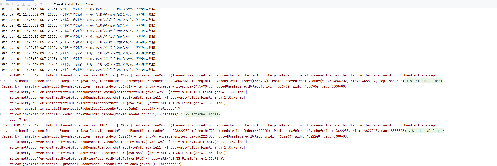
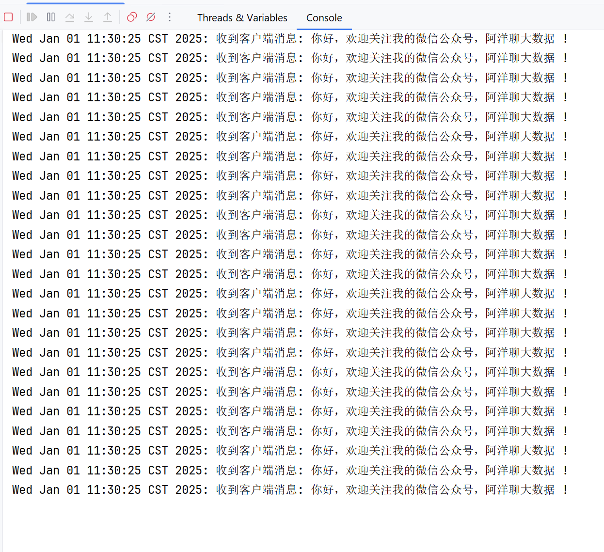

# Netty - 拆包/粘包理论与解决方案

## 引言         
我们先来看一个例子,在之前 blog `构建客户端与服务端的 Pipeline`代码基础上调整，修改`NettyClient#startConsoleThread()`方法，内容如下：        
**NettyClient**    
```java
private static void startConsoleThread(Channel channel) {
    new Thread(() -> {
        while (!Thread.interrupted()) {
            if (LoginUtil.hasLogin(channel)) {
//                    System.out.println("输入消息发送至服务端: ");
//                    Scanner sc = new Scanner(System.in);
//                    String line = sc.nextLine();
//
//                    channel.writeAndFlush(new MessageRequestPacket(line));

                for (int i = 0; i < 1000; i++) {
                    channel.writeAndFlush(new MessageRequestPacket("你好，欢迎关注我的微信公众号，阿洋聊大数据 !"));
                }
            }
        }
    }).start();
}
```        

测试结果是：     
  
这显然出现拆包异常。  

## 调整 PacketCodeC#decode()   
```java
public Packet decode(ByteBuf byteBuf) {
    // bytebuf 可读长度
    int readableBytesBufLen = byteBuf.readableBytes();
    if (readableBytesBufLen < 11) {
        return null;
    }

    int readerIndex = byteBuf.readerIndex();

    // 跳过 magic number
    byteBuf.skipBytes(4);

    // 跳过版本号
    byteBuf.skipBytes(1);

    // 序列化算法
    byte serializeAlgorithm = byteBuf.readByte();

    // 指令
    byte command = byteBuf.readByte();

    // 数据包长度
    int length = byteBuf.readInt();

    // 如何剩余的长度不够读 length，仍然需要回到起点，并返回 null。
    if (byteBuf.readableBytes() < length) {
        byteBuf.readerIndex(readerIndex); // 重置 readerIndex
        return null;
    }

    byte[] bytes = new byte[length];
    byteBuf.readBytes(bytes);

    Class<? extends Packet> requestType = getRequestType(command);
    Serializer serializer = getSerializer(serializeAlgorithm);

    if (requestType != null && serializer != null) {
        return serializer.deserialize(requestType, bytes);
    }

    byteBuf.readerIndex(readerIndex);
    return null;
}
``` 

修改1：判断可读长度是否满足最低字节要求
```java
// bytebuf 可读长度
int readableBytesBufLen = byteBuf.readableBytes();
if (readableBytesBufLen < 11) {
    return null;
}
```  

修改2：判断剩余长度是否符合 length 要求，若不符合则需要回到起点，并返回 null 
```java
// 如何剩余的长度不够读 length，仍然需要回到起点，并返回 null。
if (byteBuf.readableBytes() < length) {
    byteBuf.readerIndex(readerIndex); // 重置 readerIndex
    return null;
}
```

看调整后的输出：      
        

## 调整 PacketDecoder#decode()  
针对为 null，则不继续传递过去。  
```java
public class PacketDecoder extends ByteToMessageDecoder {

    @Override
    protected void decode(ChannelHandlerContext ctx, ByteBuf in, List out) {
        Packet packet = PacketCodeC.INSTANCE.decode(in);
        if (packet != null) {
            out.add(packet);
        }
    }
}
```

## 为什么会有粘包、半包现象
尽管我们在应用层面使用了Netty，但是操作系统只认TCP协议；尽管我们的应用层按照ByteBuf为单位来发送数据，但是到了底层操作系统，仍然是按照字节流发送数据的，因此，数据到了服务端，也按照字节流的方式读入，然后到了Netty应用层面，重新拼装成ByteBuf。这里的ByteBuf与客户端按照顺序发送的ByteBuf可能是不对等的。因此，我们需要在客户端根据自定义协议来组装应用层的数据包，然后在服务端根据应用层的协议来组装数据包，这个过程通常在服务端被称为`拆包`，而在客户端被称为`粘包`。             

拆包和粘包是相对的，一端粘了包，另外一端就需要将粘过的包拆开。举个例子，发送端将三个数据包粘成两个TCP数据包发送到接收端，接收端就需要根据应用协议将两个数据包重新拆分成三个数据包。             

## 拆包的原理
在没有Netty的情况下，用户如果自己需要拆包，基本原理就是不断地从TCP缓冲区中读取数据，每次读取完都需要判断是否是一个完整的数据包。                
1.如果当前读取的数据不足以拼接成一个完整的业务数据包，那就保留该数据，继续从TCP缓冲区中读取，直到得到一个完整的数据包。                     

2.如果当前读到的数据加上已经读取的数据足够拼接成一个数据包，那就将已经读取的数据拼接上本次读取的数据，构成一个完整的业务数据包传递到业务逻辑，多余的数据仍然保留，以便和下次读到的数据尝试拼接。                

如果我们自己实现拆包，那么这个过程将会非常麻烦。每一种自定义协议都需要自己实现，还需要考虑各种异常，而Netty自带的一些开箱即用的拆包器已经完全满足我们的需求了。下面介绍Netty有哪些自带的拆包器。

## Netty自带的拆包器

### 固定长度的拆包器FixedLengthFrameDecoder
如果应用层协议非常简单，每个数据包的长度都是固定的，比如100，那么只需要把这个拆包器加到Pipeline中，Netty就会把一个个长度为100的数据包（ByteBuf）传递到下一个ChannelHandler。        

### 行拆包器LineBasedFrameDecoder
从字面意思来看，发送端发送数据包的时候，每个数据包之间以换行符作为分隔，接收端通过LineBasedFrameDecoder将粘过的ByteBuf拆分成一个个完整的应用层数据包。              

### 分隔符拆包器DelimiterBasedFrameDecoder      
DelimiterBasedFrameDecoder是行拆包器的通用版本，只不过我们可以自定义分隔符。                

### 基于长度域的拆包器LengthFieldBasedFrameDecoder
最后一种拆包器是最通用的一种拆包器，只要你的自定义协议中包含长度域字段，均可以使用这个拆包器来实现应用层拆包。由于上面3种拆包器比较简单，读者可以自行写出Demo。接下来，我们就结合自定义协议，来学习如何使用基于长度域的拆包器来拆解数据包。                 

## 拒绝非本协议连接         
不知道大家还记不记得，我们在设计协议的时候为什么在数据包的开头加上一个魔数。我们设计魔数的原因是尽早屏蔽非本协议的客户端，通常在第一个Handler处理这段逻辑。接下来的做法是每个客户端发过来的数据包都做一次快速判断，判断当前发来的数据包是否满足我们的自定义协议。           

我们只需要继承自LengthFieldBasedFrameDecoder的decode()方法，然后在decode之前判断前4字节是否等于我们定义的魔数0x12345678即可。               

