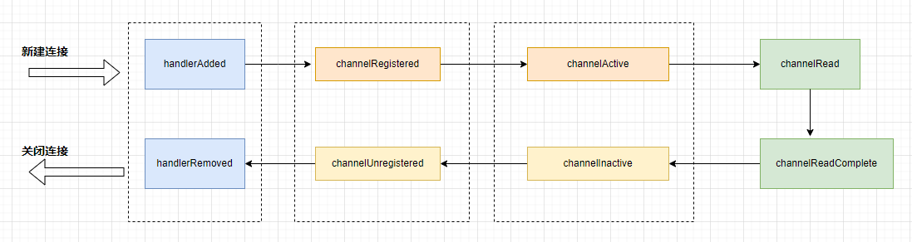

# Netty - ChannelHandler 生命周期  

## 引言         
对于ChannelHandler，我们的重点落在了读取数据相关的逻辑。本章，我们来学习ChannelHandler的其他方法，这些方法的执行是有顺序的，而这个执行顺序可以被称为ChannelHandler的生命周期。   

## ChannelHandler的生命周期详解
基于前面的代码，我们添加一个自定义ChannelHandler来测试一下各个回调方法的执行顺序。              

对于服务端应用程序来说，我们这里讨论的ChannelHandler更多的是ChannelInboundHandler，我们基于ChannelInboundHandlerAdapter，自定义了一个Handler：**LifeCyCleTestHandler**。    
```java
public class LifeCyCleTestHandler extends ChannelInboundHandlerAdapter {
    @Override
    public void handlerAdded(ChannelHandlerContext ctx) throws Exception {
        System.out.println("逻辑处理器被添加：handlerAdded()");
        super.handlerAdded(ctx);
    }

    @Override
    public void channelRegistered(ChannelHandlerContext ctx) throws Exception {
        System.out.println("channel 绑定到线程(NioEventLoop)：channelRegistered()");
        super.channelRegistered(ctx);
    }

    @Override
    public void channelActive(ChannelHandlerContext ctx) throws Exception {
        System.out.println("channel 准备就绪：channelActive()");
        super.channelActive(ctx);
    }

    @Override
    public void channelRead(ChannelHandlerContext ctx, Object msg) throws Exception {
        System.out.println("channel 有数据可读：channelRead()");
        super.channelRead(ctx, msg);
    }

    @Override
    public void channelReadComplete(ChannelHandlerContext ctx) throws Exception {
        System.out.println("channel 某次数据读完：channelReadComplete()");
        super.channelReadComplete(ctx);

    }

    @Override
    public void channelInactive(ChannelHandlerContext ctx) throws Exception {
        System.out.println("channel 被关闭：channelInactive()");
        super.channelInactive(ctx);
    }

    @Override
    public void channelUnregistered(ChannelHandlerContext ctx) throws Exception {
        System.out.println("channel 取消线程(NioEventLoop) 的绑定: channelUnregistered()");
        super.channelUnregistered(ctx);
    }

    @Override
    public void handlerRemoved(ChannelHandlerContext ctx) throws Exception {
        System.out.println("逻辑处理器被移除：handlerRemoved()");
        super.handlerRemoved(ctx);
    }
}
```                

从上面的代码可以看到，我们在每个方法被调用的时候都会打印一段文字，然后把这个事件继续往下传播。最后把这个Handler添加到我们上章构建的Pipeline中。             
```java
.childHandler(new ChannelInitializer<NioSocketChannel>() {
    protected void initChannel(NioSocketChannel ch) {
        ch.pipeline().addLast(new LifeCyCleTestHandler());
        ch.pipeline().addLast(new PacketDecoder());
        ch.pipeline().addLast(new LoginRequestHandler());
        ch.pipeline().addLast(new MessageRequestHandler());
        ch.pipeline().addLast(new PacketEncoder());
    }
});
```

我们先运行NettyServer.java，然后运行NettyClient.java。这个时候，服务端控制台的输出如下所示。            
```java
Wed Jan 01 11:42:32 CST 2025: 端口[8000]绑定成功!
逻辑处理器被添加：handlerAdded()
channel 绑定到线程(NioEventLoop)：channelRegistered()
channel 准备就绪：channelActive()
channel 有数据可读：channelRead()
Wed Jan 01 11:42:42 CST 2025: 收到客户端登录请求……
Wed Jan 01 11:42:42 CST 2025: 登录成功!
channel 某次数据读完：channelReadComplete()
```

可以看到，ChannelHandler回调方法的执行顺序为：   
```bash
handlerAdded() -> channelRegistered() -> channelActive() -> channelRead() -> channelReadComplete()
```

下面我们来逐个解释每个回调方法的含义。          
1.`handlerAdded()`：指当检测到新连接之后，调用ch.pipeline().addLast(new LifeCyCleTestHandler());之后的回调，表示在当前Channel中，已经成功添加了一个Handler处理器。  

2.`channelRegistered()`：这个回调方法表示当前Channel的所有逻辑处理已经和某个NIO线程建立了绑定关系，接收新的连接，然后创建一个线程来处理这个连接的读写，只不过在Netty里使用了线程池的方式，只需要从线程池里去抓一个线程绑定在这个Channel上即可。这里的NIO线程通常指NioEventLoop。       

3.`channelActive()`：当Channel的所有业务逻辑链准备完毕（即Channel的Pipeline中已经添加完所有的Handler），以及绑定好一个NIO线程之后，这个连接才真正被激活，接下来就会回调到此方法。    

4.`channelRead()`：客户端向服务端发送数据，每次都会回调此方法，表示有数据可读。    

5.`channelReadComplete()`：服务端每读完一次完整的数据，都回调该方法，表示数据读取完毕。      

我们再把客户端关闭，这个时候对于服务端来说，其实就是Channel被关闭。   


ChannelHandler回调方法的执行顺序为：            
```bash
channelInactive() -> channelUnregistered() -> handlerRemoved()        
```

到这里，相信大家应该已经能够看到，这里回调方法的执行顺序是新连接建立时候的逆操作。下面我们来解释一下每个方法的含义。                
1.channelInactive()：表面上这个连接已经被关闭了，这个连接在TCP层面已经不再是ESTABLISH状态了。               

2.channelUnregistered()：既然连接已经被关闭，那么与这个连接绑定的线程就不需要对这个连接负责了。这个回调表明与这个连接对应的NIO线程移除了对这个连接的处理。      

3.handlerRemoved()：我们给这个连接添加的所有业务逻辑处理器都被移除。                    

最后，我们用下图来标识Channelhandler的生命周期。            
        


