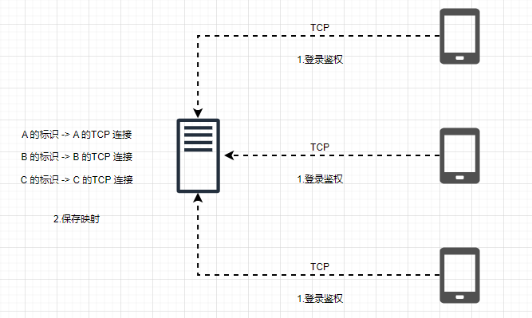

# Netty - 实现 一对一单聊          

## 引言         
   
1.A要和B聊天，首先A和B需要与服务器建立连接，然后进行一次登录流程，服务端保存用户标识和TCP连接的映射关系。           
2.A发消息给B，首先需要将带有B标识的消息数据包发送到服务器，然后服务器从消息数据包中获得B的标识，找到对应B的连接，将消息发送给B。                    
掌握原理之后，我们就来逐个实现其中的逻辑。              

## 一对一单聊的实现   

### 用户登录状态与Channel的绑定
我们来看服务端在单聊中是如何处理登录消息的。        
**LoginRequestHandler.java**        
```java
public class LoginRequestHandler extends SimpleChannelInboundHandler<LoginRequestPacket> {

    @Override
    protected void channelRead0(ChannelHandlerContext ctx, LoginRequestPacket loginRequestPacket) {
        LoginResponsePacket loginResponsePacket = new LoginResponsePacket();
        loginResponsePacket.setVersion(loginRequestPacket.getVersion());
        loginResponsePacket.setUserName(loginRequestPacket.getUserName());

        if (valid(loginRequestPacket)) {
            loginResponsePacket.setSuccess(true);
            String userId = randomUserId();
            loginResponsePacket.setUserId(userId);
            System.out.println("[" + loginRequestPacket.getUserName() + "]登录成功");
            SessionUtil.bindSession(new Session(userId, loginRequestPacket.getUserName()), ctx.channel());
        } else {
            loginResponsePacket.setReason("账号密码校验失败");
            loginResponsePacket.setSuccess(false);
            System.out.println(new Date() + ": 登录失败!");
        }

        // 登录响应
        ctx.channel().writeAndFlush(loginResponsePacket);
    }

    private boolean valid(LoginRequestPacket loginRequestPacket) {
        return true;
    }

    private static String randomUserId() {
        return UUID.randomUUID().toString().split("-")[0];
    }

    // 用户断线之后取消绑定  
    @Override
    public void channelInactive(ChannelHandlerContext ctx) {
        SessionUtil.unBindSession(ctx.channel());
    }
}
```

登录成功之后，服务端首先创建一个Session对象，表示用户当前的会话信息。在这个应用程序里面，Session只有下面两个字段。              

**Session.java**          
```java
@Data
@NoArgsConstructor
public class Session {
    // 用户唯一性标识
    private String userId;
    private String userName;

    public Session(String userId, String userName) {
        this.userId = userId;
        this.userName = userName;
    }

    @Override
    public String toString() {
        return userId + ":" + userName;
    }

}
```

在实际生产环境中，Session中的字段可能较多，比如头像URL、年龄、性别等。              
然后我们调用SessionUtil.bindSession()保存用户的会话信息，具体实现如下。       
**SessionUtil**
```java
public class SessionUtil {
    private static final Map<String, Channel> userIdChannelMap = new ConcurrentHashMap<>();

    public static void bindSession(Session session, Channel channel) {
        userIdChannelMap.put(session.getUserId(), channel);
        channel.attr(Attributes.SESSION).set(session);
    }

    public static void unBindSession(Channel channel) {
        if (hasLogin(channel)) {
            userIdChannelMap.remove(getSession(channel).getUserId());
            channel.attr(Attributes.SESSION).set(null);
        }
    }

    public static boolean hasLogin(Channel channel) {

        return channel.hasAttr(Attributes.SESSION);
    }

    public static Session getSession(Channel channel) {

        return channel.attr(Attributes.SESSION).get();
    }

    public static Channel getChannel(String userId) {

        return userIdChannelMap.get(userId);
    }
}
```

1.SessionUtil里维持了一个userId->Channel的映射Map，调用bindSession()方法的时候，在Map里保存这个映射关系。SessionUtil还提供了getChannel()方法，这样就可以通过userId获得对应的Channel。               

2.除了在Map里维持映射关系，在bindSession()方法中，我们还给Channel附上了一个属性，这个属性就是当前用户的Session。我们也提供了getSession()方法，非常方便地获得对应Channel的会话信息。         

3.这里的SessionUtil对应的是 `LoginUtil`，这里进行了重构，其中hasLogin()方法，只需要判断当前是否有用户的会话信息即可。                               

4.在LoginRequestHandler中，我们还重写了channelInactive()方法。用户下线之后，我们需要在内存里自动删除userId到Channel的映射关系，这是通过调用SessionUtil.unBindSession()来实现的。                    

关于保存用户会话信息的逻辑其实就这么多，总结一下就是：登录的时候保存会话信息，登出的时候删除会话信息。下面我们就来实现服务端接收消息并转发的逻辑。              


### 服务端接收消息并转发的实现          
我们重新定义一下客户端发送给服务端的消息的数据包格式。          
**MessageRequestPacket.java**             
```java
@Data
@NoArgsConstructor
public class MessageRequestPacket extends Packet {
    private String toUserId;
    private String message;

    public MessageRequestPacket(String toUserId, String message) {
        this.toUserId = toUserId;
        this.message = message;
    }

    @Override
    public Byte getCommand() {
        return MESSAGE_REQUEST;
    }
}
```

数据包格式很简单，toUserId表示要发送给哪个用户，message表示具体内容。我们来看一下服务端的消息处理Handler是如何处理消息的。       
**MessageRequestHandler.java**       
```java
public class MessageRequestHandler extends SimpleChannelInboundHandler<MessageRequestPacket> {
    @Override
    protected void channelRead0(ChannelHandlerContext ctx, MessageRequestPacket messageRequestPacket) {
        // 1.拿到消息发送方的会话信息
        Session session = SessionUtil.getSession(ctx.channel());

        // 2.通过消息发送方的会话信息构造要发送的消息
        MessageResponsePacket messageResponsePacket = new MessageResponsePacket();
        messageResponsePacket.setFromUserId(session.getUserId());
        messageResponsePacket.setFromUserName(session.getUserName());
        messageResponsePacket.setMessage(messageRequestPacket.getMessage());

        // 3.拿到消息接收方的 channel
        Channel toUserChannel = SessionUtil.getChannel(messageRequestPacket.getToUserId());

        // 4.将消息发送给消息接收方
        if (toUserChannel != null && SessionUtil.hasLogin(toUserChannel)) {
            toUserChannel.writeAndFlush(messageResponsePacket);
        } else {
            System.err.println("[" + messageRequestPacket.getToUserId() + "] 不在线，发送失败!");
        }
    }
}
```     

1.服务端在收到客户端发来的消息之后，首先获得当前用户也就是消息发送方的会话信息。                
2.获得消息发送方的会话信息之后，构造一个发送给客户端的消息对象MessageResponsePacket，填上消息发送方的用户标识、昵称、消息内容。                 
3.通过消息接收方的标识获得对应的Channel。       
4.如果消息接收方当前是登录状态，则直接发送；如果不在线，则控制台打印一条警告消息。                  

这里，服务端的功能相当于消息转发：收到一个客户端的消息之后，构建一条发送给另一个客户端的消息，接着获得另一个客户端的Channel，然后通过writeAndFlush()写出来。我们再来看一下客户端收到消息之后的处理逻辑。                

### 客户端接收消息的逻辑处理       
**MessageResponseHandler**      
```java
public class MessageResponseHandler extends SimpleChannelInboundHandler<MessageResponsePacket> {
    @Override
    protected void channelRead0(ChannelHandlerContext ctx, MessageResponsePacket messageResponsePacket) {
        String fromUserId = messageResponsePacket.getFromUserId();
        String fromUserName = messageResponsePacket.getFromUserName();
        System.out.println(fromUserId + ":" + fromUserName + " -> " + messageResponsePacket
                .getMessage());
    }
}
```
客户端收到消息之后，只是把当前消息打印出来。这里把发送方的用户标识打印出来是为了方便我们在控制台回消息的时候，可以直接复制。到这里，所有的核心逻辑其实已经完成了，我们还差最后一环：在客户端控制台进行登录和发送消息的逻辑。                

### 客户端控制台登录和发送消息          
我们回到客户端的启动类，改造一下控制台的逻辑      
**NettyClient**      
```java
public class NettyClient {
    private static final int MAX_RETRY = 5;
    private static final String HOST = "127.0.0.1";
    private static final int PORT = 8000;


    public static void main(String[] args) {
        NioEventLoopGroup workerGroup = new NioEventLoopGroup();

        Bootstrap bootstrap = new Bootstrap();
        bootstrap
                .group(workerGroup)
                .channel(NioSocketChannel.class)
                .option(ChannelOption.CONNECT_TIMEOUT_MILLIS, 5000)
                .option(ChannelOption.SO_KEEPALIVE, true)
                .option(ChannelOption.TCP_NODELAY, true)
                .handler(new ChannelInitializer<SocketChannel>() {
                    @Override
                    public void initChannel(SocketChannel ch) {
                        ch.pipeline().addLast(new Spliter());
                        ch.pipeline().addLast(new PacketDecoder());
                        ch.pipeline().addLast(new LoginResponseHandler());
                        ch.pipeline().addLast(new MessageResponseHandler());
                        ch.pipeline().addLast(new PacketEncoder());
                    }
                });

        connect(bootstrap, HOST, PORT, MAX_RETRY);
    }

    private static void connect(Bootstrap bootstrap, String host, int port, int retry) {
        bootstrap.connect(host, port).addListener(future -> {
            if (future.isSuccess()) {
                System.out.println(new Date() + ": 连接成功，启动控制台线程……");
                Channel channel = ((ChannelFuture) future).channel();
                startConsoleThread(channel);
            } else if (retry == 0) {
                System.err.println("重试次数已用完，放弃连接！");
            } else {
                // 第几次重连
                int order = (MAX_RETRY - retry) + 1;
                // 本次重连的间隔
                int delay = 1 << order;
                System.err.println(new Date() + ": 连接失败，第" + order + "次重连……");
                bootstrap.config().group().schedule(() -> connect(bootstrap, host, port, retry - 1), delay, TimeUnit
                        .SECONDS);
            }
        });
    }

    private static void startConsoleThread(Channel channel) {
        Scanner sc = new Scanner(System.in);
        LoginRequestPacket loginRequestPacket = new LoginRequestPacket();

        new Thread(() -> {
            while (!Thread.interrupted()) {
                if (!SessionUtil.hasLogin(channel)) {
                    System.out.print("输入用户名登录: ");
                    String username = sc.nextLine();
                    loginRequestPacket.setUserName(username);

                    // 密码使用默认的
                    loginRequestPacket.setPassword("pwd");

                    // 发送登录数据包
                    channel.writeAndFlush(loginRequestPacket);
                    waitForLoginResponse();
                } else {
                    String toUserId = sc.next();
                    String message = sc.next();
                    channel.writeAndFlush(new MessageRequestPacket(toUserId, message));
                }
            }
        }).start();
    }


    private static void waitForLoginResponse() {
        try {
            Thread.sleep(1000);
        } catch (InterruptedException ignored) {
        }
    }
}
```

在客户端启动的时候，起一个线程：                
1.如果当前用户还未登录，我们在控制台输入一个用户名，然后构造一个登录数据包发送给服务器。发完之后，等待一个超时时间，可以当作登录逻辑的最大处理时间。            
2.如果当前用户已经是登录状态，我们可以在控制台输入消息接收方的userId，然后输入一个空格，再输入消息的具体内容，这样我们就可以构建一个消息数据包，发送到服务端。              
关于单聊的原理和实现到这里就讲解完成了。           


## 运行测试     
1.客户端启动之后，我们在控制台输入用户名，服务端随机分配一个userId给客户端，这里我们省去了通过账号、密码注册的过程，userId就在服务端随机生成了，生产环境中可能会持久化在数据库，然后每次通过账号、密码去“捞”。                      

2.当有两个客户端登录成功之后，在控制台输入userId+空格+消息，这里的userId是消息接收方的标识，消息接收方的控制台接着就会显示另外一个客户端发来的消息。                

**Server**          
```bash
Wed Jan 01 19:23:14 CST 2025: 端口[8000]绑定成功!
[yzhou]登录成功
[jj]登录成功
```

**Client 01**   
```bash
Wed Jan 01 19:23:18 CST 2025: 连接成功，启动控制台线程……
输入用户名登录: yzhou
[yzhou]登录成功，userId 为: 3e363c90
a1e4f243 你好，我是yzhou，收到请回复我！
a1e4f243:jj -> 我收到你的信息，我是jj
```         

**Client 02**   
```bash
Wed Jan 01 19:23:26 CST 2025: 连接成功，启动控制台线程……
输入用户名登录: jj
[jj]登录成功，userId 为: a1e4f243
3e363c90:yzhou -> 你好，我是yzhou，收到请回复我！
3e363c90 我收到你的信息，我是jj
```

## 总结
1.我们定义一个会话类Session来维持用户的登录信息，用户登录的时候绑定Session与Channel，用户登出或者断线的时候解绑Session与Channel。               
2.服务端处理消息的时候，通过消息接收方的标识，获得消息接收方的Channel，调用writeAndFlush()方法将消息发送给消息接收方            