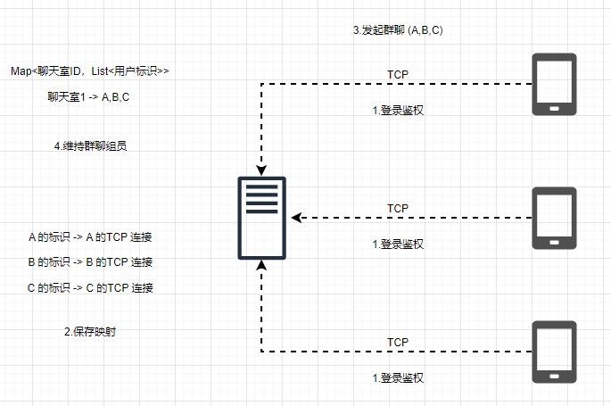

# Netty - 群聊的发起与通知 

## 引言         
如何创建一个群聊，并通知群聊中的各位成员。                  

## 群聊的原理           
关于群聊的原理，我们在即时聊天系统简介中已经学习过，现在再来重温一下。                  

群聊指的是一个组内多位用户之间的聊天，一位用户发到群组的消息会被组内任何一个成员接收。下面来看群聊的基本流程，如下图所示。              
   

群聊的基本流程其实和单聊类似。              
1.A、B、C依然会经历登录流程，服务端保存用户标识对应的TCP连接。              

2.A发起群聊的时候，将A、B、C的标识发送至服务端，服务端拿到之后建立一个群ID，然后把这个ID与A、B、C的标识绑定。               

3.群聊里的任意一方在群里聊天的时候，将群ID发送至服务端，服务端获得群ID之后，取出对应的用户标识，遍历用户标识对应的TCP连接，就可以将消息发送至每一个群聊成员。               

我们把重点放在创建一个群聊上，由于控制台输入的指令越来越多，因此在正式开始之前，我们先对控制台程序稍作重构。            

## 创建控制台命令执行器
首先，把在控制台要执行的操作抽象出来，抽象出一个接口。                  
**ConsoleCommand.java**
```java
public interface ConsoleCommand {
    void exec(Scanner scanner, Channel channel);
}
```

## 管理控制台命令执行器
接着，创建一个管理类来对这些操作进行管理。              
**ConsoleCommandManager.java**          
```java
public class ConsoleCommandManager implements ConsoleCommand {
    private Map<String, ConsoleCommand> consoleCommandMap;

    public ConsoleCommandManager() {
        consoleCommandMap = new HashMap<>();
        consoleCommandMap.put("sendToUser", new SendToUserConsoleCommand());
        consoleCommandMap.put("logout", new LogoutConsoleCommand());
        consoleCommandMap.put("createGroup", new CreateGroupConsoleCommand());
    }

    @Override
    public void exec(Scanner scanner, Channel channel) {
        //  获取第一个指令
        String command = scanner.next();

        if (!SessionUtil.hasLogin(channel)) {
            return;
        }

        ConsoleCommand consoleCommand = consoleCommandMap.get(command);

        if (consoleCommand != null) {
            consoleCommand.exec(scanner, channel);
        } else {
            System.err.println("无法识别[" + command + "]指令，请重新输入!");
        }
    }
}
```
1.在这个管理类中，把所有要管理的控制台指令都放到一个Map中。                             
2.执行具体操作的时候，先获取控制台第一个输入的指令，这里以字符串代替比较清晰（这里我们已经实现了第16章思考题中的登出操作），然后通过这个指令拿到对应的控制台命令执行器执行。                
这里我们就以创建群聊为例：首先在控制台输入createGroup，然后按下回车键，就会进入CreateGroupConsoleCommand这个类进行处理。                        

**CreateGroupConsoleCommand.java**          
```java
public class CreateGroupConsoleCommand implements ConsoleCommand {

    private static final String USER_ID_SPLITER = ",";

    @Override
    public void exec(Scanner scanner, Channel channel) {
        CreateGroupRequestPacket createGroupRequestPacket = new CreateGroupRequestPacket();

        System.out.print("【拉人群聊】输入 userId 列表，userId 之间英文逗号隔开：");
        String userIds = scanner.next();
        createGroupRequestPacket.setUserIdList(Arrays.asList(userIds.split(USER_ID_SPLITER)));
        channel.writeAndFlush(createGroupRequestPacket);
    }

}
``` 

进入CreateGroupConsoleCommand的逻辑之后，我们创建了一个群聊创建请求的数据包，然后提示输入以英文逗号分隔的userId的列表。填充完这个数据包之后，调用writeAndFlush()方法就可以发送创建群聊的指令到服务端。                  

最后来看经过改造的与客户端控制台线程相关的代码。       
**NettyClient**          
```java
public class NettyClient {
    private static final int MAX_RETRY = 5;
    private static final String HOST = "127.0.0.1";
    private static final int PORT = 8000;


    public static void main(String[] args) {
        NioEventLoopGroup workerGroup = new NioEventLoopGroup();

        Bootstrap bootstrap = new Bootstrap();
        bootstrap
                .group(workerGroup)
                .channel(NioSocketChannel.class)
                .option(ChannelOption.CONNECT_TIMEOUT_MILLIS, 5000)
                .option(ChannelOption.SO_KEEPALIVE, true)
                .option(ChannelOption.TCP_NODELAY, true)
                .handler(new ChannelInitializer<SocketChannel>() {
                    @Override
                    public void initChannel(SocketChannel ch) {
                        ch.pipeline().addLast(new Spliter());
                        ch.pipeline().addLast(new PacketDecoder());
                        ch.pipeline().addLast(new LoginResponseHandler());
                        ch.pipeline().addLast(new LogoutResponseHandler());
                        ch.pipeline().addLast(new MessageResponseHandler());
                        ch.pipeline().addLast(new CreateGroupResponseHandler());
                        ch.pipeline().addLast(new PacketEncoder());
                    }
                });

        connect(bootstrap, HOST, PORT, MAX_RETRY);
    }

    private static void connect(Bootstrap bootstrap, String host, int port, int retry) {
        bootstrap.connect(host, port).addListener(future -> {
            if (future.isSuccess()) {
                System.out.println(new Date() + ": 连接成功，启动控制台线程……");
                Channel channel = ((ChannelFuture) future).channel();
                startConsoleThread(channel);
            } else if (retry == 0) {
                System.err.println("重试次数已用完，放弃连接！");
            } else {
                // 第几次重连
                int order = (MAX_RETRY - retry) + 1;
                // 本次重连的间隔
                int delay = 1 << order;
                System.err.println(new Date() + ": 连接失败，第" + order + "次重连……");
                bootstrap.config().group().schedule(() -> connect(bootstrap, host, port, retry - 1), delay, TimeUnit
                        .SECONDS);
            }
        });
    }

    private static void startConsoleThread(Channel channel) {
        ConsoleCommandManager consoleCommandManager = new ConsoleCommandManager();
        LoginConsoleCommand loginConsoleCommand = new LoginConsoleCommand();
        Scanner scanner = new Scanner(System.in);

        new Thread(() -> {
            while (!Thread.interrupted()) {
                if (!SessionUtil.hasLogin(channel)) {
                    loginConsoleCommand.exec(scanner, channel);
                } else {
                    consoleCommandManager.exec(scanner, channel);
                }
            }
        }).start();
    }
}
```

抽取出控制台指令执行器之后，客户端控制台的逻辑已经相比之前清晰很多了，可以非常方便地在控制台模拟各种在IM聊天窗口的操作。接下来，我们看一下如何创建群聊。                

## 创建群聊的实现   

### 客户端发送创建群聊请求
通过前面讲述控制台逻辑的重构，我们已经了解到，我们发送了一个CreateGroupRequestPacket数据包到服务端，这个数据包的格式如下。                  
```java
@Data
public class CreateGroupRequestPacket extends Packet {

    private List<String> userIdList;

    @Override
    public Byte getCommand() {

        return CREATE_GROUP_REQUEST;
    }
}
```
它只包含了一个列表，这个列表就是需要拉取群聊的用户列表。我们来看下服务端是如何处理的。    

### 服务端处理创建群聊请求
我们依然创建一个Handler来处理新的指令。             
**NettyServer.java**    
```java
public class NettyServer {

    private static final int PORT = 8000;

    public static void main(String[] args) {
        NioEventLoopGroup boosGroup = new NioEventLoopGroup();
        NioEventLoopGroup workerGroup = new NioEventLoopGroup();

        final ServerBootstrap serverBootstrap = new ServerBootstrap();
        serverBootstrap
                .group(boosGroup, workerGroup)
                .channel(NioServerSocketChannel.class)
                .option(ChannelOption.SO_BACKLOG, 1024)
                .childOption(ChannelOption.SO_KEEPALIVE, true)
                .childOption(ChannelOption.TCP_NODELAY, true)
                .childHandler(new ChannelInitializer<NioSocketChannel>() {
                    protected void initChannel(NioSocketChannel ch) {
                        ch.pipeline().addLast(new Spliter());
                        ch.pipeline().addLast(new PacketDecoder());
                        ch.pipeline().addLast(new LoginRequestHandler());
                        ch.pipeline().addLast(new AuthHandler());
                        ch.pipeline().addLast(new MessageRequestHandler());
                        ch.pipeline().addLast(new CreateGroupRequestHandler());
                        ch.pipeline().addLast(new LogoutRequestHandler());
                        ch.pipeline().addLast(new PacketEncoder());
                    }
                });


        bind(serverBootstrap, PORT);
    }

    private static void bind(final ServerBootstrap serverBootstrap, final int port) {
        serverBootstrap.bind(port).addListener(future -> {
            if (future.isSuccess()) {
                System.out.println(new Date() + ": 端口[" + port + "]绑定成功!");
            } else {
                System.err.println("端口[" + port + "]绑定失败!");
            }
        });
    }
}
```

我们来看一下这个Handler具体做哪些事情。                             
**CreateGroupRequestHandler.java**          
```java
public class CreateGroupRequestHandler extends SimpleChannelInboundHandler<CreateGroupRequestPacket> {
    @Override
    protected void channelRead0(ChannelHandlerContext ctx, CreateGroupRequestPacket createGroupRequestPacket) {
        List<String> userIdList = createGroupRequestPacket.getUserIdList();

        List<String> userNameList = new ArrayList<>();
        // 1. 创建一个 channel 分组
        ChannelGroup channelGroup = new DefaultChannelGroup(ctx.executor());

        // 2. 筛选出待加入群聊的用户的 channel 和 userName
        for (String userId : userIdList) {
            Channel channel = SessionUtil.getChannel(userId);
            if (channel != null) {
                channelGroup.add(channel);
                userNameList.add(SessionUtil.getSession(channel).getUserName());
            }
        }

        // 3. 创建群聊创建结果的响应
        CreateGroupResponsePacket createGroupResponsePacket = new CreateGroupResponsePacket();
        createGroupResponsePacket.setSuccess(true);
        createGroupResponsePacket.setGroupId(IDUtil.randomId());
        createGroupResponsePacket.setUserNameList(userNameList);

        // 4. 给每个客户端发送拉群通知
        channelGroup.writeAndFlush(createGroupResponsePacket);

        System.out.print("群创建成功，id 为[" + createGroupResponsePacket.getGroupId() + "], ");
        System.out.println("群里面有：" + createGroupResponsePacket.getUserNameList());

    }
}
```

｝
整个过程可以分为以下4个步骤。     
1.创建一个ChannelGroup。这里简单介绍一下ChannelGroup：它可以把多个Channel的操作聚合在一起，可以往它里面添加、删除Channel，也可以进行Channel的批量读写、关闭等操作，详细的功能读者可以自行查阅这个接口的方法。这里的一个群组其实就是一个Channel的分组集合，使用ChannelGroup非常方便。    

2.遍历待加入群聊的userId，如果存在该用户，就把对应的Channel添加到ChannelGroup中，用户昵称也被添加到昵称列表中。     

3.创建一个创建群聊响应的对象，其中groupId是随机生成的，群聊创建结果共有三个字段，这里就不展开对这个类进行说明了。      

4.调用ChannelGroup的聚合发送功能，将拉群的通知批量地发送到客户端，接着在服务端控制台打印创建群聊成功的信息。至此，服务端处理创建群聊请求的逻辑结束。     

我们再来看客户端处理创建群聊响应。       

## 运行演示     
**NettyServer**      
```bash
Wed Jan 01 23:14:16 CST 2025: 端口[8000]绑定成功!
[yzhou]登录成功
[jj]登录成功
[lisi]登录成功
群创建成功，id 为[53189947], 群里面有：[yzhou, jj, lisi]
```

**NettyClient01**
```bash
Wed Jan 01 23:14:26 CST 2025: 连接成功，启动控制台线程……
输入用户名登录: yzhou
[yzhou]登录成功，userId 为: 819b8950
createGroup
【拉人群聊】输入 userId 列表，userId 之间英文逗号隔开：819b8950,05529b98,2b5f4c89  
群创建成功，id 为[53189947], 群里面有：[yzhou, jj, lisi]
```

**NettyClient02**   
```bash
Wed Jan 01 23:14:36 CST 2025: 连接成功，启动控制台线程……
输入用户名登录: jj
[jj]登录成功，userId 为: 05529b98
群创建成功，id 为[53189947], 群里面有：[yzhou, jj, lisi]
```

**NettyClient03**   
```bash
Wed Jan 01 23:14:44 CST 2025: 连接成功，启动控制台线程……
输入用户名登录: lisi
[lisi]登录成功，userId 为: 2b5f4c89
群创建成功，id 为[53189947], 群里面有：[yzhou, jj, lisi]
```

1.依然是三位用户依次登录服务器。            

2.我们在闪电侠的控制台输入createGroup指令，提示创建群聊需要输入userId列表，然后我们输入以英文逗号分隔的userId。                 

3.群聊创建成功之后，分别在服务端和三个客户端弹出提示消息，包括群ID及群里各位用户的昵称。            


## 总结
1.群聊的原理和单聊类似，都是通过标识拿到Channel。               
2.重构了控制台的程序结构，在实际带有UI的IM应用中，我们输入的第一个指令其实就是对应我们点击UI的某些按钮或菜单的操作。                        
3.通过ChannelGroup，可以很方便地对一组Channel进行批量操作。    

