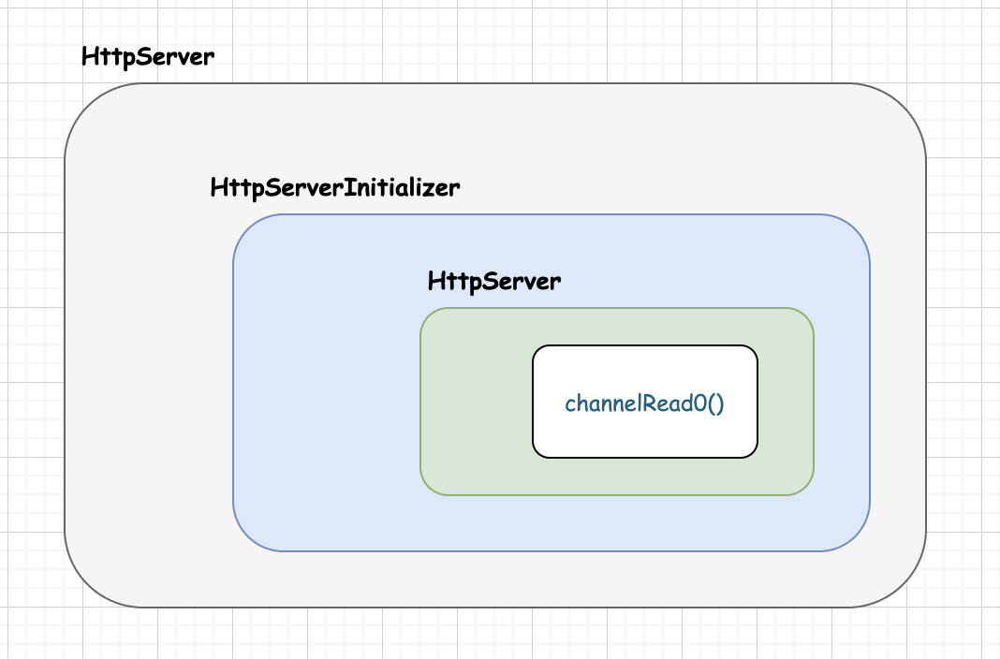

# Netty 开发一个 HTTP 服务 Demo   

## 目标  
使用 Netty 框架开发一个 HTTP 服务, 输入效果是输入 "http://127.0.0.1:8081", 返回`Hello Netty`;   

    
 
## 使用 Netty 开发 HTTP 服务     
```bash
[root@vm01 bin]# curl  192.168.0.2:8081
hello netty
```         

### HttpServer  
```java
public class HttpServer {
    public static void main(String[] args) throws Exception {

        // 定义主从线程组
        // 定义主线程池，用于接受客户端的连接，但是不做任何处理，比如老板会谈业务，拉到业务就会交给下面的员工去做了
        io.netty.channel.EventLoopGroup bossGroup = new io.netty.channel.nio.NioEventLoopGroup();
        // 定义从线程池，处理主线程池交过来的任务，公司业务员开展业务，完成老板交代的任务
        io.netty.channel.EventLoopGroup workerGroup = new io.netty.channel.nio.NioEventLoopGroup();

        try {
            // 构建Netty服务器
            io.netty.bootstrap.ServerBootstrap server = new io.netty.bootstrap.ServerBootstrap();     // 服务的启动类
            server.group(bossGroup, workerGroup)                // 把主从线程池组放入到启动类中
                    .channel(io.netty.channel.socket.nio.NioServerSocketChannel.class)      // 设置Nio的双向通道
                    .childHandler(new HttpServerInitializer());   // 设置处理器，用于处理workerGroup

            // 启动server，并且绑定端口号8081，同时启动方式为"同步"
            io.netty.channel.ChannelFuture channelFuture = server.bind(8081).sync();
            // 请求：http://127.0.0.1:8081

            // 监听关闭的channel
            channelFuture.channel().closeFuture().sync();
        } finally {
            // 优雅的关闭线程池组
            bossGroup.shutdownGracefully();
            workerGroup.shutdownGracefully();
        }
    }
}
```  

### HttpServerInitializer    
```java
public class HttpServerInitializer extends ChannelInitializer<SocketChannel> {
    @Override
    protected void initChannel(SocketChannel channel) throws Exception {
        // 通过SocketChannel获得对应的管道
        io.netty.channel.ChannelPipeline pipeline = channel.pipeline();

        /**
         * 通过管道，添加handler处理器
         */

        // HttpServerCodec 是由netty自己提供的助手类，此处可以理解为管道中的拦截器
        // 当请求到服务端，我们需要进行做解码，相应到客户端做编码
        pipeline.addLast("HttpServerCodec", new io.netty.handler.codec.http.HttpServerCodec());

        // 添加自定义的助手类，当请求访问，返回“hello netty”
        pipeline.addLast("HttpHandler", new HttpHandler());
    }
}
```

### HttpHandler         
```java
Version:1.0 StartHTML:0000000128 EndHTML:0000015472 StartFragment:0000000128 EndFragment:0000015472 SourceURL:about:blank
public class HttpHandler extends SimpleChannelInboundHandler<HttpObject> {

    @Override
    protected void channelRead0(ChannelHandlerContext ctx,
                                HttpObject msg) throws Exception {
        // 获取channel
        Channel channel = ctx.channel();

        if (msg instanceof HttpRequest) {
            // 打印客户端的远程地址
            System.out.println(channel.remoteAddress());

            // 通过缓冲区定义发送的消息，读写数据都是通过缓冲区进行数据交换的
            ByteBuf content = Unpooled.copiedBuffer("hello netty", CharsetUtil.UTF_8);

            // 构建http的response
            FullHttpResponse response = new DefaultFullHttpResponse(
                    HttpVersion.HTTP_1_1,
                    HttpResponseStatus.OK,
                    content);
            // 为响应添加数据类型和数据长度
            response.headers().set(HttpHeaderNames.CONTENT_TYPE, HttpHeaderValues.TEXT_PLAIN);
            response.headers().set(HttpHeaderNames.CONTENT_LENGTH, content.readableBytes());

            // 把响应数据写到缓冲区再刷到客户端
            ctx.writeAndFlush(response);
        }
    }

    @Override
    public void channelRegistered(ChannelHandlerContext ctx) throws Exception {
        System.out.println("channel...注册");
        super.channelRegistered(ctx);
    }

    @Override
    public void channelUnregistered(ChannelHandlerContext ctx) throws Exception {
        System.out.println("channel...移除");
        super.channelUnregistered(ctx);
    }

    @Override
    public void channelActive(ChannelHandlerContext ctx) throws Exception {
        System.out.println("channel...活跃");
        super.channelActive(ctx);
    }

    @Override
    public void channelInactive(ChannelHandlerContext ctx) throws Exception {
        System.out.println("channel...不活跃");
        super.channelInactive(ctx);
    }

    @Override
    public void channelReadComplete(ChannelHandlerContext ctx) throws Exception {
        System.out.println("channel...读取数据完毕");
        super.channelReadComplete(ctx);
    }

    @Override
    public void userEventTriggered(ChannelHandlerContext ctx, Object evt) throws Exception {
        System.out.println("用户事件触发");
        super.userEventTriggered(ctx, evt);
    }

    @Override
    public void channelWritabilityChanged(ChannelHandlerContext ctx) throws Exception {
        System.out.println("channel可写更改");
        super.channelWritabilityChanged(ctx);
    }

    @Override
    public void exceptionCaught(ChannelHandlerContext ctx, Throwable cause) throws Exception {
        System.out.println("捕获到异常");
        super.exceptionCaught(ctx, cause);
    }

    @Override
    public void handlerAdded(ChannelHandlerContext ctx) throws Exception {
        System.out.println("handler...添加");
        super.handlerAdded(ctx);
    }

    @Override
    public void handlerRemoved(ChannelHandlerContext ctx) throws Exception {
        System.out.println("handler...移除");
        super.handlerRemoved(ctx);
    }
}
```
