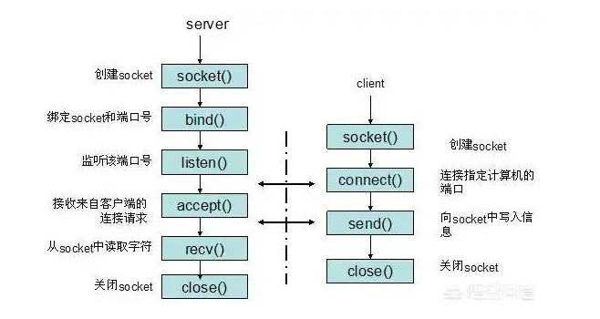
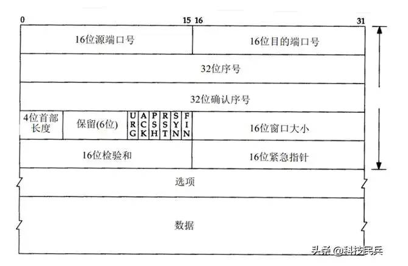

## 单台服务器最大并发TCP连接数

首先，问题中描述的65535个连接指的是客户端连接数的限制。

在tcp应用中，server事先在某个固定端口监听，client主动发起连接，经过三次握手后建立tcp连接。那么对单机，其最大并发tcp连接数是多少呢？

### 如何标识一个TCP连接
在确定最大连接数之前，先来看看系统如何标识一个tcp连接。系统用一个4四元组来唯一标识一个TCP连接：{localip, localport,remoteip,remoteport} = {本地ip，本地port，远程ip，远程port}

### client最大tcp连接数
client每次发起tcp连接请求时，除非绑定端口，通常会让系统选取一个空闲的本地端口（local port），该端口是独占的，不能和其他tcp连接共享。tcp端口的数据类型是unsigned short，因此本地端口个数最大只有65536，端口0有特殊含义，不能使用，这样可用端口最多只有65535，所以在全部作为client端的情况下，一个client最大tcp连接数为65535，这些连接可以连到不同的serverip。

### server最大tcp连接数
server通常固定在某个本地端口上监听，等待client的连接请求。不考虑地址重用（unix的SO_REUSEADDR选项）的情况下，即使server端有多个ip，本地监听端口也是独占的，因此server端tcp连接4元组中只有remoteip（也就是clientip）和remote port（客户端port）是可变的，因此最大tcp连接为客户端ip数×客户端port数，对IPV4，不考虑ip地址分类等因素，最大tcp连接数约为2的32次方（ip数）×2的16次方（port数），也就是server端单机最大tcp连接数约为2的48次方。

### 实际的tcp连接数
上面给出的是理论上的单机最大连接数，在实际环境中，受到机器资源、操作系统等的限制，特别是sever端，其最大并发tcp连接数远不能达到理论上限。在unix/linux下限制连接数的主要因素是内存和允许的文件描述符个数（每个tcp连接都要占用一定内存，每个socket就是一个文件描述符），另外1024以下的端口通常为保留端口。

所以，对server端，通过增加内存、修改最大文件描述符个数等参数，单机最大并发TCP连接数超过10万,甚至上百万是没问题的。`这明显是进入了思维的误区，65535是指可用的端口总数，并不代表服务器同时只能接受65535个并发连接`。

### 文件句柄限制
在linux下编写网络服务器程序的朋友肯定都知道每一个tcp连接都要占一个文件描述符，一旦这个文件描述符使用完了，新的连接到来返回给我们的错误是“Socket/File:Can't open so many files”。    
这时需要调整操作系统对可以打开的最大文件数的限制。  

**进程限制**
执行 ulimit -n 输出 1024，说明对于一个进程而言最多只能打开1024个文件，所以你要采用此默认配置最多也就可以并发上千个TCP连接。临时修改：ulimit -n 1000000，但是这种临时修改只对当前登录用户目前的使用环境有效，系统重启或用户退出后就会失效。

重启后失效的修改（不过我在CentOS 6.5下测试，重启后未发现失效），编辑 /etc/security/limits.conf 文件， 修改后内容为：
```shell
soft nofile 1000000
hard nofile 1000000
```

永久修改：编辑/etc/rc.local，在其后添加如下内容：
```shell
ulimit -SHn 1000000
```

**全局限制**
执行 cat /proc/sys/fs/file-nr 输出 9344 0 592026，分别为：
1. 已经分配的文件句柄数，
2. 已经分配但没有使用的文件句柄数，
3. 最大文件句柄数。

但在kernel 2.6版本中第二项的值总为0，这并不是一个错误，它实际上意味着已经分配的文件描述符无一浪费的都已经被使用了 。

我们可以把这个数值改大些，用 root 权限修改 /etc/sysctl.conf 文件:
```shell
fs.file-max = 1000000
net.ipv4.ip_conntrack_max = 1000000
net.ipv4.netfilter.ip_conntrack_max = 1000000
```

### 案例分析
我们做了一个网站，绑定的是TCP的80端口，结果是所有访问这个网站的用户都是通过服务器的80端口访问，而不是其他端口。可见端口是可以复用的。
即使Linux服务器只在80端口侦听服务， 也允许有10万、100万个用户连接服务器。Linux系统不会限制连接数至于服务器能不能承受住这么多的连接，取决于服务器的硬件配置、软件架构及优化。

**01**
我们知道两个进程如果需要进行通讯最基本的一个前提是：能够唯一的标示一个进程。在本地进程通讯中我们可以使用PID来唯一标示一个进程，但PID只在本地唯一，网络中的两个进程PID冲突几率很大。

这时候就需要另辟它径了，IP地址可以唯一标示主机，而TCP层协议和端口号可以唯一标示主机的一个进程，这样可以利用IP地址＋协议＋端口号唯一标示网络中的一个进程。

能够唯一标示网络中的进程后，它们就可以利用socket进行通信了。socket（套接字）是在应用层和传输层之间的一个抽象层，它把TCP/IP层复杂的操作抽象为几个简单的接口供应用层调用以实现进程在网络中通信。


socket源自Unix，是一种"打开—读/写—关闭"模式的实现，服务器和客户端各自维护一个"文件"，在建立连接打开后，可以向自己文件写入内容供对方读取或者读取对方内容，通讯结束时关闭文件。

**02**
唯一能够确定一个连接有4个东西：
* 服务器的IP
* 服务器的Port
* 客户端的IP
* 客户端的Port
服务器的IP和Port可以保持不变，只要客户端的IP和Port彼此不同就可以确定一个连接数。


一个socket是可以建立多个连接的，一个TCP连接的标记为一个四元组(source_ip, source_port, destination_ip, destination_port)，即(源IP，源端口，目的IP，目的端口)四个元素的组合。只要四个元素的组合中有一个元素不一样，那就可以区别不同的连接。

举个例子：
你的主机IP地址是1.1.1.1， 在8080端口监听
当一个来自 2.2.2.2 发来一条连接请求，端口为5555。这条连接的四元组为(1.1.1.1, 8080, 2.2.2.2, 5555)
这时2.2.2.2又发来第二条连接请求，端口为6666。新连接的四元组为(1.1.1.1, 8080, 2.2.2.2, 6666)

那么，你主机的8080端口建立了两条连接；
（2.2.2.2）发来的第三条连接请求,端口为5555(或6666)。第三条连接的请求就无法建立，因为没有办法区分于上面两条连接。

同理，可以在同一个端口号和IP地址上绑定一个TCP socket和一个UDP socket
因为端口号虽然一样，但由于协议不一样，所以端口是完全独立的。
TCP/UDP一般采用五元组来定位一个连接:
source_ip, source_port, destination_ip, destination_port， protocol_type
即（源IP，源端口，目的IP，目的端口，协议号）
综上所述，服务器的并发数并不是由TCP的65535个端口决定的。服务器同时能够承受的并发数是由带宽、硬件、程序设计等多方面因素决定的。

所以也就能理解淘宝、腾讯、头条、百度、新浪、哔哔哔哔等为什么能够承受住每秒种几亿次的并发访问，是因为他们采用的是服务器集群。服务器集群分布在全国各地的大型机房，当访问量小的时候会关闭一些服务器，当访问量大的时候回不断的开启新的服务器。

`65535从哪来的，干啥的？`
   

要解释好这个问题，就要先说清楚65535的含义。在Linux系统中，如果两个机器要通信，那么相互之间需要建立TCP连接，为了让双方互相认识，Linux系统用一个四元组来唯一标识一个TCP连接：{local ip, local port, remote ip, remote port}，即本机IP、本机端口、远程IP、远程端口，IP和端口就相当于小区地址和门牌号，只有拿到这些信息，通信的双方才能互相认知。在Linux系统中，表示端口号（port）的变量占16位，这就决定了端口号最多有2的16次方个，即65536个，另外端口0有特殊含义不给使用，这样每个服务器最多就有65535个端口可用。因此，65535代表Linux系统支持的TCP端口号数量，在TCP建立连接时会使用。
`TCP怎么建立连接，与端口号是什么关系？`
Linux服务器在交互时，一般有两种身份：客户端或者服务器端。典型的交互场景是：
（1）服务器端主动创建监听的socket，并绑定对外服务端口port，然后开始监听
（2）客户端想跟服务器端通信时，就开始连接服务器的端口port
（3）服务端接受客户端的请求，然后再生成新的socket
（4）服务器和客户端在新的socket里进行通信

可以看到，端口port主要用在服务器和客户端的“握手认识”过程，一旦互相认识了，就会生成新的socket进行通信，这时候port就不再需要了，可以给别的socket通信去使用，所以很明显TCP连接的数量可以大于TCP端口号的数量65,535。

考虑一下两个极端场景，即某台Linux服务器只作为客户端或者服务器端
`（1）Linux服务器只作为客户端`

这时候每发起一个TCP请求，系统就会指定一个空闲的本地端口给你用，而且是独占式的，不会被别的TCP连接抢走，这样最多可以建立65535个连接，每个连接都与不同的服务器进行交互。这种场景，就是题主所描述的样子，但是由于条件过于苛刻，属于小概率事件，所以更多的还是理论上的可能，现实的环境中几乎不会出现。

`（2）Linux服务器只作为服务端`

这种场景下，服务端就会固定的监听本地端口port，等着客户端来向它发起请求。为了计算简单，我们假设服务器端的IP跟端口是多对一的，这样TCP四元组里面就有remote ip和remote port是可变的，因此最大支持创建TCP个数为2的32次方（IP地址是32位的）乘以2的16次方（port是16位的）等于2的48次方。

现实中单台Linux服务器支持的TCP连接数量

通过前面的分析我们知道，在现实场景中，由于存在端口port复用的情况，服务器可同时支持的TCP连接数跟65535没有一一对应关系，事实上，真正影响TCP连接数量的，是服务器的内存以及允许单一进程同时打开文件的数量，因为每创建一个TCP连接都要创建一个socket句柄，每个socket句柄都占用一部分系统内存，当系统内存被占用殆尽，允许的TCP并发连接数也就到了上限。一般来讲，通过增加服务器内存、修改最大文件描述符个数等，可以做到单台服务器支持10万+的TCP并发。

当然，在真实的商用场景下，单台服务器都会编入分布式集群，通过负载均衡算法动态的调度不同用户的请求给最空闲的服务器，如果服务器平均内存使用超过80%的警戒线，那么就会及时采用限流或者扩展集群的方式来保证服务，绝对不会出现服务器的内存被耗尽的情况，那样就算事故了。

总之，65535只是Linux系统中可使用端口port数量的上限，端口port数量与TCP连接数量并非完全一一对应的关系，服务器支持的TCP并发连接数量主要跟服务器的内存以及允许单个进程同时打开的文件数量有关系，通过端口复用及调整服务器参数等手段，单台服务器支持的TCP并发连接数是可以高于65535的。


refer: 
《一台服务器​最大并发 tcp 连接数多少？65535？》 https://www.modb.pro/db/427892
《单台服务器并发TCP连接数到底可以有多少》http://www.52im.net/thread-561-1-1.html