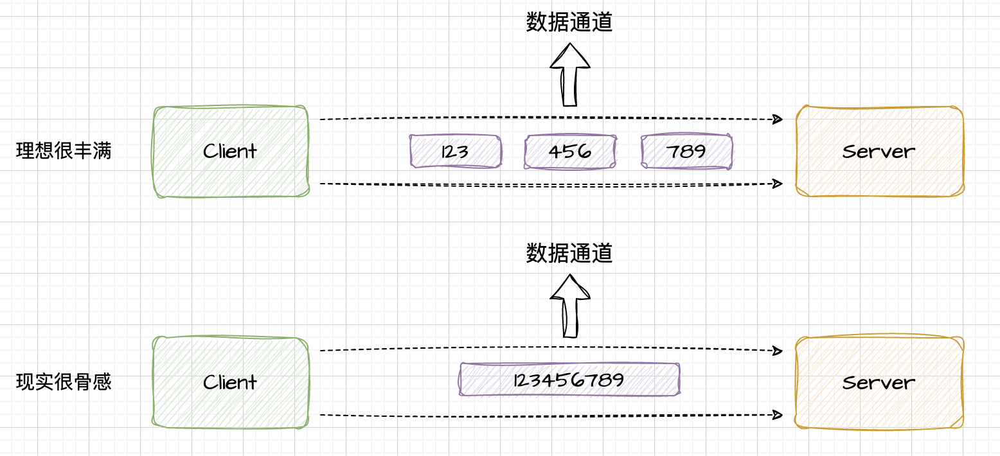
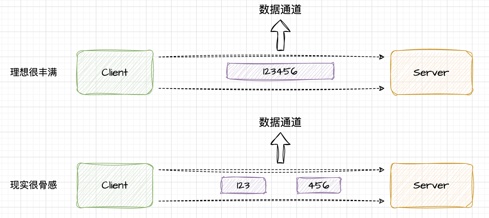
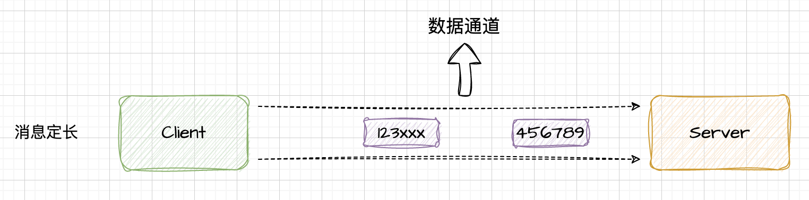
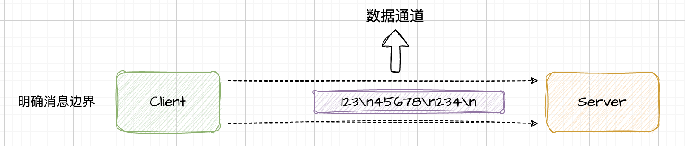
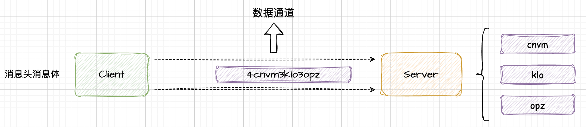

## Netty如何解决拆包和粘包问题

### 引言
客户端与服务端进行TCP网络通信时，在发送以及读取数据时可能会出现粘包以及拆包问题，那么作为高性能网络框架的Netty是如何解决粘包以及拆包问题的呢？我们一起来探讨下这个问题。

### 什么是粘包、拆包？
在搞清楚Netty如何解决粘包以及拆包问题之前，我们得先搞清楚到底什么是粘包、拆包。我们都知道TCP是一种面向连接的、可靠的、基于字节流的传输层通信协议。 这种基于流的协议是没有明显边界的，TCP这种底层协议是不会理解上层的业务业务含义的，因此在通信过程中，发送数据流的时候，有可能出现一份完整的数据，被TCP拆分为多个数据包进行发送，当然也有可能将多个数据包合并为一个数据包进行发送。从而产生了拆包以及粘包的问题。

**粘包**
业务侧理想的是分别发送三个数据包到服务端，服务端根据不同的数据包进行对应的业务处理。但是实际事与愿违，现实很骨感，实际上服务端接收到的是一个数据包，而且是三个数据包揉在一起的。这种现象就是TCP粘包。


**拆包**
这种情况下，服务端理想是要接收一个数据包，但是实际收到了拆解后的两个数据包。这种场景就成为拆包。


**出现粘包、拆包现象的根本原因**
1、客户端要发送的数据小于TCP发送缓冲区的大小，TCP为了提升效率，将多个写入缓冲区的数据包一次发送出去，多个数据包粘在一起，造成粘包；
2、服务端的应用层没有及时处理接收缓冲区中的数据，再次进行读取时出现粘包问题；
3、数据发送过快，数据包堆积导致缓冲区积压多个数据后才一次性发送出去；
4、拆包一般由于一次发送的数据包太大，超过MSS的大小，那么这个数据包就会被拆成多个TCP报文分开进行传输。
`根本原因：TCP 基于字节流的协议，消息无边界`

### 产常见解决办法
通过上文我们知道，底层的的TCP协议负责数据传输，它是无法理解上层的业务数据的具体语义的，所以在底层我们没有办法进行解决。那么我们只能通过上层的协议设计来解决粘包、拆包问题，主要有以下几种方法：

**消息定长**
可以考虑客户端将每个数据包设定为固定长度（不够的可以通过补特定字符进行填充）的流数据，那么接收端在接收缓冲区中读取到约定固定长度的数据流之后，服务端就可以根据约定的数据长度进行数据包的解析，区分不同的数据包。


**明确消息边界**
既然流式协议无法区分消息边界，那我们就约定好消息边界。服务端接收到数据流之后，按照之前的约定通过消息边界进行消息数据分离。比如在数据包尾增加\n进行分割。


**将消息分为消息头和消息体**
消息头中包含表示消息总长度（或者消息体长度）的字段，后面跟上对应的消息内容。服务端读取数据后，先解析出消息头中的内容长度大小，再将后面的内容一把读取出来。


### Netty解决粘包、拆包的办法
Netty作为一款高性能的网络框架，不仅仅是它对NIO进行了深度封装，其在客户端和服务端之间的数据传输也进行了很好的处理。其中粘包、拆包的办法就是它的用武之地。Netty通过预先指定的数据流编解码器，按照预先约定好的规则进行数据的解析，即可解决对应的粘包、拆包问题。
下面我们一起看下Netty为我们提供了哪些编解码器吧。
Netty 中的拆包器大致如下：

**对应定长法的解码器 FixedLengthFrameDecoder**
Netty 在消息长度固定的场景下，对定长法进行了封装。其中FixedLengthFrameDecoder便是Netty中的固定长度解码器，它的主要作用就是对固定长度的流数据进行解码。定长法中只有解码器，没有编码器。对于编码器来说，Netty 懒得实现了，由用户自己实现，只需要在发送数据时将不足的长度补齐即可，不需要其他额外的操作。解码器使用非常简单，只需要在 childHandler 中添加一个解码器就可以了。
```java
public class EchoServer {

  public void bind(int port) throws InterruptedException {
    EventLoopGroup bossGroup = new NioEventLoopGroup();
    EventLoopGroup workerGroup = new NioEventLoopGroup();
    try {
      ServerBootstrap bootstrap = new ServerBootstrap();
      bootstrap.group(bossGroup, workerGroup)
        .channel(NioServerSocketChannel.class)
        .option(ChannelOption.SO_BACKLOG, 200)
        .handler(new LoggingHandler(LogLevel.INFO))
        .childHandler(new ChannelInitializer<SocketChannel>() {
          @Override
          protected void initChannel(SocketChannel ch) throws Exception {
            // 将FixedLengthFrameDecoder添加到pipeline中，定长20
            ch.pipeline().addLast(new FixedLengthFrameDecoder(20));
            ch.pipeline().addLast(new StringDecoder());
           ch.pipeline().addLast(new EchoServerHandler());
          }
        });

      ChannelFuture future = bootstrap.bind(port).sync();
      future.channel().closeFuture().sync();
    } finally {
      bossGroup.shutdownGracefully();
      workerGroup.shutdownGracefully();
    }
  }

  public static void main(String[] args) throws InterruptedException {
    new EchoServer().bind(8080);
  }
}

```

**对应明确消息边界的分隔符拆包器 DelimiterBasedFrameDecoder**
通过LineBasedFrameDecoder 可以实现自动处理以指定分割符为字节流的消息的解码。 LineBasedFrameDecoder则是实现以\n以及\r\n为分隔符的数据流解码。
```java
public class EchoServer {

  public void bind(int port) throws InterruptedException {
    EventLoopGroup bossGroup = new NioEventLoopGroup();
    EventLoopGroup workerGroup = new NioEventLoopGroup();
    try {
      ServerBootstrap bootstrap = new ServerBootstrap();
      bootstrap.group(bossGroup, workerGroup)
        .channel(NioServerSocketChannel.class)
        .option(ChannelOption.SO_BACKLOG, 200)
        .handler(new LoggingHandler(LogLevel.INFO))
        .childHandler(new ChannelInitializer<SocketChannel>() {
          @Override
          protected void initChannel(SocketChannel ch) throws Exception {
            // 将FixedLengthFrameDecoder添加到pipeline中，定长20
            ByteBuf delimiter = Unpooled.copiedBuffer(“%_%”.getBytes());
            ch.pipeline().addLast(new DelimiterBasedFrameDecoder(1024， delimiter));
            ch.pipeline().addLast(new StringDecoder());
           ch.pipeline().addLast(new EchoServerHandler());
          }
        });

      ChannelFuture future = bootstrap.bind(port).sync();
      future.channel().closeFuture().sync();
    } finally {
      bossGroup.shutdownGracefully();
      workerGroup.shutdownGracefully();
    }
  }

  public static void main(String[] args) throws InterruptedException {
    new EchoServer().bind(8080);
  }
}

```

**对应消息头消息体的基于数据包长度的解码器 LengthFieldBasedFrameDecoder**
LengthFieldBasedFrameDecoder与LengthFieldPrepender这两个需要配合起来使用。实际上就是在编码的时候需要在数据包头部添加数据包长度的字段，具体的数据紧跟在数据包后面。LengthFieldBasedFrameDecoder便会按照参数指定的数据长度偏移量对接收到的数据包进行解码，进而得到指定的消息体数据。但是LengthFieldPrepender则会在响应的数据前面添加指定的字节数据，这个字节数据中保存了当前消息体的整体字节数据长度。

**自定义编解码器**
一般来说，上面几种方式可以解决大部分粘包以及拆包问题，但是如果涉及更复杂的编解码，开发者可以自行进行定义实现

* 编码器
```java
public abstract class CustomDecoder extends ChannelInboundHandlerAdapter {
    protected abstract void decode(ChannelHandlerContext ctx, ByteBuf in, List<Object> out) 
        throws Exception;
}
```

* 解码器
```java
public abstract class CustomEncoder<I> extends ChannelOutboundHandlerAdapter {
    protected abstract void encode(ChannelHandlerContext ctx, I msg, ByteBuf out) 
        throws Exception;
}
```


refer: 《Netty如何解决粘包以及拆包问题》https://juejin.cn/post/6975109908106575903

