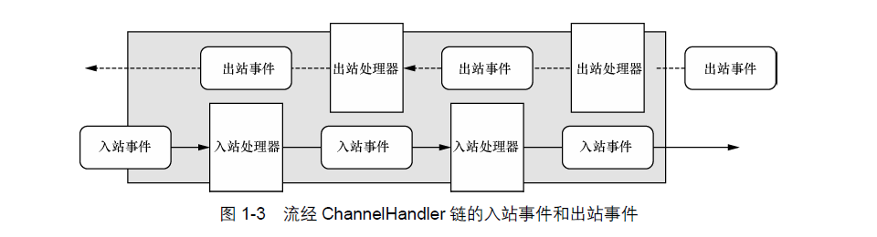

## Netty 的主要构件块:
* Channel
* 回掉
* Future
* 事件和ChannelHandler

### Channel
Channel 是java NIO的一个基本构造。它代表一个到实体(如一个硬件设备，一个文件，一个网络套接字或一个能够执行一个或多个不同的I/O操作的程序组件)的开放连接，如读操作和写操作。
目前，可以把Channel看作是传入(入站)或者传出(出站)数据的载体。因此，它可以被打开或者被关闭，连接或者断开连接。


### 回调
一个回调其实就是一个方法，一个指向已经被提供给另外一个方法的方法的引用。这使得后者可以在适当的时候调用前者。Netty在内部使用了回调来处理时间。当一个回调被触发时，相关的事件可以被一个interfaceChannelHandler的实现处理。

>案例: 当一个新的连接已经被建立时，ChannelHandler的channelActive()回调方法将会被调用，并将打印一条信息。
```java
//被回调触发的ChannelHandler
public class ConnectHandler extends ChannelInboundHandlerAdapter throws Exception{

    //当一个新的连接已经被建立时，channelActive(ChannelHandlerContext)将会被调用
    @Override
    public void channelActive(ChannelHandlerContext ctx){
        System.out.println("Client" + ctx.channel().remoteAddress() + " connected");
    }

}
```

### Future
Future提供了另一种在操作完成时通知应用程序的方式。这个对象可以看作是一个异步操作的结果的占位符，它将在未来的某个时刻完成，并提供对其结果的访问。
JDK预置了interface java.util.concurrent.Future，但是其所提供的实现，只允许手动检查对应的操作是否已经完成，或者一直阻塞直到它完成。这是非常繁琐的，所以Netty提供了它自己的实现  ChannelFuture，用于在执行异步操作的时候使用。
`ChannelFuture`提供了几种额外的方法，这些方法使得我们能够注册一个或多个ChannelFutureListener实例。监听器的回调方法operationComplete(),将会在对应的操作完成时被调用，然后监听器可以判断该操作是成功完成了还是出错了。如果是后者，我们可以检索产生的Throwable。简而言之，`由ChannelFutureListener提供的通知机制消除了手动检查对应的操作是否完成的必要`。
每个Netty的出站I/O操作都将返回一个ChannelFuture，也就是说，它们都不会阻塞。正如我们前面所提到过的一样，`Netty完成时异步和事件驱动的`。

```java
//异步建立连接 和 添加监听器

Channel channel = ... ;
//异步连接到远程节点
ChannelFuture future  = channel.connect(new InetSocketAddress("192.168.0.1",25));
//注册一个ChannelFurtureListener，以便在操作完成时通知
future.addListener(new ChannelFutureListener(){ 
    @Override
    public void operationComplete(ChannelFuture future){
        if(future.isSuccess()){
            ByteBuf buffer = Unpooled.copiedBuffer(   //如果操作是成功的，则差U那个就爱你一个ByteBuf以持有数据
                "Hello",Charset.defaultCharset());
            ChannelFuture wf = future.channel().writeAndFlush(buffer);  //将数据异步地发送到远程节点,返回一个ChannelFuture。
            ...
        }else{
            Throwable cause  = future.cause();    //如果发生错误，则访问描述原因的Throwable
            cause.printStackTrace();
        }
    }
});

```

### 事件和ChannelHandler
Netty使用不同的事件来通知我们状态的改变或者是操作的改变。这使得我们能够基于已经发生的时间来触发适当的动作。这些动作可能是：
* 记录日志
* 数据转换
* 流控制
* 应用程序逻辑
* 连接已被激活或者连接失活
* 数据读取
* 用户事件
* 错误事件
* 打开或者关闭到远程节点的连接
* 将数据写到或者冲刷到套接字

**一个事件是如何被一个这样的ChannelHandler链处理**

Netty提供了大量预定义的可以开箱即用的ChannelHandler实现，包括用于各种协议(HTTP和SSL/TLS)的ChannelHandler。在内部，ChannelHandler自己也使用了事件和Future，使得它们也成为了你的应用程序将使用相同抽象的消费者。


## 总结
1. Future、回调和ChannelHandler 
Netty的异步编程模型是建立在Future和回调的概念之上的，而将事件派发到ChannelHandler的方法则发生在更深的层次上。结合在一起，这些元素就提供了一个处理环境，使你的应用程序逻辑可以独立于任何网络操作相关的顾虑而独立地演变。这也是Netty的设计方式的一个关键目标。
拦截操作以及高速的转换入站数据和出站数据，都只需要你提供回调或者利用操作所返回的Future。这使得链接操作变得既简单又高效，并且促进了可重用的通用代码的编写。

2. 选择器、事件和EventLoop
Netty通过触发事件将Selector从应用程序中抽象出来，消除了所有本来将需要手动编写的派发代码。在内部，将会为每个Channel分配一个EventLoop，用以处理所有事件，包括：
* 注册感兴趣的事件
* 将事件派发给ChannelHandler
* 安排进一步的动作
EventLoop本身只由一个线程驱动，其处理了一个Channel的所有I/O事件，并且在该EventLoop的整个生命周期内都不会改变。这个简单而强大的设计消除了你可能有的在ChannelHandler实现中需要进行同步的任何顾虑，因此，你可以专注于提供正确的逻辑，用来在有感兴趣的数据要处理的时候执行。

>摘自:《Netty实战》 第一部分Netty的概念及体系结构