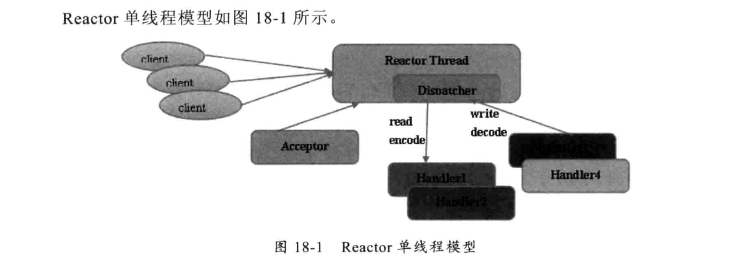
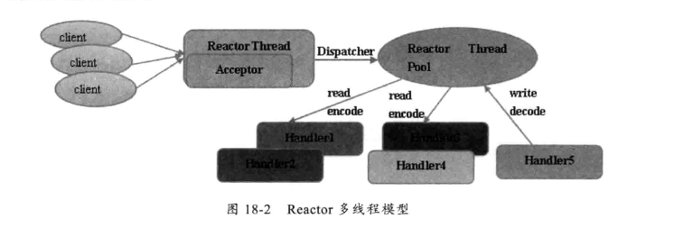
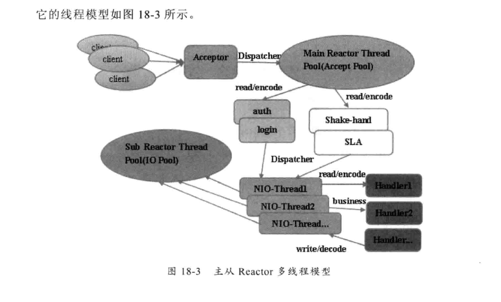

**正文**

[TOC]

 __尽管不同的NIO框架对于Reactor模式的实现存在差异，但本质上还是遵循了Reactor的基础线程模型__

## 1.Reactor单线程模型
Reactor单线程模型，是指所有的I/O操作都在同一个NIO线程上面完成。NIO线程的职责如下：
* 作为NIO服务器，接口客户端的TCP连接    
* 作为NIO客户端，向服务端发起TCP连接    
* 读取通信对端的请求或者应答消息    
* 向通信对端发送消息请求或者应答消息    

 
由于Reactor模式使用的异步非阻塞I/O，所有的I/O操作都不会导致阻塞，理论上一个线程可以独立处理所有I/O相关的操作。从架构层面看么，一个NIO线程确实可以完成其承担的职责。例如，通过Acceptor类接口客户端的TCP连接请求消息，当链路建立成功之后，通过Dispatch将对应的ByteBuffer派发到指定的Handler上，进行消息解码。用户线程消息编码后通过NIO线程将消息发送到客户端。

但一些小容量应用场景下，可以使用单线程模型。但是这对于高负载，大并发的应用场景却不合适。 主要原因如下：
* 一个NIO线程同时处理成百上千的链路，性能上无法支撑，即便NIO线程的CPU负荷达到100%，也无法满足海量消息的编码、解码、读取和发送。
* 当NIO线程负载过重之后，处理速度将变慢，这会导致大量的客户端连接超时，超时之后往往会进行重发，这更加重了NIO线程的负载，最终会导致大量消息积压和处理超时，成为系统的性能瓶颈。
* 可靠性问题，一旦NIO线程意外跑飞，或者进入死循环，会导致整个系统通信模块不可用，不能接受和处理外部消息，造成节点故障。

**为了解决这些问题，演进出了Reactor多线程模型**

## 2.Reactor多线程模型
Reactor多线程模型与单线程最大的区别就是有一组NIO线程来处理I/O操作，它的原理图：

Reactor多线程模型的特点如下:
* 有专业一个NIO线程  Acceptor线程用于监听服务端，接受客户端的TCP连接请求
* 网络I/O操作  读，写等由一个NIO线程池负责，线程池可以采用标准的JDK线程池实现，它包含一个任务队列和N个可用的线程，由这些NIO线程负责消息的读取，解码，编码和发送
* 一个NIO线程可以同时处理N条链路，但是一个链路只对应一个NIO线程，防止发生并发操作问题。

在绝大多场景下，Reactor多线程模型可以满足性能需求，但是，在个别特殊场景中，一个NIO线程负责监听和处理所有的客户端连接可能会存在性能问题。例如并发百万客户端连接，或者服务端需要对客户端握手进行安全认证，但是认证本身非常损耗性能。在这类场景下，单独一个Acceptor线程可能会存在性能不足的问题，为了解决性能问题，产生了第三种Reactor线程模型 主从Reactor多线程模型

## 主从Reactor多线程模型
主从Reactor线程模型的特点是：服务端用于接受客户端的不再是一个单独的NIO线程，而是一个独立的NIO线程池。Acceptor接受到客户端TCP连接请求并处理完成后(可能包含接入认证等)，将新创新的SocketChannel注册到I/O线程池(sub reactor线程池)的某个I/O线程上，由它负责SocketChannel的读写和编解码工作。Acceptor线程池仅仅用于客户端的登录，握手和安全认证，一旦链路建立成功，就将链路注册到后端subReactor线程池上的I/O线程上，由I/O线程负责后续的I/O操作8

 

利用主从NIO线程模型，可以解决一个服务端监听线程无法有效处理所有客户端连接的性能不足问题，因此，在Netty的官网demo中，推荐使用该线程模型。

>摘自：《Netty权威指南》 18.1 Netty的线程模型