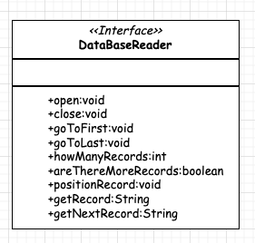
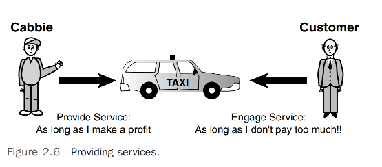

# 如何用对象的方式思考   

## 引言 
就像生活中的大多数事情一样，解决问题没有唯一的对或错方法。通常有许多方法可以解决同一个问题。因此，在尝试设计一个面向对象的解决方案时，不要纠结于第一次就尝试做出完美的设计（总会有改进的空间）。你真正需要做的是头脑风暴，让你的思维过程朝不同的方向发展。解决问题时不要试图遵循任何标准或惯例，因为整个想法是要有创造性。          

事实上，在过程的开始，甚至不要开始考虑具体的编程语言。首要任务是识别和解决商业问题。首先进行概念分析和设计。只有当特定技术对商业问题至关重要时，才考虑具体技术。例如，你不能在没有无线技术的情况下设计一个无线网络。然而，通常情况下，你将有不止一种软件解决方案可供考虑。          

因此，在你开始设计一个系统或甚至一个类之前，先通盘考虑问题，并且享受其中的乐趣！在这一章中，我们将探讨面向对象思维的精细艺术和科学。                

任何在思维上的根本改变都不是小事。正如之前提到的，从结构化到面向对象开发的转变被广泛提及。如前所述，这一辩论的一个副作用是误解，认为结构化开发和面向对象开发是相互排斥的。事实并非如此。正如我们在讨论包装器时了解到的，结构化开发和面向对象开发是可以共存的。实际上，当你编写一个面向对象的应用程序时，你到处都在使用结构化构造。我从未见过一个程序，无论是面向对象的还是其他类型的，不使用循环、if语句等。然而，转向面向对象设计确实需要不同类型的投资。          

从FORTRAN 转换到 COBOL，甚至是转到 C，需要你学习一门新的语言；然而，从 COBOL 转向C++、C# .NET、Visual Basic .NET、Objective-C、Swift或Java，需要你学习一种新的思考过程。这就是被过度使用的短语“面向对象（OO）范式”显得尤为重要的地方。在转向面向对象语言时，你必须首先投入学习面向对象概念及相应的思考过程。如果这种范式转变没有发生，将会出现两种情况之一：要么项目本质上不会真正是面向对象的（例如，它会使用C++但不使用面向对象的结构），要么项目将完全是一个对象导向的混乱。     

在本章中，`我们覆盖了三件重要的事情，可以帮助你发展良好的面向对象思考过程`：          
* 了解接口和实现之间的区别         
* 更加抽象地思考           
* 尽可能为用户提供最小的接口           

现在我们将更详细地探讨这些内容。                

## 了解 接口和实现 之间的区别
正如我们了解的 `构建强大的面向对象设计的关键之一是理解接口和实现之间的区别`。 因此，在设计一个类时，用户需要知道什么，以及可能更重要的是，用户不需要知道什么，这都至关重要。封装所固有的数据隐藏机制是隐藏用户不必要数据的手段。      

>不要将接口的概念与图形用户界面（GUI）这样的术语混淆。虽然GUI正如其名，是一个界面，但在这里使用的“接口”一词具有更普遍的性质，并不限于图形界面。             

我们一起看下烤面包机案例，烤面包机或任何电器都被插入到接口中，即电源插座。所有的电器通过遵守正确的接口：电源插座，获得所需的电力。烤面包机不需要知道关于电力是如何产生的实现细节。对于烤面包机来说，不管是煤炭发电厂还是核电厂产生的电力——只要接口按照规定正确且安全地工作，电器就不关心是哪一种。      
          

作为另一个例子，考虑一下汽车。你和汽车之间的接口包括方向盘、油门、刹车和点火开关等组成部分。对大多数人来说，除了美学问题外，开车时的主要关注点是汽车能否启动、加速、停止、转向等等。实现部分，基本上是你看不见的东西，对普通驾驶者来说关注度很低。事实上，大多数人甚至无法识别某些部件，如催化转化器和垫圈。然而，任何驾驶者都会识别并知道如何使用方向盘，因为这是一个常见的接口。通过在汽车中安装标准方向盘，制造商确保目标市场中的人们能够使用系统。          

然而，如果制造商决定用操纵杆代替方向盘，大多数驾驶者可能会对此感到不满，这种汽车可能不会成为畅销车（除非可能是游戏玩家）。另一方面，只要性能和美观没有变化，普通驾驶者可能不会注意到制造商是否更换了汽车的引擎（实现的一部分）。            

必须强调，可互换的引擎在所有方面必须完全相同——就接口而言。用八缸引擎替换四缸引擎会改变规则，并且可能无法与与引擎接口的其他组件协同工作，就像将电流从交流变为直流会影响电力厂示例中的规则一样。          

引擎是实现的一部分，方向盘是接口的一部分。实现的变化不应该影响驾驶者，而接口的变化可能会。即使性能相似，驾驶者也会注意到方向盘的美观变化。必须强调，驾驶者能够感觉到的对引擎的改变违反了这一规则。例如，导致明显动力损失的变化实际上影响了接口。        

>当我们在本章节中谈论用户时，主要是指设计师和开发者——并不一定是最终用户。因此，当我们在这种情况下谈论接口时，我们讨论的是类接口，而不是图形用户界面（GUI）。            

`正确构建的类被设计为两部分——接口和实现。`                   

### 接口 (Interface)
呈现给用户的服务构成了接口。在最理想的情况下，只有用户需要的服务会被呈现出来。当然，用户需要哪些服务可能是一个观点问题。如果你把10个人放在一个房间里，让每个人独立设计，你可能会得到10个完全不同的设计, 这并没有什么不对。然而，`作为一个通用规则，类的接口应该只包含用户需要知道的内容`。在烤面包机的例子中，用户只需要知道烤面包机必须插入接口（在这种情况下是电源插座）以及如何操作烤面包机本身。        

>确定用户,设计类时可能最重要的考虑是确定类的受众或用户。  

### 实现（Implementation）  
实现细节对用户来说是隐藏的。关于实现，应该牢记一个目标：`实现的更改不应要求更改用户的代码`。这听起来可能有点混乱，但这个目标是设计问题的核心。          

>好的接口，如果接口设计得当，实现的更改不应要求更改用户的代码。

记住，接口包括调用方法和返回值的语法。如果这个接口没有变化，用户不会关心实现是否改变。只要程序员可以使用相同的语法并检索相同的值，那就是最重要的。    

我们在使用手机时经常看到这一点。要打电话，接口很简单——我们要么拨打一个号码，要么在联系人列表中选择一个条目。然而，如果提供商更新了软件，这并不改变你打电话的方式。无论实现如何改变，接口都保持不变。然而，我能想到一个提供商确实改变了接口的情况——当我的区号改变时。像区号变更这样的根本接口改变，确实要求用户改变行为。企业试图将这类变化减少到最少，因为有些客户可能不喜欢这种变化或可能不愿意忍受这种麻烦。          

回想一下烤面包机的例子，虽然接口始终是电源插座，但实现可以从煤炭发电厂变为核电厂而不影响烤面包机。这里应该提出一个非常重要的警告：煤炭或核电厂也必须符合接口规范。如果煤炭发电厂产生交流电，而核电厂产生直流电，就存在问题。关键是用户和实现都必须符合接口规范。        

### An Interface / Implementation Example  
让我们创建一个简单的（如果不是非常功能性的）数据库读取器类。我们将编写一些Java代码，用于从数据库中检索记录。正如我们所讨论的，了解你的最终用户始终是进行任何设计时最重要的问题。你应该分析情况，并与最终用户进行访谈，然后列出项目的需求。以下是我们可能想用于数据库读取器的一些需求：          
* 我们必须能够打开到数据库的连接。  
* 我们必须能够关闭数据库的连接。      
* 我们必须能够将光标定位在数据库中的第一条记录上。        
* 我们必须能够将光标定位在数据库中的最后一条记录上。  
* 我们必须能够找到数据库中的记录数量。                  
* 我们必须能够确定数据库中是否还有更多记录（即，我们是否在末尾）。          
* 我们必须能够通过提供键来将光标定位在特定的记录上。      
* 我们必须能够通过提供键来检索记录。            
* 我们必须能够根据光标的位置获取下一条记录。            

有了这些需求，我们可以初步尝试设计数据库读取器类，为这些最终用户创建可能的接口。            

在这种情况下，数据库读取器类是为需要使用数据库的程序员设计的。因此，接口本质上是程序员将使用的应用程序编程接口（API）。`这些方法实际上是封装了数据库系统提供的功能的包装器。为什么我们要这样做？我们将在本章稍后更详细地探讨这个问题；简短的答案是我们可能需要定制一些数据库功能`。例如，我们可能需要处理对象，以便我们可以将它们写入关系数据库。编写这种中间件在设计和编码方面并非易事，但它是封装功能的一个现实生活中的例子。更重要的是，我们可能想要更改数据库引擎本身，而不必更改代码。         

下面显示了一个类图，代表了可能的数据库读取器类接口：        

      

这个类中的方法都是公开的（记住，公开接口的方法名称旁边有加号）。还要注意，只有接口被表示出来；实现没有显示。花点时间来确定这个类图是否一般符合项目早先概述的要求。如果你稍后发现图表并未满足所有要求，这也没关系；`记住，面向对象设计是一个迭代过程，所以你不必在第一次就做到完全正确`。            

>注意，公共接口，应用程序开发者可以访问它，因此，它被认为是类接口的一部分。`不要将“接口”这个术语与在Java和.NET中使用的关键字“interface”混淆——这将在后面的章节中讨论`。              

对于我们列出的每个需求，我们需要一个相应的方法来提供我们想要的功能。现在你需要问自己几个问题：               
- 为了有效地使用这个类，作为一个程序员，你还需要知道关于它的其他什么信息吗？                
- 你需要知道内部数据库代码是如何打开数据库的吗？        
- 你需要知道内部数据库代码是如何在特定记录上物理定位的吗？          
- 你需要知道内部数据库代码是如何确定是否还有剩余记录的吗？              

在所有这些问题上，`答案都是响亮的否！`你不需要知道任何这些信息。你只关心的是你得到正确的返回值，并且操作正确执行。实际上，应用程序开发者很可能至少比实现抽象出一个更高的层级。应用程序将使用你的类来打开数据库，这反过来将调用适当的数据库API。                 

>注意：`最小接口`，虽然可能有些极端，但确定最小化接口的一种方法是最初不向用户提供任何公开接口。当然，这样类将是无用的；然而，这迫使用户回到你这里并说：“嘿，我需要这个功能。”然后你可以进行协商。因此，只有在被请求时才添加接口。永远不要假设用户需要某样东西。         

创建封装器（wrappers）可能看起来有些过度，但编写它们有很多优点。举例来说，市场上今天有许多中间件产品。考虑将对象映射到关系数据库的问题。面向对象数据库从未真正流行起来；然而，从理论上讲，它们可能完美适合面向对象应用程序。然而，存在一个小问题：大多数公司的数据都存储在传统的关系数据库系统中。公司如何在保留其关系数据库中的数据的同时，拥抱面向对象技术并保持技术前沿？            

首先，你可以将所有传统的关系数据转换为全新的面向对象数据库。然而，任何经历过数据转换的急性（和慢性）痛苦的人都知道，这是不惜一切代价都要避免的。尽管这些转换可能需要大量时间和努力，但往往它们从未能正确工作。       

其次，你可以使用中间件产品无缝地将应用程序代码中的对象映射到关系模型。鉴于关系数据库的普遍存在，这是一个更好的解决方案。有些人可能会争论说，面向对象数据库在对象持久性方面比关系数据库更有效率。实际上，许多开发系统已经无缝提供了这项服务。        

>注意：`对象持久性`,对象持久性指的是保存对象状态的概念，以便它可以在以后被恢复和使用。一个不持久的对象基本上在超出作用域时就会消亡。例如，对象的状态可以保存在数据库中。        

然而，在当前的商业环境中，关系到对象的映射是一个很好的解决方案。许多公司已经整合了这些技术。对于一个公司来说，拥有一个前端网站界面，其数据存储在大型机上是很常见的事情。        

如果你创建一个完全面向对象的系统，面向对象的数据库可能是一个可行的（并且性能更好的）选项；然而，面向对象数据库的增长远没有面向对象语言的增长那么快。        

>注意：`独立应用程序`,即使是从头开始创建一个新的面向对象应用程序，避免遗留数据也可能不容易。即使是新创建的面向对象应用程序很可能不是一个独立的应用程序，并且可能需要交换存储在关系数据库（或其他任何数据存储设备）中的信息。        

让我们回到数据库示例。上面的`DataBaseReader UML图` 展示了类的公共接口，除此之外没有别的。当这个类完成后，它可能会包含更多的方法，并且肯定会包含一些属性。然而，作为使用这个类的程序员，你不需要了解这些私有方法和属性。你当然不需要知道公共方法内部的代码是什么样子。你只需要知道如何与接口互动。     

假设我们从一个 Oracle 数据库示例开始，这个公共接口的代码会是什么样子呢？让我们看看`open()`方法：        
```java
public void open(String name){
 /* Some application-specific processing */
 /* call the Oracle API to open the database */
 /* Some more application-specific processing */
};
```
在这种情况下，你作为程序员意识到 open() 方法需要一个字符串作为参数。传入的 name 代表一个数据库文件，但在这个例子中，解释 name 是如何映射到特定数据库的并不重要。这就是我们需要知道的全部内容。现在来到有趣的部分——这正是接口如此棒的原因！                  

只是为了逗我们的用户，让我们更改一下数据库的实现。昨晚我们把所有数据从 Oracle 数据库转移到了 SQLAnywhere 数据库（我们忍受了急性和慢性的痛苦）。这花了我们几个小时——但我们做到了。

现在代码看起来是这样的：
```java
public void open(String Name){
 /* Some application-specific processing
 /* call the SQLAnywhere API to open the database */
 /* Some more application-specific processing */
};
``` 

确实，我们深感遗憾，今天早上没有一个用户抱怨。这是因为尽管实现改变了，接口却没有改变！就用户而言，调用仍然是相同的。实现的代码更改可能需要相当多的工作（并且需要重新构建具有一行代码更改的模块），但使用这个 `DataBaseReader类` 的任何一行应用代码都不需要更改。        

>注意：`代码重新编译`, 动态加载的类是在运行时加载的——不是静态链接到可执行文件中。当使用像Java和.NET这样的动态加载类时，用户类不需要重新编译。然而，在像C++这样的静态链接语言中，需要链接来引入新类。                

通过将用户界面与实现分离，我们可以在未来避免许多头痛问题。在图2.3中，数据库的实现对最终用户是透明的，他们只看到接口。       

`这种分离确保了，即使底层数据库技术如何变化，用户面对的应用程序的功能和操作方式保持不变`。这种方法不仅减少了维护成本，还提高了整个系统的适应性，允许开发者在不影响用户体验的情况下，优化或替换后端系统。   

       
图2.3           

## 使用抽象思维设计接口   
`面向对象编程的主要优势之一是类可以被重用`。通常，可重用的类倾向于拥有比具体更抽象的接口。具体的接口往往非常特定，而抽象的接口则更为通用。然而，虽然通常认为高度抽象的接口比高度具体的接口更有用，但这并不总是如此。            

有可能编写一个非常有用的具体类，而这个类根本就不可重用。这种情况一直在发生，而在某些情况下这并没有什么问题。然而，我们现在处于设计行业，并希望利用面向对象提供给我们的优势。因此，`我们的目标是设计抽象、高度可重用的类` ——为此，我们将设计高度抽象的用户接口。`为了说明抽象接口和具体接口之间的区别`，让我们创建一个出租车对象。拥有像“开车送我去机场”的接口比拥有像“右转”、“左转”、“启动”、“停止”等分开的接口更有用，因为如图2.4所示，用户想要做的只是到达机场。                  

这种方法不仅简化了用户的操作过程，也提高了代码的可维护性和扩展性。通过提供一种抽象的操作方式，我们可以在不影响现有用户操作的情况下，调整和优化后端逻辑。例如，不论是通过城市道路、高速公路还是使用不同的路径，接口的调用方不需要关心这些细节，他们只关注能否顺利到达目的地。这种设计也使得同一个接口可以适用于多种不同的实现场景，极大地增加了类的可重用性。    

        
图2.4    

当你从酒店出来，把行李扔进出租车的后座，然后坐进车里时，出租车司机会转过头来问你：“你想去哪里？”你回答：“请送我去机场。”（当然，这假设城市中只有一个主要机场。在芝加哥，你需要说：“请送我去Midway机场” 或 “请送我去O'Hare机场。”）你可能甚至不知道自己怎么去机场，即使你知道，你也不想告诉司机何时转弯以及向哪个方向转弯，如图2.5所示。出租车司机实际上如何驾驶对你来说并不重要，你只是乘客。（然而，如果司机欺骗并带你走远路去机场，车费可能在某些时候会成为问题。）     

这个例子说明了在设计面向对象接口时应用抽象思维的重要性。作为乘客，你关心的是结果（安全到达机场），而不是过程（行驶的具体路径）。这样的接口设计不仅提供了用户操作的便利性，还隐藏了实现的复杂性，使得后端的任何变动（如路径选择的优化）都不会影响到前端用户的体验。这种设计理念是面向对象程序设计中重用性和灵活性的关键。      

          
图2.5    

现在，`抽象与可重用性之间的联系在哪里呢？` 问问自己这两种情境哪个更可重用，抽象的还是不那么抽象的？简单来说，哪个短语更可重用：“带我去机场”，还是“向右转，然后右转，再左转，再左转，再左转”？显然，第一个短语更可重用。无论你在哪个城市，只要你坐进出租车并想去机场，就可以使用它。第二个短语只在特定情况下有效。因此，抽象的接口“带我去机场”通常是实现良好、可重用的面向对象设计的方法，其实现在芝加哥、纽约或克利夫兰都会有所不同。              

这种抽象化的接口减少了与具体细节的绑定，提高了代码的灵活性和可重用性。通过将接口设计得更抽象，我们可以在不同的上下文中使用同一接口，而不必为每个具体情境重新设计。这种方法让软件系统能够更加适应未来的变化，降低了维护和扩展的成本。对开发者而言，这意味着他们可以专注于改善和优化后端实现，而不必担心这些更改会破坏现有的前端应用程序。              

## 提供尽可能简约的用户接口    
在设计类时，一般规则是尽可能少地让用户了解类的内部工作机制。要做到这一点，遵循以下简单的规则：          
* 只给用户他们绝对需要的东西。实际上，这意味着类应该拥有尽可能少的接口。当你开始设计一个类时，`从最小的接口开始`。类的设计是迭代的，所以你很快会发现最小的接口集可能不足以满足需求。这是可以接受的。这种方法的关键是使接口尽可能简单直观，从而降低学习和使用的难度，同时隐藏不必要的复杂性。`从最小的接口开始`，并根据需要逐渐扩展，可以确保你的设计不会一开始就过度复杂，这有助于保持系统的清晰和维护性。通过迭代，你可以逐步增加那些真正必要的功能，从而在不牺牲易用性的前提下，增强功能。这种方法还有助于防止过度设计，使系统更加专注于核心功能。    

* 提供用户真正需要的接口，而不是提供过多的接口，是更好的选择。有时，用户能够访问某些接口可能会造成严重问题。例如，你不会希望一个提供薪资信息的接口对所有用户开放——只对那些需要知道的用户开放。           

* 举一个硬件的例子来说明我们的软件例子。想象一下，把一个没有显示器或键盘的PC机交给用户。显然，这台PC几乎无法使用。你只提供了用户与PC交互的最少接口集。然而，这个最小集是不足够的，很快就有必要增加更多接口。        

* 公共接口定义了用户可以访问什么。如果你一开始通过将接口设置为私有来对用户隐藏整个类，当程序员开始使用这个类时，你将被迫将某些方法公开——这些方法因此成为公共接口。              

* 设计类时至关重要的是从用户的视角而不是从信息系统的视角来设计。类的设计者（更不用说其他任何类型的软件的设计者）往往会设计类以使其适应特定的技术模型。即使设计者采取了用户的视角，这个视角仍可能是技术用户的视角，并且类的设计着眼于从技术角度使其工作，而不是从用户使用的便利性角度。          

* 在设计类时，确保你与实际将使用它的人（不仅仅是开发者）一起讨论需求和设计（这包括所有级别的测试）。当系统的原型建立后，类很可能会发展并需要更新。      

### 确定用户
让我们再次回到出租车的例子。我们已经决定，用户是那些将实际使用系统的人。这么说来，一个显而易见的问题是，谁是用户？    

首先可能会说是顾客。这只对了一半。虽然顾客当然是用户，但出租车司机也必须能够成功地为顾客提供服务。换句话说，提供一个无疑会让顾客高兴的接口，比如“免费带我去机场”，可能不会让出租车司机满意。因此，实际上，为了构建一个现实且可用的接口，既要考虑顾客，也必须考虑出租车司机作为用户。        

简而言之，任何向出租车对象发送消息的对象都被视为用户（是的，用户也是对象）。图2.6展示了出租车司机是如何提供服务的。         

>展望未来,出租车司机很可能也是一个对象。
              

### 对象行为
确定用户只是整个过程的一部分。在确定了用户之后，你必须确定对象的行为。`从所有用户的角度出发，开始确定每个对象的目的以及为了正确执行它必须做什么。请注意，许多最初的选择可能不会成为公共接口的最终部分`。这些选择是通过使用各种方法（如UML用例）收集需求来确定的。       

在这个过程中，了解每个对象在系统中的角色和责任至关重要。通过确定对象应如何相互作用以及每个对象应承担的职责，可以帮助你设计出更清晰、更有效的系统架构。这不仅有助于优化对象之间的通信和交互，还有助于确保每个对象的设计都是为了满足特定的需求，而不是简单地反映出概念模型。      

### 环境约束
在《Java中的面向对象设计》中，Gilbert和McCarty指出，环境通常会对对象能做什么施加限制。实际上，环境约束几乎总是一个因素。计算机硬件可能限制软件功能。例如，系统可能未连接到网络，或者公司可能使用特定类型的打印机。在出租车示例中，如果桥断了，即使是一条通往机场更快的路线，出租车也不能在这条路上行驶。                        

### 识别公共接口 (Identifying the Public Interfaces)         
通过收集有关用户、对象行为和环境的所有信息，你需要确定每个用户对象的公共接口。所以，想想你将如何使用出租车对象：        
* 上出租车。    
* 告诉出租车司机你要去哪里。            
* 付款给出租车司机。            
* 给出租车司机小费。            
* 下出租车。        

你需要做什么才能使用出租车对象？            
* 有一个要去的地方。        
* 招呼出租车。          
* 付钱给出租车司机。            

在最初，你应该思考对象是如何被使用的，而不是如何构建的。你可能会发现这个对象需要更多的接口，比如“把行李放进后备箱”或“与出租车司机进行无聊的对话”。图2.7提供了一个类图，列出了Cabbie类可能的方法。               

      

正如这样的，确定最终接口是一个迭代过程。对于每个接口，你必须确定该接口是否有助于对象的操作。如果没有，那么它可能是不必要的。许多面向对象的文献推荐每个接口只模拟一个行为。这让我们回到了设计应该有多抽象的问题上。如果我们有一个叫做 `enterTaxi()` 的接口，我们当然不希望在 `enterTaxi()` 中包含支付给出租车司机的逻辑。如果这样做，不仅设计有些不合逻辑，而且使用该类的用户几乎无法知道必须做什么才能支付给出租车司机(`这种设计理念强调了“单一职责原则”，即每个函数或模块应该有且只有一个改变的理由。在面向对象设计中，这意味着每个方法应该非常专注，只处理一种行为或操作`)。              

### 识别实现 (Identifying the Implementation) 
在选择了公共接口之后，你需要确定实现。在类设计完成且所有必需的方法到位以保证类的正常运作后，就需要考虑如何让类工作的具体细节。      

技术上讲，任何不是公共接口的部分都可以被视为实现。这意味着用户永远不会看到被认为是实现一部分的方法，包括方法的签名（包括方法名称和参数列表）以及方法内的实际代码。      

`一个类内部使用的私有方法可以被认为是实现的一部分。任何私有方法都被视为实现的一部分，因为用户永远不会看到它，因此也无法访问它`。例如，一个类可能有一个`changePassword()`方法；然而，同一个类可能有一个加密密码的私有方法。这个方法对用户是隐藏的，只能从`changePassword()`方法内部调用。实现对用户完全隐藏。公共方法内的代码是实现的一部分，因为用户看不到它。（用户应该只看到接口的调用结构——而不是里面的代码。）     

这种分隔确保了封装性 —— 类的内部工作方式对用户来说是透明的，用户只需要关心如何通过公共接口与类交互。这不仅有助于保护类的内部逻辑免受外部干扰，还简化了用户接口，使得用户在使用时更加直观和简单。此外，这样的设计也使得维护和更新类的内部实现变得更容易，而不需要修改调用这些类的代码。        

这意味着，理论上，被认为是实现的任何部分都可能发生变化，而不影响用户如何与类交互。当然，这假设实现提供了用户期望的答案。            

接口代表用户如何看待对象，而实现则真正是对象的核心部分。实现包含代表对象状态的代码。在这个框架下，实现负责处理数据和执行任务，而接口则确保用户可以以一种可预测和一致的方式与这些功能交互(`这种分离的美妙之处在于它允许开发者在不影响用户体验的前提下优化和修改内部逻辑。例如，如果一个方法的内部实现由于效率问题需要重写，只要其接口保持不变，对用户来说这个变化是无形的。用户继续以相同的方式调用相同的方法，但可能会因为内部优化而获得更快的响应或更高的效率`)。

## 结论
在本章中，我们探讨了三个可以帮助你开始以面向对象（OO）方式思考的领域。记住，关于OO思维过程没有一份固定的问题清单。以OO方式做事更像是一门艺术而非科学。尝试想出自己描述OO思维的方式。        

在后面的“更多面向对象概念”中，我们将讨论对象的生命周期：它诞生、生存并最终死亡。在其生存期间，它可能会经历许多状态。例如，如果数据库打开，则 DataBaseReader 对象处于一种状态；如果数据库关闭，则处于另一种状态。这如何表示取决于类的设计。          

这个讨论强调了 OO设计 中的动态性和适应性。对象不仅仅是静态代码的集合，它们是活动的、可以响应外部输入的实体。理解对象如何在其生命周期中转换状态，并管理这些状态转换，是OO设计中至关重要的。          

refer   
1.The Object-Priented Thought Process Fifth Edition                 


