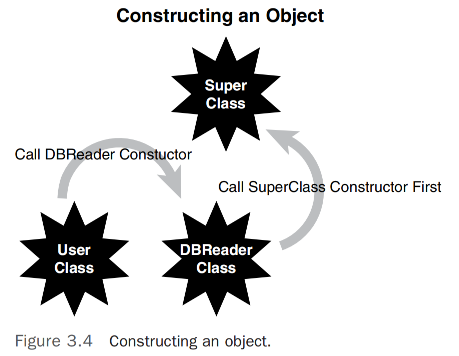

# 更多面向对象概念          

## 引言     
在我们开始深入探索构建`OO系统`相关的更精细设计问题之前，我们需要讲解一些更高级的 OO概念，如`构造函数`、`操作符重载`以及`多重继承`。我们还将考虑错误处理技术以及作用域如何适用于面向对象设计。        

这些概念中的一些可能对于理解更高层次的`OO设计` 并不是必不可少，但对于参与`OO系统` 设计和实现的任何人来说，它们都是必需的。      

## 构造函数 (Constructors)  
对于结构化编程的程序员来说，构造函数可能是一个新概念。虽然在非面向对象的语言如 COBOL、C和 Basic中通常不使用构造函数，但 C/C++中的结构体（struct）确实包含构造函数。在一些面向对象语言中,用于构建对象的特殊方法，例如Java和C#，构造函数是与类名相同的方法。Visual Basic .NET 使用 `New` 关键字，而Swift使用 `init` 关键字。通常，我们将关注构造函数的概念，而不涉及所有语言的具体语法。让我们看一些实现构造函数的Java代码。              

例如，我们在第二章中提到的Cabbie类的构造函数可能看起来像这样：      
```java
public Cabbie(){
 /* code to construct the object */
}
```
编译器会识别出方法名与类名相同，并将该方法视为构造函数。            

>注意:在这段Java代码中（以及C#和C++中），构造函数没有返回值。如果你为构造函数提供了返回值，编译器将不会将该方法视为构造函数。           

例如，如果你在类中包含以下代码，编译器将不会将其视为构造函数，因为它具有返回值——在这个例子中是一个整数。               
```java
public int Cabbie(){
 /* code to construct the object */
}
```
这种语法要求可能会导致问题，因为这段代码虽然会编译，但不会按预期那样运行。          

### 何时调用构造函数？  
当创建一个新对象时，首先发生的事之一就是调用构造函数。看看下面的代码：   
```java
Cabbie myCabbie = new Cabbie();
```
关键字 `new` 创建了 `Cabbie` 类的一个新实例，因此分配了所需的内存。然后调用构造函数本身，传递参数列表中的参数。构造函数为开发者提供了处理适当初始化的机会。         

因此，代码 `new Cabbie()` 将实例化一个 `Cabbie` 对象并调用 `Cabbie` 方法，这是构造函数。                

### 构造函数内部有什么？    
构造函数最重要的功能之一是初始化在遇到 `new` 关键字时分配的内存。简而言之，构造函数内部包含的代码应该将新创建的对象设置到其初始、稳定、安全的状态。         

例如，如果你有一个带有名为 `count` 的属性的计数器对象，你需要在构造函数中将 `count` 设置为零：          
```java
count = 0;
```

>注意：`初始化属性`, 在结构化编程中，通常使用名为 housekeeping（或初始化）的例程来进行初始化。在构造函数中执行初始化属性是一种常见的功能。无论如何，不要依赖系统默认值(`构造函数提供了一个清晰的位置来执行所有必要的初始设置，这有助于维护代码的清晰性和可维护性。`)。            

### 默认构造函数
如果你编写一个类而不包括构造函数，该类仍然会编译，并且你仍然可以使用它。`如果类没有提供显式的构造函数，系统将提供一个默认的构造函数`。重要的是要理解，无论你是否自己编写构造函数，至少存在一个构造函数。如果你不提供构造函数，系统将为你提供一个默认的构造函数。   

除了创建对象本身外，`默认构造函数唯一的操作是调用其超类的构造函数`。在许多情况下，超类将是语言框架的一部分，比如Java中的 `Object` 类。例如，如果没有为 `Cabbie` 类提供构造函数，将插入以下默认构造函数(`在这个默认构造函数中，`super()` 调用是对父类构造函数的调用。在Java中，所有类都隐式继承自 `Object` 类，因此如果 `Cabbie` 类没有显式的父类，`super()` 将调用 `Object` 类的构造函数`)：                 
```java     
public Cabbie() {
    super();
}
```
`如果你反编译由编译器产生的字节码，你会看到这段代码。编译器实际上会插入它。`              

在这种情况下，如果 `Cabbie` 类没有显式地从另一个类继承，那么 `Object` 类将是父类。也许默认构造函数在某些情况下可能足够用；然而，在大多数情况下，应该执行某种形式的内存初始化。无论情况如何，总是在类中包含至少一个构造函数是良好的编程实践。如果类中有属性，初始化这些属性总是好的做法。此外，初始化变量在编写代码时总是一个好习惯，无论是不是面向对象的。          

>注意：`提供一个构造函数`, 一般规则是你应该始终提供一个构造函数，即使你不打算在其中做任何事情。你可以提供一个什么也不做的构造函数，然后以后再添加内容。虽然从技术上讲，使用编译器提供的默认构造函数没有什么问题，但出于文档和维护目的，最好清楚地知道你的代码是什么样子的。         

`维护在这里成为一个问题并不奇怪。如果你依赖默认构造函数，然后后续的维护添加了另一个构造函数，那么默认构造函数就不再被创建。这实际上可能会破坏那些假设默认构造函数存在的代码`。    

始终记住，只有当你不包含任何构造函数时，才会添加默认构造函数。只要你包含了一个构造函数，就不会提供默认构造函数。这是为了确保你的类总是以你预期的方式进行初始化，避免由于默认构造函数的隐式行为导致潜在的错误和混淆。     

### 使用多个构造函数        
在许多情况下，一个对象可以通过多种方式构建。为了适应这种情况，你需要提供多个构造函数。例如，让我们考虑这里提出的 Count 类：     
```java
public class Count {
 int count;
 public Count(){
  count = 0;
 }
}
```
在一方面，我们想将属性 `count` 初始化为零。我们可以通过以下方式的构造函数轻松完成这一初始化：       
```java
public Count() {
    count = 0;
}
```

另一方面，我们可能想传递一个初始化参数，允许将 `count` 设置为各种数字：                
```java
public Count(int number) {
    count = number;
}
```
这被称为`方法重载`（重载适用于所有方法，不仅仅是构造函数）。大多数面向对象的语言提供了方法重载的功能(`通过重载构造函数，我们能够提供多种创建对象的方式，使得对象的初始化更加灵活。在不同的场景下，根据提供的参数不同，对象可以有不同的初始状态。这种设计使得类的使用更加灵活，能够应对更多的使用情况，同时也保持了代码的清晰和整洁。重载方法也是代码复用的一种形式，允许类通过不同的入口参数实现多种功能，而不必为每种情况编写完全独立的代码块。`)。    

### 重载方法 (Overloading Methods)             
重载允许程序员多次使用相同的方法名，只要每次方法的签名不同即可。签名由方法名和参数列表组成。                    
```java
public String getRecord(int key)
```
**签名**            
            
图3.1     

因此，以下方法都有不同的签名：          
```java
public void getCab();
// 参数列表不同
public void getCab(String cabbieName);
// 参数列表不同
public void getCab(int numberOfPassengers);             
```

>注意：`签名`, 根据使用的编程语言，签名可能包括也可能不包括返回类型。在Java和C#中，返回类型不是签名的一部分。例如，以下方法即使返回类型不同也会冲突：           
```java
public void getCab(String cabbieName);
public int getCab(String cabbieName);
```

理解签名的最佳方式是编写一些代码并通过编译器运行它。这将帮助你看到如何根据参数类型和数量来区分方法，以及在实际编码中如何应用方法重载。                                      

### 使用UML来建模类
让我们回到我们在第2章中使用过的数据库读取器示例。考虑到我们有两种方式可以构造数据库读取器：             
* 传递数据库的名称，并将光标定位在数据库的开始处。          
* 传递数据库的名称以及我们希望光标定位的数据库内的位置。            

图3.2显示了DataBaseReader类的类图。请注意，该图列出了该类的两个构造函数。尽管图表显示了两个构造函数，但如果没有参数列表，我们无法知道哪个构造函数是哪个。为了区分这些构造函数，您可以查看下面列出的DataBaseReader类中相应的代码。       

            
图3.2   

>注意：`无返回类型`，面向对象编程中一个重要的约定：在类图中，构造函数没有返回类型。这是因为构造函数的唯一目的是初始化一个新的对象实例，它们不返回任何值，甚至不返回 void。      

假设下面是展示了 DataBaseReader 类构造函数及其初始化属性的代码片段（参见图3.3的假设内容）：             
            

```java
public class DataBaseReader {
 String dbName;
 int startPosition;
 // initialize just the name
 public DataBaseReader (String name){
 dbName = name;
 startPosition = 0;
 };
 // initialize the name and the position
 public DataBaseReader (String name, int pos){
 dbName = name;
 startPosition = pos;
 };
 .. // rest of class
}
``` 
注意在两种情况下如何初始化 `startPosition`。如果构造函数没有通过参数列表传递该信息，它将被初始化为默认值，比如0。       

### 如何构造超类        
在使用继承时，你必须了解如何构造父类。记住，当你使用继承时，你继承的是父类的一切属性和行为。因此，你必须非常了解父类的所有数据和行为。属性的继承相对明显；然而，构造函数是如何被继承的则不那么明显。在遇到 `new` 关键字并分配了对象后，将发生以下步骤（见图3.4）：                  
1. 在构造函数内部，会调用该类超类的构造函数。如果没有显式调用超类构造函数，则自动调用默认构造函数；然而，你可以在字节码中看到这部分代码。           
2. 初始化对象的每个类属性。这些是类定义中的属性（实例变量），而不是构造函数或任何其他方法内的属性（局部变量）。在之前介绍的 `DataBaseReader` 代码中，整数 `startPosition` 是类的实例变量。          
3. 构造函数中的其余代码执行。

            
图3.4  

### 构造函数的设计      
正如我们已经看到的，设计一个类时，初始化所有属性是一个好习惯。在一些语言中，编译器提供某种形式的初始化。但是，永远不要依赖编译器来初始化属性！在Java中，你不能使用一个未初始化的属性。如果属性首次在代码中设置，请确保将属性初始化为某个有效的状态——例如，将一个整数设置为零。              

构造函数用于确保应用程序处于稳定状态（我喜欢称之为“安全”状态）。例如，当一个属性用作除法操作中的分母时，将其初始化为零可能会导致应用程序不稳定。你必须考虑到除零是非法操作。初始化为零并不总是最佳策略。                

在设计过程中，识别所有属性的稳定状态并在构造函数中将它们初始化到这个稳定状态是一个好习惯。                  

