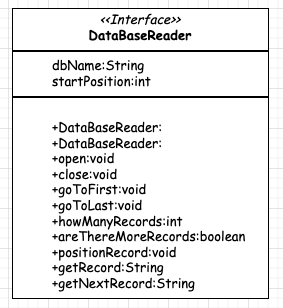
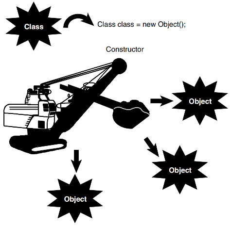
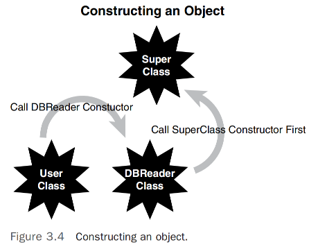
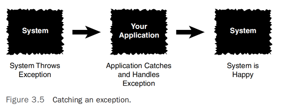
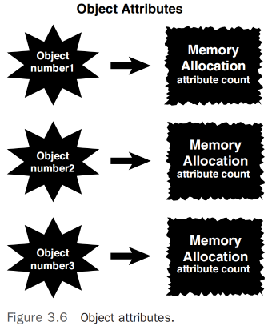
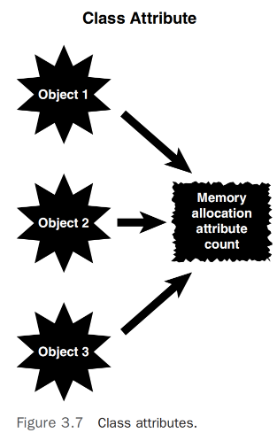
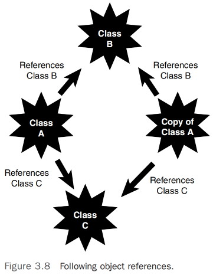

# 更多面向对象概念         

## Constructors 
在我们开始深入探索构建`OO系统`相关的更精细设计问题之前，我们需要讲解一些更高级的 OO概念，如`构造函数`、`操作符重载`以及`多重继承`。我们还将考虑错误处理技术以及作用域如何适用于面向对象设计。        

这些概念中的一些可能对于理解更高层次的`OO设计` 并不是必不可少，但对于参与`OO系统` 设计和实现的任何人来说，它们都是必需的。      

### 构造函数 (Constructors)  
对于结构化编程的程序员来说，构造函数可能是一个新概念。虽然在非面向对象的语言如 COBOL、C和 Basic中通常不使用构造函数，但 C/C++中的结构体（struct）确实包含构造函数。在一些面向对象语言中,用于构建对象的特殊方法，例如Java和C#，构造函数是与类名相同的方法。Visual Basic .NET 使用 `New` 关键字，而Swift使用 `init` 关键字。通常，我们将关注构造函数的概念，而不涉及所有语言的具体语法。让我们看一些实现构造函数的Java代码。              

例如，我们在第二章中提到的Cabbie类的构造函数可能看起来像这样：      
```java
public Cabbie(){
 /* code to construct the object */
}
```
编译器会识别出方法名与类名相同，并将该方法视为构造函数。            

>注意:在这段Java代码中（以及C#和C++中），构造函数没有返回值。如果你为构造函数提供了返回值，编译器将不会将该方法视为构造函数。           

例如，如果你在类中包含以下代码，编译器将不会将其视为构造函数，因为它具有返回值——在这个例子中是一个整数。               
```java
public int Cabbie(){
 /* code to construct the object */
}
```
这种语法要求可能会导致问题，因为这段代码虽然会编译，但不会按预期那样运行。          

### 何时调用构造函数？  
当创建一个新对象时，首先发生的事之一就是调用构造函数。看看下面的代码：   
```java
Cabbie myCabbie = new Cabbie();
```
关键字 `new` 创建了 `Cabbie` 类的一个新实例，因此分配了所需的内存。然后调用构造函数本身，传递参数列表中的参数。构造函数为开发者提供了处理适当初始化的机会。         

因此，代码 `new Cabbie()` 将实例化一个 `Cabbie` 对象并调用 `Cabbie` 方法，这是构造函数。                

### 构造函数内部有什么？    
构造函数最重要的功能之一是初始化在遇到 `new` 关键字时分配的内存。简而言之，构造函数内部包含的代码应该将新创建的对象设置到其初始、稳定、安全的状态。         

例如，如果你有一个带有名为 `count` 的属性的计数器对象，你需要在构造函数中将 `count` 设置为零：          
```java
count = 0;
```

>注意：`初始化属性`, 在结构化编程中，通常使用名为 housekeeping（或初始化）的例程来进行初始化。在构造函数中执行初始化属性是一种常见的功能。无论如何，不要依赖系统默认值(`构造函数提供了一个清晰的位置来执行所有必要的初始设置，这有助于维护代码的清晰性和可维护性。`)。            

### 默认构造函数
如果你编写一个类而不包括构造函数，该类仍然会编译，并且你仍然可以使用它。`如果类没有提供显式的构造函数，系统将提供一个默认的构造函数`。重要的是要理解，无论你是否自己编写构造函数，至少存在一个构造函数。如果你不提供构造函数，系统将为你提供一个默认的构造函数。   

除了创建对象本身外，`默认构造函数唯一的操作是调用其超类的构造函数`。在许多情况下，超类将是语言框架的一部分，比如Java中的 `Object` 类。例如，如果没有为 `Cabbie` 类提供构造函数，将插入以下默认构造函数(`在这个默认构造函数中，`super()` 调用是对父类构造函数的调用。在Java中，所有类都隐式继承自 `Object` 类，因此如果 `Cabbie` 类没有显式的父类，`super()` 将调用 `Object` 类的构造函数`)：                 
```java     
public Cabbie() {
    super();
}
```
`如果你反编译由编译器产生的字节码，你会看到这段代码。编译器实际上会插入它。`              

在这种情况下，如果 `Cabbie` 类没有显式地从另一个类继承，那么 `Object` 类将是父类。也许默认构造函数在某些情况下可能足够用；然而，在大多数情况下，应该执行某种形式的内存初始化。无论情况如何，总是在类中包含至少一个构造函数是良好的编程实践。如果类中有属性，初始化这些属性总是好的做法。此外，初始化变量在编写代码时总是一个好习惯，无论是不是面向对象的。          

>注意：`提供一个构造函数`, 一般规则是你应该始终提供一个构造函数，即使你不打算在其中做任何事情。你可以提供一个什么也不做的构造函数，然后以后再添加内容。虽然从技术上讲，使用编译器提供的默认构造函数没有什么问题，但出于文档和维护目的，最好清楚地知道你的代码是什么样子的。         

`维护在这里成为一个问题并不奇怪。如果你依赖默认构造函数，然后后续的维护添加了另一个构造函数，那么默认构造函数就不再被创建。这实际上可能会破坏那些假设默认构造函数存在的代码`。    

始终记住，只有当你不包含任何构造函数时，才会添加默认构造函数。只要你包含了一个构造函数，就不会提供默认构造函数。这是为了确保你的类总是以你预期的方式进行初始化，避免由于默认构造函数的隐式行为导致潜在的错误和混淆。     

### 使用多个构造函数        
在许多情况下，一个对象可以通过多种方式构建。为了适应这种情况，你需要提供多个构造函数。例如，让我们考虑这里提出的 Count 类：     
```java
public class Count {
 int count;
 public Count(){
  count = 0;
 }
}
```
在一方面，我们想将属性 `count` 初始化为零。我们可以通过以下方式的构造函数轻松完成这一初始化：       
```java
public Count() {
    count = 0;
}
```

另一方面，我们可能想传递一个初始化参数，允许将 `count` 设置为各种数字：                
```java
public Count(int number) {
    count = number;
}
```
这被称为`方法重载`（重载适用于所有方法，不仅仅是构造函数）。大多数面向对象的语言提供了方法重载的功能(`通过重载构造函数，我们能够提供多种创建对象的方式，使得对象的初始化更加灵活。在不同的场景下，根据提供的参数不同，对象可以有不同的初始状态。这种设计使得类的使用更加灵活，能够应对更多的使用情况，同时也保持了代码的清晰和整洁。重载方法也是代码复用的一种形式，允许类通过不同的入口参数实现多种功能，而不必为每种情况编写完全独立的代码块。`)。    

### 重载方法 (Overloading Methods)             
重载允许程序员多次使用相同的方法名，只要每次方法的签名不同即可。签名由方法名和参数列表组成。                    
```java
public String getRecord(int key)
```
**签名**            
            
图3.1     

因此，以下方法都有不同的签名：          
```java
public void getCab();
// 参数列表不同
public void getCab(String cabbieName);
// 参数列表不同
public void getCab(int numberOfPassengers);             
```

>注意：`签名`, 根据使用的编程语言，签名可能包括也可能不包括返回类型。在Java和C#中，返回类型不是签名的一部分。例如，以下方法即使返回类型不同也会冲突：           
```java
public void getCab(String cabbieName);
public int getCab(String cabbieName);
```

理解签名的最佳方式是编写一些代码并通过编译器运行它。这将帮助你看到如何根据参数类型和数量来区分方法，以及在实际编码中如何应用方法重载。                                      

### 使用UML来建模类
让我们回到我们在第2章中使用过的数据库读取器示例。考虑到我们有两种方式可以构造数据库读取器：             
* 传递数据库的名称，并将光标定位在数据库的开始处。          
* 传递数据库的名称以及我们希望光标定位的数据库内的位置。            

图3.2显示了DataBaseReader类的类图。请注意，该图列出了该类的两个构造函数。尽管图表显示了两个构造函数，但如果没有参数列表，我们无法知道哪个构造函数是哪个。为了区分这些构造函数，您可以查看下面列出的DataBaseReader类中相应的代码。       

            
图3.2   

>注意：`无返回类型`，面向对象编程中一个重要的约定：在类图中，构造函数没有返回类型。这是因为构造函数的唯一目的是初始化一个新的对象实例，它们不返回任何值，甚至不返回 void。      

假设下面是展示了 DataBaseReader 类构造函数及其初始化属性的代码片段（参见图3.3的假设内容）：             
            

```java
public class DataBaseReader {
 String dbName;
 int startPosition;
 // initialize just the name
 public DataBaseReader (String name){
 dbName = name;
 startPosition = 0;
 };
 // initialize the name and the position
 public DataBaseReader (String name, int pos){
 dbName = name;
 startPosition = pos;
 };
 .. // rest of class
}
``` 
注意在两种情况下如何初始化 `startPosition`。如果构造函数没有通过参数列表传递该信息，它将被初始化为默认值，比如0。       

## 如何构造超类        
在使用继承时，你必须了解如何构造父类。记住，当你使用继承时，你继承的是父类的一切属性和行为。因此，你必须非常了解父类的所有数据和行为。属性的继承相对明显；然而，构造函数是如何被继承的则不那么明显。在遇到 `new` 关键字并分配了对象后，将发生以下步骤（见图3.4）：                  
1. 在构造函数内部，会调用该类超类的构造函数。如果没有显式调用超类构造函数，则自动调用默认构造函数；然而，你可以在字节码中看到这部分代码。           
2. 初始化对象的每个类属性。这些是类定义中的属性（实例变量），而不是构造函数或任何其他方法内的属性（局部变量）。在之前介绍的 `DataBaseReader` 代码中，整数 `startPosition` 是类的实例变量。          
3. 构造函数中的其余代码执行。

            
图3.4  

### 构造函数的设计      
正如我们已经看到的，设计一个类时，初始化所有属性是一个好习惯。在一些语言中，编译器提供某种形式的初始化。但是，永远不要依赖编译器来初始化属性！在Java中，你不能使用一个未初始化的属性。如果属性首次在代码中设置，请确保将属性初始化为某个有效的状态——例如，将一个整数设置为零。              

构造函数用于确保应用程序处于稳定状态（我喜欢称之为“安全”状态）。例如，当一个属性用作除法操作中的分母时，将其初始化为零可能会导致应用程序不稳定。你必须考虑到除零是非法操作。初始化为零并不总是最佳策略。                

在设计过程中，识别所有属性的稳定状态并在构造函数中将它们初始化到这个稳定状态是一个好习惯。                  


## Error Handling  
确实，在软件开发中，很难一次性完美地编写出一个类。在大多数情况下，总会出现一些问题。任何没有为问题做计划的开发者都是在招致灾难。                

假设你的代码能够检测并捕获错误条件，你可以通过几种方式处理错误。在他们的书《Java Primer Plus》（ISBN: 9781571690623）第11章中，Tyma、Torok和Downing提到有三种基本的解决程序中检测到的问题的方法：修复它、通过抑制问题来忽略问题，或以某种优雅的方式退出运行时。在他们的书《Java中的面向对象设计》（ISBN: 9781571691347）第4章中，Gilbert和McCarty通过增加抛出异常的选择来扩展这一主题：                     

* 忽略问题 —— 这不是一个好主意！
* 检查潜在问题并在发现问题时中止程序。          
* 检查潜在问题，捕获错误，并尝试修复问题。          
* 抛出异常（这通常是处理情况的首选方式）。              

以下部分将讨论这些策略。            

### 忽略问题     
简单地忽略潜在的问题是导致灾难的配方。如果你打算忽略问题，那为什么还要在第一时间检测它呢？显然，你不应该忽略任何已知的问题。所有应用程序的首要准则是应用程序永远不应该崩溃。如果你不处理错误，应用程序最终将不优雅地终止，或继续处于可以被认为是不稳定状态的模式——可能伴随着数据损坏。在后一种情况下，你甚至可能不知道你得到了错误的结果，这可能比程序崩溃更糟。                    

### 检测问题并中止应用程序       
如果你选择检测潜在问题并在检测到问题时中止应用程序，应用程序可以显示一个消息，表明存在问题。在这种情况下，应用程序可以优雅地退出，用户则留在电脑屏幕前，摇头并想知道刚刚发生了什么。尽管这比忽略问题是一个远优越的选择，但这绝不是最佳方案。然而，这确实允许系统清理事物并将自己置于更稳定的状态，例如关闭文件和强制系统重启。      

### 检测问题并尝试恢复       
检测潜在问题，捕获错误，并尝试恢复是一种比仅检测问题并中止程序要好得多的解决方案。在这种情况下，问题通过代码被检测到，并且应用程序尝试自行修复。这在某些情况下效果很好。            
例如，考虑以下代码：        
```java
if (a == 0)
    a = 1;

c = b / a;
```
很明显，如果代码中不包括条件语句，且零进入到除法语句中，你将得到一个系统异常，因为不能除以零。通过捕获异常并将变量 `a` 设置为1，至少系统不会崩溃。然而，将 `a` 设置为1可能不是一个恰当的解决方案，因为结果将是不正确的。更好的解决方案是提示用户重新输入正确的数值。                    

>注意：`混合错误处理技术`, 尽管这种类型的错误处理在本质上并不一定是面向对象的，我认为它在面向对象设计中有其有效的位置。抛出异常（将在下一节中讨论）在开销方面可能是昂贵的。因此，虽然异常可能是一个有效的设计选择，但根据你的设计和性能需求，你仍然会想要考虑其他错误处理技术（甚至是经过验证的结构化技术）。               

虽然之前提到的错误检查技术比什么都不做要好，但它们仍然存在一些问题。确定问题首次出现的位置并不总是容易的，而且检测到问题可能需要一段时间。无论如何，详细解释错误处理超出了本章节的范围。然而，从一开始就将错误处理设计进类中是非常重要的，而且操作系统本身往往可以警告你它检测到的问题。            

### 抛出异常  
在面向对象编程中，异常处理是一种重要的机制，用来应对在系统运行中可能出现的预料之外的事件或错误。异常提供了一种方式来检测问题，并相应地处理它们。在Java、C#、C++、Swift和Visual Basic等语言中，异常是通过关键词 `catch` 和 `throw` 来处理的。虽然这听起来像是一场棒球比赛，但关键概念在于编写特定的代码块来处理特定的异常。这解决了确定问题起点和将代码回溯到适当位置的问题。                    

在Java中处理异常的典型结构是使用 `try` 和 `catch` 块。这里是其基本结构：                
```java
try {
    // 代码块，尝试可能引发异常的操作
} catch (ExceptionType name) {
    // 异常处理代码块
} finally {
    // 无论是否捕获到异常，finally块中的代码都会执行
}
```

当在 `try` 块内抛出异常时，`catch` 块将处理它。当块执行时抛出异常时，将发生以下情况：           
1.`try` 块的执行被终止。            
2.检查 `catch` 子句以确定是否包括了适当的 `catch` 块来处理触发的异常。（每个 `try` 块可能有多个 `catch` 子句。）                
3.如果没有任何 `catch` 子句处理触发的异常，它将被传递到下一个更高级别的 `try` 块。（如果代码中没有捕获异常，系统最终会捕获它，结果是不可预测的——即应用程序崩溃。）                  
4.如果匹配了一个 `catch` 子句（遇到的第一个匹配），则执行该 `catch` 子句中的语句。          
5.然后执行继续在 `try` 块之后的语句。           

足以说明，异常是面向对象编程语言的一个重要优势。这里是一个如何在Java中捕获异常的示例：     
```java
try {
 // possible nasty code
 count = 0;
 count = 5/count;
} catch(ArithmeticException e) {
 // code to handle the exception
 System.out.println(e.getMessage());
 count = 1;
}
System.out.println("The exception is handled.");
```

>注意：`异常的粒度`, 在Java中，你可以以不同的粒度级别捕获异常。你可以捕获所有异常，或者检查特定的异常，例如算术异常。如果你的代码没有捕获一个异常，Java运行时将会捕获它——这通常不是一个好情况！                    

在这个例子中，由于 count 等于0，try 块中的除以零操作将导致算术异常。如果异常是在 try 块外部生成（抛出）的，程序很可能已经终止（崩溃了）。然而，因为异常是在 try 块内抛出的，所以会检查 catch 块，看看是否为特定的异常（在这种情况下是算术异常）做了规划。因为 catch 块包含对算术异常的检查，所以执行 catch 块内的代码，从而将 count 设置为1。catch 块执行完毕后，退出 try/catch 块，并在Java控制台上显示消息“异常已处理”。这个过程的逻辑流程如图3.5所示。           

        

确实，如果你没有在 catch 块中指定捕获 ArithmeticException，程序很可能会崩溃。在Java中，你可以使用以下代码来捕获所有类型的异常，从而提供一个更通用的错误处理机制：           
```java
try {
 // possible nasty code
} catch(Exception e) {
 // code to handle the exception
}
```     
Exception 参数在 catch 块中用来捕获 try 块范围内可能生成的任何异常。这是一个强大的机制，它允许程序在面对不可预见的错误时继续运行，而不是崩溃。          

>注意：`程序的防弹性`, 为了使你的程序对用户尽可能地“防弹”——即能够抵御错误和异常情况，不崩溃，同时提供连贯的用户体验——组合使用多种方法是一个好主意。         

## The Importance of Scope   
从一个单一的类中可以实例化多个对象。每个这样的对象都具有独特的身份和状态。这是一个重要的观点。每个对象都是单独构建的，并且分配了自己的独立内存。然而，如果适当声明，一些属性和方法可以被来自同一类的所有对象共享，因此共享为这些类属性和方法分配的内存。

>注意：`共享方法`, 构造函数是一个很好的例子，展示了一个由类的所有实例共享的方法。构造函数不直接属于任何一个实例，而是在创建每个实例时被调用来初始化实例的状态。         

方法代表对象的行为；对象的状态则由属性表示。有三种类型的属性：              

* 1.局部属性（Local attributes）：        
- 这些属性定义在方法内部，只在方法的执行过程中存在，执行完毕后即被销毁。            
- 它们只在定义它们的方法的上下文中可见。            

* 2.对象属性（Object attributes）：              
- 也称为实例属性，它们属于类的各个实例。            
- 每个对象都有其自己的一套实例属性的副本。          
- 这些属性的生命周期与对象的生命周期相同。          

* 3.类属性（Class attributes）：        
- 也称为静态属性，它们属于类本身，而不是类的任何特定实例。              
- 在内存中只有一份副本，由该类的所有实例共享。              
- 这使得类属性成为共享全局数据的一种方式。          

### 局部属性（Local attributes）
`局部属性是指在方法内部定义并使用的变量`，它们仅在该方法的执行期间存在，当方法执行完毕后，这些属性就会消失。这意味着它们的生命周期仅限于方法调用的范围内，且只在该方法的作用域内可见。局部属性对于执行临时计算或存储方法内部的状态很有用，而这些状态不需要在方法调用之外保留。                      
```java
public class Number {   
 public method1() {
 int count;
 }
 public method2() {
 }
}
```

局部变量 count 位于 method1 方法中，这意味着它只在 method1 的内部可访问。method2 方法甚至不知道这个整数 count 的存在。这里我们引入了一个非常重要的概念：`作用域`。属性（和方法）存在于特定的作用域内。在这种情况下，整数 count 存在于 method1 的作用域内。在Java、C#、C++和Swift中，作用域是由大括号（{}）界定的。在 Number 类中，有几个可能的作用域——只需匹配大括号即可。              

类本身具有自己的作用域。类的每个实例（即每个对象）都有自己的作用域。method1 和 method2 同样也各自拥有自己的作用域。因为 count 位于 method1 的大括号内，当 method1 被调用时，count 的一个副本被创建。当 method1 结束时，count 的副本被移除。         

看一看这段代码，让问题更有趣一些：
```java
public class Number {
 public method1() {
 int count;
 }
 public method2() {
 int count;
 }
}
```
这个示例中的 `count` 变量在类中有两个副本，每个副本存在于 `method1` 和 `method2` 的各自作用域内。因此，编译器可以简单地通过识别它所在的方法来确定应该访问哪一个 `count` 副本。你可以这样想象：              
- `method1.count`       
- `method2.count`           

对于编译器来说，即使这两个属性有相同的名称，也能轻松区分它们。这有点像两个人有相同的姓，但根据他们的名的上下文，你知道他们是两个不同的个体。            

这种作用域的概念在编程中非常重要，因为它帮助确保变量的使用不会相互干扰，即使它们的名称相同。在实际编程中，这种机制允许开发者在不同的函数或方法中复用相同的变量名，而不必担心一个函数中的变量更改会影响到另一个。每个方法内部的变量都是独立的，其生命周期和可见性仅限于该方法的大括号内。            

### 对象属性
在许多设计情况下，一个属性必须由同一对象中的多个方法共享。例如，在图3.6中，三个对象是从同一个类构造出来的。考虑以下代码：               
```java
public class Number {
 int count; // available to both method1 and method2
 public method1() {
 count = 1;
 }
 public method2() {
 count = 2;
 }
}
```
        

示例中提到的类属性 `count` 是在 `method1` 和 `method2` 的作用域之外声明的，但它在类的作用域内。因此，`count` 对 `method1` 和 `method2` 都是可用的（基本上，类中的所有方法都可以访问这个属性）。注意，这两个方法的代码都将 `count` 设置为特定的值。对于整个对象来说，`count` 只有一份拷贝，所以两个赋值操作都在内存中操作同一份拷贝。然而，这份 `count` 的拷贝不会在不同的对象之间共享。    

为了说明这一点，让我们创建三个 `Number` 类的副本：          
```java
Number number1 = new Number();
Number number2 = new Number();
Number number3 = new Number();
```

每个对象——`number1`、`number2` 和 `number3`——都是单独构造的，并分配了自己的资源。有三个独立的 `count` 整数实例。当 `number1` 更改其属性 `count` 时，这绝不会影响 `number2` 或 `number3` 对象中 `count` 的拷贝。在这种情况下，整数 `count` 是一个对象属性。              

你可以用作用域玩一些有趣的游戏。考虑以下代码：          
```java
public class Number {
 int count;
 public method1() {
 int count;
 }
 public method2() {
 int count;
 }
}
```

在这种情况下，每个对象的 count 实际上都在内存中有三个完全独立的位置。对象拥有其中一个副本，而 method1() 和 method2() 在各自的作用域内操作这个副本。

要从一个方法内部访问对象变量，例如 method1()，你可以在基于C的语言中使用一个称为 `this 的指针`。this 关键字在面向对象的编程中非常重要，它用于引用当前对象的实例。          
```java
public method1() {
 int count;
 this.count = 1;
}
```     
请注意，有些代码看起来有点奇怪：            
```java
this.count = 1;
```

选择 `this` 作为关键字或许是不太幸运的。然而，我们必须接受它。使用 `this` 关键字指导编译器访问对象变量 `count`，而不是方法体内的局部变量。       

>注意： 关键字 `this` 是对当前对象的引用。      

## 类属性   
如前所述，同一个类的两个或多个对象可以共享属性。在Java、C#、C++和Swift中，你可以通过将属性声明为静态的来实现这一点：            
```java
public class Number {
    static int count;  // 静态属性

    public void method1() {
        // 方法实现
    }
}
```     
通过将 `count` 声明为静态，这个属性为该类的所有对象实例分配了一块单一的内存。因此，该类的所有对象都使用相同的内存位置存储 `count`。本质上，每个类只有一个副本，被该类的所有对象共享（参见图3.7）。这在面向对象设计中是最接近全局数据的情况。            

            

静态属性有许多有效的用途；然而，你必须意识到潜在的同步问题。让我们实例化两个 `Count` 对象：         
```java
Count Count1 = new Count();
Count Count2 = new Count();
```
为了讨论，假设对象 `Count1` 正快乐地使用 `count` 来跟踪计算机屏幕上的像素。这本身不是问题，直到对象 `Count2` 决定使用属性 `count` 来跟踪绵羊。在 `Count2` 记录其第一只绵羊的瞬间，`Count1` 正在保存的数据就丢失了。实际上，对于静态方法可能没有很多用途。在将它们纳入设计之前，请确保你对它们的使用有足够的信心。         

## 运算符重载       
一些面向对象的编程语言允许你重载运算符。C++ 就是这样一种语言的例子。`运算符重载` 使你能够改变一个运算符的含义。例如，当大多数人看到加号时，他们会认为它代表加法。如果你看到这样一个等式：        
```java     
X = 5 + 6;
```     
你会期望 X 包含的值是 11。在这种情况下，你是对的。          
然而，有时候加号可能代表其他的含义。例如，在下面的代码中：              
```java
String firstName = "Joe", lastName = "Smith";
String Name = firstName + " " + lastName;
```         
你会期望 Name 包含 "Joe Smith"。这里的加号被重载用于执行字符串连接。            

>注意: `字符串连接`, 字符串连接发生在两个独立的字符串组合成一个新的单一字符串时。           

在字符串的上下文中，加号并不意味着整数或浮点数的加法，而是字符串的连接。            
那么矩阵加法呢？你可以有像这样的代码：
```
Matrix a, b, c;
c = a + b;
```
因此，加号现在执行矩阵加法，而不是整数或浮点数的加法。       

重载是一个强大的机制。然而，它对于阅读和维护代码的人来说可能会非常令人困惑。实际上，开发者自己也可能会感到困惑。要把这个概念推到极端，你甚至可以改变加法操作来执行减法。为什么不呢？运算符重载允许你改变运算符的含义。因此，如果加号被改为执行减法，下面的代码将导致 X 的值为 -1。      

```java
x = 5 + 6;      
```
尽管有些语言可能不允许程序员直接重载运算符，但许多语言确实将运算符重载作为一个功能实现（一个常见的例子是用加号进行字符串连接）。当使用运算符重载时，务必记录你的逻辑，以便维护代码的人（可能是未来的你）能理解发生了什么。      

## 多重继承     
我们将在后面的章节 “掌握继承和组合”中更详细地讨论继承。然而，现在是一个开始讨论多重继承的好时机，多重继承是类设计中更为强大和具有挑战性的方面之一。             

正如名称所暗示的，多重继承允许一个类从多于一个的类中继承。在实践中，这听起来像是一个很好的主意。对象应该模拟现实世界，不是吗？而且，许多现实世界中的例子都存在多重继承。父母是多重继承的一个很好的例子。每个孩子都有两个父母——事实就是如此。所以，使用多重继承设计类似乎是有道理的。在一些面向对象的语言中，比如C++，你可以这样做。         

然而，这种情况属于类似于运算符重载的一个类别。多重继承是一种非常强大的技术，实际上，有些问题没有它很难解决。多重继承甚至可以非常优雅地解决一些问题。然而，多重继承可以显著增加系统的复杂性，无论是对程序员还是对编译器的编写者都是如此。        

Java、.NET 和 Swift 的设计者们认为允许多重继承增加的复杂性远远超过了它的优势，所以他们根本没有实现它。在某些方面，Java、.NET 和 Swift 对此进行了补偿；然而，底线是 Java、.NET 和 Swift 不允许传统的多重继承。           

`现代的继承概念是，你只能从一个父类（单继承）继承属性。尽管你可以使用多个接口或协议，这并不是真正的多重继承`。

>注意：`行为和实现继承`, 接口是一种行为继承的机制，而抽象类用于实现继承。归根结底，接口语言结构提供了行为接口但没有实现，而抽象类可能提供接口和实现。这个话题将在后面章节“框架与复用：用接口和抽象类设计”中详细讨论。         

## 对象操作  
在处理复杂的数据结构和对象时，编程中一些最基本的操作变得更加复杂。例如，当你想要复制或比较基本数据类型时，这个过程是相当直接的。然而，复制和比较对象就没有那么简单了。在他的书《Effective C++》中，Scott Meyers专门讨论了复制和赋值对象的一整个部分。             

>注意：`类和引用`, 复杂数据结构和对象的问题在于它们可能包含引用。简单地复制引用并不会复制它所引用的数据结构或对象。同样，当比较对象时，仅比较一个指针和另一个指针只是比较了引用——并不是它们所指向的内容。           

当在对象上执行比较和复制操作时，会出现问题。具体来说，问题归结为是否遵循指针。无论如何，应该有一种方法来复制一个对象。再次强调，这并不像看起来那么简单。因为对象可以包含引用，这些引用树必须被遵循以进行有效的复制（`如果你真的想做一个深拷贝`）。              

>注意：`深拷贝与浅拷贝`, 当遵循所有引用并为所有被引用的对象创建新副本时，发生了深拷贝。在深拷贝中，可能涉及多个层级。对于具有多个对象引用的对象，这些对象又可能引用更多对象，复制本身可能会产生显著的开销。浅拷贝则简单地复制引用而不遵循这些层级。Gilbert和McCarty在《Java中的面向对象设计》一书的“Prefer a Tree to a Forest”一节中对浅层和深层层级有很好的讨论。              

例如，在图3.8中，如果你进行简单的对象复制（称为按位复制），只有引用被复制——实际的对象没有被复制。因此，两个对象（原始对象和复制对象）将引用（指向）相同的对象。要执行完整的复制，其中所有引用对象都被复制，你必须编写代码来创建所有子对象。          

         

这个问题在比较对象时也会显现出来。与复制功能一样，这并不像看起来那么简单。因为对象包含引用，这些引用树必须被遵循以进行有效的对象比较。在大多数情况下，编程语言提供了默认的机制来比较对象。通常情况下，不应依赖默认机制。在设计类时，你应该考虑在你的类中提供一个比较函数，你知道它将按照你希望的方式表现。          

## 结论 
本章介绍了许多高级面向对象（OO）概念，尽管这些概念对于理解OO概念来说可能不是必须的，但在更高级别的OO任务中，如设计一个类，它们是非常必要的。在第4章“类的解剖”中，我们将具体探讨如何设计和构建一个类。       

refer   
1.The Object-Priented Thought Process Fifth Edition   