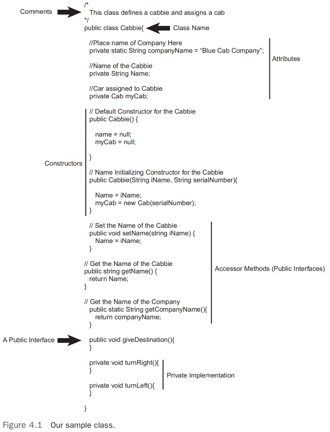
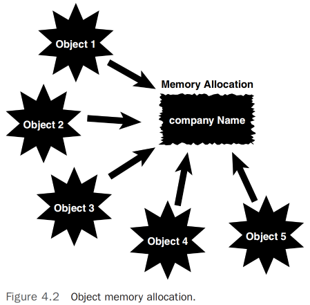
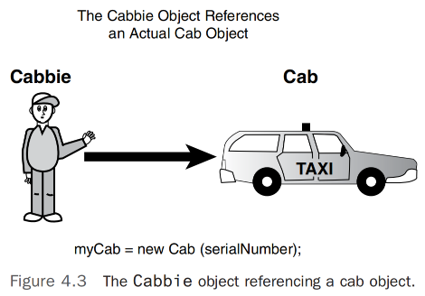
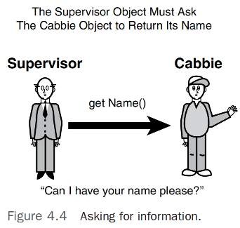
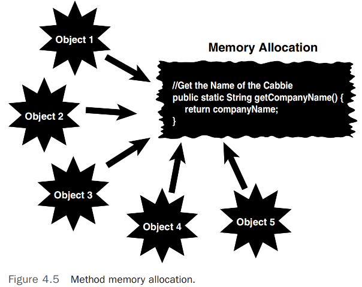

# 类的解刨  

## 引言 
在前面章节中，我们已经涵盖了基本的面向对象（OO）概念，并确定了接口和实现之间的区别。`无论你如何思考哪些内容应该是接口的一部分，哪些内容应该是实现的一部分，归根结底总是取决于类的实用性以及它与其他类的交互方式`。一个类绝不应该在真空中设计，正如人们常说的，没有一个类是孤立的。当对象被实例化时，它们几乎总是与其他对象互动。一个对象也可以是另一个对象的一部分，或者是继承层次结构的一部分。                

本章将检查一个简单的类，然后逐块拆解它，同时提供在设计类时应考虑的指导原则。我们将继续使用“如何以对象的方式思考”中介绍的出租车司机示例。                

以下各节涵盖了类的特定方面。尽管并非每个类都必需所有组件，但理解一个类是如何设计和构建的非常重要。          

>注意: 这个示例类仅用于说明目的。其中的一些方法没有具体实现（意味着没有实现），只是呈现了接口——主要是为了强调接口是初始设计的重点。                 

## 类的名称
类的名字很重要，原因有几个原因。最明显的原因是识别类本身。除了简单的识别外，名称必须是描述性的。选择一个名称很重要，因为它提供了关于类的功能以及它如何在更大系统中交互的信息。      

在考虑语言约束时，名称也很重要。例如，在Java中，公共类的名称必须与文件名相同。如果这些名称不匹配，应用程序将无法编译。          

图4.1显示了将要检查的类。简单明了，我们示例中的类名称 “Cabbie”，位于关键字 `class` 之后：           
```java
public class Cabbie {
    // 类的实现
}   
```
          

在实例化 `Cabbie` 类时，会使用类名 `Cabbie`。       

## 注释
不管使用什么语法编写注释，注释对于理解类的功能都至关重要。在Java和其他语言中，常见的有两种注释方式。

>注意：`Java和C#的额外注释风格`, 在Java和C#中，有三种类型的注释。在Java中，第三种注释类型（`/** */`）关联到Java提供的一种文档形式。本书中我们不涉及这种类型的注释。在C#中，创建文档注释的语法是 `///`，很像Java的 `/** */` Javadoc文档注释。

第一种注释是旧的C风格注释，使用 `/*`（斜杠-星号）来开启注释，使用 `*/`（星号-斜杠）来关闭注释。这种类型的注释可以跨越多行，重要的是不要忘记为每个注释使用一对开启和关闭的注释符号。如果你漏掉了关闭注释（`*/`），你的一些代码可能会被标记为注释而被编译器忽略。这里是一个在 `Cabbie` 类中使用这种类型注释的示例：   

```java
/*
 This class defines a cabbie and assigns a cab
*/
```

`第二种注释类型是` //（双斜线），它会将其后面直到行尾的所有内容变成注释。这种类型的注释只覆盖一行，因此你不需要记住使用关闭注释的符号，但你确实需要记住将注释限制在一行之内，并且注释后不要包含任何实际的代码。下面是这种类型的注释在 Cabbie 类中使用的一个例子：         
```java
// Name of the cabbie
``` 

## 属性 
属性代表了对象的状态，因为它们存储了关于对象的信息。以我们的示例来说，Cabbie类 有一些属性存储了公司的名称、出租车司机的名称和分配给司机的出租车。例如，第一个属性存储了公司的名称：     
```java
private static String companyName = "Blue Cab Company";
```
注意这里的两个关键字 private 和 static。关键字 private 表明一个方法或变量只能在声明它的对象内部被访问。     

>注意：`尽可能隐藏数据`, 这个例子中的所有属性都是私有的。这符合尽可能保持接口设计最简化的设计原则。访问这些属性的唯一方式是通过提供的方法接口（我们将在本章后面探讨）。     

`关键字 static 表示这个属性对于由这个类实例化的所有对象只有一份拷贝`。基本上，这是一个类属性。（见第3章“更多面向对象概念”中对类属性的进一步讨论。）因此，即使从Cabbie类实例化了500个对象，companyName 属性在内存中只有一份拷贝（见图4.2）。     

  
图4.2           

第二个属性 `name` 是一个字符串，用于存储出租车司机的名字：      
```java
private String name;
``` 
这个属性也是私有的，因此其他对象不能直接访问它。它们必须使用接口方法。               
`myCab` 属性是对另一个对象的引用。这个类称为 `Cab`，包含了出租车的信息，如其序列号和维护记录：      
```java
private Cab myCab;
```

>注意：`传递引用`, 很可能 `Cab` 对象是由另一个对象创建的。因此，对象引用将被传递给 `Cabbie` 对象。然而，为了本例的目的，`Cab` 是在 `Cabbie` 对象内部创建的。因此，我们并不真正关心 `Cab` 对象的内部细节。

**请注意，在这一点上，只创建了对 `Cab` 对象的引用；此定义并未分配内存。这意味着，直到 `Cab` 对象实际被创建并赋值给这个引用之前，`myCab` 仅仅是一个指向可能的 `Cab` 实例的指针**。       

## 构造器
这个 Cabbie 类包含两个构造器。我们知道它们是构造器，因为它们与类名相同：Cabbie。第一个构造器是默认构造器：      
```java
public Cabbie() {
    name = null;
    myCab = null;
}
```  
技术上讲，这不是系统提供的默认构造器。回想一下，如果你没有为类编写任何构造器，编译器将提供一个空的默认构造器。这里之所以称其为默认构造器，是因为它是一个没有参数的构造器，实际上覆盖了编译器的默认构造器。    

如果你提供了带参数的构造器，系统将不会提供默认构造器。虽然这看起来可能有些复杂，但规则是，只有当你的代码中没有提供任何构造器时，编译器的默认构造器才会包含在内。            

>注意：`没有构造器`, 不编写构造器并允许默认构造器发挥作用可能会在未来造成维护上的困扰。如果代码依赖于默认构造器，而稍后添加了另一个构造器，系统将不会包含默认构造器。               

在这个构造器中，属性 `name` 和 `myCab` 被设置为 `null`：        
```java
name = null;
myCab = null;
``` 

>在许多编程语言中，null 值代表无值。这看起来可能是一个深奥的概念，但将属性设置为无值是一种有用的编程技巧。检查一个变量是否为 null 可以确定一个值是否已经正确初始化。例如，你可能想声明一个稍后需要用户输入的属性。因此，在给用户机会输入数据之前，你可以将属性初始化为 null。通过将属性设置为 null（这是一个有效的条件），你可以检查一个属性是否已经正确设置。注意在某些语言中，这对字符串类型不允许。例如，在 .NET 中，必须使用 name = string.empty。          

众所周知，构造函数中初始化属性是一个良好的编码习惯。同样，测试属性值以查看是否为 null 也是一种良好的编程实践。这可以在以后节省很多麻烦，如果属性或对象没有正确设置。例如，如果你在一个真实对象分配给 myCab 引用之前使用它，你很可能会遇到问题。如果你在构造函数中将 myCab 引用设置为 null，稍后你可以检查在尝试使用它时 myCab 是否仍然是 null。如果你像对待已经正确初始化的引用那样对待一个未初始化的引用，可能会生成异常。         

考虑另一个例子：如果你有一个包括配偶属性的 Employee 类（也许是出于保险目的），最好为员工未婚的情况做好准备。通过最初将属性设置为 null，你随后可以检查这种状态。     

第二个构造函数为类的用户提供了一种初始化 Name 和 myCab 属性的方式：         
```java 
public Cabbie(String iName, String serialNumber) {
 name = iName;
 myCab = new Cab(serialNumber);
}
```
在这种情况下，用户将在构造函数的参数列表中提供两个字符串以正确初始化属性。请注意，myCab 对象是在此构造函数中实例化的：          
```java
myCab = new Cab(serialNumber);      
```
在这行代码执行后，为 Cab 对象分配了存储空间。图 4.3 展示了如何通过 myCab 属性引用一个新的 Cab 对象实例。在这个例子中使用两个构造函数演示了方法重载的常见用途。请注意，`这些构造函数都被定义为公共的。这是有道理的，因为在这种情况下，构造函数是类接口的明显成员`。如果构造函数是私有的，其他对象就无法访问它们——因此，其他对象也无法实例化 Cab 对象。  

>注意：`多个构造函数`, 值得注意的是，如今使用多个构造函数有时被认为是不太理想的做法。随着控制反转（IoC）容器等的普及，使用多个构造函数在许多框架中不被推荐，甚至在没有特殊配置的情况下不被支持。        

      
图4.3       

## 访问者 
一个类它的属性大多数会被定义为私有，这样其他对象就不能直接访问这些属性。单独创建一个不与其他对象互动的对象是荒谬的——因为我们希望分享适当的信息。话虽如此，有时候检查甚至更改另一个类的属性是否有时候也是必要的呢？答案当然是肯定的。有很多时候，一个对象需要访问另一个对象的属性；然而，它不需要直接做这件事。   

一个类应该非常保护其属性。例如，你不希望对象A有能力检查或更改对象B的属性，而不受对象B的控制。这样做的几个原因中，最重要的原因归结为数据完整性和高效的调试。     

假设 Cab 类中存在一个错误。你追踪问题到 Name 属性。不知怎么的，它被覆写了，一些名字查询中出现了垃圾数据。如果 Name 是公开的，任何类都能改变它，你就必须搜遍所有可能的代码，试图找到引用和改变 Name 的地方。然而，如果你只允许 Cabbie 对象更改 Name，你只需要检查 Cabbie 类中的一个方法。这种访问是通过一种叫做访问器的方法提供的。有时访问器被称为获取器和设置器，有时它们简单地被称为 get() 和 set()。按照这本书的惯例，我们使用 set 和 get 前缀来命名这些方法，如下所示。         
```java
// Set the Name of the Cabbie
public void setName(String iName) {
 name = iName;
}
// Get the Name of the Cabbie
public String getName() {
 return name;
}
```     
在这段代码中，Supervisor 对象必须请求 Cabbie 对象返回其名称（见图 4.4）。这里的重点是 Supervisor 对象不能自己检索信息；它必须向 Cabbie 对象请求信息。这个概念在许多层面上都很重要。例如，你可能有一个 setAge() 方法，该方法检查输入的年龄是否为 0 或以下。如果年龄小于 0，setAge() 方法可以拒绝设置这个明显不正确的值。通常，设置器用于确保数据完整性的一个层级。       

      

这也是安全问题的一个方面。你可能有敏感数据，如密码或工资信息，你希望控制访问权限。因此，通过获取器和设置器访问数据提供了使用密码检查和其他验证技术的能力。这极大地增强了数据的完整性。          

>注意：`对象`, 实际上，并不是每个对象都有每个非静态方法的物理副本。每个对象将指向相同的物理代码。然而，在概念层面上，你可以将对象视为完全独立的，拥有自己的属性和方法。           

以下代码片段展示了如何定义一个静态方法，图 4.5 显示了多个对象如何指向相同的代码。           

>注意：`静态属性`, 如果一个属性是静态的，并且类为该属性提供了一个设置器，任何调用该设置器的对象都将改变那个单一的副本。因此，所有对象的该属性值都将发生变化。   
```java
// Get the Name of the Cabbie
public static String getCompanyName() {
 return companyName;
}
```
请注意，getCompanyName 方法被声明为静态的，作为一个类方法；类方法在第三章中有更详细的描述。记住，companyName 属性也被声明为静态的。像属性一样，方法也可以被声明为静态，以表明整个类只有一个方法的副本。     

      

## 公共接口方法   
构造函数和访问器方法都被声明为公共的，并且是公共接口的一部分。它们之所以被单独指出，是因为它们对于类的构建具有特定的重要性。然而，大部分真正的工作是在其他方法中完成的。如第二章所提到的，公共接口方法往往非常抽象，而实现则更具体。对于这个类，我们提供了一个叫做 giveDestination 的方法，这是用户描述她想去的地方的公共接口：         
```java
public void giveDestination(){

}
```
目前这个方法内部的内容并不重要。主要的一点是这是一个公共方法，并且是该类公共接口的一部分。          

## 私有实现方法   
虽然到目前为止本章讨论的所有方法都被定义为公共的，但并非类中的所有方法都是公共接口的一部分。类中的方法通常对其他类隐藏。这些方法被声明为私有：          
```java
private void turnRight(){
}
private void turnLeft() {
}
```
这些私有方法旨在成为实现的一部分，而不是公共接口的一部分。你可能会问，如果没有其他类可以调用这些方法，那么谁来调用它们。答案很简单：你可能已经猜到了，这些方法是从类本身内部调用的。例如，这些方法可以从 giveDestination 方法内部调用：             
```java
public void giveDestination(){
.. 一些代码
 turnRight();
 turnLeft();
.. 更多代码
}
```
另一个例子，你可能有一个内部方法提供加密，你只会在类本身内部使用。简而言之，这个加密方法不能从实例化对象本身之外调用。      

这里的重点是，私有方法严格来说是实现的一部分，不可被其他类访问。                

## 结论
在这一章中，我们深入了解了类，并描述了理解类构建所需的基本概念。虽然这一章采取了实用的方法来讨论类，但从后面章节“类设计指南”则从一般设计的角度来覆盖类的内容。                          
