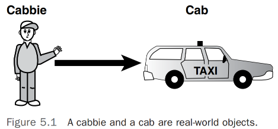
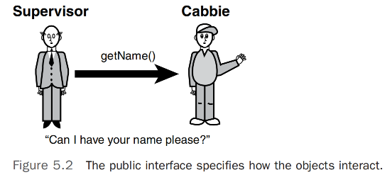
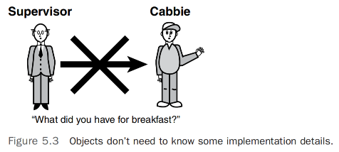
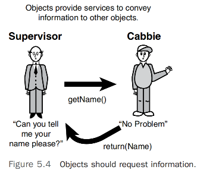
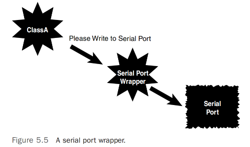
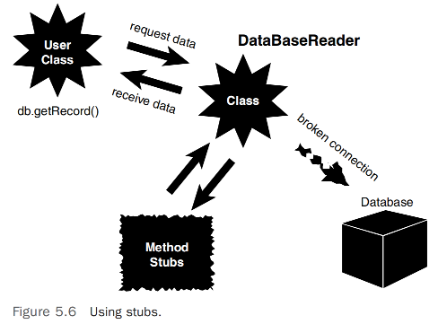

# 类设计指南        

## 引言 
正如我们已经讨论过的，面向对象编程支持创建类的想法，这些类是完整的包，封装了单个实体的数据和行为。因此，一个类应该代表一个逻辑组件，例如出租车。            

这一章提出了一些设计类的建议。显然，像这样的列表不能被认为是完整的。你无疑会在你的个人列表中添加许多指南，并纳入其他开发者的有用指南。      

## 模拟现实世界系统 
`面向对象（OO）编程的主要目标之一是以类似于人们实际思考方式的方式模拟现实世界系统`。设计类是创建这些模型的面向对象方法。与使用结构化或自顶向下的方法不同，在该方法中，数据和行为是逻辑上分开的实体，面向对象的方法将数据和行为封装进互相交互的对象中。我们不再将问题视为一系列事件或例程操作独立的数据文件。这种思维方式的优雅之处在于，类实际上模拟了现实世界的对象以及这些对象如何与其他现实世界的对象互动。          

这些互动发生的方式类似于现实世界对象之间的互动，如人类。因此，在创建类时，你应该以一种代表对象真实行为的方式来设计它们。让我们使用前几章中的出租车司机例子。Cab 类和 Cabbie 类模拟了一个现实世界的实体。如图 5.1 所示，Cab 和 Cabbie 对象封装了它们的数据和行为，并通过彼此的公共接口进行交互。     

      

当面向对象编程首次流行起来时，许多结构化程序员发现转型很困难。结构化程序员的一个主要错误是创建了一个有行为但没有类数据的类，实际上在结构化模型中创建了一组函数或子程序。这是不可取的，因为它没有利用封装的力量。        

现在这种情况只是部分正确。目前，许多开发工作使用 `anemic domain models`，也就是数据传输对象（DTO）和视图模型，这些模型只包含足够的数据来填充视图，或者正好是消费者所需的数据量。现在更多的关注点放在了行为和数据操作上，这是通过接口处理的。将行为封装进单一责任的接口，并针对接口编程，使代码更加灵活和模块化，也更易于维护。      

## 识别公共接口
到目前为止应该很明显，设计一个类时最重要的问题之一是尽量减少公共接口。建立一个类的全部目的是提供有用且简洁的东西。在他们的书《Java中的面向对象设计》中，Gilbert 和 McCarty 表明：“一个设计良好的对象的接口描述了客户想要完成的服务。”如果一个类没有为用户提供有用的服务，那么它本不应该被建立。             

## 最小公共接口
提供最小的公共接口使得类尽可能简洁。目标是为用户提供正确完成工作的确切接口。如果公共接口不完整（即缺少行为），用户将无法完成全部工作。如果公共接口没有适当限制（即用户能访问不必要甚至危险的行为），可能会导致需要调试的问题，甚至系统完整性和安全问题也可能浮出水面。          

创建一个类是一个商业提议，正如设计过程中的所有步骤一样，从一开始就让用户参与设计并贯穿测试阶段是非常重要的。通过这种方式，类的实用性以及适当的接口将得到保证。      

>注意：`扩展接口`, 即使一个类的公共接口对于某个应用来说不足，对象技术也容易允许扩展和适应这个接口。简而言之，如果设计得当，一个新的类可以利用一个现有的类并创建一个具有扩展接口的新类。         
这是一个重点，即如果你要添加行为，开发者不应该使用继承，而应该使用接口。            

举例来说，再次考虑出租车司机的例子。如果系统中的其他对象需要获取出租车司机的名字，Cabbie 类必须提供一个公共接口来返回其名字；这就是 getName() 方法。因此，如果一个 Supervisor 对象需要从一个 Cabbie 对象获取名字，它必须调用 Cabbie 对象的 getName() 方法。实际上，监督者在向出租车司机询问其名字（见图 5.2）。                 
      

使用你代码的用户不需要了解其内部工作原理。他们需要知道的只是如何实例化和使用对象。简而言之，为用户提供达到目的的方法，但隐藏细节。      

## 隐藏实现 
隐藏实现的需要已经被详细讨论过了。识别公共接口是围绕类的用户的设计问题，而实现则根本不应涉及用户。实现必须提供用户需要的服务，但如何实际执行这些服务不应该让用户明显感知到。如果实现可以更改而不影响用户，那么类就最有用。基本上，对实现的更改不应该需要更改用户的应用程序代码。再次强调，实现行为变更的最佳方式是通过使用接口和组合。          

>注意：`客户与用户`, 有时我在提到将实际使用软件的人时，使用“客户”而不是“用户”。系统的用户实际上可能是客户。同样，你组织中的用户可以被称为内部客户。这似乎是一个微不足道的点，但我认为将所有最终用户视为实际客户是重要的——你必须满足他们的需求。   

在出租车司机的例子中，Cabbie 类可能包含有关他在哪里或如何吃午餐的行为。然而，出租车司机的主管不需要知道出租车司机午餐吃什么。因此，这种行为是 Cabbie 对象实现的一部分，不应该对系统中的其他对象开放（见图 5.3）。Gilbert 和 McCarty 指出，封装的首要原则是“所有字段都应该是私有的。”通过这种方式，类中的任何字段都不可从其他对象访问。      

      

## 设计健壮的构造函数（以及可能的析构函数）
在设计类时，`最重要的设计问题之一涉及类将如何被构造`。构造函数在第三章“更多面向对象概念”中讨论过。如果你需要回顾设计构造函数的指南，请重新查看这一讨论。        

首先，构造函数应该将对象置于初始且安全的状态。这包括属性初始化和内存管理等问题。你还需要确保对象在默认条件下被正确构造。通常来说，提供一个处理这种默认情况的构造函数是个好主意。        

在包含析构函数的语言中，确保析构函数包含适当的清理功能至关重要。在大多数情况下，这种清理涉及到释放对象在某个时点获取的系统内存。Java和.NET通过垃圾收集机制自动回收内存。在诸如C++之类的语言中，开发者必须在析构函数中包含代码，以适当释放对象在其存在期间获取的内存。如果忽视了这个功能，将会导致内存泄漏。

>注意：`构造函数注入`, 这是引入构造函数注入概念的好时机，其中服务类在对象创建时（通过构造函数）而不是在类内部（使用new关键字）被注入。例如，出租车司机可以通过构造函数获得他的许可证对象、他的无线电信息对象（频率、呼号等）以及启动他的出租车的钥匙。          

>注意：`内存泄漏`, 当一个对象在其生命周期内未能适当释放它获取的内存时，只要创建该对象的应用程序正在执行，这部分内存就会对整个操作系统丢失。例如，假设同一类的多个对象被创建然后销毁，可能是在某种循环中。如果这些对象在它们离开作用域时未能释放它们的内存，这种内存泄漏会逐渐耗尽系统内存的可用池。在某个时点，可能会消耗足够的内存，导致系统没有剩余的可分配内存。这意味着系统中执行的任何应用程序都无法获取任何内存。这可能会使应用程序处于不安全状态，甚至锁定系统。   

## 设计类的错误处理     
如同构造函数的设计一样，设计类如何处理错误至关重要。
第3章详细讨论了错误处理。               

几乎可以肯定的是，每个系统都会遇到意外问题。因此，忽视潜在错误并不是一个好主意。一个好的类（或任何代码）的开发者会预见潜在的错误，并在遇到这些情况时包括处理这些条件的代码。            

一般规则是应用程序永远不应该崩溃。当遇到错误时，系统应该自我修复并继续运行，或者至少在不丢失对用户重要的任何数据的情况下优雅地退出。    

### 文档化一个类和使用注释  
注释和文档化的话题在大多数编程书籍和文章中都会提到，在每次代码审查以及你关于良好设计的每次讨论中都会提到。不幸的是，注释和良好的文档经常被不重视，甚至更糟糕的是被忽略。            

大多数开发者都知道他们应该彻底地文档化他们的代码，但他们通常不愿意花时间去做。然而，没有良好的文档化实践，良好的设计几乎是不可能的。在类级别，范围可能足够小，开发者可以逃避糟糕的文档化。然而，当类被传递给其他人来扩展和/或维护，或者它成为更大系统的一部分时（这是应该发生的），缺乏适当的文档和注释可能会破坏整个系统。     

许多人之前都说过这些。无论是为类还是其他东西设计，良好设计的最关键方面之一就是要仔细地记录过程。像Java和.NET这样的实现提供了特殊的注释语法来促进文档化过程。有关适当语法，请查看第4章，“类的解剖”。                 

>过度文档化, 要注意，过度注释也可能是一个问题。过多的文档和/或注释可能变成背景噪音，实际上可能会破坏文档的目的。就像在良好的类设计中一样，使文档和注释简洁明了。编写良好的代码本身就是最好的文档。      

### 构建意图协作的对象      
我们可以肯定地说，几乎没有哪个类是孤立存在的。在大多数情况下，如果一个类不打算与其他类交互，几乎没有理由构建它，除非该类只使用一次。这是类生命周期中的一个事实。一个类将服务于其他类；它将请求其他类的服务，或两者兼而有之。在后面的章节中，我们将讨论类之间互动的各种方式。            

在出租车司机的例子中，出租车司机和监督者并不是独立的实体；他们在各个层面相互作用（见图5.4）。           

      
图5.4       

用户设计类时，请确保您了解其他对象将如何与它交互。              

## 设计时考虑重用性 
`对象可以在不同系统中重用，代码编写时应考虑到重用性`。例如，开发并测试了出租车司机类后，它可以在任何需要出租车司机的地方使用。为了使一个类在各种系统中都可用，必须在设计时考虑到重用性。这是设计过程中需要大量思考的地方。尝试预测出租车司机对象必须操作的所有可能场景不是一件简单的事——实际上，这几乎是不可能的。          

## 设计时考虑可扩展性       
设计时考虑可扩展性，向类中添加新功能可能像扩展现有类、添加几个新方法和修改其他方法的行为一样简单。没有必要重写一切。这就是继承发挥作用的地方。如果你刚写了一个人类，你必须考虑到你可能以后想写一个员工类或客户类。因此，让员工从人类继承可能是最好的策略；在这种情况下，人类被认为是可扩展的。你不想设计人类，使其包含阻止它被像员工或客户这样的类扩展的行为（假设在你的设计中，你真的打算让其他类扩展人类）。例如，你不会想在员工类中编码专门用于监督功能的功能。如果你这样做了，然后一个不需要监督功能的类从员工继承，你就会遇到问题。
这一点涉及到之前讨论的抽象准则。人类应该只包含特定于人的数据和行为。其他类可以继承它，并继承适当的数据和行为。
正如我们将在第11章“避免依赖和高耦合类”和第12章“面向对象设计的SOLID原则”中讨论的，类应该对扩展开放，但对修改封闭。通过首先使用接口并对其编码，你可以使用各种模式，如装饰器，在不触碰已测试和部署的代码的情况下扩展功能，例如。       

>注意：`哪些属性和方法可以是静态的？`, 静态方法促进了对类的强耦合。你不能抽象化一个静态方法。
你不能模拟一个静态方法或静态类。你不能提供一个静态接口。在应用程序开发中使用静态类的唯一合理时机是当你在处理某种助手类或扩展方法时，这些方法不产生副作用。例如，一个用来加数字的静态类是可以的。一个与数据库或网络服务交互的静态类则不行。

### 命名的描述性    
我们之前讨论过使用适当的文档和注释的重要性。为你的类、属性和方法遵循命名约定是类似的主题。有许多命名约定，你选择哪一种不如选择一种并坚持使用它来得重要。然而，当你选择一种约定时，确保在创建类、属性和方法名称时，不仅要遵循约定，还要使名称具有描述性。当有人读到名称时，他应该能够从名称中了解对象代表什么。这些命名约定通常由各种组织的编码标准规定。        

>注意：`良好的命名`, 确保命名约定是有意义的。人们经常过分行事，创建的约定可能对他们有意义，但对其他人完全难以理解。在强迫其他人遵守约定时要小心。确保约定是合理的，且所有参与者都理解其背后的意图。使变量描述性地反映它们的用途，而不是基于它们的类型进行编码。     

`使用描述性命名是一个超越各种开发范式的良好开发实践。`   

### 将非可移植代码抽象出来
如果你正在设计一个必须使用非可移植（本地）代码的系统（即，代码只能在特定的硬件平台上运行），你应该将这些代码从类中抽象出来。通过抽象出来，我们的意思是将非可移植代码隔离在它自己的类中，或者至少是它自己的方法中（一个可以被覆盖的方法）。例如，如果你正在编写代码来访问特定硬件的串行端口，你应该创建一个封装类来处理它。然后你的类应该向封装类发送消息，以获取它需要的信息或服务。不要将系统依赖的代码放入你的主类中（见图5.5）。      

  

例如，考虑程序员直接与硬件交互的情况。在这些情况下，不同平台的对象代码很可能会有很大的不同，因此必须为每个平台编写代码。然而，如果功能放在一个封装类中，那么类的用户可以直接与封装交互，而不必担心各种底层代码。封装类将处理这些平台之间的差异，并决定调用哪些代码。        

### 提供对象的复制和比较方式            
第3章讨论了复制和比较对象的问题。理解对象如何被复制和比较是很重要的。你可能不希望或预期进行简单的位拷贝或比较操作。你必须确保你的类按预期行为，这意味着你需要花时间设计对象的复制和比较方式。           

### 尽可能保持较小的范围    
尽可能保持较小的范围与抽象化和隐藏实现密切相关。这个想法是尽可能地局部化属性和行为。这样一来，维护、测试和扩展一个类就变得更加容易。使用接口是实施这一点的好方法。          

>注意：`范围和全局数据`, 最小化全局变量的范围是一种良好的编程风格，这并非特定于面向对象编程。结构化开发中允许使用全局变量，但这可能会变得复杂。实际上，在面向对象开发中没有全局数据。静态属性和方法在同一类的对象之间共享；然而，它们对非该类的对象不可用。你也可以通过文件或数据库共享数据。           

例如，如果你有一个需要临时属性的方法，保持它的局部性。考虑以下代码：            
```java
public class Math {
 int temp=0;
 public int swap (int a, int b) {
 temp = a;
 a=b;
 b=temp;
 return temp;
 }
}
``` 
这个类有什么问题？问题在于，属性temp只在swap()方法的范围内需要。没有理由将其放在类级别。因此，你应该将temp移动到swap()方法的范围内：            
```java
public class Math {
 public int swap (int a, int b) {
 int temp=0;
 temp = a;
 a=b;
 b=temp;
 return temp;
 }
}
```
这就是所谓的尽可能保持范围小。              

## 以可维护性为设计目标 
设计实用且简洁的类促进了高水平的可维护性。就像你在设计类时考虑可扩展性一样，你也应该考虑未来的维护需求。  

设计类的过程迫使你将代码组织成许多（理想情况下）可管理的部分。相比于较大的代码块，分开的代码块往往更易于维护（至少这是理念上的）。促进可维护性的最佳方法之一是减少代码间的依赖性——即，一个类的更改对其他类没有影响或只有最小的影响。            

>注意：`高耦合类`, 高度依赖彼此的类被认为是高耦合的。因此，如果对一个类的更改迫使另一个类也必须更改，这两个类就被认为是高耦合的。没有这种依赖的类耦合度非常低。更多关于此主题的信息，请参考Scott Ambler所著的《对象入门》。     

`如果类最初设计得当，系统的任何更改应该只对对象的实现进行。应该避免对公共接口进行任何更改。对公共接口的任何更改都会在使用该接口的所有系统中引起连锁反应`。      

例如，如果对 Cabbie类 的getName()方法进行更改，使用此接口的所有系统中的每一个地方都必须更改并重新编译。找到所有这些方法调用是一项艰巨的任务，且漏掉某个调用的可能性相当高。         

为了促进高水平的可维护性，应尽可能保持类的耦合级别较低。        

### 在开发过程中使用迭代
如同大多数设计和编程功能一样，推荐使用迭代过程。这与提供最小接口的概念非常吻合。基本上，这意味着不要一次性编写所有代码！以小增量创建代码，然后在每一步进行构建和测试。一个良好的测试计划可以快速发现提供的接口不足的任何区域。这样，过程可以迭代，直到类具有适当的接口。这个测试过程不仅限于编码。通过走查和其他设计审查技术测试设计非常有帮助。当使用迭代过程时，测试人员的生活会更愉快，因为他们很早就参与到过程中，而不是在开发过程结束时简单地被交付一个"抛过墙来"的系统。   

### 测试接口
`接口的最小实现通常被称为存根（stubs）`。（Gilbert 和 McCarty 在《Java面向对象设计》中对存根有很好的讨论。）通过使用存根，您可以在不编写任何实际代码的情况下测试接口。在以下示例中，存根被用来验证接口是否正常工作（从用户的角度来看——记住接口是为用户设计的）。因此，此时还不需要实现。事实上，现阶段完成实现可能会花费宝贵的时间和精力，因为接口的设计会影响实现，而且接口还没有完成。            

在图5.6中，请注意，当用户类向DataBaseReader类发送消息时，返回给用户类的信息是由代码存根提供的，而不是实际的数据库。（实际上，数据库很可能还不存在。）当接口完成且实现正在开发中时，可以连接数据库并断开存根。        

  
图5.6 

下面是一个使用内部模拟数组的工作数据库（尽管很简单）：      
```java
public class DataBaseReader {
 private String db[] = { "Record1","Record2","Record3","Record4","Record5"};
 private booleanDBOpen = false;
 private int pos;
 public void open(String Name){
 DBOpen = true;
 }
 public void close(){
 DBOpen = false;
 }
 public void goToFirst(){
 pos = 0;
 }
 public void goToLast(){
 pos = 4;
 }
 public int howManyRecords(){
 int numOfRecords = 5;
 return numOfRecords;
 }
 public String getRecord(int key){
 /* DB Specific Implementation */
 return db[key];
 }
 public String getNextRecord(){
 /* DB Specific Implementation */
 return db[pos++];
 }
}       
```     
注意方法如何模拟数据库调用。数组中的字符串代表将要写入数据库的记录。当数据库成功集成到系统中时，它将替换数组。          

>注意：`保留存根`, 当你完成存根时，不要删除它们。保留它们以便可能以后使用——只需确保用户看不到它们，其他团队成员知道它们存在。事实上，在一个设计良好的程序中，你的测试存根应该被集成到设计中，并保留在程序中以供以后使用。简而言之，将测试设计直接集成到类中！或许更好的是，创建带有模拟数据并编码到接口的存根，然后当时机成熟时，你可以将它们与实际实现互换。       

当你发现接口设计存在问题时，进行更改并重复该过程，直到你对结果感到满意。            

## 使用对象持久性
对象持久性是许多面向对象系统必须解决的另一个问题。持久性是维持对象状态的概念。当你运行程序时，如果不以某种方式保存对象，对象将消失，永不复原。这些瞬态对象可能在某些应用中有效，但在大多数商业系统中，必须保存对象的状态以供后续使用。          

>尽管对象持久性和下一节中的主题可能不被认为是真正的设计指南，我认为在设计类时必须解决它们。我在这里介绍它们，强调在设计类的早期必须解决这些问题。       

在最简单的形式中，一个对象可以通过被序列化并写入一个平面文件来持久化。目前的最先进技术是基于XML的。尽管理论上一个对象可以在内存中持久存在，只要它没有被销毁，我们将集中讨论在某种存储设备上存储持久对象。需要考虑的三种主要存储设备有：                         
1. 文件系统 —— 你可以通过序列化对象将其存储在一个平面文件中。这已经是过时的做法。现在更常见的是，对象被序列化为XML和/或JSON，并写入某种文件系统、数据存储或网络端点。它们可以被放入数据库或写入磁盘，这是当今最常见的做法。         
2. 关系数据库 —— 需要某种中间件来将对象转换为关系模型。         
3. NoSQL数据库 —— 这可能是使对象持久化的更有效方式，但大多数公司都将其数据存储在遗留系统中，并且在当前时点不太可能将其关系数据库转换为面向对象的数据库。这是一种最常见的灵活结构数据库形式。MongoDB或Cosmos DB是这个领域的两个较大的名字。          

### 序列化和封送对象    
我们已经讨论了在最初为结构化编程设计的环境中使用对象的问题。其中一个很好的例子是中间件示例，我们在该示例中将对象写入关系数据库。我们还触及了将对象写入平面文件或通过网络发送的问题。        

要通过网络发送对象（例如，发送到文件或通过网络），系统必须对对象进行解构（将其扁平化），通过网络发送，然后在网络的另一端重构它。这个过程被称为序列化对象。将对象发送过网络的行为称为封送对象。理论上，一个序列化的对象可以被写入一个文件，并在以后以写入时的同样状态检索出来。      

这里的主要问题是序列化和反序列化必须使用相同的规范。这有点像加密算法。如果一个对象加密了一个字符串，希望解密它的对象必须使用相同的加密算法。Java 提供了一个名为 Serializable 的接口，提供这种转换。         

`这也是为什么现在数据与行为分离的另一个原因。创建一个数据合约的接口，并将其推送到网络服务，远比确保双方拥有相同代码要简单得多`。          

## 结论
本章提出了许多有助于你设计类的指南。这绝不是一份完整的指南列表。在你的面向对象设计之旅中，你无疑会遇到更多的指南。      

本章处理的是与单个类相关的设计问题。然而，我们已经看到一个类不是孤立存在的。类必须被设计为与其他类互动。一组相互作用的类是系统的一部分。最终，这些系统为最终用户提供价值。                

