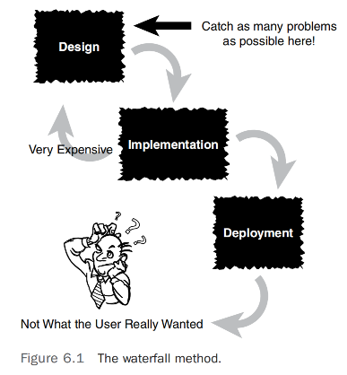
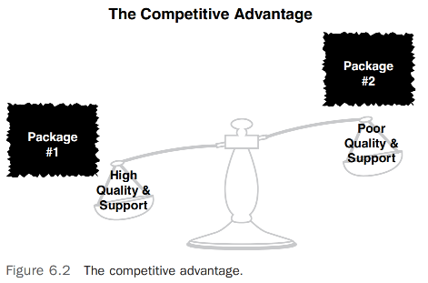
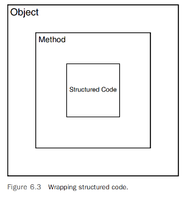

# 使用对象进行设计       

## 引言     
当你使用软件产品时，你期望它能按照广告所宣传的那样运行。不幸的是，并非所有产品都能达到预期。问题在于，当许多产品被生产出来时，大部分时间和努力都投入到了工程阶段，而不是设计阶段。      

面向对象（OO）设计被誉为一种强大而灵活的软件开发方法。事实是，你可以轻易地创建好的和不好的OO设计，就像你可以创建好的和不好的非OO设计一样。不要因为你正在使用最先进的设计方法学就陷入一种错误的安全感。你必须关注整体设计，并投入适当的时间和精力来创建尽可能好的产品。      

在第5章“类设计指南”中，我们专注于设计好的类。本章重点是设计好的系统。一个系统可以被定义为相互作用的类。适当的设计实践在软件开发的历史中已经演变，你没有理由不利用你的软件前辈们的血汗和泪水，无论他们是否使用了 OO 技术。   

利用以往的努力不仅限于设计实践；你甚至可以在你的面向对象设计中整合现有的遗留代码。在许多情况下，你可以取用可能已经运行良好多年的代码，并直接将其包装在你的对象中。这种包装将在本章后面讨论。            

## 设计指南
`一个误区是认为存在一种真正的（最佳的）设计方法论`。这显然不是事实。没有正确或错误的方式来创建设计。如今，有许多设计方法可用，它们都有自己的支持者。然而，主要问题不在于使用哪种设计方法，而在于是否根本使用一种方法。这可以扩展到整个软件开发过程之外。一些组织没有遵循标准的软件开发流程，或者他们有一个流程但不坚持使用。创建良好设计的最重要因素是找到一个你和你的组织感到舒适的流程，坚持使用它，并不断完善它。实施一个没有人会遵循的设计流程是没有意义的。            

大多数涉及面向对象技术的书籍都提供了设计系统的非常相似的策略。实际上，除了一些特定于面向对象的问题之外，许多策略也适用于非 OO系统。      
`通常，一个稳固的OO设计过程包括以下步骤`：            
1. 进行适当的分析           
2. 制定描述系统的工作说明书         
3. 从这个工作说明书中收集需求           
4. 开发用户界面的原型           
5. 确定类           
6. 确定每个类的责任         
7. 确定各种类如何相互作用           
8. 创建描述待建系统的高层模型           

对于面向对象开发来说，高层系统模型特别重要。系统或对象模型由类图和类交互组成。这个模型应该忠实地代表系统，并且易于理解和修改。我们还需要一种模型的符号系统。这就是统一建模语言（UML）的用武之地。如你所知，UML不是一种设计过程，而是一种建模工具。在本书中，我只使用UML中的类图。我喜欢使用类图作为一种视觉工具来协助设计过程以及文档记录——即使我不使用其他可用的UML工具。      

>注意：`持续的设计过程`, 尽管有最好的意图和计划，在除最简单的情况外，设计是一个持续的过程。即使产品处于测试阶段，也会出现设计更改。项目经理需要划定界限，说明何时停止更改产品和增加功能。我喜欢称这为版本1。        

重要的是要理解有许多设计方法可用。一种早期的方法论称为瀑布模型，它主张在各个阶段之间设立严格的界限。在这种情况下，设计阶段在实现阶段之前完成，实现阶段在测试阶段之前完成，依此类推。实践中，瀑布模型被发现是不切实际的。目前，其他设计模型，如快速原型、极限编程、敏捷、Scrum等，推动了真正的迭代过程。在这些模型中，某些实现是在完成设计阶段之前尝试的，作为一种概念验证。尽管最近对瀑布模型有所回避，但该模型背后的目标是可以理解的。在开始编码之前制定一个完整且彻底的设计是一种健全的做法。你不会想在产品发布阶段再次决定迭代设计阶段。跨阶段迭代是不可避免的；然而，你应该将这些迭代减少到最少（见图6.1）。            

  
图6.1       

简单来说，早期确定需求和将设计变更保持在最小的原因如下：        
* 设计阶段的需求/设计变更成本相对较小。     
* 实施阶段的设计变更成本显著更高。          
* 部署阶段后的设计变更成本与第一项相比简直是天文数字。          

同样地，你也不会希望在建筑设计完成之前就开始建造你梦想中的房子。如果我说金门大桥或帝国大厦的建造没有考虑任何设计问题，你会认为这种说法绝对是疯狂的。然而，如果我告诉你，你正在使用的软件可能包含一些设计缺陷，实际上可能没有经过彻底测试，你可能不会觉得这很疯狂。          

事实上，可能无法彻底测试软件，意味着绝对不存在任何错误。然而，从理论上讲，这始终是目标。我们应该始终尝试消除尽可能多的错误。桥梁和软件可能不是直接可比的；然而，软件必须追求与桥梁建设等“更硬”的工程学科相同的工程卓越水平。劣质软件可能是致命的——它不仅仅是工资单上的错误数字。例如，医疗设备中的劣质软件可以杀死和致残人。然而，你可能愿意接受偶尔重启计算机。但对于桥梁的失败不能这么说。            

>注意：`安全与经济`，你会愿意走过一座没有经过检查和测试的桥梁吗？不幸的是，对于许多软件包，用户不得不承担大部分测试的责任。这对用户和软件提供商来说都非常昂贵。不幸的是，短期经济利益似乎常常是项目决策的主要因素。         

因为客户似乎只愿意支付有限的价格并忍受质量差的软件，一些软件提供商发现从长远来看，让客户测试产品比自己做测试更便宜。从短期来看这可能是真的，但从长远来看，其成本远超软件提供商的预期。最终，软件提供商的声誉将受到损害。            

一些计算机软件公司愿意使用beta测试阶段让客户进行测试——理论上，这些测试应该在beta版本到达客户手中之前就完成。许多客户愿意冒险使用尚未发布的软件，因为他们急于获取产品承诺的功能。相反，一些客户像躲避瘟疫一样抵制新版本。如果它运行正常，就不要修复它。升级可能是一场噩梦！          

软件发布后，未能在发布前发现并修复的问题将变得更加昂贵。举个例子，考虑汽车公司面临召回的困境。如果在汽车发货前（理想情况下是在制造前）发现并修复了一个缺陷，那么成本将比所有已交付的汽车都必须被一一召回和修复要便宜得多。这种情况不仅非常昂贵，还会损害公司的声誉。在日益竞争激烈的市场中，高质量的软件、支持服务和声誉是竞争优势（见图6.2）。         

      

以下部分提供了之前列出的设计过程中各项内容的简要概述。在本章的后面部分，我们将通过一个例子，更详细地解释这些内容。      

### 执行适当的分析
在构建设计和生产软件产品的过程中涉及许多变量。用户必须在所有阶段与开发者紧密合作。在分析阶段，用户和开发者必须进行适当的研究和分析，以确定工作说明书、项目需求，以及是否真的进行项目。最后一点可能看起来有些意外，但这很重要。在分析阶段，如果存在有效的理由，绝不能犹豫终止项目。很多时候，由于宠爱的项目地位或某种政治惯性，项目会继续进行，不管明显的警告信号呼吁取消项目。假设项目是可行的，分析阶段的主要焦点是让每个人了解系统（包括旧的和拟议的新系统）并确定系统需求。          

>注意：`通用软件原则`, 这些实践中的大多数并非特定于面向对象。它们适用于一般的软件开发。     

### 制定工作说明书  
工作说明书（SOW）是描述系统的文件。尽管确定需求是分析阶段的最终目标，在此阶段，需求还未形成最终格式。工作说明书应使任何阅读它的人都能对系统有一个完整的、高层次的理解。无论工作说明书如何编写，它都必须代表完整的系统，并清楚地描述系统的外观和感觉。       

工作说明书包含了必须了解的关于系统的一切。许多客户创建了一个分发用的请求提案（RFP），类似于工作说明书。客户创建一个RFP，完整描述客户希望建造的系统，并将其发布给多个供应商。然后供应商使用这份文件和他们需要进行的任何分析，来决定是否应该对项目进行投标，如果是，应该收取什么价格。            

### 收集需求
需求文档描述了用户希望系统执行的操作。尽管需求文档的详细程度无需非常技术性，但需求必须足够具体，以代表用户对最终产品需求的真实性质。需求文档必须详细到足以让用户对系统的完整性做出明智的判断。它还必须具体到设计团队可以使用该文档继续进行设计阶段。            

工作说明书（SOW）是以段落（甚至叙述）形式编写的文档，而需求通常表示为总结陈述或以项目符号列表的形式呈现。每个项目符号项代表系统的一个具体需求。需求是从工作说明书中提炼出来的。这个过程将在本章后面展示。           

在许多方面，这些需求是系统中最重要的部分。工作说明书可能包含不相关的材料；然而，需求是必须实现的系统的最终表示。软件开发过程中的所有未来文档都将基于这些需求。      

### 开发系统原型
确保用户和开发者理解系统的最佳方法之一是创建一个原型。原型可以是任何东西；然而，大多数人认为原型是一个模拟的用户界面。通过创建实际的屏幕和屏幕流程，人们更容易获得对他们将要使用的内容以及系统的感觉的理解。无论如何，原型几乎肯定不会包含最终系统的所有功能。              

大多数原型是使用集成开发环境（IDE）创建的。然而，在一些基本情况下，可能只需要在白板甚至纸上画出屏幕。记住，当你构建原型时，你不一定要创建业务逻辑（界面背后实际完成工作的逻辑/代码），尽管这是可能的。此时，用户界面的外观和感觉是主要关注点。拥有一个好的原型在识别类时可以极大地帮助。            

### 识别类
在需求被记录后，可以开始识别类的过程。从需求中，识别类的一种直接方式是突出显示所有名词。这些往往代表对象，如人、地点和物品。不要太挑剔于第一次就获得所有的类。你可能最终会消除类、添加类，并在设计的各个阶段更改类。重要的是先写下一些东西。利用设计是一个迭代过程的事实。就像其他形式的头脑风暴一样，首先记录下来，理解最终结果可能与初稿完全不同。            

### 确定每个类的责任
你需要确定你已识别的每个类的责任。这包括类必须存储的数据和类必须执行的操作。例如，一个员工对象可能负责计算工资和将钱转账到适当的账户。它也可能负责存储各种工资率和各个银行的账号。          

### 确定类如何与彼此协作
大多数类不是孤立存在的。尽管一个类必须履行某些责任，但很多时候它需要与另一个类互动以获得它想要的东西。这就是类之间消息的用途。当一个类需要从另一个类获取信息，或者希望另一个类为其做某事时，它可以向另一个类发送消息。          

### 创建一个类模型来描述系统        
当所有的类都被确定，并列出了类的责任和协作关系后，可以构建代表整个系统的类模型。这个类模型展示了各个类在系统内如何相互作用。        

我们使用UML（统一建模语言）来模拟系统。市场上有几种使用UML的工具，它们提供了一个良好的环境来创建和维护UML类模型。随着我们在下一节中开发示例，我们将看到类图如何融入大局，并了解如果没有某种良好的建模符号和建模工具，对大型系统进行建模将几乎是不可能的。           

### 在代码中原型用户界面
在设计过程中，我们必须创建用户界面的原型。这个原型将提供宝贵的信息，帮助我们在设计过程的迭代中导航。正如《Java中的面向对象设计》一书中的Gilbert和McCarty所指出的，“对于系统用户来说，用户界面就是系统。”创建用户界面原型有几种方法。你可以通过在纸上或白板上绘制来草绘用户界面。你也可以使用特殊的原型工具，或者使用像Visual Basic这样的语言环境，它常用于快速原型设计。或者你可以使用你最喜欢的开发工具的IDE来创建原型。然而，此时它们基本上是外观；业务逻辑并不一定到位。无论你如何开发用户界面原型，确保用户对外观和感觉有最终发言权。           

## 对象封装
在前几章中，我多次指出，我在本书中的一个主要目标是驳斥面向对象编程与结构化编程是两种不同范式、甚至是相互冲突的谬论。实际上，正如我已经提到的，我经常被问到这样的问题：“你是一个面向对象的程序员还是一个结构化程序员？”答案总是一样——我两者都是！        

在我看来，没有使用结构就无法编写程序。因此，当你使用面向对象编程语言并使用合理的面向对象设计技术编写程序时，你也在使用结构化编程技术。这是无可避免的。      

例如，当你创建一个包含属性和方法的新对象时，这些方法将包含结构化代码。事实上，我甚至可以说这些方法主要包含结构化代码。这种方法与我们在前几章中遇到的容器概念很吻合。实际上，当我到达我在方法级别编码的时候，我的编码思维过程自从我使用结构化语言（如Cobol、C等）编程以来并没有太大变化。这并不是说它完全一样，因为我显然不得不调整一些面向对象的构造；
然而，方法级别的编码基本方法几乎与编程一直以来的方式相同。      

现在我将回到这个问题：“你是一个面向对象的程序员还是一个结构化程序员？”我经常喜欢说，编程就是编程。通过这种方式，我认为成为一个优秀的程序员意味着理解编程逻辑的基础并对编码充满热情。你经常会看到针对具有特定技能集的程序员的广告——比如说像Java这样的特定语言。          

尽管我完全理解一个组织在紧急情况下可能确实需要一名经验丰富的Java程序员，但从长远来看，我更愿意专注于招聘具有广泛编程经验的程序员，他们能够在新技术出现时迅速学习和调整。我的一些同事并不总是同意这一点；然而，我认为在招聘时，我更看重潜在员工能学到什么，而不是他们已经知道什么。热情这一部分至关重要，因为它确保员工将始终探索新技术和开发方法论。                

### 结构化代码      
尽管编程逻辑的基础可能会有争议，正如我所强调的，面向对象的基本构造包括封装、继承、多态性和组合。在我看过的大多数教科书中，结构化编程的基本构造是顺序、条件和迭代。          

顺序部分是理所当然的，因为从顶部开始并以逻辑方式进行到底部似乎是合理的。对我来说，结构化编程的核心在于条件和迭代，我分别称之为if语句和循环。            

看看下面的Java代码，它从0开始，循环10次，如果值等于5，则打印出该值：            
```java
class MainApplication {
  public static void main(String args[]) {
    int x = 0;
    while (x <= 10) {
      if (x == 5) System.out.println("x = " + x);
      x++;
    }
  }
}
```
虽然这段代码是用面向对象的语言编写的，但main方法内的代码是结构化代码。结构化编程的所有三个基本元素都存在：顺序、条件和迭代。            
顺序部分很容易识别，因为执行的第一行是：            
```java
int x = 0;
```
当这行代码执行完毕后，执行下一行：      
```java
while (x <= 10) {
``` 

等等。简而言之，这是经过验证的自顶向下的编程：从第一行开始执行，然后继续执行下一行。            
这段代码中也存在一个条件，作为if语句的一部分：      
```java
if (x == 5)
```
最后，有一个循环来完成结构化的三元组。              
```java
while (x <= 10) {
}
```
实际上，while循环也包含一个条件：           
```java     
(x <= 10)
```
你可以仅用这三个构造来编写几乎任何东西。事实上，封装的概念在结构化编程中与面向对象编程中基本相同。在结构化设计中，你将代码封装在函数中（例如这个例子中的main方法），而在面向对象设计中，你将代码封装在对象和方法中。            

### 封装结构化代码      
尽管定义属性被认为是编程（例如，创建一个整数），但对象的行为存在于方法中。这些方法是大部分代码逻辑所在的地方。          

考虑图6.3。正如你所看到的，一个对象包含方法，这些方法包含代码，这些代码可以是从变量声明到条件到循环的任何内容。             
          

让我们考虑一个简单的例子，我们在其中封装了加法功能。这里我们创建了一个名为 `add` 的方法，它接受两个整数参数并返回它们的和。 
```java
class SomeMath {
 public int add(int a, int b) {
 return a + b;
 }
}
```
如你所见，用于执行加法的结构化代码（a + b）被封装在 `add` 方法内。虽然这是一个简单的例子，但封装结构化代码就是这么简单。因此，当用户想要使用这个方法时，只需要方法的签名，如下所示：            
```java
public class TestMath {
 public static void main(String[] args) {
 int x = 0;
 SomeMath math = new SomeMath();
 x = math.add(1,2);
 System.out.println("x = " + x);
 }
}
```
最后，我们可以添加一些更有趣且更复杂的功能。假设我们想要包括一个计算数字斐波那契值的方法。我们可以添加这样一个方法：        
```java
public static int fib(int n) {
 if (n < 2) {
 return n;
 } else {
 return fib(n–1) + fib(n–2);
 }
}
```
这里的重点是展示我们拥有一个包含（封装）结构化代码的面向对象方法，因为 `fib` 方法包含条件、递归等。正如在引言中提到的，也有可能在封装中整合现有的遗留代码。     

### 封装非可移植代码    
对象封装的另一个用途是隐藏非可移植（或本地）代码。这个概念本质上是相同的；然而，在这种情况下，关键是将只能在一个平台（或少数几个平台）上执行的代码封装在一个方法中，为使用该代码的程序员提供一个简单的接口。            
考虑让计算机发出声音的任务——在这种情况下，是一个哔声。在Windows平台上，我们可以使用以下代码执行一个哔声：           
```java
System.out.println("\007");             
```
而不是让程序员记住代码（或查找它），你可以提供一个名为 `Sound` 的类，其中包含一个如下所示的名为 `beep` 的方法：         
```java
class Sound {
 public void beep() {
 System.out.println("\007");
 }
}
```
现在，程序员不必知道制作声音的代码，他们可以使用这个类并调用 `beep` 方法：          
```java
public class TestBeep {
 public static void main(String[] args) {
 Sound mySound = new Sound();
 mySound.beep();
 }
}
```
这不仅使程序员使用起来更简单，而且你可以扩展类的功能以包括其他声音。或许更重要的是，当代码在非Windows平台上使用时，用户的接口保持不变。简而言之，构建 `Sound` 类代码的团队将不得不处理平台变化。对于在其应用程序中使用该类的程序员来说，变化将是无缝的，因为他们仍将调用 `beep` 方法。          

### 封装现有类
虽然将遗留的结构化代码，甚至非可移植代码，封装到新的（面向对象的）类中似乎是合理的，但封装现有类的需求可能不那么明显。然而，也有许多理由为现有的（面向对象的）类创建封装。软件开发人员经常使用其他人编写的代码。可能这些代码是从供应商处购买的，甚至是在同一组织内部编写的。在许多这些情况下，代码不能被更改。可能编写代码的个人已经不在该组织，或者供应商不能进行维护更新等。这就是封装的真正力量所在。            

这个想法是采用一个现有的类并通过将其封装在一个新类中来改变其实现或接口，就像我们对结构化代码和非可移植代码所做的那样。这种情况的区别在于，我们不是为代码提供一个面向对象的外观，而是改变其实现或接口。          

为什么我们想这样做呢？好吧，答案与实现和接口都有关。        

考虑我们在第2章《如何以对象的方式思考》中使用的数据库示例。我们的目标是为开发者提供相同的接口，无论他们使用哪种数据库。实际上，如果我们需要支持另一个数据库，我们的目标仍然相同——使新数据库的过渡对用户来说是透明的（参见第2章中展示的图2.3）。     

同时，还记得我们早先关于创建中间件以提供对象和关系数据库之间接口的讨论。作为开发者，我们想要使用对象。因此，我们需要能让我们将对象持久化到数据库的功能。我们不想要的是为每一个对关系数据库执行的对象事务编写SQL代码。这就是我们可以将中间件视为一个封装器的地方，市场上有许多对象-关系映射产品可用。            

从概念上讲，对我来说，界面和实现范式的终极示例是我们在第2章中关于发电厂示例的讨论，并在图2.1中展示。在这种情况下，我们可以替换（封装）两者：我们可以通过更改插座来改变接口，也可以通过更改发电设施来改变实现。      

在软件开发中使用封装器相当广泛，不仅从开发者的角度，也从供应商的角度。封装器是开发软件系统时的重要工具。    

在本章中，我们关注了各种设计考虑，包括编写新代码以及使用以前编写的代码，无论是内部的还是来自供应商的。在某些情况下，封装器甚至是它们自己的设计范式。例如，设计模式在各种情况下使用封装器。正如我们稍后将看到的，装饰器模式专注于封装实现，而适配器模式专注于改变接口。设计模式的讨论在第10章《设计模式》中更详细地探讨。        

## 结论     
本章涵盖了完整系统的设计过程。需要注意的是，面向对象和结构化代码并不是相互排斥的。事实上，你不能在不使用结构化代码的情况下创建对象。因此，在构建面向对象系统时，你也在设计中使用结构化技术。        

对象封装用于封装多种功能，这些功能可以从传统的结构化（遗留）和面向对象（类）代码到非可移植（本地）代码。对象封装的主要目的是为使用代码的程序员提供一致的接口。          

在接下来的几章中，我们将更详细地探讨类之间的关系。第七章，“掌握继承和组合”，涵盖了继承和组合的概念和 它们是如何相互联系的。         

refer   
1.The Object-Priented Thought Process Fifth Edition   