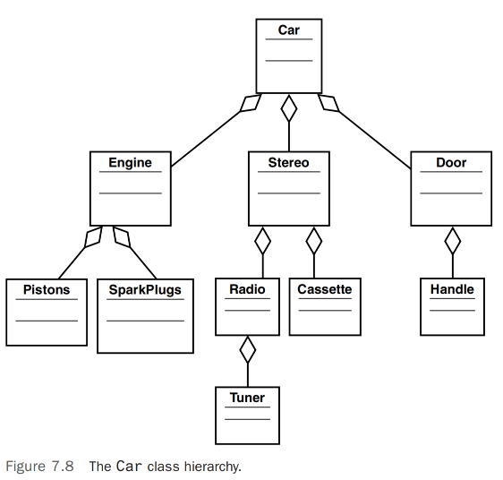

# 掌握继承和组合       

## 引言 
在面向对象（OO）系统设计中，继承和组合发挥着重要的作用。事实上，许多最复杂和最有趣的设计决策归结为在继承和组合之间做出选择。随着面向对象设计实践的演变，这些决策变得更加有趣。继承的争论可能是最有趣的辩论之一。尽管继承是面向对象开发的基本结构之一（一种语言必须支持继承才能被认为是面向对象的），但一些开发者甚至通过仅使用组合的设计来避免使用继承。通常使用接口继承而非直接继承来实现行为（实现而非继承）。继承通常用于数据/模型，而实现通常用于行为。     

无论如何，继承和组合都是重用机制。继承，顾名思义，涉及从其他类继承属性和行为，其中存在真正的父/子关系。子类（或子类）直接从父类（或超类）继承。组合，顾名思义，涉及使用其他对象来构建对象。在本章中，我们将探讨继承和组合之间的明显和微妙差异。主要是，我们将考虑何时使用这两者中的哪一个。         

## 对象重用         
或许`继承和组合存在的主要原因是对象重用`。简而言之，你可以通过继承和组合利用其他类来构建类（最终成为对象），这实际上是重用先前构建的类的唯一方式。            
继承代表了在第一章“面向对象概念介绍”中介绍的是-一个关系。例如，狗是哺乳动物。              

组合涉及使用其他类来构建更复杂的类——一种组装。在这种情况下，不存在父/子关系。基本上，复杂的对象由其他对象组成。组合代表了一种有-一个关系。例如，一辆车有一个引擎。引擎和车都是分开的，可能是独立的对象。然而，汽车是一个复杂的对象，它包含（有一个）引擎对象。实际上，一个子对象本身可能由其他对象组成；例如，引擎可能包括气缸。在这种情况下，一个引擎有多个气缸。

当面向对象技术首次进入主流时，继承通常是用来设计面向对象系统的第一个例子。你可以设计一次类然后从中继承功能，这被认为是使用面向对象技术的最重要优势之一。重用是游戏的名字，而继承是重用的终极表达。      

然而，随着时间的推移，继承的光泽有些黯淡。事实上，在一些讨论中，继承本身的使用甚至受到质疑。在他们的书《Java设计》中，Peter Coad 和 Mark Mayfield 有一整章标题为“用组合而非继承设计”。许多早期的基于对象的平台甚至不支持真正的继承。随着 Visual Basic 发展为 Visual Basic .NET，早期基于对象的实现不包括严格的继承能力。如 MS COM 模型等平台基于接口继承。接口继承在第8章“框架和重用：用接口和抽象类设计”中有详细介绍。         

今天，继承的使用仍是一个主要的讨论话题。一些语言，如 Objective-C 和 Swift，不直接支持抽象类这种形式的继承。尽管接口不提供抽象类所提供的所有功能，但仍然被使用。         

好消息是，关于是否使用继承或组合的讨论是向某种成熟的中间地带自然发展的。如同所有哲学辩论一样，双方都有激烈的论证。幸运的是，通常情况下，这些激烈的讨论导致了对如何利用这些技术有更合理的理解。          

我们将在本章后面看到为什么一些人认为应该避免继承，而组合应该是首选的设计方法。这个论点相当复杂且微妙。实际上，继承和组合都是有效的类设计技术，它们各自在面向对象开发者的工具箱中都有适当的位置。至少，你需要理解这两者以做出正确的设计选择——更不用说维护遗留代码了。             

继承经常被误用和过度使用，更多是由于对继承本质的理解不足，而不是使用继承作为设计策略的根本缺陷。              

总之，继承和组合都是构建面向对象系统的重要技术。设计师和开发者需要花时间理解两者的优点和缺点，并在适当的情境中使用每一种。              

## 继承
继承在第一章被定义为一个系统，其中子类从父类继承属性和行为。然而，继承还有更多内容，在这一章我们将更详细地探索继承。        

第一章指出，你可以通过遵循一个简单的规则来确定继承关系：如果你能说类B是类A，那么这种关系就是继承的良好候选。    

>注意：`Is-a`, `面向对象设计的主要规则之一是公共继承由“是一个”关系表示。在接口的情况下，你可能会添加“表现得像”（实现）。被继承的数据（属性）是“是”，描述封装行为的接口是“表现得像”，而组合是“有一个”。然而，这些界限很模糊`。     

让我们回顾一下第一章中使用的哺乳动物例子。我们来考虑一个狗类。狗有几种行为使其明显区别于猫。在这个例子中，我们来指定两个：狗会吠叫和狗会喘气。因此，我们可以创建一个具有这两种行为的狗类，以及两个属性（见图7.1）。     

       

现在，假设你想创建一个金毛寻回犬类。你可以创建一个全新的类，包含狗类所具有的相同行为。然而，我们可以做出以下非常合理的结论：金毛寻回犬是一种狗。由于这种关系，我们可以从狗类继承属性和行为，并在我们新的金毛寻回犬类中使用它们（见图7.2）。     

     

GoldenRetriever类现在包含了其自身的行为以及所有更一般的狗的行为。这为我们提供了一些重大的好处。首先，当我们编写GoldenRetriever类时，我们不需要通过重写bark（吠叫）和pant（喘气）方法来重新发明部分轮子。这不仅节省了一些设计和编码时间，而且还节省了测试和维护时间。bark和pant方法只编写一次，并且假设在编写Dog类时已经进行了适当的测试，它们就不需要再进行大量测试；但由于存在新的接口等，所以需要重新测试。               

现在，让我们充分利用我们的继承结构，并在Dog类下创建第二个类：一个名为LhasaApso的类。与金毛寻回犬被培育用于取回物品不同，拉萨犬被培育用作看门狗。这些狗不是攻击犬；它们具有敏锐的感觉，当它们感觉到不寻常的事物时，就会开始吠叫。因此，我们可以创建我们的LhasaApso类，并像我们之前创建GoldenRetriever类一样从Dog类继承（见图7.3）。          

        

>测试新代码，在我们的示例中，使用 GoldenRetriever类时，应当在编写Dog类时编写、测试并调试 bark（吠叫）和 pant（喘气）方法。从理论上讲，这段代码现在已经足够健壮，可以在其他情况下重用。然而，不需要重写代码并不意味着不应该对其进行测试。虽然可能性不大，但可能存在一些特定的金毛寻回犬的特性，这些特性可能会破坏代码的正常运作。关键是你应该始终测试新代码。每一种新的继承关系都为使用继承的方法创造了一个新的上下文。一个完整的测试策略应该考虑到每一个这样的上下文。                    

继承的另一个主要优点是，bark()和pant()的代码位于单一位置。比如说，如果需要更改bark()方法中的代码，当你在Dog类中更改它时，你不需要在LhasaApso类和GoldenRetriever类中进行更改。           

你看到这里有问题吗？在这个层面上，继承模型似乎工作得很好。然而，你能确定所有的狗都有Dog类中包含的行为吗？     

`在他的书《Effective C++》中，Scott Meyers提供了一个关于使用继承进行设计的典型困境的例子。考虑一个用于表示鸟的类。鸟最显著的特征之一当然是它能飞。因此我们创建了一个名为Bird的类，并为其添加了一个fly（飞行）方法。你应该立即意识到问题所在。我们该怎么处理企鹅或鸵鸟呢？它们是鸟类，但它们不能飞。你可以在本地重写行为，但方法仍然被称为fly。对于一只只会蹒跚行走、奔跑或游泳的鸟来说，拥有一个名为fly的方法并不合理。这是SOLID的里氏替换原则的一个例子，我们将在第12章“面向对象设计的SOLID原则”中讨论`。            

这可能导致一些重大问题。例如，如果企鹅有一个fly方法，企鹅可能会理解地决定尝试一下。然而，如果fly方法实际上被重写了并且飞行的行为不存在，那么当fly方法在跳过悬崖后被调用时，企鹅将会大吃一惊。想象一下，当调用fly方法结果是蹒跚而行而不是飞行时（或甚至是一个no-op，意味着没有操作，根本什么也不发生），企鹅的失望之情。     

在我们的狗的例子中，我们设计了一个类，使所有的狗都有吠叫的能力。然而，有些狗不吠叫。巴辛吉犬就是一种不吠的狗。尽管这些狗不吠叫，但它们会发出类似于约德尔歌声的声音。那么我们应该重新评估我们的设计吗？这种设计应该是什么样子？图7.4是一个展示了对Dog类层级结构更正确的建模方式的例子。     

          

### 一般化和专业化      
考虑狗类层级的对象模型。我们从一个叫做Dog的单一类开始，我们分解了不同狗品种之间的一些共性。这个概念，有时被称为`泛化-特化`，是使用继承时的另一个重要考虑因素。这个想法是，当你沿着继承树向下走时，事物会变得更具体。最一般的情况位于树的顶部。在我们的狗继承树中，Dog类位于顶部，是最一般的类别。各种品种——GoldenRetriever（金毛寻回犬）、LhasaApso（拉萨犬）和Basenji（巴辛吉犬）类是最具体的。`继承的想法是通过分解共性从一般到特殊`。

在狗的继承模型中，我们开始通过理解尽管金毛寻回犬和拉萨犬的行为有所不同，但这些品种确实共享一些共同的行为——例如，它们都会喘气和吠叫来分解共同的行为。然后我们意识到，并非所有狗都会吠叫——有些会发出类似约德尔的声音。因此，我们必须将吠叫行为分解到一个单独的BarkingDog（吠叫狗）类中。约德尔行为则被归入一个YodelingDog（约德尔狗）类。然而，我们意识到，无论是会吠的狗还是不会吠的狗，它们仍然共享一些共同的行为——所有狗都会喘气。因此，我们保留了Dog类，并让BarkingDog和YodelingDog类从Dog继承。现在，Basenji可以从YodelingDog继承，而LhasaApso和GoldenRetriever可以从BarkingDog继承。            

我们本可以决定不为BarkingDog和YodelingDog创建两个不同的类。在这种情况下，我们可以实现每个个体品种的类中的所有吠叫和约德尔行为——因为每只狗的声音都不同。这只是必须做出的一些设计决策中的一个例子。也许最好的解决方案是将吠叫和约德尔行为实现为接口，我们将在第8章中讨论。        

在这种情况下，第10章“设计模式”中介绍的设计模式可能是一个不错的选择。开发者通常不会创建这些变体的狗；他们要么使用Dog（实现IDog接口），要么使用装饰器来为Dog对象添加行为。            

### 设计决策
理论上，尽可能地分解共性是极好的。然而，就像所有设计问题一样，有时候过犹不及。尽管尽可能地分解共性可能会尽可能真实地代表现实生活，但它可能不会尽可能真实地代表你的模型。你分解的越多，你的系统就越复杂。因此，你面临一个难题：你是想要一个更精确的模型，还是一个复杂度更低的系统？你必须根据你的情况来做出这个选择，因为没有硬性的指导方针来做决定。                

>注意：`计算机不擅长的事情`, 显然，计算机模型只能近似模拟现实世界的情况。计算机擅长进行数字运算，但在更抽象的操作方面则不那么擅长。     

例如，将Dog类分解为BarkingDog和YodelingDog更好地模拟了现实生活，而不是假设所有狗都会吠叫，但这确实增加了一些复杂性。        

>注意：`模型复杂性`, 在我们例子的这个层面，增加两个更多的类并不会使事情变得复杂到使模型难以维持的程度。然而，在更大的系统中，当这类决策一次又一次地被做出时，复杂性迅速累积。`在更大的系统中，保持尽可能简单通常是最佳实践`。             

在你的设计中将会有一些情况，更精确的模型的优势并不值得增加额外的复杂性。假设你是一名狗繁殖者，并且你外包了一个系统来跟踪你的所有狗。包括吠叫狗和约德尔狗的系统模型运行良好。然而，假设你从未繁殖过任何约德尔狗，将来也不会。也许你不需要引入区分约德尔狗和吠叫狗的复杂性。这将使你的系统变得更简单，并且它将提供你需要的功能。          

`决定是设计更少的复杂性还是更多的功能是一种平衡行为`。主要目标始终是构建一个灵活的系统，而不添加过多的复杂性，以至于系统在自身重量下崩溃。如果你需要在项目后期添加约德尔怎么办？   

当前和未来的成本也是这些决策中的一个主要因素。尽管使系统更加完整和灵活似乎是合适的，这增加的功能可能几乎不增加任何好处——投资回报可能不在那里。例如，你会扩展你的狗系统的设计以包括其他的犬科动物，如鬣狗和狐狸（见图7.5）吗？       

        

如果你是一个动物园管理员，这个设计可能是谨慎的，但如果你是在繁殖和销售家养的狗，扩展犬类可能是不必要的。            
正如你所看到的，设计时总会有一些权衡。              

>注意：`以未来为考量做设计决策`, 你可能会说，“永不言绝。”虽然你现在可能不繁殖约德尔狗，但将来你可能会想这么做。如果你现在不为约德尔狗的可能性设计，那么之后改变系统以包含它们将会更加昂贵。这只是你必须做出的许多设计决策之一。你可能会重写bark()方法使其发出约德尔声；然而，这并不直观，一些人会期望一个叫做bark()的方法实际上是吠叫。                 

## 组合 
将对象视为包含其他对象是很自然的想法。一台电视机包含调谐器和视频显示器。一台计算机包含视频卡、键盘和驱动器。计算机本身可以被视为一个对象，闪存驱动器也被认为是一个有效的对象。你可以打开计算机并拿出硬盘在手中。事实上，你可以将硬盘带到另一台计算机并安装它。它是一个独立对象的事实得到了加强，因为它可以在多台计算机中工作。          

对象组合的经典例子是汽车。许多书籍、培训课程和文章似乎都将汽车用作对象组合的经典例子。除了最初可互换的步枪制造外，大多数人都将亨利·福特创建的汽车装配线视为可互换部件的典型例子。因此，汽车似乎自然而然地成为了设计面向对象（OO）软件系统的主要参考点。     

大多数人会觉得车子自然应该包含一个引擎。然而，除了引擎外，汽车还包含许多其他对象，包括轮子、方向盘和立体声。当一个特定的对象由其他对象组成，并且这些对象作为对象字段包含在内时，这个新对象被称为复合对象、聚合体或组合对象（见图7.6）。         

>注意：`聚合、关联和组合`, 从我的角度来看，重用类只有两种方式——通过继承或通过组合。在第9章“构建对象和面向对象设计”中，我们将更详细地讨论组合——特别是聚合和关联。在这本书中，我认为聚合和关联是组合的类型，尽管对此有不同的观点。                

        

### 使用UML表示组合
为了模拟汽车对象包含方向盘对象的事实，UML使用图7.7所示的符号表示。              

>注意：`聚合、关联和UML`, 在这本书中，聚合在UML中通过带有菱形的线来表示，例如作为汽车部分的引擎。关联则仅由线表示（没有菱形），例如独立的键盘服务于单独的计算机箱。         

        

请注意，连接Car类和SteeringWheel类的线在Car一侧有一个菱形。这表示汽车包含（拥有）一个方向盘。       

让我们扩展这个例子。假设这个设计中的所有对象都不以任何方式使用继承。所有的对象关系都严格是组成的，且存在多个组成层级。当然，这是一个简化的例子，在设计汽车时，有更多的对象和对象关系。然而，这个设计旨在简单地说明组成的概念。              

假设一辆车由一个引擎、一个立体声系统和一个车门组成。            

>注意：`多少扇门和立体声系统？`, 请注意，一般的汽车不止一扇门。有些车有两扇门，有些车有四扇门。你甚至可以把后备箱盖视为第五扇门。同样，也并不是所有的车都有立体声系统。一辆车可能没有立体声系统，或者有一个。我甚至见过一辆车装有两套独立的立体声系统。这些情况将在第9章中详细讨论。为了这个例子，假设一辆车只有一扇门（也许是一辆特别的赛车）和一个立体声系统。              

说一辆车由引擎、立体声系统和车门组成是很容易理解的，因为大多数人都是这样认为的。然而，在设计软件系统时，就像汽车一样，要牢记对象是由其他对象组成的这一点很重要。实际上，可以包含在这种类的树状结构中的节点和分支的数量几乎是无限的。            

图7.8显示了汽车的对象模型，包括了引擎、立体声系统和车门。



请注意，组成汽车的三个对象本身都是由其他对象组成的。引擎包含活塞和火花塞。立体声包含一个收音机和CD播放器。车门包含一个把手。同时也请注意，还有另外一层级。收音机包含一个调谐器。我们还可以添加把手包含一个锁；CD播放器包含一个快进按钮等事实。此外，我们还可以在调谐器的基础上再往下一级，创建一个用于调节的旋钮对象。对象模型的层级和复杂性取决于设计师。          

>注意：`模型复杂性`, 就像吠叫和约德尔狗的继承问题一样，过度使用组合也可能导致更大的复杂性。存在一条微妙的界限，介于创建一个包含足够细粒度以足够表达的对象模型和一个过于细粒度以至于难以理解和维护的模型之间。   

## 为什么封装是面向对象（OO）的基础   
`封装是面向对象编程的基本概念`。每当涉及到接口/实现范式时，我们就在讨论封装。基本问题是类中应该暴露什么，不应该暴露什么。这种封装同样适用于数据和行为。当讨论一个类时，主要的设计决策围绕着将数据和行为封装进一个编写良好的类中。       

Stephen Gilbert 和 Bill McCarty 将封装定义为“将程序打包的过程，将其每个类分为两个不同的部分：接口和实现。”这是这本书一再呈现的信息。        

但封装与继承有什么关系，它如何适用于本章呢？这涉及到一个面向对象的悖论。`封装是面向对象的基础，它是面向对象设计的基本规则之一`。继承也被认为是三个主要的面向对象概念之一。然而，`在某种方式上，继承实际上破坏了封装`！这怎么可能？两个面向对象的三个主要概念之间可能互不兼容吗？让我们探索这种可能性。

### 继承如何削弱封装        
如前所述，封装是将类打包成公共接口和私有实现的过程。本质上，一个类隐藏了其他类不需要知道的一切。              

Peter Coad 和 Mark Mayfield 认为，使用继承时，封装在类层次结构中本质上被削弱。他们谈到一个具体的风险：`继承在与其他类的封装上很强，但在超类和其子类之间的封装上却很弱`。                      

问题在于，如果你从一个超类继承了一个实现，然后改变了这个实现，`超类的改变`会通过类层次结构产生连锁反应。这种连锁反应可能会影响所有的子类。起初，这可能看起来不是一个大问题；然而，正如我们所见，这样的连锁反应可能会导致意外的问题。例如，测试可能变成一场噩梦。在第6章“用对象设计”中，我们讨论了封装如何使测试系统变得更容易。理论上，如果你创建了一个名为Cabbie的类（见图7.9），具有适当的公共接口，对Cabbie的实现的任何改变都应该对所有其他类是透明的。然而，在任何设计中，对超类的更改肯定对子类不是透明的。你看到这个难题了吗？          

如果其他类直接依赖于Cabbie类的实现，测试将变得更加困难，如果不是不可行的话。通过使用不同的设计方法，通过抽象出行为并只继承属性，上面提到的问题就会消失。        

        

>注意：`持续测试`, 即使有封装，你仍然需要重新测试使用Cabbie的类，以验证更改是否引入了问题。     

如果你随后创建了一个名为 PartTimeCabbie 的Cabbie的子类，并且PartTimeCabbie继承了Cabbie的实现，改变Cabbie的实现将直接影响PartTimeCabbie类。      

例如，考虑图7.10中的UML图。PartTimeCabbie是Cabbie的子类。因此，PartTimeCabbie继承了Cabbie的公共实现，包括方法giveDirections()。如果在Cabbie中更改了方法giveDirections()，它将直接影响PartTimeCabbie以及任何可能稍后成为Cabbie子类的其他类。                             
通过这种微妙的方式，对Cabbie实现的更改不一定在Cabbie类内部封装。            

     

为了减少这个困境带来的风险，`当使用继承时坚持严格的“是一个”条件是非常重要的`。如果子类真正是超类的特化，那么对父类的更改很可能以自然和预期的方式影响子类。例如，如果一个 Circle类 从Shape类继承实现，而对Shape的实现的更改破坏了Circle，那么Circle一开始就不真正是一个Shape。              

如何不当使用继承？考虑一种情况，你想为图形用户界面（GUI）创建一个窗口。一种冲动可能是通过使其成为矩形类的子类来创建窗口：            
```java
public class Rectangle {
}
public class Window extends Rectangle {
}
```

实际上，GUI窗口远不止是一个矩形。它不是矩形的特化版本，就像正方形一样。一个真正的窗口可能包含一个矩形（实际上是许多矩形）；然而，它不是一个真正的矩形。在这种方法中，Window类不应该从Rectangle继承，而应该包含Rectangle类。         
```java
public class Window {
 Rectangle menubar;
 Rectangle statusbar;
 Rectangle mainview;
}
```     

### 多态性的详细示例
许多人认为多态性是面向对象设计的基石。设计一个类以创建完全独立的对象是面向对象编程的全部内容。在一个设计良好的系统中，一个对象应该能够回答关于它的所有重要问题。作为一条规则，一个对象应该对自己负责。这种独立性是代码重用的主要机制之一。          

正如第1章中所述，多态性字面意思是多种形状。当向一个对象发送消息时，该对象必须定义一个方法来响应那个消息。在一个继承层次结构中，所有子类都继承了它们超类的接口。然而，因为每个子类是一个独立的实体，每个子类可能需要对同一消息作出不同的响应。           

回顾第1章中的一个例子，考虑一个叫做Shape的类。这个类有一个叫做Draw的行为。然而，当你告诉某人绘制一个形状时，第一个问题可能会是：“什么形状？”仅仅告诉一个人绘制一个形状是太抽象了（实际上，Shape中的Draw方法没有实现）。你必须指定你指的是哪个形状。为此，你在Circle和其他子类中提供实际的实现。尽管Shape有一个Draw方法，Circle覆盖了这个方法并提供了自己的Draw方法。覆盖基本上意味着用你自己的实现替换父类的实现。          

### 对象责任        
让我们重新访问第1章中的Shape示例（参见图7.11)。     

        

`多态性是继承使用中最为优雅的一种`。记住，Shape 不能被实例化。它是一个抽象类，因为它有一个抽象方法 getArea()。第8章将详细解释抽象类。           

然而，Rectangle（矩形）和 Circle（圆形）可以被实例化，因为它们是具体的类。尽管 Rectangle 和 Circle 都是形状，它们之间存在一些差异。作为形状，它们的面积可以被计算。然而，计算面积的公式对每一个都是不同的。因此，面积公式不能放在 Shape 类中。                  

这就是多态性的用武之地。多态性的前提是你可以向各种对象发送消息，它们将根据其对象的类型做出响应。例如，如果你向 Circle 类发送消息 getArea()，你将调用的计算与向 Rectangle 类发送相同的 getArea() 消息时的计算不同。这是因为 Circle 和 Rectangle 都对自己负责。如果你要求 Circle 返回其面积，它知道如何做到这一点。如果你想让圆形自己绘制，它也能做到这一点。即使 Shape 对象可以被实例化，它也不能这样做，因为它对自己的了解不足。注意在 UML 图（图 7.11）中，Shape 类中的 getArea() 方法是斜体的。这表明该方法是抽象的。                

作为一个非常简单的例子，想象有四个类：抽象类 Shape 和具体类 Circle、Rectangle 和 Star。这里是代码：         
```java
public abstract class Shape{
 public abstract void draw();
}
public class Circle extends Shape{
 public void draw() {
 System.out.println("I am drawing a Circle");
 }
}
public class Rectangle extends Shape{
 public void draw() {
 System.out.println("I am drawing a Rectangle");
 }
}
public class Star extends Shape{
 public void draw() {
 System.out.println("I am drawing a Star");
 }
}
```     

>注意，每个类只有一个方法：draw()。`关于多态性和对象对自身负责的重要点是：具体类本身对绘图功能负责。Shape类并未提供绘图的代码`；Circle、Rectangle和Star类为自己提供。这里有一些代码来证明这一点：            
```java
public class TestShape {
 public static void main(String args[]) {
 Circle circle = new Circle();
 Rectangle rectangle = new Rectangle();
 Star star = new Star();
 circle.draw();
 rectangle.draw();
 star.draw();
 }
}
```     

测试应用程序TestShape创建了三个类：Circle（圆形）、Rectangle（矩形）和Star（星形）。为了绘制这些类，TestShape要求各个类自行绘制：               
```java
circle.draw();
rectangle.draw();
star.draw();        
```         

当你执行TestShape时，你会得到以下结果：         
```bash
C:\>java TestShape
I am drawing a Circle
I am drawing a Rectangle
I am drawing a Star
``` 

这就是多态性的运作。如果你想创建一个新的形状，比如Triangle（三角形）会怎样？只需编写类，编译它，测试它，并使用它。基类Shape不需要改变——其他任何代码也不需要改变：               
```java
public class Triangle extends Shape{
 public void draw() {
 System.out.println("I am drawing a Triangle");
 }
}
```         
现在可以向Triangle发送消息。尽管Shape不知道如何绘制三角形，但Triangle类知道：           
```java
public class TestShape {
 public static void main(String args[]) {
 Circle circle = new Circle();
 Rectangle rectangle = new Rectangle();
 Star star = new Star();
 Triangle triangle = new Triangle();
 circle.draw();
 rectangle.draw();
 star.draw();
 triangle.draw();
 }
}
```

执行TestShape时，你将得到以下结果：         
```bash 
C:\>java TestShape
I am drawing a Circle
I am drawing a Rectangle
I am drawing a Star
I am drawing a Triangle
``` 

要看到多态性的真正威力，你可以将形状传递给一个完全不知道即将来什么形状的方法。看看下面的代码，它将具体的形状作为参数：          
```java
public class TestShape {
 public static void main(String args[]) {
 Circle circle = new Circle();
 Rectangle rectangle = new Rectangle();
 Star star = new Star();
 drawMe(circle);
 drawMe(rectangle);
 drawMe(star);
 }
 static void drawMe(Shape s) {
 s.draw();
 }
}
```     

在这种情况下，Shape对象可以被传递给方法drawMe()，而drawMe()方法可以处理任何有效的Shape——甚至是你稍后添加的。你可以像前一个版本那样运行这个版本的TestShape。     

### 抽象类、虚方法和协议        
Java中定义的抽象类也可以在.NET和C++中直接实现。不出所料，C# .NET的代码看起来与Java代码相似，如下所示：      
```csharp
public abstract class Shape{
 public abstract void draw();
}
```
Visual Basic .NET的代码是这样写的：         
```vb
Public MustInherit Class Shape
 Public MustOverride Function draw()
End Class
```

在C++中，可以使用以下代码通过虚方法提供相同的功能：             
```cpp  
class Shape 
{ 
 public: 
 virtual void draw() = 0; 
}
```
如前几章所述，Objective-C和Swift没有完全实现抽象类的功能。          

例如，考虑我们多次看到的Shape类的以下Java接口代码：             
```java
public abstract class Shape{
 public abstract void draw();
}
```
下面的代码显示了对应的Objective-C（Swift）协议。请注意，在Java代码和Objective-C代码中，draw()方法都没有实现：           
```objc
@protocol Shape
@required
- (void) draw;
@end // Shape
```
此时，抽象类和协议的功能基本相当；然而，这里是Java类型接口和协议发散的地方。考虑以下Java代码：              
```java     
public abstract class Shape{
 public abstract void draw();
 public void print() {
 System.out.println("I am printing");
 };
}
```
在前面的Java代码中，print()方法提供了可以被子类继承的代码。尽管C# .NET、VB .NET和C++也是这种情况，但对于Objective-C协议来说则不然，其外观如下：         
```objc
@protocol Shape
@required
- (void) draw;
- (void) print;
@end // Shape
```
在Objective-C中，协议无法直接提供方法的实现，这意味着即使在协议中声明了print方法，也需要每个实现协议的类单独实现它。                

在这个协议中，提供了print()方法的签名，因此必须由子类实现；但是，不能包括任何代码。简而言之，子类不能直接从协议继承任何代码。因此，协议不能像抽象类那样使用，这在设计对象模型时有一定的影响。               

## 结论
本章简要概述了什么是继承和组合以及它们之间的差异。许多受到尊敬的面向对象设计师都表示，应尽可能使用组合，只在必要时使用继承。        

然而，这有点简化了问题。我认为，尽可能使用组合的想法掩盖了真正的问题，这可能是在更多情况下组合比继承更合适——而不是说应该尽可能使用它。组合在大多数情况下可能更合适并不意味着继承是有害的。在适当的情境中使用组合和继承。        

在前面的章节中，抽象类和Java接口的概念多次出现。在第8章中，我们将探索开发合同的概念以及如何使用抽象类和Java接口来满足这些合同。         

refer   
1.The Object-Priented Thought Process Fifth Edition   