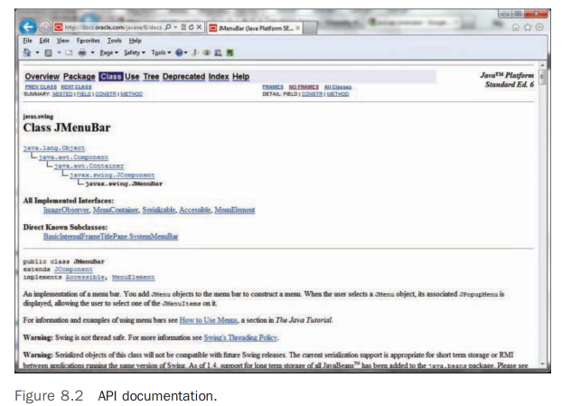
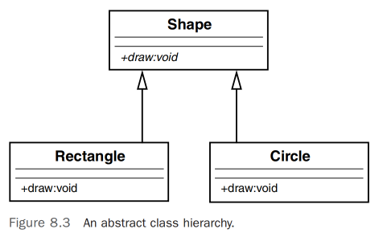
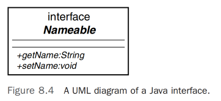
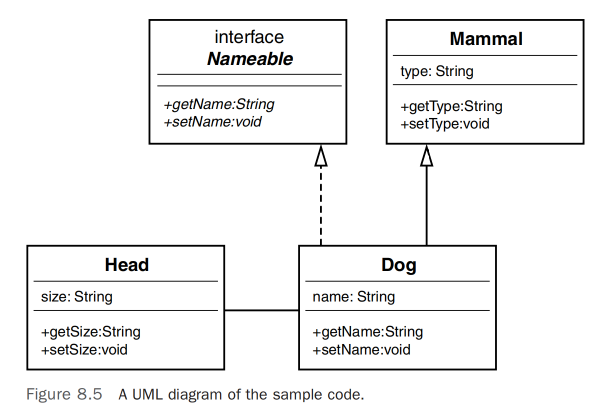

# 框架与重用 - 使用接口和抽象类进行设计     

## 引言     
第7章“掌握继承与组合” 解释了继承和组合在面向对象（OO）系统设计中的重要作用。 本章扩展了接口、协议和抽象类的概念。           

接口、协议和抽象类是代码重用的强大机制，称之为合约的概念提供了基础。本章讨论了代码重用、框架、合约、接口、协议和抽象类的主题（在本章余下内容中，除非另有说明，我使用术语接口来包含协议的概念）。在章节的最后，我们将通过一个实例来看看所有这些概念如何应用于实际情况。              

## 代码：重用还是不重用？       
程序员从编写第一行代码起就一直在处理代码重用的问题。许多软件开发范式都强调代码重用是过程的重要部分。自从计算机软件诞生以来，代码重用的概念已经被多次重新发明。面向对象范式也不例外。面向对象的支持者宣称的一个主要优势是，如果你第一次编写代码时就做得正确，你可以随心所欲地重用它。            

这只在一定程度上是正确的。就像所有设计方法一样，代码的实用性和可重用性取决于它的设计和实现的质量。面向对象设计并不专有代码重用的专利。没有什么能阻止任何人在非面向对象语言中编写非常健壮和可重用的代码。当然，无数使用结构化语言（如COBOL、C和传统的VB）编写的例程和函数质量很高，且相当可重用。            

因此，很明显，遵循面向对象范式并不是开发可重用代码的唯一方式。然而，面向对象方法确实提供了几种促进可重用代码开发的机制。创建可重用代码的一种方式是创建框架。在本章中，我们将重点使用接口和抽象类来创建框架并鼓励代码重用。          

## 什么是框架？ 
代码重用的概念与标准化的概念密切相关，这有时被称为即插即用。框架的理念围绕着即插即用和重用原则。桌面应用程序是框架的一个经典例子。以办公套件应用程序为例，我目前使用的文档编辑器有一个包含多个标签选项的功能区。这些选项与我同时打开的演示软件包和电子表格软件中的选项类似。事实上，前两个菜单项（主页、插入）在所有三个程序中都是相同的。不仅菜单选项相似，许多选项的外观也非常相似（新建、打开、保存等）。功能区下方是文档区域——无论是文档、演示文稿还是电子表格。共同的框架使得学习办公套件中的各种应用程序更加容易。它也通过允许最大限度地重用代码来简化开发人员的工作，更不用说我们还可以重用设计的部分。              

所有这些菜单栏具有相似的外观和感觉显然不是偶然的。事实上，当你在像微软Windows或Linux这样的特定平台上的集成开发环境中开发时，你会得到一些不需要自己创建的东西。当你在Windows环境中创建一个窗口时，你会得到主标题栏和右上角的文件关闭按钮等元素。操作也是标准化的——当你双击主标题栏时，屏幕总是最小化/最大化。当你点击右上角的关闭按钮时，应用程序总是终止。这都是框架的一部分。图8.1是一个文字处理器的截图。注意菜单栏、工具栏和其他属于框架的元素。         

一个文字处理框架通常包括创建文档、打开文档、保存文档、剪切文本、复制文本、粘贴文本、搜索文档等操作。为了使用这个框架，开发者必须使用预定的接口来创建应用程序。这个预定的接口符合标准框架，这有两个明显的优势。首先，正如我们已经看到的，外观和感觉是一致的，最终用户不必学习新的框架。其次，开发者可以利用已经编写和测试过的代码（测试问题是一个巨大的优势）。为什么要编写代码来创建一个全新的打开对话框，当一个已经存在并且经过彻底测试的对话框已经存在呢？在商业环境中，当时间至关重要时，人们不希望不得不学习新事物，除非这是绝对必要的。

>注意：`代码重用再访`, 在第7章中，我们讨论了代码重用，尤其是关于继承——基本上是一个类从另一个类继承。这一章是关于框架和重用整个或部分系统。一个明显的问题是：如果你需要一个对话框，你怎么使用框架提供的对话框呢？答案很简单：遵循框架提供的规则。而这些规则在哪里找呢？框架的规则可以在文档中找到。编写类、类库的人应该提供关于如何使用类、类库的公共接口的文档（至少我们希望如此）。在许多情况下，这采取的形式是应用程序编程接口（API）。           

例如，要在Java中创建菜单栏，你可以查看JMenuBar类的API文档，并了解它呈现的公共接口。图8.2展示了Java API的一部分。通过使用这些API，你可以创建一个有效的Java应用程序并遵守所需的标准。如果你遵循这些标准，你的应用程序将设置为在支持Java的浏览器中运行。       

        

## 什么是合约 
在本章的上下文中，我们将把“合约”视为任何要求开发者遵守API规范的机制。通常，API被称为框架。在线词典Merriam-Webster定义合约为“两个或更多个人或方之间的具有约束力的协议，特别是：具有法律效力的协议。”         

这正是开发者使用API时发生的情况——由项目经理、业务所有者或行业标准提供执行力。在使用合约时，开发者需要遵守框架中定义的规则。这包括方法名称、参数数量等问题（签名等）。简而言之，标准的创建是为了促进良好的开发实践。             

>注意：`术语合约`, 在包括软件开发在内的许多商业方面，合约这个术语被广泛使用。不要将这里介绍的概念与其他可能的软件设计概念混淆，这些概念也称为合约。     

执行非常重要，因为开发者总是有可能违反合约。没有执行力，一个行为不端的开发者可能决定重新发明轮子，编写自己的代码，而不是使用框架提供的规范。如果人们经常忽视或绕过标准，那么标准的好处就很小。在Java和.NET语言中，实现合约的两种方式是使用抽象类和接口。            

### 抽象类
`通过抽象类实现合约是一种方式`。抽象类是一种包含一个或多个没有提供实现的方法的类。假设你有一个名为Shape的抽象类。它之所以是抽象的，是因为你不能实例化它。如果你让某人画一个形状，这个人最有可能问你的第一件事是：“什么样的形状？”因此，形状的概念是抽象的。然而，如果有人让你画一个圆，这就不会带来同样的问题，因为圆是一个具体的概念。你知道圆长什么样。你也知道如何画其他形状，如矩形。         

这如何应用于合约？假设我们想创建一个绘制形状的应用程序。我们的目标是绘制我们当前设计中代表的每一种形状，以及以后可能添加的形状。我们必须遵守两个条件。          

首先，我们希望所有形状使用相同的语法来绘制自己。例如，我们希望系统中实现的每个形状都包含一个名为draw()的方法。因此，经验丰富的开发者隐含地知道，要绘制一个形状，无论形状是什么，你都调用draw()方法。理论上，这减少了翻阅手册的时间，并减少了语法错误。          

其次，记住每个类都必须对其行为负责是很重要的。因此，尽管一个类需要提供一个名为 draw() 的方法，该类必须提供自己的代码实现。例如，Circle 和 Rectangle 类都有一个 draw() 方法；然而，Circle 类显然有绘制圆形的代码，正如预期的那样，Rectangle 类有绘制矩形的代码。当我们最终创建名为 Circle 和 Rectangle 的类，这些作为 Shape 的子类的类必须实现它们自己版本的 draw() 方法（见图8.3）。                    

            

>注意：`抽象方法`, 在UML图中，请注意抽象方法是用斜体标记的。
通过这种方式，我们拥有一个真正多态的形状框架。draw()方法可以在系统中的每个形状上调用，每个形状的调用产生不同的结果。在Circle对象上调用draw()方法会绘制一个圆，而在Rectangle对象上调用draw()方法会绘制一个矩形。本质上，向一个对象发送消息会根据对象的不同而引发不同的响应。这就是多态的本质。               
```java
circle.draw(); // 绘制一个圆
rectangle.draw(); // 绘制一个矩形
```

让我们看一些代码，以说明Rectangle和Circle是如何符合Shape合约的。这是Shape类的代码：         
```java
public abstract class Shape {
 public abstract void draw(); // 没有实现
}
```         
请注意，该类没有为draw()提供任何实现；基本上没有代码，这就是使方法成为抽象的原因（提供任何代码将使方法具体化）。没有实现的原因有两个。首先，Shape不知道要绘制什么，所以即使我们想要，我们也无法实现draw()方法。         

>注意：`结构化类比`, 这是一个有趣的问题。如果我们确实希望Shape类包含所有可能形状（现在和将来）的代码，那么将需要条件语句，比如Java中的switch语句。这会非常混乱并且难以维护。这是对象导向设计强大之处的一个例子。            

其次，我们希望子类提供实现。让我们看看Circle和Rectangle类的代码：           
```java
public class Circle extends Shape {
 public void Draw() {System.out.println("Draw a Circle");};
}
public class Rectangle extends Shape {
 public void Draw() {System.out.println("Draw a Rectangle");};
}
```
请注意，Circle和Rectangle都扩展（即继承自）Shape。也请注意它们提供了实际的实现（在这个例子中，实现是微不足道的）。这里就是合约的应用之处。如果Circle继承自Shape并且未能提供draw()方法，Circle甚至无法编译。因此，Circle将无法满足与Shape的合约。项目经理可以要求编写应用程序中形状的程序员必须从Shape继承。通过这样做，应用程序中的所有形状都将拥有以预期方式执行的draw()方法。         

>注意：`Circle`, 如果Circle确实未实现draw()方法，Circle将被视为抽象类本身。因此，另一个子类必须从Circle继承并实现draw()方法。这个子类将成为Shape和Circle的具体实现。        

虽然抽象类的概念围绕抽象方法展开，但没有什么能阻止Shape提供一些实现。记住，抽象类的定义是它包含一个或多个抽象方法——这意味着抽象类也可以提供具体方法。例如，尽管Circle和Rectangle以不同的方式实现draw()方法，它们共享设置形状颜色的相同机制。因此，Shape类可以有一个颜色属性和一个设置颜色的方法。这个setColor()方法是一个具体的实现，将被Circle和Rectangle继承。子类必须实现的唯一方法是超类声明为抽象的方法。这些抽象方法就是合约。        

>请注意，在Shape、Circle和Rectangle的案例中，我们处理的是严格的继承关系，与我们在下一节中讨论的接口相对。Circle是Shape的一种，Rectangle也是Shape的一种。     
一些语言，如C++，仅使用抽象类来实现合约；然而，Java和.NET还有另一种实现合约的机制称为接口。在其他情况下，如Objective-C和Swift，语言不提供抽象类。因此，要在Objective-C或Swift中实现合约，你需要使用协议。

### 接口        
在定义接口之前，有趣的是要注意到C++没有被称为接口的结构。在使用C++时，你可以通过使用抽象类的语法子集本质上创建一个接口。例如，以下C++代码是一个抽象类。然而，因为类中唯一的方法是虚拟方法，没有实现。因此，这个抽象类提供与接口相同的功能。

```cpp
class Shape
{ 
 public: 
 virtual void draw() = 0; 
}
```

>注意：`接口术语`,这又是一个软件术语变得混乱的时刻——非常混乱。请注意，你可以以几种方式使用接口这个术语，因此请确保在适当的上下文中使用每个术语。        
首先，图形用户界面（GUI）在提到用户与之互动的视觉界面时被广泛使用——通常是在监视器上。       
其次，类的接口基本上是其方法的签名。            
第三，在Objective-C和Swift中，你将代码分解为称为接口和实现的物理独立模块。          
第四，接口和协议基本上是父类和子类之间的合约。          
你还能想到其他的吗？                

一个明显的问题是：如果抽象类可以提供与接口相同的功能，为什么Java和.NET还要提供称为接口的结构？以及为什么Objective-C和Swift提供协议？                

首先，C++ 支持多重继承，而 Java、Objective-C、Swift 和 .NET 则不支持。尽管 Java、Objective-C、Swift 和 .NET 的类只能从一个父类继承，但它们可以实现许多接口。使用多个抽象类构成多重继承；因此，Java 和 .NET 不能采用这种方式。简而言之，当使用接口时，你不必担心正式的继承结构——理论上你可以为任何类添加接口，如果设计合理的话。然而，抽象类要求你从那个抽象类继承，并且顺带继承其所有可能的父类。           

>由于这些考虑，接口常被认为是弥补缺乏多重继承的一种方法。技术上这并不完全正确。接口是一种独立的设计技术，虽然它们可以用来设计可以通过多重继承完成的应用程序，但它们并不替代或规避多重继承。                 

就像抽象类一样，接口是一种强有力的方式来强制实施框架的合约。在我们进入任何概念性定义之前，看看实际的接口UML图和相应的代码是有帮助的。考虑一个名为 Nameable 的接口，如图8.4所示。                

        

请注意，在UML图中，Nameable 被标识为一个接口，这与普通类（无论是否抽象）有所区别。还要注意，接口包含两个方法，getName() 和 setName()。以下是相应的代码：            
```java
public interface Nameable {
 String getName();
 void setName(String aName);
}
```
为了比较，这是对应的 Objective-C 协议的代码：           
```objective-c          
@protocol Nameable
@required
- (char *) getName;
- (void) setName: (char *) n;
@end // Nameable
```

在代码中，请注意 Nameable 没有被声明为一个类，而是作为一个接口。因此，两个方法，getName() 和 setName()，都被视为抽象的，并且没有提供实现。与抽象类不同，接口根本不能提供任何实现。结果是，任何实现接口的类都必须为所有方法提供实现。例如，在 Java 中，一个类从抽象类继承，而另一个类实现一个接口。          


        

>注意：`实现与定义继承`, 有时，继承被称为实现继承，而接口被称为定义继承。   

### 把一切联系起来      
`如果抽象类和接口都提供抽象方法，那么两者之间的真正区别是什么呢？正如我们之前所见，抽象类可以提供抽象方法和具体方法，而接口只提供抽象方法。为什么会有这样的区别呢`？     

假设我们想设计一个代表狗的类，并打算稍后添加更多哺乳动物。逻辑上的做法是创建一个名为Mammal的抽象类：            
```java
public abstract class Mammal {
 public void generateHeat() {System.out.println("Generate heat");}
 public abstract void makeNoise();
}
```
这个类有一个具体方法叫做generateHeat()和一个抽象方法叫做makeNoise()。generateHeat()方法是具体的，因为所有哺乳动物都会产生热量。makeNoise()方法是抽象的，因为每种哺乳动物发出的声音都不同。          

我们还将创建一个名为Head的类，用于构成组合关系：            
```java
public class Head {
 String size;
 public String getSize() {
 return size;
 }
 public void setSize(String aSize) { size = aSize; }
}
```     

Head有两个方法：getSize()和setSize()。尽管组合可能无法深刻解释抽象类和接口之间的区别，但在这个例子中使用组合确实说明了组合如何与抽象类和接口在面向对象系统的整体设计中相关联。我认为这很重要，因为这个例子更加完整。记住，`构建对象关系有两种方式：is-a关系，通过继承表示；has-a关系，通过组合表示。问题是：接口在哪里适用`？   

为了回答这个问题并把一切联系起来，让我们创建一个名为Dog的类，它是Mammal的子类，实现了Nameable，并拥有一个Head对象（见图8.5）。          
            

简而言之，Java和.NET通过三种方式构建对象：继承、接口和组合。                
请注意图8.5中表示接口的虚线。这个例子说明了你应该在何时使用这些结构。何时选择抽象类？何时选择接口？何时选择组合？让我们进一步探索。     

你应该熟悉以下概念：                
* Dog 是 Mammal，所以这种关系是继承。           
* Dog 实现了 Nameable，所以这种关系是接口。         
* Dog 拥有一个 Head，所以这种关系是组合。       

以下代码展示了如何在同一个类中结合使用抽象类和接口：            
```java
public class Dog extends Mammal implements Nameable {
 String name;
 Head head;
 public void makeNoise() {System.out.println("Bark");}
 public void setName(String aName) {name = aName;}
 public String getName() {return (name);}
}
```

在查看UML图之后，你可能会提出一个明显的问题：尽管从Dog 到 Nameable的虚线代表接口，这不仍然是继承吗？乍一看，答案并不简单。虽然接口可能被视为一种特殊类型的继承，但了解这个“特殊”意味着什么是非常重要的。理解这些特殊的差异是理解坚固的面向对象设计的关键。                

虽然继承是一个严格的是一个（is-a）关系，接口并非完全如此。例如：            
* 一只狗是哺乳动物。        
* 一只爬行动物不是哺乳动物。                    

因此，Reptile 类不能从 Mammal 类继承。然而，接口超越了各种类。例如：       
* 一只狗是可命名的。            
* 一只蜥蜴是可命名的。      

`这里的关键是，在严格继承关系中的类必须是相关的。例如，在这个设计中，Dog类与Mammal类直接相关。一只狗是哺乳动物。狗和蜥蜴在哺乳动物层面上并不相关，因为你不能说蜥蜴是哺乳动物。然而，接口可以用于不相关的类。你可以给狗取名，同样也可以给蜥蜴取名。这是使用抽象类和使用接口之间的关键区别`。               

抽象类代表某种实现。事实上，我们看到Mammal提供了一个具体方法叫做generateHeat()。尽管我们不知道我们有什么样的哺乳动物，但我们知道所有哺乳动物都会产生热量。然而，接口只模拟行为。接口从不提供任何类型的实现，只有行为。接口指定的行为在可能没有任何联系的类中是相同的。不仅狗是可命名的，汽车、行星等也是如此。       

有人说接口是多重继承的不完全替代品。虽然接口可能是Java设计的一部分，该设计消除了多重继承（并被许多其他语言采用），但接口在与继承不同的设计情况下使用，正如Nameable的例子所示。      

### 编译器证明          
我们能证明或反驳接口有一个真正的是一个（is-a）关系吗？在Java的情况下（这也可以在C#或VB中完成），我们可以让编译器告诉我们。考虑以下代码：            
```java
Dog D = new Dog();  
Head H = D;
```
当这段代码通过编译器运行时，会产生以下错误：                
Test.java:6: 标识符的不兼容类型。无法将Dog转换为Head。Head H = D;                
           
显然，狗不是头。不仅我们知道这一点，编译器也同意。然而，如预期的那样，以下代码可以正常工作：                    
```java
Dog D = new Dog();
Mammal M = D;
```
这是一个真正的继承关系，编译器可以清楚地解析这段代码，因为狗是哺乳动物。                

现在我们可以进行接口的真正测试。接口是否是一个实际的是一个（is-a）关系？编译器认为是：          
```java
Dog D = new Dog();
Nameable N = D;
```
这段代码工作正常。因此，我们可以安全地说，狗是一个可命名的实体。这是一个简单但有效的证明，表明继承和接口都构成一个是一个（is-a）关系。接口关系更像是在适当使用时的“行为像一个（behaves-like-a）”。你可能有数据接口是“是一个（is-a）”，但更常见的是前者。            

>注意：`Nameable接口`, 接口指定某种行为，但不指定实现。通过实现Nameable接口，你表明你将通过实现名为getName()和setName()的方法提供可命名的行为。如何实现这些方法取决于你。你所要做的就是提供这些方法。           

### 制定合约
定义合约的简单规则是通过抽象类或接口提供一个未实现的方法。因此，当子类设计为遵守合约时，它必须为父类或接口中未实现的方法提供实现。          

如前所述，合约的一个优势是标准化编码规范。让我们通过提供一个编码标准未被使用时会发生什么的例子，更详细地探索这个概念。在这个例子中，有三个类：Planet、Car和Dog。每个类都实现了命名实体的代码。然而，由于它们都是单独实现的，每个类检索名称的语法都不同。考虑Planet类的以下代码：                
```java
public class Planet {
 String planetName;
 public void getPlanetName() {return planetName;};
}
```     

同样，Car类可能有如下代码：     
```java
public class Car {
 String carName;
 public String getCarName() { return carName; };
}
```

而Dog类的代码可能是这样的：     
```java
public class Dog {
 String dogName;
 public String getDogName() { return dogName; };
}
```

这里明显的问题是，任何使用这些类的人都必须查看文档（多么可怕的想法！）来了解如何在每种情况下检索名称。尽管查看文档不是世界上最糟糕的命运，但如果项目（或公司）中使用的所有类都使用相同的命名约定，那将会使生活更加轻松。这就是Nameable接口的用武之地。          

这个想法是为任何需要使用名称的类型的类制定一个合约。随着各种类的用户从一个类移动到另一个类，他们不必弄清楚当前命名对象的语法。Planet类、Car类和Dog类都将拥有相同的命名语法。                

为了实现这个崇高的目标，我们可以创建一个接口（我们可以使用之前用过的Nameable接口）。约定是所有类都必须实现Nameable。这样，用户在涉及命名约定时只需要记住一个接口即可：          
```java
public interface Nameable {
 public String getName();
 public void setName(String aName);
}
```

新的类，Planet、Car和Dog，应该看起来是这样的：      
```java
public class Planet implements Nameable {
 String planetName;
 public String getName() {return planetName;}
 public void setName(String myName) { planetName = myName; }
}
```

