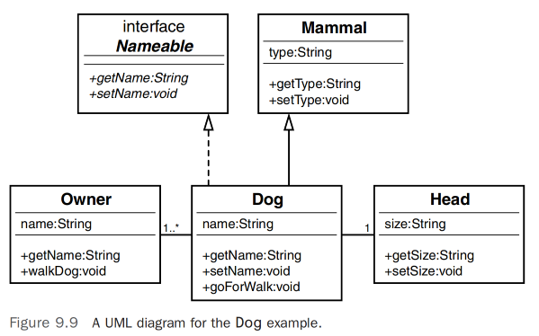

# 构建对象和面向对象设计        

## 引言 
前两章涵盖了继承和组合的主题。在第7章“掌握继承和组合”中，我们学习了继承和组合是构建对象的主要方式。在第8章“框架与重用：用接口和抽象类设计”中，我们学习了继承的不同程度以及继承、接口、抽象类和组合是如何结合在一起的。          

本章涉及对象在整体设计中是如何相互关联的问题。你可能会说这个话题已经被介绍过了，你说得对。继承和组合都代表了对象相互作用的方式。然而，继承和组合在构建对象的方式上有一个显著的区别。当使用继承时，最终结果至少在概念上是一个融合了继承层次中所有行为和属性的单一类。当使用组合时，一个或多个类被用来构建另一个类。              

尽管确实继承是两个类之间的关系，但实际发生的是创建了一个包含子类属性和方法的父类。让我们回顾一下Person和Employee类的例子（见图9.1）。           

虽然这里确实有两个分别设计的类，但关系不仅仅是互动——它是继承。基本上，一个员工是一个人。一个Employee对象不会向一个Person对象发送消息。一个Employee对象确实需要一个Person对象的服务。这是因为一个Employee对象就是一个Person对象。            

然而，组合是一个不同的情况。组合代表了不同对象之间的互动。因此，虽然第8章主要涵盖了继承的不同形式，本章则深入探讨了组合的各种形式以及对象之间是如何互动的。         

    

## 组合关系 
我们已经看到，组合代表了整体的一部分。虽然继承关系以“是一个”（is-a）来表述，组合则以“拥有一个”（has-a）来表述。我们直观地知道，一辆车“拥有一个”方向盘（见图9.2）。          

>注意：`是一个（Is-a）和拥有一个（Has-a）`, 请原谅我的语法：为了保持一致性，我将坚持使用“拥有一个引擎”，尽管“拥有一个引擎”在语法上是正确的。我这样做是因为我想简单地将规则表述为“是一个”和“拥有一个”。          

使用组合的理由是，它通过组合较不复杂的部分来构建系统。这是人们处理问题的常见方式。研究表明，即使是我们中最优秀的人，在同一时间也最多只能在短期记忆中保留七块数据。因此，我们喜欢使用抽象概念。我们不是说我们有一个带有方向盘、四个轮胎、一个引擎等的大单元，而是说我们有一辆车。这使得我们更容易进行沟通，并在我们的头脑中保持清晰。        

        

组合还以其他方式有所帮助，例如使部件可互换。如果所有方向盘都是相同的，那么安装在特定汽车中的具体哪个方向盘并不重要。在软件开发中，可互换的部件意味着可重用。        

在他们的书《Java中的面向对象设计》的第7章和第8章中，Stephen Gilbert和Bill McCarty展示了许多关于关联和组合的例子，并对这些内容进行了更详细的介绍。我强烈推荐参考这些材料，以更深入地了解这些主题。在这里，我们讨论了这些概念的一些更基本的点，并探讨了他们例子的一些变体。       

## 分阶段构建
`使用组合的另一个主要优势是系统和子系统可以独立构建，更重要的是，可以独立测试和维护`。          

毫无疑问，软件系统非常复杂。`为了构建高质量的软件，你必须遵循一个至关重要的规则才能成功：尽可能保持简单`。为了使大型软件系统能够正常工作并易于维护，必须将它们分解成更小、更易于管理的部分。你如何实现这一点？在1962年发表的一篇名为《复杂性的架构》的文章中，诺贝尔奖得主赫伯特·西蒙提到了关于稳定系统的以下想法：         

- “稳定的复杂系统通常采取层次结构的形式，每个系统都是由更简单的子系统构建的，每个子系统又是由更简单的子系统构建的。” ——你可能已经熟悉这一原则，因为它构成了过程软件开发背后的功能分解方法的基础。在面向对象设计中，你应用相同的原则到组合——从简单的部件构建复杂的对象。     

- “稳定、复杂的系统几乎可以分解。” ——这意味着你可以识别构成系统的部分，并能区分部件之间的互动和部件内部的互动。稳定系统的部件之间的联系比它们内部的联系少。因此，一个模块化的立体声系统，其扬声器、唱盘和放大器之间的连接简单，天生比一个不易分解的集成系统更稳定。         

- “稳定的复杂系统几乎总是由少数几种不同类型的子系统组成，这些子系统以不同的组合方式排列。” ——这些子系统反过来通常由少数几种不同类型的部件组成。     

- “有效的稳定系统几乎总是从有效的简单系统演变而来。” ——与其从头开始构建一个新系统——重新发明轮子——不如在之前证明过的设计基础上构建新系统。           

在我们的立体声例子中（见图9.3），假设立体声系统是完全集成的，不是由组件构建的（也就是说，立体声系统是一个大的黑盒系统）。在这种情况下，如果CD播放器坏了变得无法使用会怎样呢？你将不得不把整个系统送去修理。这不仅会更复杂、更昂贵，而且你将无法使用任何其他组件。       

        

这个概念对于Java以及.NET框架中包含的语言非常重要。因为对象是动态加载的，解耦设计非常重要。例如，如果你分发一个Java应用程序，而其中一个类文件需要重新创建（用于错误修复或维护），你只需要重新分发那个特定的类文件。如果所有代码都在一个文件中，整个应用程序将需要重新分发。              

假设系统被分解成多个组件而不是单一单位。在这种情况下，如果CD播放器坏了，你可以断开CD播放器并将其拿去修理。（注意所有组件都通过连接线相连。）这将会更简单、更便宜，并且比处理一个单一的集成单元需要的时间更少。作为额外的好处，你仍然可以使用系统的其余部分。你甚至可以购买另一台CD播放器，因为它是一个组件。然后修理工可以将你坏的CD播放器插入他的修理系统中进行测试和修理。总之，组件方法运作得非常好。组合是你作为软件设计师用来对抗软件复杂性的主要策略之一。            

使用组件的一个主要优势是你可以使用由组织内的其他开发人员或甚至第三方供应商构建的组件。然而，使用来自另一个来源的软件组件需要一定程度的信任。第三方组件必须来自可靠的来源，并且你必须确信软件经过适当测试，更不用说它必须正确执行广告中的功能。仍有许多人宁愿自己构建也不信任别人构建的组件。            

## 组合的类型
`通常，组合有两种类型：关联和聚合`。在这两种情况下，这些关系代表了对象之间的合作。我们刚刚用来解释组合的主要优势的立体声例子代表了一种关联。            

>注意：`组合是一种关联形式吗？`, 组合是面向对象技术中的另一个领域，存在哪个先有，鸡还是蛋的问题。一些文本说组合是一种关联形式，而一些则说关联是一种组合形式。无论如何，在这本书中，我们认为继承和组合是构建类的两种主要方式。因此，在这本书中，关联被认为是一种组合形式。       

所有形式的组合都包括一个“有一个”关系。然而，基于你如何看待整体的部分，关联和聚合之间存在微妙的差异。在一个聚合中，你通常只看到整体，在关联中，你通常看到构成整体的部分。            

### 聚合
也许最直观的组合形式是聚合。聚合意味着一个复杂的对象由其他对象组成。电视机是一个整洁、干净的包装，你用它来娱乐。当你看着你的高清电视时，你看到的是一个单一单位。大多数时候，你不会停下来思考高清电视包含一些微芯片、一个屏幕、一个调谐器等事实。当然，你看到一个开关来打开和关闭电视机，你当然看到画面屏幕。然而，这不是人们通常对高清电视的看法。当你走进家电店时，销售人员不会说，“让我给你看看这些微芯片、画面屏幕、调谐器等的聚合体。”销售人员会说，“让我给你看看这台高清电视。”            

同样，当你去买车时，你不会挑选车辆的所有单独组件。你不会决定买哪种火花塞或哪种车门把手。你是去买一辆车。当然，你确实会选择一些选项，但大部分情况下，你选择的是整车，这是由许多其他复杂和简单的对象组成的复杂对象（见图9.4）。       

        

### 关联
虽然聚合代表的是你通常只看到整体的关系，关联则同时呈现整体和部分。正如立体声示例中所述，各种组件是单独呈现的，并通过使用补丁线（连接各种组件的线）与整体连接。      

考虑传统桌面计算机系统作为一个例子（见图9.5）；整体是计算机系统。组件包括显示器、键盘、鼠标和主机箱。每一个都是一个单独的对象，但它们一起代表了计算机系统的整体。主计算机使用键盘、鼠标和显示器来委派部分工作。换句话说，计算机主机需要鼠标的服务，但自身没有提供这种服务的能力。因此，计算机主机通过特定的端口和连接鼠标到主机的电缆，从一个独立的鼠标请求服务。           

>注意：`聚合与关联`,聚合是由其他对象组成的复杂对象。当一个对象需要另一个对象为其提供服务时，会使用关联。        

### 同时使用聚合和关联      
你可能已经注意到，在所有例子中，什么是关联和什么是聚合的界线往往是模糊的。可以说，你许多最有趣的设计决策将归结为是使用关联还是聚合。            
例如，用来描述关联的桌面计算机系统的例子也包含了一些聚合。尽管计算机主机、显示器、键盘和鼠标之间的互动是关联，但计算机主机本身代表了聚合。你只看到计算机主机，但它实际上是由其他对象组成的复杂系统，包括芯片、主板、显卡等。        

考虑到一个员工对象可能由一个地址对象和一个配偶对象组成。你可能会认为地址对象是聚合（基本上是员工对象的一部分），而配偶对象是关联。例如，假设员工和配偶都是员工。如果员工被解雇，配偶仍在系统中，但关联被打破。      

同样，在立体声示例中，接收器与扬声器以及CD之间存在关联。然而，扬声器和CD本身是其他对象的聚合，如电源线。            

在汽车示例中，尽管引擎、火花塞和车门代表了组成，但立体声也代表了一种关联关系。实际上，汽车和桌面计算机是聚合和关联的混合。          

>注意：`没有唯一正确的答案`, 像往常一样，当涉及到做设计决策时，并没有一个单一的、绝对正确的答案。设计不是一门精确科学。虽然我们可以制定一些通用规则，但这些规则并不是一成不变的。           

## 避免依赖
在使用组合时，避免使对象高度依赖彼此是可取的。`让对象彼此高度依赖的一种方式是混合领域`。在最理想的情况下，一个领域中的对象不应与另一个领域中的对象混合，除非在某些特定情况下。我们可以再次回到立体声示例来解释这个概念。         

通过将所有组件保持在独立的领域中，立体声系统更易于维护。例如，如果CD组件坏了，你可以单独送CD播放器去修理。在这种情况下，CD播放器和MP3播放器属于不同的领域。这提供了灵活性，比如可以从不同的制造商购买CD播放器和MP3播放器。所以，如果你决定用另一个品牌的CD播放器替换现有的CD播放器，你可以这么做。          

有时在领域间混合使用会带来一定的便利。关于这一点，我多年来一直在使用的一个好例子是老式的电视/录像机组合。诚然，将两者集成在同一个模块中很方便。然而，如果电视机坏了，录像机也无法使用——至少作为购买的单元的一部分是无法使用的。         

你需要确定在特定情况下哪个更重要：是想要便利还是稳定性。没有正确的答案。这完全取决于应用程序和环境。在电视/录像机组合的情况下，我们认为集成单元的便利性远远超过了单元稳定性降低的风险（见图9.6）。回顾图9.3中的立体声系统，以加强对非集成系统的理解。       

        

接口解决了这个问题，并且管理依赖关系是其主要部分。如果接口在共享库中定义，而实现在更具体的类中定义，那么你可以通过使用行为契约来混合领域。          

>注意：`混合领域`,混合领域的便利性是一个设计决策。如果拥有电视/录像机组合的优势超过了单个组件的风险和潜在停机时间，那么混合领域可能是首选的设计选择。       

## 基数
在他们的书《Java中的面向对象设计》中，Gilbert和McCarty将基数描述为参与关联的对象数量以及参与是否是可选的或者是强制的。为了确定基数，Gilbert和McCarty提出以下问题：      
- 哪些对象与哪些其他对象合作？      
- 每次合作中有多少对象参与？            
- 合作是可选的还是强制的？          

例如，让我们考虑以下示例。我们正在创建一个继承自Person的Employee类，它与以下类有关系：          
- Division（部门）          
- JobDescription（职位描述）        
- Spouse（配偶）        
- Child（子女）     

这些类都做什么？它们是可选的吗？一个员工需要多少个？               

- Division（部门）      
  - 此对象包含与员工所在部门相关的信息。            
  - 每个员工必须属于一个部门，因此这种关系是强制的。            
  - 员工只属于一个部门。            

- JobDescription（职位描述）            
  - 此对象包含职位描述，很可能包含诸如薪资等级和薪资范围等信息。            
  - 每个员工必须有一个职位描述，因此这种关系是强制的。          

- Spouse (配偶) 
  - 在这个简化的示例中，Spouse类仅包含了结婚周年纪念日的日期。      
  - 一个员工可以已婚或未婚。因此，配偶是可选的。        
  - 一个员工只能有一个配偶。        

- Child (子女)          
  - 在这个简单的示例中，Child类仅包含了一个名为FavoriteToy的字符串。        
  - 一个员工可以有子女或者没有子女。        
  - 一个员工可以没有子女，也可以有无限多个子女（哇！）。你可以就系统能处理的子女数量上限做出设计决策。          

总之，表格9.1表示了我们刚才考虑的类的关联的基数。       
表格9.1 类关联的基数
可选/关联 必填
Employee/Division           1           必填
Employee/JobDescription     1 . . n     必填
Employee/Spouse             0 . . 1     可选
Employee/Child              0 . . n     可选

>注意：`基数符号`, 0 . . 1 的符号意味着一个员工可以有零个或一个配偶。0 . . n 的符号意味着一个员工可以有从零到无限多个子女。 n 基本上代表无穷大。        

图9.7显示了该系统的类图。请注意，在这个类图中，基数是沿着关联线指示的。请参考表9.1，看看关联是否是强制性的。        

        

### 多个对象关联 
多对象关联如何表示代码中可能包含多个对象（如0到多个子对象）的关联？以下是 Employee.class 的代码：       
```java
import java.util.Date;
public class Employee extends Person{
 private String CompanyID;
 private String Title;
 private Date StartDate;
 private Spouse spouse;
 private Child[] child;
 private Division division;
 private JobDescription[] jobDescriptions;
 public String getCompanyID() {return CompanyID;}
 public String getTitle() {return Title;}
 public Date getStartDate() {return StartDate;}
 public void setCompanyID(String CompanyID) {}
 public void setTitle(String Title) {}
 public void setStartDate(int StartDate) {}
}
```     

请注意，具有一对多关系的类在代码中表示为数组：      
```java
private Child[] child;
private JobDescription[] jobDescriptions;
```

### 可选关联
在处理关联时最重要的问题之一是确保您的应用程序设计能够检查可选关联。这意味着您的代码必须检查关联是否为null。            

假设在前面的示例中，您的代码假定每个员工都有配偶。然而，如果有一个员工未婚，代码将出现问题。如果您的代码确实期望存在配偶，则可能会失败，并使系统处于不稳定状态。最重要的是，代码必须检查是否为null，并将其处理为有效条件。          

        

例如，如果不存在配偶，代码就不应尝试调用配偶的行为。这可能导致应用程序失败。因此，代码必须能够处理没有配偶的 Employee 对象。        

## 将所有内容联系起来：一个示例     
让我们来看一个简单的示例，将继承、接口、组合、关联和聚合的概念整合到一个简短的系统图中。             

考虑在第8章中使用的示例，再加上一个细节：我们将添加一个 Owner 类，该类将带狗出去散步。      

回顾一下，Dog 类直接继承自 Mammal 类。在图9.9中，实线箭头表示 Dog 类与 Mammal 类之间的关系。Nameable 类是一个接口，Dog 实现了该接口，由从 Dog 类到 Nameable 接口的虚线箭头表示。        

            

在本章中，`我们主要关注的是关联和聚合`。Dog 类和 Head 类之间的关系被视为聚合，因为头部实际上是狗的一部分。连接两个类图的线上的基数指定了一只狗只能有一个头。          

`Dog 类和 Owner 类之间的关系是关联`。明显，主人不是狗的一部分，反之亦然，因此我们可以安全地排除聚合。然而，狗确实需要主人提供服务——带它出去散步。连接 Dog 类和 Owner 类的线上的基数指定了一只狗可以有一个或多个主人（例如，夫妻双方都可以被认为是主人，共同负责遛狗）。             

这些关系——继承、接口、组合、关联和聚合——代表了在设计面向对象系统时会遇到的大部分设计工作。          

>注意：`头在哪里？`,你可能会决定将 Head 类附加到 Mammal 类而不是 Dog 类，因为所有哺乳动物据说都有头。对于这个模型，我将 Dog 类作为示例的焦点，所以我将 Head 附加到了 Dog 本身。         

## 结论 
在本章中，我们探讨了组合及其两种主要类型——聚合和关联——的一些细微之处。而继承代表了已经存在的新对象，组合则代表了各种对象之间的交互。            

过去的三章介绍了继承和组合的基础知识。通过运用这些概念和你在软件开发过程中的技能，你将能够设计出稳固的类和对象模型。第十章，“设计模式”，探讨了如何使用 UML 类图来辅助对象模型的建模。               

refer   
1.The Object-Priented Thought Process Fifth Edition     