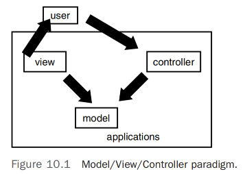
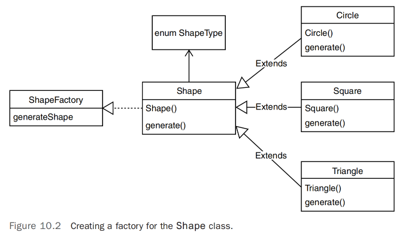

# 设计模式

## 引言     
软件开发中的一个有趣之处在于，当你创建一个软件系统时，实际上是在对现实世界的系统进行建模。例如，在信息技术行业，可以说IT即是业务，或者至少IT实现了业务。为了编写业务软件系统，开发人员必须彻底理解业务模型。因此，开发人员通常对公司的业务流程有最深入的了解。          

我们在本书中多次看到这个概念，因为它与我们的教育讨论相关。例如，当我们讨论使用继承来抽象出哺乳动物的行为和属性时，模型是基于真实的现实生活模型，而不是我们为了自己的目的而创造的虚构模型。          

因此，当我们创建一个哺乳动物类时，我们可以用它来构建无数其他类，如狗、猫等，因为所有哺乳动物都共享某些行为和属性。当我们研究狗、猫、松鼠和其他哺乳动物时，这种方法是有效的，因为我们可以看到模式。这些模式使我们能够检查动物并确定它确实是哺乳动物，或者也许是爬行动物，其行为和属性具有其他模式。          

在历史上，人类在生活的许多方面都使用模式，包括工程领域。这些模式与软件开发的圣杯——软件重用——密切相关。在这一章中，我们考虑设计模式，这是软件开发中一个相对较新的领域（关于设计模式的开创性著作出版于1995年）。          

设计模式或许是过去几年中从面向对象运动中产生的最有影响力的发展之一。模式非常适合可重用软件开发的概念。因为面向对象开发都是关于重用的，模式和面向对象开发是一脉相承的。          

设计模式的基本概念围绕着最佳实践的原则。通过最佳实践，我们指的是当好的和高效的解决方案被创造出来时，这些解决方案以一种可以让其他人从先前的成功中受益的方式进行文档记录——同时也可以从失败中学习。            

《设计模式：可复用面向对象软件的基础》是关于面向对象软件开发的最重要的书籍之一，作者是Erich Gamma、Richard Helm、Ralph Johnson和John Vlissides。这本书是软件行业的一个重要里程碑，并已经深入到计算机科学的词汇中，以至于这本书的作者们被称为“四人帮”。在有关面向对象主题的文献中，你经常会看到“四人帮”被称为GoF。           

本章的目的是解释什么是设计模式。（解释每种设计模式远远超出了本书的范围，需要多卷才能完成。）为了实现这一目的，我们将探讨“四人帮”定义的三类设计模式（创建型、结构型和行为型），并且提供每个类别中一个模式的具体示例。            

## 为什么需要设计模式？
设计模式的概念并不一定始于可复用软件的需求。事实上，设计模式的重要工作是关于建筑和城市的构造。正如Christopher Alexander在《模式语言：城镇、建筑、建造》中所指出的，“每个模式描述了在我们的环境中一再发生的问题，然后描述了解决该问题的核心，这样你就可以无数次地使用这个解决方案，而不必两次以相同的方式做相同的事情。”         

### 设计模式的四个要素：        
- 模式名称是我们用来描述设计问题、其解决方案以及结果的把手，可以用一两个词。命名模式立即增加了我们的设计词汇量。它让我们能够以更高的抽象水平进行设计。拥有模式词汇让我们能够与同事交流，在文档中描述它们，甚至与自己交流。它使得思考设计及其权衡变得更容易。找到好的名称是我们目录开发中最困难的部分之一。          

- 问题描述了何时应用该模式。它解释了问题及其内容。它可能描述了特定的设计问题，例如如何将算法表示为对象。它可能描述了类或对象结构，这些结构是一种不灵活设计的症状。有时问题会包括在应用该模式前必须满足的条件列表。          

- 解决方案描述了构成设计的元素、它们之间的关系、责任和协作。解决方案不描述特定的具体设计或实现，因为模式就像一个模板，可以应用于许多情况。相反，该模式提供了对设计问题的抽象描述，以及一个一般元素（在我们的情况下是类和对象）的排列方式如何解决它。            

- 结果是应用该模式的结果和权衡。虽然结果经常没有被明确表达，但当我们描述设计决策时，它们对于评估设计替代方案和理解应用模式的成本和收益至关重要。对于软件而言，结果通常涉及空间和时间的权衡。它们可能也涉及语言和实现问题。因为复用通常是面向对象设计的一个因素，模式的结果包括其对系统的灵活性、可扩展性或可移植性的影响。明确列出结果有助于您理解和评估它们。          

## Smalltalk的模型/视图/控制器  
为了历史视角，我们需要考虑Smalltalk中引入的模型/视图/控制器（MVC）（以及在其他面向对象语言中使用）。MVC经常被用来说明设计模式的起源。模型/视图/控制器范式被用于创建Smalltalk中的用户界面。Smalltalk可能是第一个流行的面向对象语言。     

>注意：`Smalltalk`, Smalltalk是来自Xerox PARC的几个伟大思想的产物。这些思想包括鼠标和使用窗口环境等。Smalltalk是一种很棒的语言，为随后的所有面向对象语言提供了基础。有关C++的一个抱怨是它并不真正是面向对象的，而Smalltalk是。尽管C++在OO的早期拥有更大的追随者群体，但Smalltalk始终拥有一群非常忠实的核心支持者。Java是一个主要是面向对象的语言，吸引了C++开发者群体。             

《设计模式》将MVC组件定义如下：         
- 模型是应用程序对象，
- 视图是屏幕显示，
- 控制器定义了用户界面对用户输入的反应。             

以前的范例的问题在于，模型、视图和控制器过去常常被合并到单个实体中。例如，一个单一的对象会包含这三个组件中的所有内容。使用MVC范式，这三个组件有了单独且明确的接口。因此，如果您想要更改应用程序的用户界面，您只需更改视图。图10.1说明了MVC设计的外观。  

        

请记住，我们所学习的大部分关于面向对象开发的内容都涉及到接口与实现之间的关系。尽可能地，我们希望将接口与实现分离开来。我们也希望尽可能地将接口与接口分离开来。例如，我们不希望将多个没有任何关联（或与手头问题的解决方案无关）的接口合并在一起。MVC是在这种接口分离方面的早期先驱之一。MVC明确定义了特定组件之间的接口，涉及一个非常常见且基本的编程问题——用户界面的创建以及它们与背后的业务逻辑和数据的连接。          

如果您遵循MVC的概念，将用户界面、业务逻辑和数据分开，那么您的系统将会更加灵活和健壮。例如，假设用户界面在客户端机器上，业务逻辑在应用程序服务器上，数据位于数据服务器上。以这种方式开发您的应用程序将允许您在不影响业务逻辑或数据的情况下更改GUI的外观。同样，如果您的业务逻辑发生变化，并且您以不同的方式计算特定字段，您可以在不必更改GUI的情况下更改业务逻辑。最后，如果您想要交换数据库并以不同的方式存储数据，您可以更改数据服务器上数据的存储方式，而不会影响GUI或业务逻辑。当然，这前提是三者之间的接口不会发生变化。            

>MVC示例,一个例子是用户界面中使用的列表框。考虑一个包含电话号码列表的GUI。列表框是视图，电话列表是模型，控制器是将列表框与电话列表绑定的逻辑。      

>MVC的缺点,虽然MVC是一个很好的设计，但它可能会有些复杂，因为必须对最初的设计进行大量关注。这是一般面向对象设计的问题——在良好设计与繁琐设计之间存在一条细微的界限。问题在于：在完整设计方面，您应该将多少复杂性构建到系统中？            

## 设计模式的类型   
设计模式包括23种模式，分为以下三类。大多数示例都是用C++编写的，其中一些是用Smalltalk编写的。书籍的出版时间表明了对C++和Smalltalk的使用。1995年的出版日期正值互联网革命和相应的Java编程语言的普及之时。在设计模式的好处显现后，许多其他书籍迅速填补了这个新兴市场。          

无论如何，实际使用的语言是无关紧要的。设计模式本质上是一本设计书，这些模式可以在任意数量的语言中实现。书籍的作者将模式分为三类：            
- 创建型模式为您创建对象，而不是直接实例化对象。这使得您的程序在决定为特定情况创建哪些对象时更加灵活。          
- 结构型模式帮助您将一组对象组合成更大的结构，例如复杂的用户界面或会计数据。            
- 行为模式帮助您定义系统中对象之间的通信方式，以及在复杂程序中控制流程的方式。      

以下各节讨论了每个类别中的一个示例，以展示设计模式的风格。要获取每个设计模式的全面列表和描述，请参阅本章末尾列出的书籍。        

### 创建型模式
创建型模式包括以下几个类别：        
* 抽象工厂      
* 建造者       
* 工厂方法     
* 原型     
* 单例

正如前面所述，本章的范围是描述设计模式是什么——而不是描述GoF书中的每个模式。因此，我们将涵盖每个类别中的一个模式。考虑到这一点，让我们来看一个创建型模式的例子，看看工厂模式。       

### 工厂方法设计模式    
创建或实例化对象可能是面向对象编程中最基本的概念之一。毫无疑问，如果对象不存在，就无法使用对象。在编写代码时，实例化对象最直观的方式是使用new关键字。       

为了说明这一点，让我们重新审视本书中一直使用的Shape示例。这里有一个熟悉的父类Shape，它是抽象的，以及一个子类Circle，它是具体实现。我们以通常的方式使用new关键字实例化Circle类：     
```java
abstract class Shape {
}
class Circle extends Shape {
}
Circle circle = new Circle();
```

尽管这段代码肯定可以工作，但在您的代码中可能还有许多其他地方需要实例化Circle，或者其他形状。在许多情况下，您将具有需要在每次创建形状时处理的特定对象创建参数。      

因此，任何时候您更改对象创建方式，代码必须在每个实例化 Shape 对象的位置进行更改。代码高度耦合，因为一个位置的更改需要在可能的许多其他位置进行代码更改。使用此方法的另一个问题是，它将对象创建逻辑暴露给了使用类的程序员。为了解决这些问题，我们可以实现一个工厂方法。简而言之，工厂方法负责封装所有实例化，使其在整个实现中保持统一。您使用工厂来实例化对象，而工厂负责适当地实例化。           

### 工厂方法模式      
工厂方法模式的基本意图是在不必指定确切类的情况下创建对象——实际上，使用接口来创建新类型的对象。          
为了说明如何实现工厂模式，让我们为Shape类示例创建一个工厂。图10.2中的类图有助于可视化示例中各个类之间的交互。       

        

在某种程度上，你可以把工厂看作是一个封装器。考虑到实例化对象可能涉及到一些重要的逻辑，而你不希望程序员（用户）去关心这些逻辑。这几乎就像访问器方法（获取器和设置器），当值的检索涉及到某些逻辑时（比如需要密码时）。使用工厂方法在你事先不知道需要哪个特定类的情况下是很有用的。例如，你可能知道需要一个形状，但你还不知道具体的形状（至少目前不知道）。有鉴于此，所有可能的类必须在同一个层次结构中；也就是说，这个例子中的所有类都必须是 Shape 的子类。实际上，工厂的使用正是因为你不知道你需要什么，这样你就可以在以后添加一些类。如果你知道你需要什么，你可以简单地通过构造函数或设置器方法来“注入”实例。       

基本上，这就是多态的定义。      

我们创建一个枚举来包含形状的类型。在这种情况下，我们将定义CIRCLE、SQUARE和TRIANGLE。            
```java
enum ShapeType {
 CIRCLE, SQUARE, TRIANGLE
}
```

我们将 Shape 类定义为抽象类，只包含一个构造函数和一个名为 generate() 的抽象方法。   
```java
abstract class Shape {
    private ShapeType sType = null;
    
    public Shape(ShapeType sType) {
        this.sType = sType;
    }
    
    // Generate the shape
    protected abstract void generate();
}
```

子类 CIRCLE、SQUARE 和 TRIANGLE 继承自 Shape 类，标识自身并提供 generate() 方法的具体实现。         
```java
class Circle extends Shape {
    Circle() {
        super(ShapeType.CIRCLE);
        generate();
    }

    @Override
    protected void generate() {
        System.out.println("Generating a Circle");
    }
}

class Square extends Shape {
    Square() {
        super(ShapeType.SQUARE);
        generate();
    }

    @Override
    protected void generate() {
        System.out.println("Generating a Square");
    }
}

class Triangle extends Shape {
    Triangle() {
        super(ShapeType.TRIANGLE);
        generate();
    }

    @Override
    protected void generate() {
        System.out.println("Generating a Triangle");
    }
}
```

ShapeFactory 类，顾名思义，是实际的工厂。重点关注 generate() 方法。虽然工厂提供了许多优势，但注意 generate() 方法是应用程序中唯一实例化 Shape 对象的位置。                
```java
class ShapeFactory {
    public static Shape generateShape(ShapeType sType) {
        Shape shape = null;
        switch (sType) {
            case CIRCLE:
                shape = new Circle();
                break; 
            case SQUARE:
                shape = new Square();
                break; 
            case TRIANGLE:
                shape = new Triangle();
                break;
            default:
                // throw an exception
                break;
        }
        return shape;
    }
}
```

传统的实例化这些单独对象的方法是让程序员直接使用 new 关键字来实例化对象，如下所示：         
```java
public class TestFactoryPattern {
    public static void main(String[] args) {
        Circle circle = new Circle();
        Square square = new Square();
        Triangle triangle = new Triangle();
    }
}
```

然而，正确使用工厂需要程序员使用 ShapeFactory 类来获取任何 Shape 对象，如下所示：           
```java
public class TestFactoryPattern {
    public static void main(String[] args) {
        ShapeFactory.generateShape(ShapeType.CIRCLE);
        ShapeFactory.generateShape(ShapeType.SQUARE);
        ShapeFactory.generateShape(ShapeType.TRIANGLE);
    }
}
```

### 结构型模式
结构型模式用于从一组对象中创建更大的结构。以下七种设计模式属于结构型类别：          
- 适配器（Adapter）     
- 桥接（Bridge）            
- 组合（Composite）         
- 装饰器（Decorator）           
- 外观（Facade）            
- 享元（Flyweight）         
- 代理（Proxy）         

作为结构型类别的一个例子，让我们来看一下适配器模式。适配器模式也是最重要的设计模式之一。这个模式很好地演示了实现和接口是如何分离的。            

### 适配器设计模式
适配器模式是一种为已经存在的类创建不同接口的方法。适配器模式基本上提供了一个类包装器。换句话说，你创建一个新的类，将现有类的功能（包装）与一个新的、理想情况下更好的接口结合起来。一个简单的包装器示例是 Java 类 Integer。Integer 类将一个单一的整数值包装在内部。你可能会想为什么要这样做。请记住，在面向对象的系统中，一切都是对象。在 Java 中，原始类型，如 int、float 等，不是对象。当你需要对这些原始类型执行函数操作，比如转换时，你需要将它们视为对象。因此，你创建一个包装器对象，将原始类型“包装”在其中。因此，你可以将一个原始类型像下面这样：            
```java
int myInt = 10;
```

包装在一个 Integer 对象中：         
```java
Integer myIntWrapper = new Integer (myInt);
```

现在你可以进行转换，以便将其视为字符串：        
```java
String myString = myIntWrapper.toString();
```

这个包装器使你可以将原始整数视为对象，从而提供了所有对象的优点。            

至于适配器模式本身，考虑一个邮件工具接口的示例。假设你购买了一些代码，提供了你需要实现邮件客户端的所有功能。这个工具提供了你在邮件客户端中想要的一切，除了你想稍微改变接口。事实上，你只想改变 API 来检索你的邮件。         

下面的类提供了一个非常简单的邮件客户端示例：            
```java
package MailTool;
public class MailTool {
    public MailTool () {
    }
    public int retrieveMail() {
        System.out.println ("You've Got Mail");
        return 0;
    }
}
```
当你调用 retrieveMail() 方法时，你的邮件将以最初的问候语“你有邮件”呈现。现在假设你想要在你公司的所有客户端中将接口从 retrieveMail() 改为 getMail()。你可以创建一个接口来强制执行这一点：                
```java
package MailTool;
interface MailInterface {
    int getMail();
}
```

现在你可以创建自己的邮件工具，包装原始工具并提供自己的接口：            
```java
package MailTool;
class MyMailTool implements MailInterface {
    private MailTool yourMailTool;
    public MyMailTool () {
        yourMailTool= new MailTool();
        setYourMailTool(yourMailTool);
    }
    public int getMail() {
        return getYourMailTool().retrieveMail();
    }
    public MailTool getYourMailTool() {
        return yourMailTool ;
    }
    public void setYourMailTool(MailTool newYourMailTool) {
        yourMailTool = newYourMailTool;
    }
}
```
在这个类中，你创建了一个你想要修改的原始邮件工具的实例。这个类实现了 MailInterface，它会强制你实现一个 getMail() 方法。在这个方法中，你直接调用原始邮件工具的 retrieveMail() 方法。要使用你的新类，你实例化你的新邮件工具并调用 getMail() 方法。            
```java
package MailTool;
public class Adapter {
    public static void main(String[] args) {
        MyMailTool myMailTool = new MyMailTool();
        myMailTool.getMail();
    }
}
```

当你调用 getMail() 方法时，你使用这个新接口来调用原始工具的 retrieveMail() 方法。这只是一个非常简单的例子；然而，通过创建这个包装器，你可以增强接口并向原始类添加自己的功能。           

适配器的概念非常简单，但你可以使用这种模式创建新的、强大的接口。        

### 行为模式
行为模式包括以下几个类别：          
- 责任链（Chain of responsibility）     
- 命令（Command）           
- 解释器（Interpreter）         
- 迭代器（Iterator）            
- 中介者        
- 备忘录        
- 观察者            
- 状态          
- 策略      
- 模板方法          
- 访问者            

作为行为类别的一个例子，让我们来看一下迭代器模式。这是最常用的模式之一，并由多种编程语言实现。          

### 迭代器设计模式  
迭代器提供了一种标准机制来遍历集合，比如向量。必须提供功能，以便可以逐个访问集合的每个项。迭代器模式提供了信息隐藏，保持了集合的内部结构安全。迭代器模式还规定，可以创建多个迭代器而互不干扰。Java 提供了自己的迭代器实现。以下代码创建一个向量，然后向其中插入多个字符串：     
```java
package Iterator;
import java.util.*;
public class Iterator {
    public static void main(String args[]) {
        // Instantiate an ArrayList.
        ArrayList<String> names = new ArrayList();
        // Add values to the ArrayList
        names.add(new String("Joe"));
        names.add(new String("Mary"));
        names.add(new String("Bob"));
        names.add(new String("Sue"));
        //Now Iterate through the names
        System.out.println("Names:");
        iterate(names);
    }
    private static void iterate(ArrayList<String> arl) {
        for(String listItem : arl) {
            System.out.println(listItem.toString());
        }
    }
}
```     

然后我们创建一个枚举，以便我们可以对其进行迭代。提供了方法 iterate() 来执行迭代功能。在这个方法中，我们使用了 Java 的枚举方法 hasMoreElements()，它遍历向量并列出所有的名称。               

## 反模式           
尽管设计模式是从积极经验中演变而来的，但反模式可以被视为一系列经验的集合，这些经验出现了偏差。众所周知，大多数软件项目最终被认为是失败的。事实上，正如约翰尼·约翰逊在文章《创造混乱》中所指出的，所有项目中有三分之一完全被取消了。显然，许多这些失败是由于糟糕的设计决策造成的。           

反模式一词源于设计模式是为了积极解决特定类型的问题而创建的事实。另一方面，反模式是对问题的一种反应，是从糟糕的经验中汲取的。简而言之，设计模式基于扎实的设计实践，而反模式可以被视为应该避免的实践。            

在1995年11月的《C++报告》中，安德鲁·科尼格描述了反模式的两个方面：          
- 描述了一个糟糕的解决方案，导致了糟糕的情况。          
- 描述了如何摆脱糟糕的情况以及如何从那里前进到一个好的解决方案。                

许多人认为反模式比设计模式更有用。这是因为反模式是设计来解决已经发生的问题。这归结为根本原因分析的概念。可以进行一项研究，其数据可能表明原始设计，也许是实际的设计模式，为什么没有成功。可以说，反模式是由先前解决方案的失败产生的。因此，反模式具有事后诸葛亮的好处。          

例如，在他的文章《重用模式和反模式》中，斯科特·安布勒确定了一个称为健壮的工件的模式，并定义如下：
一个良好文档化的项目，建立以满足一般需求而不是项目特定需求，经过彻底测试，并有几个示例来展示如何使用它。具有这些特性的项目比没有这些特性的项目更有可能被重复使用。健壮的工件是一个易于理解和使用的项目。            

然而，当一个解决方案被宣布可重用时，确实有很多情况下，却从未有人重用它。因此，为了说明一个反模式，他写道：
除了原始开发者之外，其他人必须审查一个不可重用的工件，以确定是否有人可能对它感兴趣。如果是这样，那么就必须重新制作该工件，使其成为一个健壮的工件。          

因此，反模式导致了现有设计的修订，并持续对这些设计进行重构，直到找到一个可行的解决方案。            

一些好的反模式示例          
* 单例模式          
* 服务定位器模式            
* 魔术字符串/魔术数字           
* 接口臃肿          
* 根据异常编码          
* 隐藏/吞没错误             

## 结论
在本章中，我们探讨了设计模式的概念。模式是生活中的一部分，这正是你应该思考面向对象设计的方式。与许多与信息技术相关的事物一样，解决方案的根源在于现实生活中的情况。          

虽然本章仅简要介绍了设计模式，但你应该通过查阅本章末尾引用的书籍之一，更详细地探讨这个主题。            

