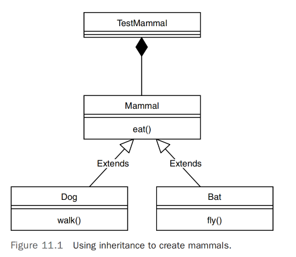
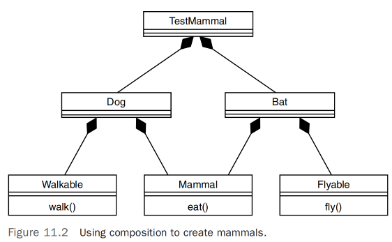
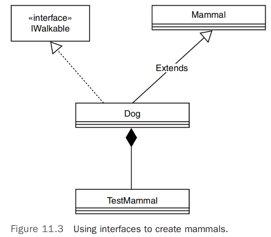

# 避免依赖和高耦合的类          

## 引言     
正如在第1章“面向对象概念介绍”中所述，传统的经典面向对象编程的标准是封装、继承和多态。理论上，要将一种编程语言视为面向对象语言，它必须遵循这三个原则。此外，正如第1章中也提到的，我喜欢包含组合。            
因此，当我教授面向对象编程时，我的基本概念列表如下：            
- 封装      
- 继承          
- 多态          
- 组合          

>提示,也许我应该在这个列表中加入接口，但我一直认为接口是一种特定类型的继承。        

在当今的开发环境中，将组合添加到这个列表中更加重要，因为关于如何适当使用继承的争论。对于如何使用继承的担忧并不是最近才出现的现象。在过去的几年里，这场辩论已经加剧。我与之交谈的许多开发人员主张使用组合而不是继承（通常称为组合优于继承）。事实上，一些人根本避免使用继承，或者至少将继承的使用限制在一个层次结构级别上。          

关注如何使用继承的原因在于耦合的问题。使用继承的论据无疑是可重用性、可扩展性和多态性；然而，继承也可能会通过在类之间创建依赖关系，实际上将类耦合在一起，从而引起问题。这些依赖关系会给维护和测试带来潜在问题。          

第7章“掌握继承和组合”讨论了继承实际上可能会削弱封装的现象，这似乎与它们都是基本概念相矛盾。然而，这实际上是一种有趣的部分，并要求我们真正思考如何使用继承。         

>注意, 请注意，我并不主张避免继承。这里的讨论实际上是关于避免依赖和高度耦合的类。何时使用继承是这个讨论的一个重要部分。     

这场辩论引出了以下问题：如果不使用继承，那么呢？简短的答案是使用组合。这不应该令人惊讶，因为在整本书中，我认为只有两种重用类的方式：使用继承和使用组合。你可以通过继承从父类创建子类，也可以使用组合将一个类包含在另一个类中。      

如果，正如一些人所主张的，应该避免使用继承，那么我们为什么要花时间学习它呢？答案很简单：很多代码都利用了继承。正如大多数开发人员很快就会明白的那样，遇到的大多数代码都处于维护模式。因此，了解如何修复、增强和维护使用继承编写的代码至关重要。你甚至可能会使用继承编写一些新代码。简而言之，程序员需要涵盖所有可能的基础知识，并学习整个开发人员工具包。然而，这也意味着我们必须不断向工具包添加工具，并重新思考我们如何使用它们。      

再次强调，请理解我在这里没有做任何价值判断。我不是说继承存在问题，要避免使用它。我要说的是，完全理解继承的使用方式、仔细研究替代设计方法，然后自行决定是非常重要的。因此，本章中的示例的目的并不一定是描述设计类的最佳方式；它们是教育性的练习，旨在让你思考在继承和组合之间做出决定时涉及的问题。记住，技术的进化、保留好的部分并改进不太好的部分是很重要的。          

此外，组合本身也存在耦合问题。在第7章中，我讨论了各种类型的组合：关联和聚合。聚合是嵌入在其他对象中的对象（使用 new 关键字创建），而关联是通过参数列表传递到其他对象中的对象。因为聚合是嵌入在对象中的，它们是高度耦合的，而我们要避免这种情况。        

因此，尽管继承可能已经获得了鼓励创建高度耦合类的声誉，但组合（使用聚合）也可能会创建高度耦合的类。让我们重新审视第9章“构建对象和面向对象设计”中使用的立体声组件示例，以在一个具体的例子中将所有这些概念结合起来。       

使用聚合创建立体声可以类比于创建一个音箱，音箱是一个将所有组件嵌入单个单元内的产品。在许多情况下，这样设计非常方便。它可以轻松携带、移动，而且不需要特殊的组装。然而，这种设计也可能导致许多问题。如果其中一个组件，比如说MP3播放器坏了，你必须把整个单元送修。更糟糕的是，可能会出现许多问题，使整个音箱无法使用，比如电气问题。       

使用关联创建立体声可以缓解与聚合遇到的许多问题。将一个分量立体声系统视为一堆通过补丁线（或无线）连接的关联。在这种设计中，有一个称为接收器的中心对象，连接到几个其他对象，比如扬声器、CD播放器，甚至是唱盘机和磁带播放器。事实上，将其视为一种供应商中立的解决方案，因为我们可以简单地从货架上取下一个分量，这是一个重大优势。          

在这种情况下，如果CD播放器坏了，你只需要将它断开连接，这样就有机会修理CD播放器（同时仍然可以使用其他组件），或者将其更换为一个新的可用的CD播放器。这就是使用关联并将类之间的耦合保持到最低程度的优势。      

>提示,正如第9章中所指出的，尽管高度耦合的类通常不受欢迎，但在某些情况下，你可能愿意接受高度耦合设计的风险。音箱就是一个例子。尽管它具有高度耦合的设计，但有时仍然是首选。       

现在，我们已经审查了继承和组合的耦合问题，让我们探讨一些使用继承和组合的高度耦合设计的例子。就像我经常在教室里做的那样，我们将通过这些例子，直到使用一种称为依赖注入的技术来减轻耦合问题。      

## 组合与继承以及依赖注入
首先，我们可以专注于如何采用继承模型（从本书经常使用的示例中获取），并重新设计它，而不是采用继承，而是采用组合。第二个例子展示了如何使用组合重新设计，尽管使用了聚合，这不一定是一个最佳解决方案。第三个例子展示了如何避免使用聚合，并改用关联——依赖注入的概念。            

### 1) 继承     
无论你是否同意采用组合优于继承的论点，让我们从一个简单的继承示例开始，并探讨如何使用组合来实现它，重新审视贯穿全书的哺乳动物示例。在这种情况下，我们引入了蝙蝠——一种能够飞行的哺乳动物，如图11.1所示。          

            

在这个例子中，继承似乎是显而易见的选择。创建一个从哺乳动物类继承的狗类是毫无疑问的，不是吗？看看下面的代码，它以这种方式利用了继承：            
```java
class Mammal {
 public void eat () {System.out.println("我在吃饭");};
}
class Bat extends Mammal {
 public void fly () {System.out.println("我在飞行");};
}
class Dog extends Mammal {
 public void walk () {System.out.println("我在走路");};
}
public class TestMammal {
 public static void main(String args[]) {
 System.out.println("组合优于继承");;
 System.out.println("\n狗");
 Dog fido = new Dog();
 fido.eat();
 fido.walk();
 
 System.out.println("\n蝙蝠");
 Bat brown = new Bat();
 brown.eat();
 brown.fly();
 }
}
```     

在这个设计中，哺乳动物具有一个行为，即eat()，假设所有的哺乳动物都必须吃东西。然而，当我们添加两个哺乳动物子类，蝙蝠和狗时，我们立即开始看到继承的问题。虽然狗可以走路，但并不是所有的哺乳动物都走路。此外，虽然蝙蝠确实能飞，但并不是所有的哺乳动物都会飞。所以问题是，这些方法应该放在哪里？就像我们之前的企鹅例子一样，由于并非所有鸟类都会飞行，决定在继承层次结构中放置方法的位置可能会很棘手。         

将哺乳动物类分离成飞行哺乳动物和行走哺乳动物并不是一个非常优雅的解决方案，因为这只是冰山一角。一些哺乳动物可以游泳，一些哺乳动物甚至会产卵。此外，可能还有无数其他个体哺乳动物物种拥有的行为，为所有这些行为创建单独的类可能是不切实际的。因此，与其将这种设计视为一种is-a关系，也许我们应该探索一下使用has-a关系。         

### 2) 组合     
在这种策略中，我们不是将行为嵌入到类本身中，而是为每个行为创建单独的类。因此，我们可以为每个行为创建类，而不是将行为放置在继承层次结构中，然后通过包含它们所需的行为来构建单个哺乳动物（通过聚合）。            
因此，我们创建一个名为Walkable的类和一个名为Flyable的类，如图11.2所示。     

        

例如，看看以下代码。我们仍然有Mammal类及其eat()方法，我们还有Dog和Bat类。这里的主要设计差异在于Dog和Bat类通过组合使用聚合来获取它们的行为。     

>请注意，在上文中使用了术语聚合。这个例子说明了如何使用组合代替继承；然而，在这个例子中，我们使用的是聚合，这仍然包含着相当大的耦合。因此，将其视为一个中间的、教育性的步骤，向下一个使用接口的例子迈进。           

```java
class Mammal {
 public void eat () {System.out.println("我在吃饭");};
}
class Walkable {
 public void walk () {System.out.println("我在走路");};
}
class Flyable {
 public void fly () {System.out.println("我在飞行");};
}
class Dog {
 Mammal dog = new Mammal();
 Walkable walker = new Walkable();
}
class Bat {
 Mammal bat = new Mammal();
 Flyable flyer = new Flyable();
}
public class TestMammal {
 public static void main(String args[]) {
 System.out.println("组合优于继承");;
 System.out.println("\n狗");;
 Dog fido = new Dog();
 fido.dog.eat();
 fido.walker.walk();
 System.out.println("\n蝙蝠");;
 Bat brown = new Bat();
 brown.bat.eat();
 brown.flyer.fly();
 }
}
```         

>注意：这个例子的目的是说明如何在设计中使用组合代替继承；这并不意味着你在设计中不能使用继承。如果你确定所有的哺乳动物都吃东西，那么也许你会决定将eat()方法放在Mammal类中，并让Dog和Bat继承自Mammal。正如往常一样，这是一个设计决策。        

也许这个讨论的核心在于我们之前介绍的概念，即继承破坏了封装性。这很容易理解，因为Mammal类的更改将需要重新编译（甚至可能需要重新部署）所有Mammal子类。这意味着类之间高度耦合，这与我们所陈述的尽可能减少类之间的耦合的目标相悖。          

在我们的组合示例中，如果我们想要添加一个Whale类，之前编写的任何类都不需要重写。你只需要添加一个名为Swimmable的类和一个名为Whale的类。然后Swimmable类可以被重用，比如用于Dolphin类。         

```java
class Swimmable {
 public void fly () {System.out.println("我在游泳");};
}
class Whale {
 Mammal whale = new Mammal();
 Walkable swimmer = new Swimmable ();
}
```

主应用程序可以在不改变先前存在的类的情况下添加这个功能。            
```java
System.out.println("\n鲸鱼");
Whale shamu = new Whale();
shamu.whale.eat();
shamu.swimmer.swim();
```

一个经验法则是只在真正多态的情况下使用继承。因此，圆形和矩形继承自形状可能是继承的合理用法。另一方面，诸如行走和飞行之类的行为可能不适合继承，因为覆盖它们可能会有问题。例如，如果你在Dog类中覆盖了fly()方法，唯一明显的选项将是一个空操作（什么也不做）。正如我们在之前的企鹅示例中看到的那样，你不希望狗跑到悬崖边，执行可用的fly()方法，然后发现fly()方法什么也没做，这会让Fido非常懊恼。                

虽然这个例子确实使用组合实现了这个解决方案，但设计上存在一个严重的缺陷。对象之间高度耦合，因为使用了new关键字。             
```java
class Whale {
 Mammal whale = new Mammal();
 Walkable swimmer = new Swimmable ();
}
```

为了完成我们对类的解耦练习，我们引入了依赖注入的概念。简而言之，我们不再在一个对象内部创建其他对象，而是通过参数列表从外部注入对象。本讨论专注于依赖注入的概念。    

### 依赖注入
前一节的示例使用组合（带有聚合）为Dog提供了一个名为Walkable的行为。Dog类在自身内部实际上创建了一个新的Walkable对象，如下面的代码片段所示：      
```java
class Dog {
 Walkable walker = new Walkable(); 
}
``` 

尽管这确实有效，但类之间仍然高度耦合。为了完全解耦前一个示例中的类，让我们实现前面提到的依赖注入的概念。依赖注入和控制反转经常一起讨论。控制反转（IOC）的一个定义是让其他人负责创建依赖关系的实例并将其传递给你。这正是我们将在这个示例中实现的。
由于并非所有的哺乳动物都会行走、飞行或游泳，为了开始解耦过程，我们创建接口来表示我们各种哺乳动物的行为。对于这个示例，我将专注于行走行为，创建一个名为IWalkable的接口，如图11.3所示。       

        

IWalkable接口的代码如下所示：       
```java
interface IWalkable {
 public void walk();
}
```

这个接口中唯一的方法是walk()，具体的实现由具体的类提供。        
```java
class Dog extends Mammal implements IWalkable{
 Walkable walker;
 public void setWalker (Walkable w) {
 this.walker=w;
 }
 public void walk () {System.out.println("I am Walking");};
}
```

>注意，Dog类扩展了Mammal类并实现了IWalkable接口。另外，注意Dog类提供了一个引用和一个构造函数，用于提供注入依赖的机制。      
```java
Walkable walker;
public void setWalker (Walkable w) {
 this.walker=w;
}
```

简而言之，这就是依赖注入的工作方式。Walkable行为不是在Dog类内部使用new关键字创建的，而是通过参数列表注入到Dog类中。     

下面是完整的示例代码：      
```java
class Mammal {
 public void eat () {System.out.println("I am Eating");};
}
interface IWalkable {
 public void walk();
}
class Dog extends Mammal implements IWalkable{
 Walkable walker;
 public void setWalker (Walkable w) {
 this.walker=w;
 }
 public void walk () {System.out.println("I am Walking");};
}
public class TestMammal {
 public static void main(String args[]) {
 System.out.println("Composition over Inheritance");
 System.out.println("\nDog");
 Walkable walker = new Walkable();
 Dog fido = new Dog();
 fido.setWalker(walker);
 fido.eat();
 fido.walker.walk();
 }
}
```
虽然这个示例使用了构造函数注入，但这并不是处理依赖注入的唯一方式。      

### 构造函数注入        
注入Walkable行为的一种方式是在Dog类中创建一个构造函数，当调用时，它将接受来自主应用程序的参数，如下所示：       
```java
class Dog {
 Walkable walker;
 public Dog (Walkable w) {
 this.walker=w;
 }
}
```

在这种方法中，应用程序实例化一个Walkable对象，并通过构造函数将其插入到Dog中。       
```java
Walkable walker = new Walkable();
Dog fido = new Dog(walker);
```

### 通过Setter注入
虽然构造函数在实例化对象时会初始化属性，但通常在对象的生命周期中需要重新设置值。这就是访问器方法发挥作用的地方——以setter的形式。通过一个名为setWalker()的setter，可以将Walkable行为插入到Dog类中：      
```java
class Dog {
 Walkable walker;
 public void setWalker (Walkable w) {
 this.walker=w;
 }
}
```     

与构造函数技术类似，应用程序实例化一个Walkable对象，并通过setter将其插入到Dog中：           
```java
Walkable walker = new Walkable();
Dog fido = new Dog();
fido.setWalker(walker);
``` 

## 结论
依赖注入将类的构建与其依赖项的构建分离开来。这就像从供应商处购买现成的产品，而不是每次都自己构建一样。          

这涉及到继承和组合的讨论核心。很重要的一点是要注意，这只是一种讨论。本章的目的并不一定是描述设计类的“最佳”方法，而是让您思考在继承和组合之间做出决定时涉及的问题。在下一章中，我们将探讨面向对象设计的SOLID原则，这是软件开发社区高度认可和接受的概念。         

