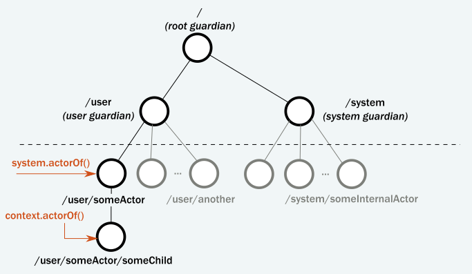
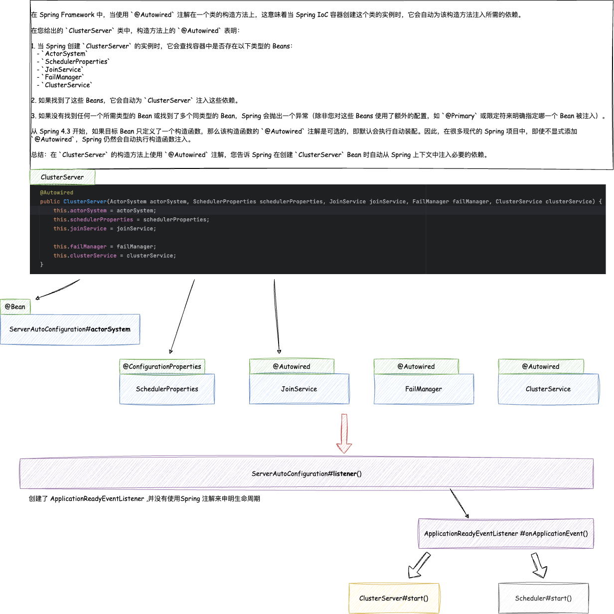
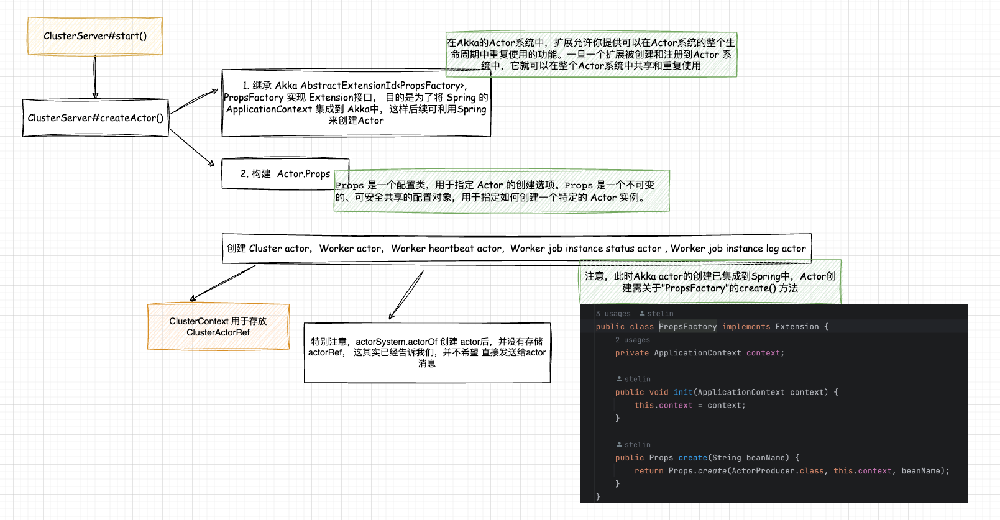

## Openjob Master Akka 启动过程 

### Coordinator Worker模式  
Coordinator-Worker 模式，也称为 Master-Slave 模式或 Master-Worker 模式，是一种并行设计模式，用于并行处理数据和执行任务。在这种模式中，主进程（协调器/主节点）负责接受和分配工作，而工作进程（工作者/从节点）负责执行具体的工作。

这是该模式的主要特点和组件：

1. **协调器 (Coordinator 或 Master)**
   - 负责管理工作流程。
   - 将工作分配给工作者。
   - 可以进行任务的切分，将大任务分解为小任务，以便并行处理。
   - 可能会收集和汇总工作者的结果。

2. **工作者 (Worker 或 Slave)**
   - 负责执行由协调器分配的任务。
   - 可以在不同的机器、线程或进程上执行，实现真正的并行处理。
   - 完成任务后，返回结果给协调器。

**使用场景**：

- **数据并行**：例如，当你有一个大数据集并且需要对每个数据元素执行相同的操作时，可以将数据集分割成小块，并分发给各个工作者并行处理。
- **任务并行**：例如，在模拟或优化计算中，你可能需要多次执行相同的代码但使用不同的参数。这些任务可以分发给各个工作者并行处理。
- **负载均衡**：当工作负载在工作者之间变化时，协调器可以确保工作均匀分配，从而实现负载均衡。

**优点**：

- 可扩展性：可以根据需要增加或减少工作者。
- 并行性：允许在多个工作者上并行执行任务，充分利用多核、多节点或多机器的能力。
- 灵活性：工作者可以在本地或远程执行，使其适用于各种计算环境，如集群、云或边缘计算。

**缺点**：

- **通信开销**：协调器和工作者之间的通信可能会引入延迟。
- **复杂性**：设计和维护这种模式的系统可能比单节点解决方案复杂。
- **容错性**：需要设计容错机制，以处理工作者失败或通信中断的情况。

### Akka的 Coordinator-Worker   
Akka 是一个构建并发和分布式系统的工具包和运行时，它基于 Actor 模型。在 Akka 中，Actor 是一个具有状态和行为的轻量级实体，它通过异步消息传递与其他 Actor 交互，确保每次只处理一个消息，从而避免并发问题。

在 Akka 中，使用 Coordinator-Worker 模式（或 Master-Worker 模式）相对直观，因为 Akka 的 Actor 模型与此模式的概念非常匹配。

以下是如何在 Akka 中实现 Coordinator-Worker 模式的概述：

1. **协调器 (Coordinator/Master) Actor**:
   - 创建工作者 (Worker) Actor。
   - 接受外部请求，如计算任务。
   - 将任务切分为较小的工作单元并将它们发送给工作者 Actor。
   - 可能会收集工作者 Actor 返回的结果并汇总。

2. **工作者 (Worker) Actor**:
   - 接受来自协调器的任务。
   - 处理这些任务。
   - 将结果发送回协调器。

**简单的例子**：

假设我们有一个计算任务，需要对大量的数字进行处理。协调器可以将数字列表分割并将它们发送给工作者进行处理。

```scala
// 定义消息类型
case class Compute(numbers: List[Int])
case class Result(value: Int)

class Coordinator(workerCount: Int) extends Actor {
  val workers = (1 to workerCount).map(_ => context.actorOf(Props[Worker]))

  var remainingWorkers = workerCount
  var totalResult = 0

  def receive = {
    case Compute(numbers) =>
      val chunkSize = numbers.size / workerCount
      numbers.grouped(chunkSize).zipWithIndex.foreach {
        case (chunk, idx) => workers(idx) ! Compute(chunk)
      }

    case Result(value) =>
      totalResult += value
      remainingWorkers -= 1
      if (remainingWorkers == 0) {
        println(s"Total Result: $totalResult")
      }
  }
}

class Worker extends Actor {
  def receive = {
    case Compute(numbers) =>
      val result = numbers.sum
      sender() ! Result(result)
  }
}
```

上面的例子只是一个简化的示范。在真实应用中，你可能还需要考虑其他因素，如工作者失败的处理、更高效的数据分发方式等。此外，Akka 还提供了更高级的模块，如 Akka Cluster 和 Akka Streams，可以进一步帮助你实现复杂的分布式和并行处理模式。        

### Openjob Master Akka启动流程 

#### ServerAutoConfiguration    
在Openjob的`openjob-server-starter`模块随处可见的Spring以及Spring Boot的使用，在还没开始介绍之前，我们必须对Akka的Actor有一些了解，不然它的使用需要经历哪几步，心里没数，只会让自己看到Akka就慌，:) 

在使用Akka构建应用时，第一步，必须首先构建 `ActorSystem`, 因为Akka的Actor的创建以及Message传递线路，与树结构很像，只能有且仅有一个 ActorSystem root角色。其他`Actor`都基于父Actor创建。     
  

>那我们回到 `ServerAutoConfiguration`来。   

**listener()**  
listener()方法实现了 `ApplicationReadyEventListener`实例化，此处需注意在，它是带参的实例化， 而ClusterServer，Scheduler的传值，是利用Spring Bean加载机制, 大家可以查看在 `ClusterServer`的构造方法，添加`@Autowired`注解， 以下是个简单介绍：   

>在 Spring Framework 中，当使用 `@Autowired` 注解在一个类的构造方法上，这意味着当 Spring IoC 容器创建这个类的实例时，它会自动为该构造方法注入所需的依赖。   
在您给出的 `ClusterServer` 类中，构造方法上的 `@Autowired` 表明：   
1. 当 Spring 创建 `ClusterServer` 的实例时，它会查找容器中是否存在以下类型的 Beans：    
   - `ActorSystem`  
   - `SchedulerProperties`  
   - `JoinService`  
   - `FailManager`  
   - `ClusterService`   

2. 如果找到了这些 Beans，它会自动为 `ClusterServer` 注入这些依赖。  
3. 如果没有找到任何一个所需类型的 Bean 或找到了多个同类型的 Bean，Spring 会抛出一个异常（除非您对这些 Beans 使用了额外的配置，如 `@Primary` 或限定符来明确指定哪一个 Bean 被注入）。    
从 Spring 4.3 开始，如果目标 Bean 只定义了一个构造函数，那么该构造函数的 `@Autowired` 注解是可选的，即默认会执行自动装配。因此，在很多现代的 Spring 项目中，即使不显式添加 `@Autowired`，Spring 仍然会自动执行构造函数注入。    
总结：在 `ClusterServer` 的构造方法上使用 `@Autowired` 注解，您告诉 Spring 在创建 `ClusterServer` Bean 时自动从 Spring 上下文中注入必要的依赖。 

所以 Spring Bean加载帮我们解决了类的创建问题，当创建 `ApplicationReadyEventListener`后，它实现了`ApplicationListener<ApplicationReadyEvent>`，这会在Spring Boot初始化加载后会自动执行`onApplicationEvent()`。   

>到这里，我们已经找到Akka相关的处理入口，但别忽略 `ServerAutoConfiguration#actorSystem()` ，它帮我们初始化了 Akka Root Actor（ActorSystem）。 这点至关重要，后面你可以看到，`ClusterServer#start()` 的关于Actor创建，都传入的ActorSystem，这里最大，最大的技巧是，当Akka集成Spring 后，很多类都可以使用Spring的特性，例如IOC，或者，换个角度，我们将Actor必做是Java中的thread（只是比喻，actor肯定比thread更轻量），在Actor如果想访问Spring Boot的Service和Dao层那该怎么做，所以 后面会提到 Akka特性“扩展”,它可easy帮我们解决与Spring集成的问题。   

      

#### ClusterServer#start()      
      

`start()` 用于创建`创建 Cluster actor，Worker actor，Worker heartbeat actor,  Worker job instance status actor , Worker job instance log actor`,    

```java
Props clusterProps = PropsFactoryManager.getFactory()
                .get(actorSystem)
                .create(ServerActorConstant.BEAN_ACTOR_CLUSTER)
                .withDispatcher(ServerActorConstant.DISPATCHER_CLUSTER);

ActorRef clusterActorRef = actorSystem.actorOf(clusterProps, ServerActorConstant.ACTOR_CLUSTER);
ClusterContext.setClusterActorRef(clusterActorRef);
```

**Props**   
在 Akka 中，`Props` 是一个配置类，用于指定 Actor 的创建选项。`Props` 是一个不可变的、可安全共享的配置对象，用于指定如何创建一个特定的 Actor 实例。`Props` 可以被认为是 Actor 的配方或蓝图。 
以下是 `Props` 在 Akka 中的一些主要用途和作用： 
1. **配置Actor实例化的参数**:   
   - `Props` 可以包含 Actor 实例化时所需要的所有参数，比如构造函数参数。这样做的好处是，它将 Actor 的创建过程封装起来，使得 ActorSystem 可以按照这些参数安全地创建 Actor 实例。      
2. **实现Actor的安全封装**: 
   - `Props` 是不可变的，这意味着它们可以被安全地共享和传递。通过使用 `Props`，可以避免暴露 Actor 的具体类和构造函数，从而保护 Actor 的实现细节。   
3. **用于创建Actor的实例**: 
   - 当你向 ActorSystem 请求创建一个新的 Actor 实例时，需要传递一个 `Props` 对象。例如：    
```java
Props props = Props.create(MyActor.class, param1, param2);
ActorRef myActor = actorSystem.actorOf(props, "myActor");
```
4. **允许配置Actor的部署属性**: 
   - `Props` 也可以包含 Actor 的部署配置，这些配置可以从外部配置文件中读取，也可以在代码中设置。例如，它可以指定一个 Actor 是否应在远程节点上运行，或应有多少个实例。   
5. **允许重新配置Actor**:   
   - 由于 `Props` 是不可变的，因此可以安全地重用它们。如果你想用不同的配置创建相同类型的多个 Actor 实例，可以轻松地创建新的 `Props` 实例。  
6. **Facilitate Actor Hierarchies and Routing**:    
   - `Props` 也可以用于配置 Akka 路由器（Routers）。路由器是特殊类型的 Actor，它可以将接收到的消息路由到一组 Actor 中的一个。`Props` 可以用来配置这个 Actor 集群的行为。    
例如，要创建一个具有特定构造函数参数的新 Actor，你会这样使用 `Props`：  
```java
Props props = Props.create(MyActor.class, param1, param2);
ActorRef myActor = actorSystem.actorOf(props, "myActor");
```
`Props` 在 Akka 中充当了一个重要的角色，它使 Actor 的创建和配置变得安全、简洁和易于管理。   

创建Actor在`PropsFactory#create()方法`。    
```java
public Props create(String beanName) {
    return Props.create(ActorProducer.class, this.context, beanName);
}
```     

现在我们拿`Cluster actor`为了，我们查看类名为ServerActorConstant.BEAN_ACTOR_CLUSTER的 ClusterAcor, 它继承了`Akka.AbstractActor`, 这里不用过多理解，这是定义Actor基本操作，这里也不过多解释，但还是希望大家了解在，如何自己创建一个Actor。 

>注意：在Spring或者Spring Boot的IOC功能，默认创建的Class对象都是单例，而在Actor中肯定不能这样，所以得修改Bean定义的原型(prototype), 这样，每次请求时，Spring 容器都会创建一个新的bean实例。  
```java
@Component
@Log4j2
@Scope(ConfigurableBeanFactory.SCOPE_PROTOTYPE)
public class ClusterActor extends AbstractActor {
    ...
}
``` 

#### ClusterServer#registerCoordinatedShutdown()    
```java
private void registerCoordinatedShutdown() {
    CoordinatedShutdown.get(this.actorSystem)
            .addTask(CoordinatedShutdown.PhaseServiceUnbind(),
                    "coordinated-shutdown-hook",
                    () -> {
                        this.failManager.shutdown(ClusterContext.getCurrentNode());
                        return Future.successful(Done.done());
                    });
}
```

`CoordinatedShutdown` 是 Akka 提供的一个机制，用于顺序和协调地停止 ActorSystem 和其相关的资源。这个机制在 Akka 应用程序准备关闭时尤其有用，因为它确保资源以一种可预测和有序的方式被释放。这是尤其重要的，例如，当你的应用程序是一个 Akka Cluster 的一部分，或者当它与外部服务（如数据库）进行了集成。

下面是给定代码段的具体分析：

1. **`CoordinatedShutdown.get(this.actorSystem)`**:
    - 这行代码从当前的 `ActorSystem` 实例中获取 `CoordinatedShutdown` 实例。每个 `ActorSystem` 都有一个与之关联的 `CoordinatedShutdown` 实例。

2. **`CoordinatedShutdown.PhaseServiceUnbind()`**:
    - 在协调的关闭过程中，不同的任务会被分组到不同的“阶段”（Phase）中。这些阶段按照预定的顺序依次执行。`PhaseServiceUnbind` 是预定义的关闭阶段之一，通常用于在关闭应用程序之前解除应用程序与外部服务的绑定。

3. **`addTask` 方法**:
    - 这个方法用于将一个关闭任务添加到指定的关闭阶段。每个任务是一个返回 `Future<Done>` 的函数，这表示任务是异步的，并且当任务完成时，这个 Future 会完成。
   
4. **`"coordinated-shutdown-hook"`**:
    - 这是添加的关闭任务的名称。这个名称是用来识别和记录这个特定任务的。

5. **Lambda 表达式**:
    - 这个 lambda 表达式定义了关闭任务的具体逻辑。在这个例子中，它首先调用 `this.failManager.shutdown(ClusterContext.getCurrentNode())`，可能是为了关闭或清理与当前集群节点相关的资源。然后，它返回一个已成功完成的 Future，表示这个关闭任务已经完成。

总结起来，给定的代码段向 `CoordinatedShutdown` 的 `PhaseServiceUnbind` 阶段添加了一个新的关闭任务。当 Akka ActorSystem 开始协调关闭过程，并到达 `PhaseServiceUnbind` 这个阶段时，这个任务会被执行。这使得开发者可以插入自定义的逻辑，以便在 ActorSystem 关闭之前执行一些清理或资源释放的操作。


refer   
1.https://openjob.io/zh-Hans/docs/intro 
2.