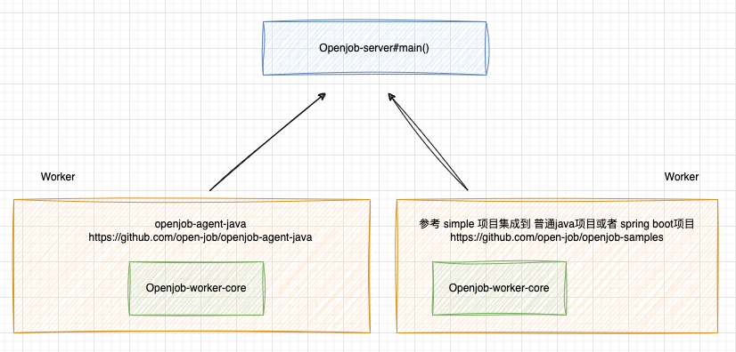

## Openjob Worker Akka 启动过程 

### OpenjobWorker#doInitialize()  
在 `openjob-samples` https://github.com/open-job/openjob-samples 项目中，可以很清楚看到Openjob Worker的接入入口。 这里先简单描述下 Openjob的worker组成部分：  
`Worker`的构造      
      

```java
public static void main(String[] args) {
    try {
        OpenjobWorker openjobWorker = new OpenjobWorker();
        openjobWorker.init();

        Thread.currentThread().join();
    } catch (Exception e) {
        e.printStackTrace();
    }
}

public synchronized Boolean doInitialize() {
    try {
        this.workerChecker.init();
        this.workerConfig.init();
        this.workerActorSystem.init();
        this.workerRegister.register();
        this.workerHeartbeat.init();
        this.workerInitializer.init();
        this.workerShutdown.init();
        return true;
    } catch (Throwable var2) {
        log.error("Openjob worker initialize failed!", var2);
        return false;
    }
}
```


### OpenjobWorker 实现 InitializingBean 简化Spring 接入
在Spring框架中，`InitializingBean`接口定义了一个方法：`afterPropertiesSet()`。当一个bean实现了这个接口，并且所有bean属性都已经被设置之后，这个方法将被Spring容器自动调用。  
实现`InitializingBean`接口允许bean在Spring容器设置完所有属性后执行某些初始化逻辑。这是一个在bean完全初始化之后，执行初始化任务（如资源分配、自定义初始化逻辑或依赖校验等）的标准Spring回调方法。    
这里是`InitializingBean`接口的示例：    

```java
public class ExampleBean implements InitializingBean {
    // bean properties and setters
    @Override
    public void afterPropertiesSet() throws Exception {
        // custom initialization logic here
    }
}
```
当Spring容器实例化这个`ExampleBean`类的一个对象，并设置完所有属性后，`afterPropertiesSet()`方法将被自动调用，你可以在这个方法里加入你需要的初始化逻辑。 
现在，关于你提到的`OpenJobWorker`，我没有具体的上下文信息（例如它是哪个库或应用程序的一部分），但从名字上看，它很可能是一个与任务或作业处理相关的组件。如果`OpenJobWorker`实现了`InitializingBean`接口，那么它可能在`afterPropertiesSet()`方法中执行一些初始化工作，比如预热缓存、初始化内部数据结构、启动线程、连接到远程服务等。  

总之，通过实现`InitializingBean`接口，并覆盖`afterPropertiesSet()`方法，`OpenJobWorker`可以在其所有属性被Spring容器设置完毕后，执行自己的初始化逻辑。   


refer   
1.https://openjob.io/zh-Hans/docs/intro 
2.