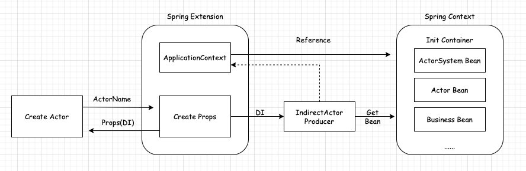

# Akkajob - Master 构建     

## 读取 akka 配置           
使用`@EnableConfigurationProperties` 自动将配置属性文件（如 application.properties 或 application.yml）中的属性映射到一个 POJO类上，并且 该 POJO 类还需添加 @ConfigurationProperties 注解  
```java
@Configuration
@EnableConfigurationProperties(value = {AkkaProperties.class})
public class ServerAutoConfiguration{...}
```

```java
@ConfigurationProperties(prefix = "akka")
public class AkkaProperties {...} 
```

## 使用 Akka 扩展特性 集成 Spring 
使用 Akka Actor 构建系统时，会频繁使用 `actorOf()`创建 actor，那为了简化这部分代码，Akka 也提供了集成到第三方DI组件来创建，例如`集成Spring，也是为了将 ActorSystem和Actor 的创建、Actor 系统与其他系统组件的依赖都纳入 Spring 的管理中` 。 这部分内容，大家可访问 https://doc.akka.io/docs/akka/current/actors.html#dependency-injection 了解 DI（Dependency Injection）。      

>在 Akka 中使用扩展（Extensions）机制有许多好处，特别是当你希望将一些全局的功能或配置集成到你的 Actor 系统中时。以下是 Akka 扩展的一些主要优点:           
    **全局可访问性:**  
    扩展提供了一种全局的机制，允许在整个 Actor 系统中访问共享的对象或状态。这对于需要在多个 Actor 之间共享数据或服务的情况非常有用。  
    **单例模式:**  
    扩展通常以单例模式存在，这确保了在整个 Actor 系统中只有一个扩展实例。这对于管理资源、连接池、配置等非常有用。  
    **初始化和生命周期管理:**  
    扩展可以在 Actor 系统初始化时进行配置和初始化。这使得你可以在 Actor 系统启动时设置一些全局的配置或服务。  
    **代码解耦:**  
    扩展机制可以帮助你将全局功能与具体的业务逻辑解耦。例如，将数据库连接池、配置管理、监控工具等放入扩展中，而不是直接在每个 Actor 中处理。  
    **简化依赖注入:**  
    通过扩展，可以更容易地管理依赖注入。特别是在与 Spring 等框架集成时，可以将 Spring 上下文作为扩展的一部分，使得 Akka Actor 可以方便地获取 Spring 管理的 Bean。  
    **方便测试:**  
    使用扩展可以让你更容易地进行单元测试和集成测试。你可以在测试时用 Mock 对象或特殊配置来替换实际的扩展实例，从而简化测试过程。  
    **重用性:**
    扩展机制使得你可以创建可重用的组件，这些组件可以在不同的 Akka 应用程序中共享和使用。通过定义通用的扩展，你可以提高代码的重用性和维护性。  

在做集成之前，我们有必要先理清一下整个过程。对于 ActorSystem 来说，它并不是使用 new 的方式来创建的，而是拥有自己的工厂方法，即 create ，假如要将其设置为一个 Spring Bean，需要在配置时指定 factory-method ，但是这种方式并不是太简洁，官方推荐采用 @Configuration 的方式来生产ActorSystem；对于Actor来说，它是通过actorOf方法来创建的，在该方法中，可以传入前面所讲的依赖注入组件 IndirectActorProducer，然后让 ApplicationContext.getBean 方法返回 Actor；     

一般来说，在集成了Spring后，所有 ActorSystem 范围内的依赖都会交给 Spring 来管理，并且每个 ActorSystem 都会持有一个 ApplicationContext，所以可以将集成功能做成Akka的扩展。综上所述，我们可以采用下图给出的方案来集成Spring。         
      

首先，需要定义 `IndirectActorProducer`，作为生产 Actor 的工厂，它需要依赖两个参数：Spring Bean工厂（ApplicationContext）和 Actor的名字             
```java
// SpringDI
public class ActorProducer implements IndirectActorProducer { 
    private final ApplicationContext context;
    private final String beanName;

    public ActorProducer(ApplicationContext applicationContext, String beanName) {
        this.context = applicationContext;
        this.beanName = beanName;
    }

    @Override
    public Actor produce() {
        return (Actor) context.getBean(beanName);
    }

    @Override
    public Class<? extends Actor> actorClass() {
        return (Class<? extends Actor>) context.getType(beanName);
    }
}
```

此时使用 PropsFactory 构造的Props 来创建 Actor 的话，就能通过 ApplicationContext 拿到 Spring 容器内的 Actor Bean了，构造Props 的过程可以放到自定义的扩展里，
```java
// SpringExt
public class PropsFactory implements Extension {
    private ApplicationContext context;

    public void init(ApplicationContext context) {
        this.context = context;
    }

    public Props create(String beanName) {
        return Props.create(ActorProducer.class, this.context, beanName);
    }
}
``` 

```java
// SpringExtProvider 
public class PropsFactoryManager extends AbstractExtensionId<PropsFactory> {
    private static PropsFactoryManager provider = new PropsFactoryManager();

    public static PropsFactoryManager getFactory() {
        return provider;
    }

    @Override
    public PropsFactory createExtension(ExtendedActorSystem system) {
        return new PropsFactory();
    }
}
```

其中 `PropsFactory` 是扩展组件，它持有的 ApplicationContext 对象将在 Spring 加载时被传进来 `PropsFactoryManager` 是一个 ExtensionId，通过它可以在 ActorSystem 范围内创建并查找 PropsFactory 。`create() 方法主要用来 构造 Props`，它依赖于前面创建的 IndirectActorProducer，一旦在外部得到该Props，就可以创建基于 Spring 容器内的 Actor Bean了。那么，我们该怎样初始化ActorSystem并扫描到被纳入容器的Actor呢？Spring提供了一种简单方法来实现Bean的扫描，即 @Configuration 和 AnnotationConfigApplicationContext，通过`AnnotationCon-figApplicationContext`扫描到的被注解的 Class，都能被纳入Bean容器。为了创建 AcorSystem 并初始化，可以按照下面这种方式定义一个配置类：            
```java
@Configuration
@EnableConfigurationProperties(value = {AkkaProperties.class})
public class ServerAutoConfiguration {

    /**
     * Actor system.
     *
     * @param applicationContext applicationContext
     * @return ActorSystem
     */
    @Bean
    public ActorSystem actorSystem(ApplicationContext applicationContext, AkkaProperties akkaProperties) {
        // Remote hostname
        String remoteHostname = akkaProperties.getRemote().getHostname();
        if (StringUtils.isEmpty(remoteHostname)) {
            remoteHostname = IpUtil.getLocalAddress();
        }

        // Bind hostname
        String bindHostname = akkaProperties.getBind().getHostname();
        if (StringUtils.isEmpty(bindHostname)) {
            bindHostname = IpUtil.getLocalAddress();
        }

        // Merge config
        Map<String, Object> newConfig = new HashMap<>(8);
        newConfig.put("akka.remote.artery.canonical.hostname", remoteHostname);
        newConfig.put("akka.remote.artery.canonical.port", String.valueOf(akkaProperties.getRemote().getPort()));
        newConfig.put("akka.remote.artery.bind.hostname", bindHostname);
        newConfig.put("akka.remote.artery.bind.port", String.valueOf(akkaProperties.getBind().getPort()));

        Config defaultConfig = ConfigFactory.load(AkkaConfigConstant.AKKA_CONFIG);
        Config mergedConfig = ConfigFactory.parseMap(newConfig).withFallback(defaultConfig);

        // Create actor system
        ActorSystem system = ActorSystem.create(AkkaConstant.SERVER_SYSTEM_NAME, mergedConfig);

        // Set ApplicationContext
        PropsFactoryManager.getFactory().get(system).init(applicationContext);
        return system;
    }
}
```

`ServerAutoConfiguration` 主要做了两件事：      
* 创建 ActorSystem 对象，并纳入 Spring容器管理；        
* 初始化 PropsFactory 中的 ApplicationContext。对于 Actor 来讲，仅仅将其作为普通的Bean就好，这里仍然通过注解来实现Bean的定义：  


 

refer   
1."Akka实战：快速构建高可用分布式应用"      
2.https://github.com/open-job/openjob           
3.https://www.baeldung.com/akka-with-spring         
4.https://doc.akka.io/docs/akka/current/actors.html#dependency-injection       
5.https://github.com/typesafehub/activator-akka-java-spring          
