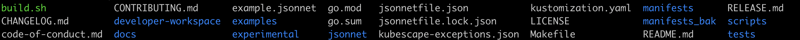
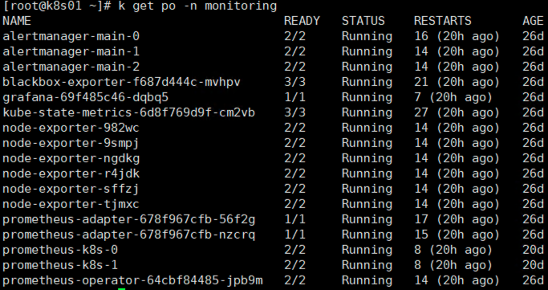

## kube-prometheus on k8s 部署    

### kube-prometheus 介绍    
`kube-prometheus` 是一个开源项目，旨在为 Kubernetes 集群提供简单和全面的监控解决方案。它结合了多个组件，使开发者和操作者可以方便地监控和告警 Kubernetes 的各种方面。    

以下是 `kube-prometheus` 中的核心组件和其功能简介： 
* 1. **Prometheus**：核心的时间序列数据库和监控系统。它是 `kube-prometheus` 的基础，并提供对 Kubernetes 集群中的工作负载、节点和其他组件的指标收集。    
* 2. **Alertmanager**：用于处理由 Prometheus 触发的告警。它可以分组、路由和发送告警到各种外部服务，如邮件、Slack、PagerDuty 等。    
* 3. **node_exporter**：一个代理，部署在每个 Kubernetes 节点上，用于收集操作系统级别的指标。    
4. **kube-state-metrics**：一个服务，用于将 Kubernetes API 服务器的状态信息转化为 Prometheus 可识别的指标格式。 
5. **Grafana**：一个流行的开源仪表盘和可视化平台，用于显示从 Prometheus 中收集的指标。  
6. **Prometheus Operator**：使得管理 Prometheus 实例和相关组件变得更加简单的 Kubernetes Operator。它允许用户定义和管理 Prometheus 和 Alertmanager 实例，以及与之相关的监控和告警规则，使用自定义资源定义（CRD）。   

使用 `kube-prometheus` 的优点： 
- **简单的部署**：通过预先定义的 Kubernetes 清单，您可以轻松地在集群上部署全部组件。    
- **预配置的仪表盘和告警**：`kube-prometheus` 附带了为 Kubernetes 定制的 Grafana 仪表盘和 Prometheus 告警规则，从而为您提供了丰富的监控和告警能力，无需额外配置。       
- **可扩展性**：您可以轻松地添加更多的 Exporters 和监控其他应用或服务。     

### 版本选择    
以下的 Kubernetes 版本是受支持的，并且我们在相应的分支中对这些版本进行了测试。但请注意，其他版本也可能适用！    

| kube-prometheus stack                                                                      | Kubernetes 1.21 | Kubernetes 1.22 | Kubernetes 1.23 | Kubernetes 1.24 | Kubernetes 1.25 | Kubernetes 1.26 | Kubernetes 1.27 |
|--------------------------------------------------------------------------------------------|-----------------|-----------------|-----------------|-----------------|-----------------|-----------------|-----------------|
| [`release-0.9`](https://github.com/prometheus-operator/kube-prometheus/tree/release-0.9)   | ✔               | ✔               | ✗               | ✗               | ✗               | x               | x               |
| [`release-0.10`](https://github.com/prometheus-operator/kube-prometheus/tree/release-0.10) | ✗               | ✔               | ✔               | ✗               | ✗               | x               | x               |
| [`release-0.11`](https://github.com/prometheus-operator/kube-prometheus/tree/release-0.11) | ✗               | ✗               | ✔               | ✔               | ✗               | x               | x               |
| [`release-0.12`](https://github.com/prometheus-operator/kube-prometheus/tree/release-0.12) | ✗               | ✗               | ✗               | ✔               | ✔               | x               | x               |
| [`main`](https://github.com/prometheus-operator/kube-prometheus/tree/main)                 | ✗               | ✗               | ✗               | ✗               | x               | ✔               | ✔               |

### kube-prometheus 部署    

#### 下载 kube-prometheus安装   
请根据上面版本对应关系选择相应的版本资源`https://github.com/prometheus-operator/kube-prometheus/releases`   
```shell
tar -zxf kube-prometheus-0.11.0.tar.gz  
```
  
>manifests_bak 是我自己做的配置文件备份，不是原目录 

#### 安装过程   
`环境配置`：     
`manifests/setup/` 通常包含初始化或基本设置的相关 Kubernetes 清单。这些清单可能涉及：   
* 1. **Custom Resource Definitions (CRDs)**：Prometheus Operator 使用 CRDs 来定义和管理 Prometheus、Alertmanager 实例以及相关的监控和告警规则。`setup/` 通常包含这些 CRDs 的定义。  
* 2. **Prometheus Operator Deployment**: 在部署 Prometheus 和 Alertmanager 实例之前，您首先需要部署 Prometheus Operator。`setup/` 可能包含了 Prometheus Operator 的 Deployment 清单。   
* 3. **RBAC Resources**: 这可能包括与 Prometheus Operator 和其他监控组件相关的 Roles, RoleBindings, ServiceAccounts 等。    
* 4. **Initial Configurations**: 这可能包括一些初步的配置，如 ConfigMaps，用于初始化组件的设置。  
在应用整个 `manifests/` 目录之前，通常首先应用 `manifests/setup/`。这确保了所有必要的基础设施和设置都到位，然后再部署其他监控组件，例如 Prometheus、Alertmanager、Grafana 等。

```shell
kubectl apply --server-side -f manifests/setup  
```

`yaml清单安装`  
`manifests/` 目录包含了为部署和运行 Prometheus、Alertmanager 以及与其相关的各种组件的所有预定义 Kubernetes 清单。 但必须要明确一点， 这里面的yaml并不是我们都要照单全收。请参考`https://github.com/prometheus-operator/kube-prometheus/blob/main/docs/customizing.md`,      
博主举2个场景：    
* 不需要部署`nodeExporter` , 那将 `manifests/nodeExporter-*` 文件删除 
* Prometheus，Grafana，Alertmanager 端口设置`NodePort`访问，没有使用ingress配置访问。则需要将 `manifests/*networkPolicy*` 文件删除。    

**配置 Prometheus-server 存储持久化**   
修改`prometheus-prometheus.yaml`，因为prometheus是`Statefuelset`部署模式，这里使用的operator动态创建pvc存储（并不需要提前创建pvc），并且命名规则会参考pod的命名。   
```yaml
  serviceMonitorNamespaceSelector: {}
  serviceMonitorSelector: {}
  version: 2.36.1   # 该行以下是新增 
  retention: 3d  # 数据保留时长
  storage:
    volumeClaimTemplate:
      spec:
        storageClassName: strage-class # 配置 pvc的storageClass
        resources:
          requests:
            storage: 5Gi
``` 

**配置 Grafana 持久化** 
`由于 ​​Grafana​​​ 是部署模式为 ​​Deployment​​​，所以我们提前为其创建一个 ​​grafana-pvc.yaml ​​​文件，加入下面 ​​PVC​​ 配置`。  
创建`manifests/grafana-pvc.yaml`    
```yaml
kind: PersistentVolumeClaim
apiVersion: v1
metadata:
  name: grafana
  namespace: monitoring  # namespace
spec:
  storageClassName: strage-class # 配置 pvc的storageClass
  accessModes:
    - ReadWriteOnce
  resources:
    requests:
      storage: 5Gi
```

需将 `name: grafana`的volume 配置在`grafana-deployment.yaml`文件中，内容如下：  
```yaml
    serviceAccountName: grafana
    volumes:
    - name: grafana-storage  # 新增
    persistentVolumeClaim:   # 新增
        claimName: grafana   # 新增
            #      - emptyDir: {}
            #        name: grafana-storage
    - name: grafana-datasources
    secret:
        secretName: grafana-datasources
```
> 注意 claimName 要与 grafana-pvc.yaml中的 metadata.name保持一致。  

需提前执行 `kubectl apply -f grafana-pvc.yaml`  .   

>需特别注意： kube-prometheus的`manifests/`目录下 
```shell
# 若以存在，删除即可
kubectl delete networkpolicy --all -n monitoring
```   


**配置 Prometheus Service 访问方式为 NodePort** 
`修改​​prometheus Service​​​端口类型为 ​​NodePort​​​，设置 ​​NodePort​​​ 端口为 ​​32101​​`  
修改`prometheus-service.yaml`   
```yaml
spec:
  type: NodePort  # 新增
  ports:
  - name: web
    port: 9090
    targetPort: web
    nodePort: 32101  # 新增
  - name: reloader-web
    port: 8080
    targetPort: reloader-web
    nodePort: 32102  # 新增
  selector:
    app.kubernetes.io/component: prometheus
```

**配置 Grafana Service 访问方式为 NodePort**   
`修改 ​​garafana service​​​ 端口类型为 ​​NodePort​​​，设置 ​​NodePort ​​​端口为 ​​32102​3`  
修改`grafana-service.yaml`  
```yaml
spec:
  type: NodePort   # 新增
  ports:
  - name: http
    port: 3000
    targetPort: http
    nodePort: 32103  # 新增
  selector:
``` 

**配置 基础环境以及安装**   
对于Prometheus安装需下载相关镜像，这里会存在部分镜像无法拉取情况，建议使用`阿里云的容器镜像服务`管理一些拉取不了的镜像， 一次费劲，后期都收益。请参考`https://cr.console.aliyun.com/cn-hangzhou/instances`。     

```shell
# 安装基础环境
kubectl apply --server-side -f manifests/setup  

# 安装组件
kubectl apply -f manifests/ 
```
安装哪些组件取决 manifests的yaml 文件，这里除了需注意 service使用NodePort通信，则`networkpolicy相关`不能安装。  

      


refer   
1.https://github.com/prometheus-operator/kube-prometheus        
2.https://www.jianshu.com/p/e681e300cfb8        
3.https://blog.51cto.com/u_15294985/5329709 
4.https://github.com/prometheus-operator/kube-prometheus/blob/main/docs/customizing.md  