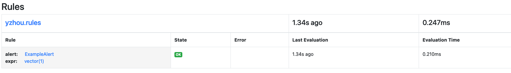
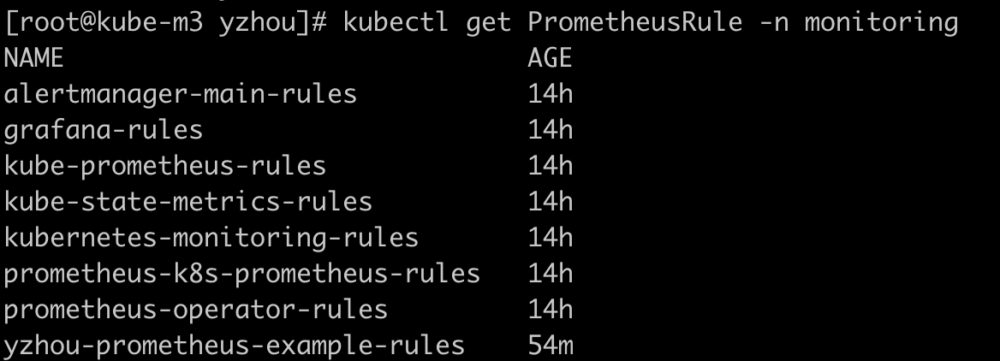
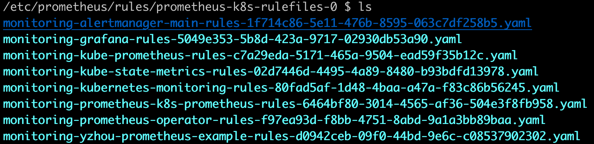

## 动态添加 Prometheus Rule

### 测试 Rule yaml 
```yaml
apiVersion: monitoring.coreos.com/v1
kind: PrometheusRule
metadata:
  labels:
    # labels与Prometheus CRD中match ruleSelector -> matchLabels保持一致。
    prometheus: k8s
    role: alert-rules
  name: yzhou-prometheus-example-rules
  namespace: monitoring
spec:
  groups:
  - name: yzhou.rules
    rules:
    - alert: ExampleAlert
      # expr为PromQL对数据的查询和触发条件，此处可参考本文报警规则说明列表中PromQL配置列。
      expr: vector(1)
```
>这里需特别注意，一定要 这两个参数值： prometheus: k8s,role: alert-rules    

### 操作过程    
```shell
kubectl apply -f rule01.yaml
``` 

* 1.访问 Prometheus Web可查看到 Rules   
      

* 2.执行 `kubectl get PrometheusRule -n monitoring`
  

* 3.登入Prometheus-Server pod，"kubectl exec -it prometheus-k8s-0 /bin/sh -n monitoring",  可查看到 monitoring-yzhou-prometheus开头的配置   
  


refer   
1.https://prometheus-operator.dev/docs/user-guides/alerting/#deploying-prometheus-rules     
2.https://help.aliyun.com/zh/ack/ack-managed-and-ack-dedicated/user-guide/best-practices-for-configuring-alert-rules-in-prometheus  