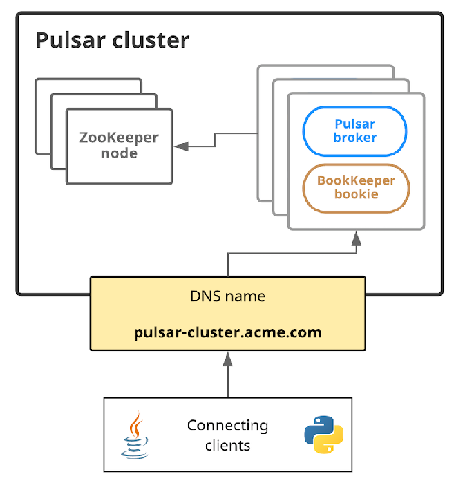
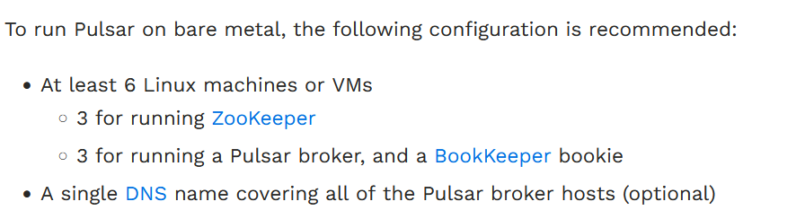

## Apache Pulsar 分布式部署

### 资源分配划分    
* **Zookeeper** Bookkeeper和Pulsar Broker服务都依赖于Zookeeper。    
* **Pulsar Broker** Broker是Pulsar的核心组件    
* **Bookie** Bookie节点是一个独立的Bookkeeper节点，由多个Bookie节点组成的Bookkeeper为Pulsar提供数据持久化存储服务，以及多副本、高可用性、一致性的保障。 
* **必要的命名解析服务** 在所有分布式服务中，都有将一批对等节点组为一个逻辑上的集群，并对外提供服务的需求。因此在生产实践中，需要将一组节点通过命名解析服务对外暴露。用户可以根据企业环境中的实际需求选择Consul服务或者其他域名解析服务。   

结构分布式图：  
   

### 集群搭建
因Zookeeper的集群搭建再简单不过了，这里博主就简化为standalone模式，只启一个Zookeeper节点，目的是简化部署步骤。  

| 机器      |    IP | 角色  |
| :-------- | --------:| :--: |
| VM01  | 192.168.0.201 |  Broker，Bookie，Zookeeper  |
| VM02  | 192.168.0.202 |  Broker，Bookie，Consul  |
| VM03  | 192.168.0.203 |  Broker，Bookie  |  

>虚机环境，建议统一关闭访问墙，避免端口不通，访问不到的问题。 以上是虚机环境，若要在部署生产环境，还需参考 https://pulsar.apache.org/docs/2.11.x/deploy-bare-metal/ 

      

**版本介绍**    
* Zookeeper version：3.5.10
* Pulsar version: 2.11.1
* JDK version: 17

应满足Pulsar官网要求。      

#### Zookeeper部署  
* 将`conf/zoo_sample.cfg`改成`conf/zoo.cfg`     
* 编辑 zoo.cfg 修改`dataDir`参数，防止Centos7会删除临时文件     
* 修改Zookeeper admin端口，从Zookeeper3.6之后的版本，都默认占用8080端口，为了留给Pulsar的REST 端口，在 zoo.cfg中修改`admin.serverPort`参数为8098    

参考以下命令启动zk即可：    
```shell
# 修改dataDir
dataDir=/data/apache-zookeeper-3.5.10-bin/data/zookeeper

# 修改admin端口
admin.serverPort=8098

# 启动Zookeeper
[root@localhost bin]# ./zkServer.sh start
ZooKeeper JMX enabled by default
Using config: /data/apache-zookeeper-3.5.10-bin/bin/../conf/zoo.cfg
Starting zookeeper ... STARTED
```

执行`jps`命令，看到 QuorumPeerMain就代表启动成功了

### 初始化集群元数据    
部署ZooKeeper后，需要将一些集群元数据写入ZooKeeper。只需要写一次这个数据即可。  
Pulsar提供了Shell脚本`pulsar.sh` 对集群进行元数据初始化，此命令可以在 Pulsar 集群中的任何机器上运行，因此可以从 ZooKeeper、代理或 bookie 机器初始化元数据。 
```shell
# 官方文档示例
bin/pulsar initialize-cluster-metadata \
    --cluster pulsar-cluster-1 \ # 代表集群名称
    --metadata-store zk:zk1.us-west.example.com:2181,zk2.us-west.example.com:2181 \ # 代表集群使用的Zookeeper地址
    --configuration-metadata-store zk:zk1.us-west.example.com:2181,zk2.us-west.example.com:2181 \  # pulsar实例所使用的Zookeeper地址
    --web-service-url http://pulsar.us-west.example.com:8080 \ # web服务端口
    --web-service-url-tls https://pulsar.us-west.example.com:8443 \  # Https协议的web服务
    --broker-service-url pulsar://pulsar.us-west.example.com:6650 \  # Broker服务的地址
    --broker-service-url-tls pulsar+ssl://pulsar.us-west.example.com:6651 # 支持加密协议的Broker地址

# 博主示例， 别着急操作，请看下面参数介绍以及多主机节点配置
bin/pulsar initialize-cluster-metadata \
    --cluster pulsar-cluster-1 \ 
    --metadata-store zk:192.168.0.201:2181/test_cluster1 \
    --configuration-metadata-store zk:192.168.0.201:2181/global_zk \  
    --web-service-url http://pulsar.yzhou.example.com:8080 \ 
    --web-service-url-tls https://pulsar.yzhou.example.com:8443 \  
    --broker-service-url pulsar://pulsar.yzhou.example.com:6650 \  
    --broker-service-url-tls pulsar+ssl://pulsar.yzhou.example.com:6651 
```

>有个不同点是，博主的初始化脚本中关于zk的配置都加上自定义路径，这样能有效避免了zk数据读写混乱。     

* **--cluster** 集群名称    
* **--metadata-store**  # 代表集群使用的Zookeeper地址     
* **--confguration-srore** pulsar实例所使用的Zookeeper地址  
* **--web-service-url**  web服务端口
* **--web-service-url-tls** Https协议的web服务
* **--broker-service-url** Broker服务的地址 
* **--broker-service-url-tls** 支持加密协议的Broker地址     

> 在上面的结构分布图中是包含DNS服务，如果你没有 DNS 服务器，你可以配置多主机格式来配置以下参数：    
```shell
--web-service-url http://host1:8080,host2:8080,host3:8080 \
--web-service-url-tls https://host1:8443,host2:8443,host3:8443 \
--broker-service-url pulsar://host1:6650,host2:6650,host3:6650 \
--broker-service-url-tls pulsar+ssl://host1:6651,host2:6651,host3:6651
```
如果你想使用现有的 BookKeeper 集群，你可以添加 --existing-bk-metadata-service-uri 标志，如下所示：  
```shell
--existing-bk-metadata-service-uri "zk+null://zk1:2181;zk2:2181/ledgers" \
--web-service-url http://host1:8080,host2:8080,host3:8080 \
--web-service-url-tls https://host1:8443,host2:8443,host3:8443 \
--broker-service-url pulsar://host1:6650,host2:6650,host3:6650 \
--broker-service-url-tls pulsar+ssl://host1:6651,host2:6651,host3:6651
```
你可以使用 bin/bookkeeper shell whatisinstanceid 命令获取现有 BookKeeper 集群的元数据服务 URI。您必须将值括在双引号中，因为多个元数据服务 URI 用分号分隔。      


### DNS服务器搭建   


refer   
1.https://pulsar.apache.org/docs/2.11.x/deploy-bare-metal/  
2.《Apache Pulsar原理解析与应用实践》       
3.https://xie.infoq.cn/article/4e1b2514b46115f87766b39ec    
