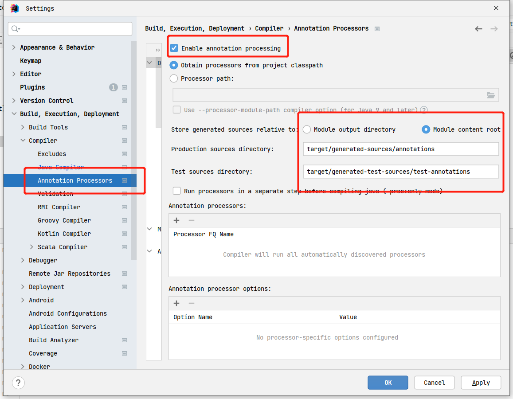
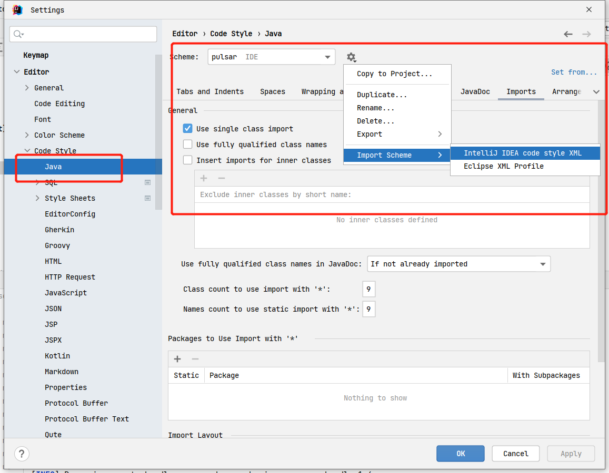

## Apache Pulsar 源码调试环境搭建

>version: 2.11  


### clone源码及编译
```shell
# 克隆项目
git clone git@github.com:apache/pulsar.git

# 编译

# 方式一 全量编译
mvn install -DskipTests

# 方式二 最小化编译
mvn install -Pcore-modules,-main -DskipTests
```

执行`mvn install`可校验JDK、下载Maven依赖等基础环境是否OK。 

### IDE配置

**配置 Annotation Processors**  
Settings -> Build, Execution, Deployment -> Compiler -> Annotation Processors, 选中 `Enable annotation processing`和`Module content root`   
```
target/generated-sources/annotations
target/generated-test-sources/test-annotations
```


**配置 Pulsar code-style.xml**  
Settings -> Editor -> Code Style -> Java -> Import Scheme -> IntelliJ IDEA code style XML   
  

### 源码模块介绍    
它的代码库包含多个模块，每个模块负责一部分特定的功能。以下是 Pulsar 的主要模块及其职责的概述：  

* **pulsar-broker**: 这是 Pulsar 的核心模块，包含了 Pulsar broker 服务的实现。broker 是 Pulsar 系统的主要组件，负责接收和分发消息，处理客户端连接，以及与其他 Pulsar 组件交互。     
* **pulsar-client**: 这个模块包含了 Pulsar 客户端库的实现。客户端库是用户在他们的应用程序中用来连接到 Pulsar 集群并发送/接收消息的接口。        
* **pulsar-common**: 这个模块包含了 Pulsar 项目中多个模块共享的代码，例如一些工具类和基本的数据结构。           
* **managed-ledger**: 这个模块是 Pulsar 的一个关键组件，提供了 Pulsar 主题的实现。每个 Pulsar 主题都对应一个 managed ledger，它使用 BookKeeper 提供的 ledgers 来存储消息。     
* **pulsar-functions**: Pulsar Functions 是 Pulsar 的一个流处理功能，允许用户在 Pulsar 上运行简单的计算任务。这个模块包含了 Pulsar Functions 的实现。  
* **pulsar-admin**: 这个模块包含了 Pulsar 管理工具的实现。Pulsar 管理工具允许管理员执行各种管理和监控任务。    
* **pulsar-io**: 这个模块包含了 Pulsar IO 连接器的实现。Pulsar IO 连接器允许 Pulsar 集群与其他系统进行集成，例如数据库、搜索引擎和其他消息队列。    

以上是 Pulsar 项目的主要模块。除此之外，还有一些其他的模块，例如测试模块（用于运行 Pulsar 的自动化测试），以及一些小的模块（用于特定的功能或集成）。


### 本地调试入口介绍       

* **单元测试**  
* **Pulsar Broker调试**     
* **Pulsar Server Rest API调试**    
* **Pulsar Client API调试** 
* **Pulsar Admin（管控端） API调试**    


### Zookeeper部署
Pulsar的Broker和Bookie都依赖于Zookeeper，所以搭建一个单节点Zookeeper，方面开发测试使用。 但需注意Zookeeper在3.4.6之后的版本，默认的`admin.serverPort`端口是8080，会与Pulsar Broker的默认Http端口冲突，所以需在`zoo.cfg`配置中设置`admin.serverPort=8098`。  
```shell
admin.serverPort=8098   
```


refer   
1.https://www.bilibili.com/video/BV1T741147B6/?p=37&vd_source=89b3f4bd088c6355f40a00df74cf8ffd  
2.https://mp.weixin.qq.com/s/l4kkFoRHeDKWKE6rWCyJCw 
3.https://boatrainlsz.github.io/posts/pulsar_debug_in_ide/      
