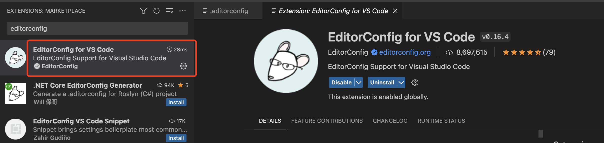

### Vite 项目 
创建项目        
```shell
# 使用 NPM：
npm init vite@latest

# 使用 Yarn
yarn create vite

# 使用 PNPM 
pnpm create vite        
```

>项目配置    

### editorconfig  

**1.** 项目根目录创建 `.editorconfig` 文件, 并添加以下内容 
```js
# https://editorconfig.org
root = true

[*]
charset = utf-8
indent_style = space
indent_size = 2
end_of_line = lf
insert_final_newline = true
trim_trailing_whitespace = true

[*.md]
insert_final_newline = false  
trim_trailing_whitespace = false    
```

**配置解读**  
root=true 对所有文件生效
end_of_line=lf 不同操作系统换行符不同
```
end_of_line
lf | cr | crlf (大小写不限）

end_of_line 设置的换行符的表示方式   

先看一下这几个值是什么意思
lf：全拼Line Feed，意思是换行，用符号 \n 表示
cr: 全拼Carriage Return， 意思是回车， 用符号 \r 表示
crlf：cr 和 lf的结合，回车换行，用符号 \r\n
```

insert_final_newline = true 代码最后新增一行        
trim_trailing_whitespace = true 修剪尾随空格            

**2.** 安装 editorconfig for vs code 插件 (否则配置不可生效)     
     


### npm/yarn 

环境安装和配置 
**1.** 下载最新稳定版 Node.js               
**2.** 安装cnpm、yarn或者pnpm         
```shell
# 安装yarn
npm install -g yarn
# 安装pnpm
npm install -g pnpm
npm安装文档：https://pnpm.io/installation           
```

>源注册地址：
`yarn config get registry`
https://registry.yarnpkg.com            

**3.** npm 修改配置   
在项目根目录（package.json同一目录）中新建 .npmrc 文件，编辑文件内容如下：           
```
registry=https://registry.npm.taobao.org    
```
保存后再使用 `npm install` 下载包的速度会快很多     

**4.** yarn 修改配置        
在项目根目录（package.json同一目录）中新建 .yarnrc 文件，编辑文件内容如下：          
```
registry "https://registry.npm.taobao.org"
```

**5.** 命令行修改配置      
```
npm config set registry https://registry.npm.taobao.org
yarn config set registry https://registry.npm.taobao.org
```

### pnpm 介绍     
```shell
# 安装 
npm install -g pnpm 
pnpm init 
```

一、什么是 pnpm
快速的，节省磁盘空间的包管理工具。

二、pnpm 的特点 
1、快速
pnpm比其他包管理器快2倍。       
2、高效
node_modules 中的文件为复制或链接自特定的内容寻址存储库。       
3、支持monorepos
pnpm内置支持单仓多包。      
4、严格
pnpm默认创建了一个非平铺的 node_modules，因此代码无法访问任意包。       

**pnpm使用命令**
```
pnpm install 包名 //
pnpm i 包名
pnpm add 包名 // -S 默认写入dependencies
pnpm add -D // -D devDependencies
pnpm add -g // 全局安装
pnpm remove 包名 //移除
pnpm up //更新所有依赖项
pnpm upgrade 包 //更新包
pnpm upgrade 包 --global //更新全局包
```     

### Prettier 集成 (语法格式化)           

测试地址： https://prettier.io/playground/      

#### 部分配置：  
* trailingComma ：对象的最后一个属性末尾也会添加 , ，比如 { a: 1, b: 2 } 会格式为 { a: 1, b: 2, }           
* tabWidth ：缩进大小             
* semi ：是否添加分号           
* singleQuote ：是否单引号            
* jsxSingleQuote ：jsx语法下是否单引号。      
* endOfLine ：与 .editorconfig 保持一致设置           
* printWidth ：单行代码最长字符长度，超过之后会自动格式化换行         
* bracketSpacing ：在对象中的括号之间打印空格， {a: 5} 格式化为 { a: 5 }          
* arrowParens ：箭头函数的参数无论有几个，都要括号包裹。比如 (a) => {} ，如果设为 avoid ，会自动格式化为 a => {}            

#### 安装配置流程  
1.安装 prettier 插件和 vscode 扩展 https://www.prettier.cn/ (https://marketplace.visualstudio.com/items?itemName=esbenp.prettier-vscode)        
```shell
# 安装 prettier
yarn add prettier -D 
```

2.prettier配置, 在根目录下创建 `.prettierrc.cjs` 文件，内容如下：                
```
module.exports = {
// 每行最大列，超过换行
printWidth: 120,
// 使用制表符而不是空格缩进
useTabs: false,
// 缩进
tabWidth: 2,
// 结尾不用分号
semi: false,
// 使用单引号
singleQuote: true,
// 在JSX中使用单引号而不是双引号
jsxSingleQuote: true,
// 箭头函数里面，如果是一个参数的时候，去掉括号
arrowParens: 'avoid',
// 对象、数组括号与文字间添加空格
bracketSpacing: true,
// 尾随逗号
trailingComma: 'none',
}
```

3.在项目根目录新建一个文件夹 .vscode ，在此文件下再建一个 settings.json 文件            

代码保存时会自动格式化代码      
```json
{
    "editor.formatOnSave": true,
    "editor.codeActionsOnSave":
    {
        "source.fixAll": true
    },
    "editor.defaultFormatter": "esbenp.prettier-vscode"
}
```   

### eslint (语法检查)       

>如果使用`yarn create vite` 创建的项目自带的有 `.eslintrc.cjs`文件，则不需要再次安装 `eslint`。   

官方链接：Getting Started withESLint - ESLint - PluggableJavaScript Linter(https://eslint.org/docs/latest/use/getting-started)            

Prettier 都是为了解决代码风格问题，而 ESLint 是主要为了解决代码质量问题，它能在我们编写代码时就检测出程序可能出现的隐性BUG，通过 `eslint --fix` 还能自动修复一些代码写法问题，比如你定义了 var a = 3 ，自动修复后为 const a = 3 。还有许多类似的强制扭转代码最佳写法的规则，在无法自动修复时，会给出红线提示，强迫开发人员为其寻求更好的解决方案。        

首先在项目中安装 eslint ：  
```shell
# npm
npm init @eslint/config
# 或者
npx eslint --init
# 使用yarn时，需要先安装eslint插件才可以执行命令
yarn add eslint -D
yarn eslint --init
# pnpm
pnpm eslint --init
```

#### 初始化过程：   
* How would you liketo use ESLint?  
选择第三条 To check syntax, find problems, and enforce code style ，检查语法、检测问题并强制代码风格。    

* What type ofmodules does your project use?      
采用的 ES6 模块系统导入导出，选择 JavaScript modules (import/export) 。     

* Which framework does your project use?    
选择 React 。     

* Does your project use TypeScript?   
选择 Yes 后生成的 eslint 配置文件会给我们默认配上支持 Typescript 的 parse 以及插件 plugins 等。     

* Where does yourcoderun?       
Browser 和 Node 环境都选上，之后可能会编写一些 node 代码。      

* What format do youwant yourconfig fileto bein?        
选择 JavaScript ，即生成的配置文件是 js 文件，配置更加灵活。    

* Would you liketo installthemnowwith npm?      
当然 Yes 了～ 

在漫长的安装结束后，项目根目录下多出了新的文件 .eslintrc.cjs ，这便是我们的 eslint 配置文件了。其默认内容如下：   
```
module.exports = {
  parser: {}, // 解析器
  extends: [], // 继承的规则 [扩展]
  plugins: [], // 插件
  rules: {} // 规则
};

module.exports = {
  env: {
    browser: true,
    es2021: true,
    node: true
  },
  extends: [
    "eslint:recommended",
    "plugin:react/recommended",
    "plugin:@typescript-eslint/recommended",
  ],
  overrides: [],
  parser: "@typescript-eslint/parser",
  parserOptions: {
    ecmaVersion: "latest",
    sourceType: "module",
  },
  plugins: ["react", "@typescript-eslint"],
    /*
    * "off" 或 0 ==> 关闭规则
    * "warn" 或 1 ==> 打开的规则作为警告（不影响代码执行）
    * "error" 或 2 ==> 规则作为一个错误（代码不能执行，界面报错）
    */
  rules: {
    'react/react-in-jsx-scope': 'off',
    'no-console': 'error', // 禁止使用console
    'no-unused-vars': 'error',// 禁止定义未使用的变量
    'no-debugger': 'error', // 禁止使用debugger
    'no-var': 'error', // 要求使用 let 或 const 而不是 var
  },
};
```
**Prettier和ESLint冲突问题**  
如果项目出现规则冲突以后，需要安装以下插件解决冲突，如果未出现冲突，则可以忽略。      
安装插件 `eslint-plugin-prettier` `eslint-config-prettier`    
```
npm install eslint-plugin-prettier eslint-config-prettier -D  
```
* eslint-config-prettier 的作用是关闭eslint中与prettier相互冲突的规则。     
* eslint-plugin-prettier 的作用是赋予eslint用prettier格式化代码的能力。     

安装依赖并修改.eslintrc文件     
prettier 添加到 extends的最后     
```
"extends":[ …, “plugin:prettier/recommended”]   
```


### Mono Repo 搭建  
参考 `https://pnpm.io/pnpm-workspace_yaml` 
1.创建 `pnpm-workspace.yaml` 

2.将以下内容放入 yaml 文件即可。    
```
packages:
  # all packages in direct subdirs of packages/
  - 'packages/*'
```

3.在根目录下创建 packages 文件夹


### 开发规范    
1.代码规范： lint 工具 
`eslint`
```shell
# 安装  -w ：表示 根目录下
pnpm i eslint -D -w 

# 初始化 
npx eslint --init 
# 此时注意 ,我们想把代码风格的检查交给其他 ,所以 我们的 eslint 只检查语法和发现错误。   
```
