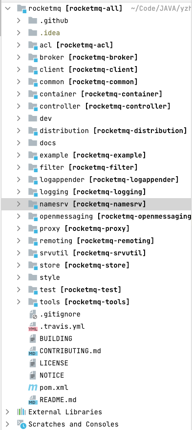
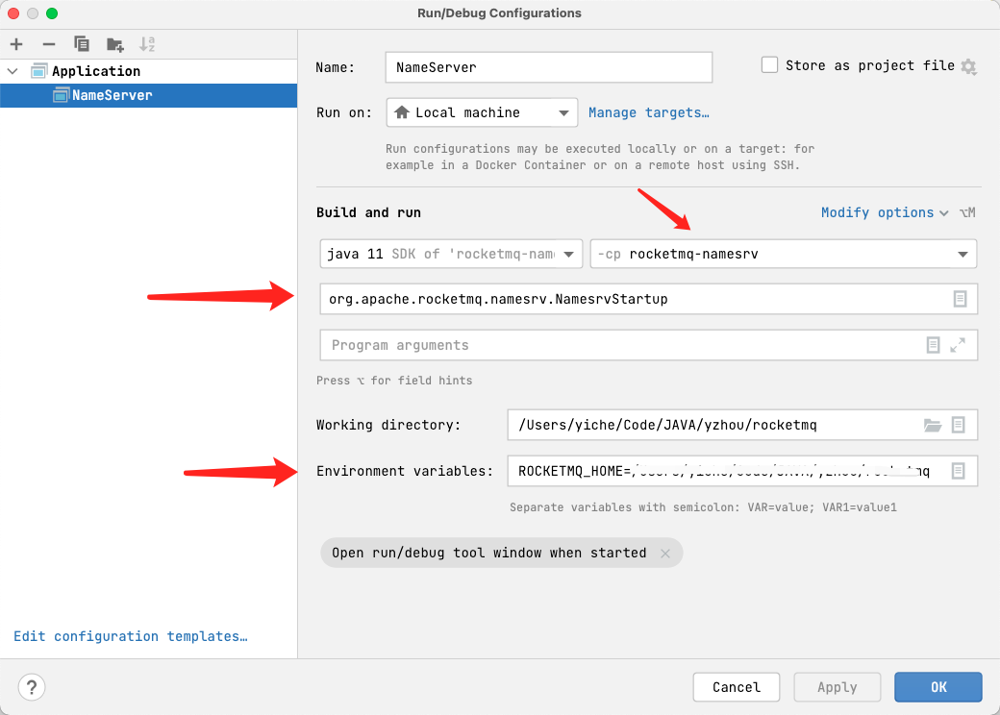
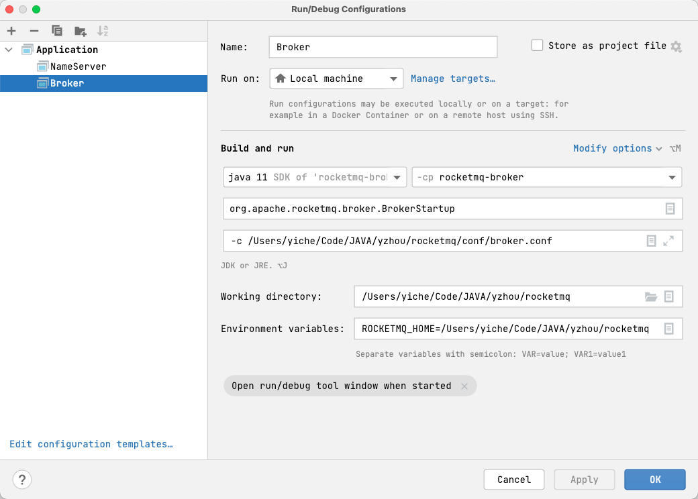

## 搭建RocketMQ源码调试环境

>本文将展示如何在IntelliJ IDEA中启动NameServer、Broker(version=4.9.5), 并编写一个消息发送与消息消费示例程序

### 下载源码及了解RocketMQ源码的模块名称
通过`git clone https://github.com/apache/rocketmq` 下载RocketMQ源码，通过IntelliJ IDEA导入项目



### 1.启动NameServer
首先展开`namesrv模块`，将`NamesrvStartup.java`配置NameServer模块的启动类，其次在**Environment variablles**配置`ROCKETMQ_HOME`环境变量，而value输入源码的保存路径


**设置broker.conf配置** 
在RocketMQ项目主目录下创建conf文件夹，以`distribution模块`conf下broker.conf为配置样板，将broker.conf拷贝到conf目录下，设置成以下内容, 下面以store开头的路径配置按照实际情况配置即可

新增配置项： namesrvAddr、storePathRootDir、storePathCommitLog、storePathConsumeQueue、storePathIndex、storeCheckpoint、abortFile

这里需要注意，abort,checkpoint是文件而不是文件夹路径

```
brokerClusterName = DefaultCluster
brokerName = broker-a
brokerId = 0
deleteWhen = 04
fileReservedTime = 48
brokerRole = ASYNC_MASTER
flushDiskType = ASYNC_FLUSH

# 新增配置
namesrvAddr=127.0.0.1:9876
# 存储路径
storePathRootDir=/Users/yiche/Code/JAVA/yzhou/rocketmq/tmp/store
# CommitLog存储路径
#storePathCommitLog=/Users/yiche/Code/JAVA/yzhou/rocketmq/tmp/store/commitlog
# 消费队列存储路径
#storePathConsumeQueue=/Users/yiche/Code/JAVA/yzhou/rocketmq/tmp/store/consumequeue
# 消息索引存储路径
#storePathIndex=/Users/yiche/Code/JAVA/yzhou/rocketmq/tmp/store/index
# checkpoint文件存储路径
#storeCheckpoint=/Users/yiche/Code/JAVA/yzhou/rocketmq/tmp/store/checkpoint
# abort文件存储路径
#abortFile=/Users/yiche/Code/JAVA/yzhou/rocketmq/tmp/store/abort
```

**设置logs** 
在RocketMQ项目主目录下创建logs文件夹，将`distribution模块`conf下`logback_broker.xml`,`logback_namesrv.xml`拷贝到conf目录，并根据logback配置的日志目录，创建logs文件夹
```
<file>${user.home}/logs/rocketmqlogs/namesrv_default.log</file>
```

>启动NameServer后，控制台显示 "The Name Server boot success. serializeType=JSON",则表示已成功

### 2.启动Broker
首先展开`broker模块`，将`BrokerStartup.java`配置broker模块的启动类，其次在**Environment variablles**配置`ROCKETMQ_HOME`环境变量，而value输入源码的保存路径, 配置 -c属性指定broker配置文件路径



>启动Broker后，控制台显示 "The broker[broker-a, 10.168.44.14:10911] boot success. serializeType=JSON and name server is 127.0.0.1:9876",则表示已成功


### 3.遇到的问题

1.java.io.FileNotFoundException: /Users/yiche/Code/JAVA/yzhou/rocketmq/tmp/store/checkpoint (Is a directory)

在`broker.conf` 关于路径先只配置 `storePathRootDir`参数项即可

2.idea 分别namesrv、broker服务各自的控制台没有启动log

这是因为在`logback_broker.xml`、`logback_namesrv.xml`中并没有配置console appender 