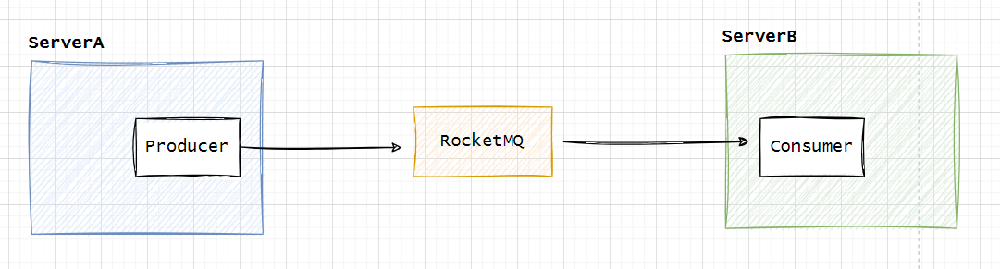
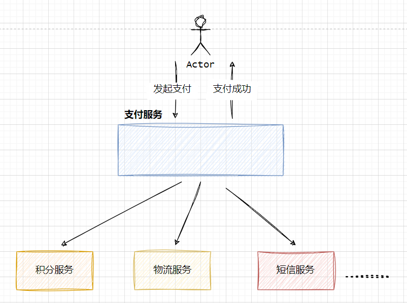
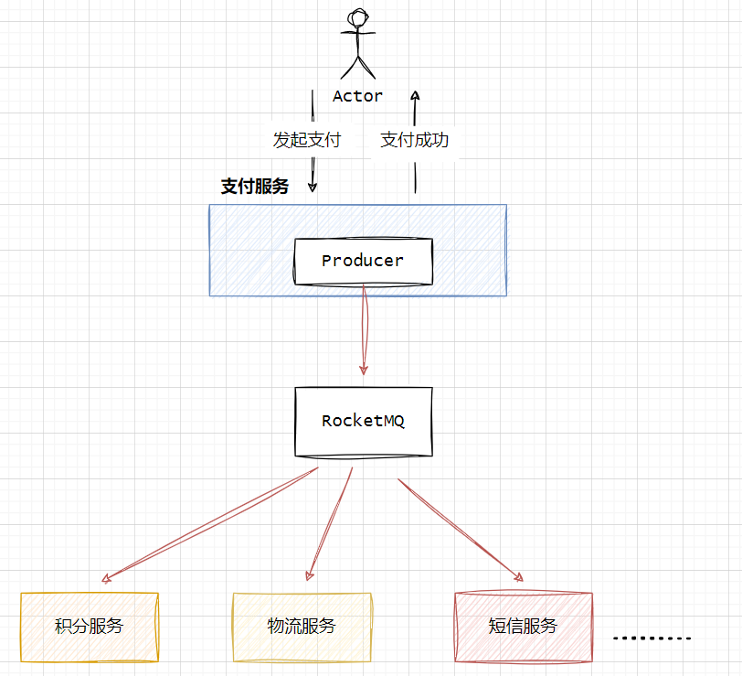
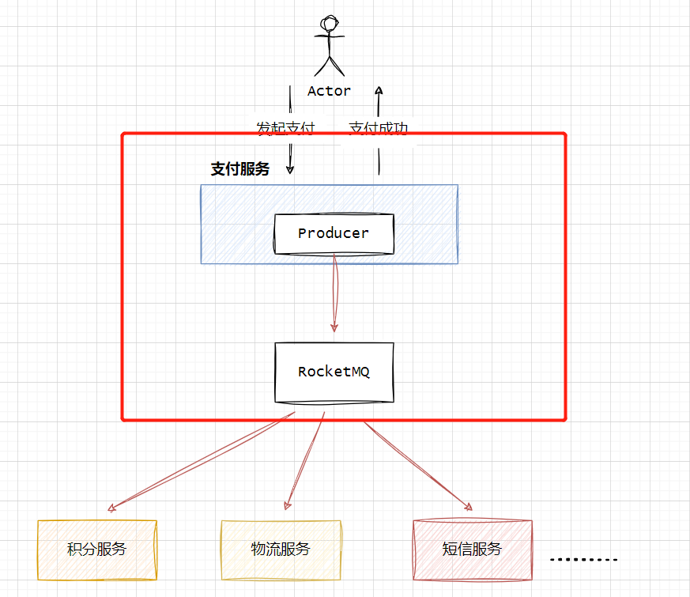
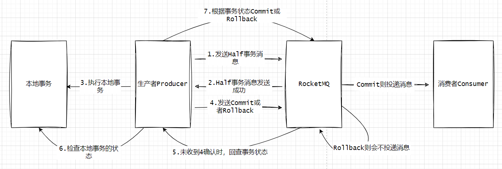
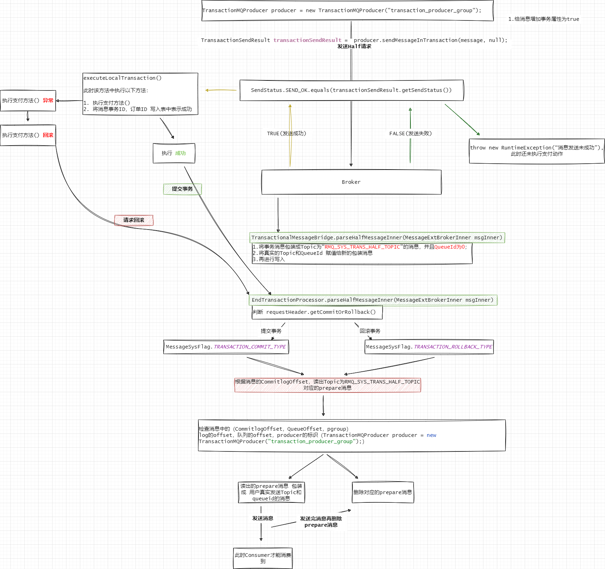
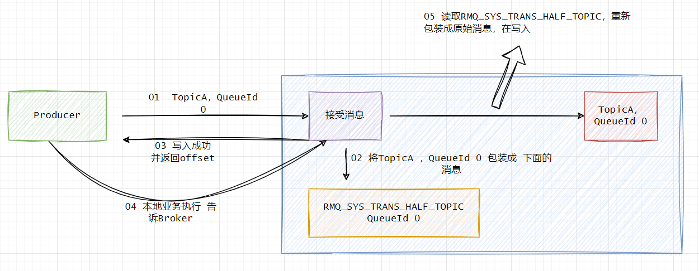
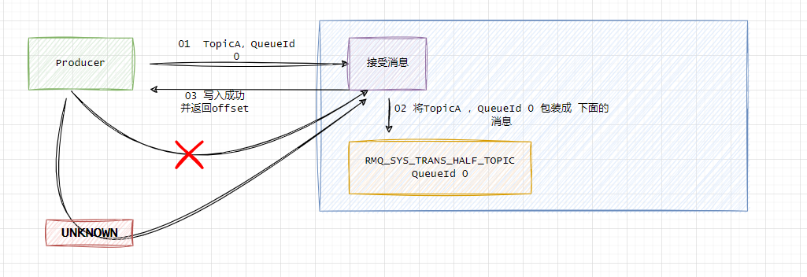

## 事务消息

### 引言
看到这篇Blog，博主认为你对RocketMQ的Producer如何发送消息，Consumer如何消费消息都有一定的了解，下面展示基本结构图

从ServerA生产数据到ServerB消费数据，这里面的2个环节（生产、消费）都存在业务处理上的“数据丢失问题”，而`RocketMQ的事务消息仅是为了保证ServerA业务与RocketMQ消息最终一致性的问题`。下面通过模拟订单支付业务来说明。

### 订单支付业务（模拟，任意1写多读"广播模式"强一致性业务都能体现出以下场景）
以电商交易场景为例，用户支付订单这一核心操作的同时会涉及到下游物流发货、积分变更、短信通知等多个子系统的变更。当前业务的处理分支包括：  
* 物流系统状态新增：新增待发货物流记录，创建订单物流记录。  
* 积分系统状态变更：变更用户积分，更新用户积分表。  
* 短信通知：发送信息通知用户支付完成。  


此时支付系统通过网络调用(HTTP/RPC)通知第三方服务处理相关逻辑，这种方式最大的好处是能利用分布式事务解决数据的一致性问题，但暴露以下缺点：    
**1.** 即使是异步调用第三方，也会随着下游业务对接增多，导致支付服务处理耗时增加，并且增加核心业务不稳定情况。    
**2.** 在分布式事务保证一致性情况下，面对不同重要层次业务做到回滚上游业务，是非常不可取。这里必须强调业务极高耦合的业务才能这样做。 

于是针对以上缺点，将支付服务和其他第三方服务利用消息发送和订阅架构进行解耦。最终多服务调用链路图变成以下结构：  

此时支付服务只需将支付成功的订单数据发送给RocketMQ中Topic，第三方服务（积分服务、物流服务、短信服务等）通过广播模式消费RocketMQ中某个Topic，这样就做到了服务的解耦，极大简化了支付服务与其他服务的耦合关系。    

`第三方服务以前通过分布式事务保证与支付服务的一致性问题，例如如果积分服务处理失败后通知事务中心TransactionManager告诉支付服务需回滚本地事务，于是支付服务回滚数据并返回给用户支付失败`，改进后的支付服务并不知道下游涉及到什么第三方服务，故支付服务发送消息给RocketMQ，当RocketMQ确认消息写入OK，支付服务才能提交本地事务，若RockerMQ消息写入失败则支付服务需回滚本地事务，这个过程还需特别注意：当支付服务接受到RocketMQ消息写入成功且本地事务提交成功，下游第三方业务才能消费该消息，否则可能会出现以下数据不一致情况：   
* 订单服务支付成功，RocketMQ未写入成功，第三方服务未消费到。
* 订单服务发生异常，但RocketMQ在订单服务提交本地事务前已写入消息，那第三方服务消费到数据，可订单服务因未能提交事务导致数据未成功写入。  

### 订单服务与RocketMQ的最终一致性
在重要业务场景下，支付服务与RocketMQ之间的数据最终一致性是何等重要，可能会存在反驳点：`是支付重要`还是`下游重要`，假若支付成功，消息没写入，增加补偿措施，补救一条消息，延迟处理，若支付失败，可消息写入成功，那下游处理时回调支付服务接口，判断订单状态补救。 `太难了，针对时效性高的业务，补偿未免做到高时效性。`     




### 事务消息
在RocketMQ中将具备提交、回滚和统一协调的能力的消息成为`事务消息`。它在普通消息基础上支持二阶段的提交能力。将二阶段提交和本地事务绑定，实现全局提交结果的一致性。下面了解事务消息该如何发送？    
```java

public static void main(String[] args) throws MQClientException, InterruptedException {
    // Step 1: 创建一个 TransactionMQProducer 实例
    TransactionMQProducer producer = new TransactionMQProducer("transaction_producer_group");
    // Step 2: 设置 NameServer 地址
    producer.setNamesrvAddr("127.0.0.1:9876");
    // Step 3: 注册事务监听器
    producer.setTransactionListener(new TransactionListener() {
        @Override
        public LocalTransactionState executeLocalTransaction(Message msg, Object arg) {
            return LocalTransactionState.COMMIT_MESSAGE;
        }

        @Override
        public LocalTransactionState checkLocalTransaction(MessageExt msg) {
            return LocalTransactionState.COMMIT_MESSAGE;
        }
    });

    // Step 4: 启动生产者
    producer.start();

    // Step 5: 构造一个 Message 实例
    Message message = new Message("transaction_topic", "transaction_tag", "transaction_key", "Hello Transaction Message".getBytes());

    // Step 6: 调用 sendMessageInTransaction 方法发送事务消息
    SendResult sendResult = producer.sendMessageInTransaction(message, null);

    System.out.printf("Transaction Message Send Result: %s%n", sendResult);

    // 暂停，以便观察事务消息的发送和消费过程
    Thread.sleep(1000 * 10);

    // Step 7: 在适当的时候关闭生产者
    producer.shutdown();
}

```

* Producer发送事务消息，使用的是`TransactionMQProducer`。
* 需实现TransactionListener接口（匿名类/实现TransactionListener）且`producer.setTransactionListener`配置实现对象
* `Producer使用sendMessageInTransaction()`发送消息

接下来，重点关注`TransactionListener`接口的`executeLocalTransaction()`和`checkLocalTransaction()`两个方法的作用和生命周期


### 执行本地事务    

**整个事务消息的详细交互流程如下图所示：**
  

**executeLocalTransaction()** 在图中`step3 执行本地事务`    
**checkLocalTransaction()** 在图中`step6 检查本地事务状态`  
 

  

我们先暂时不去讨论上面超大的流程图，先梳理下面简易且“成功写入”事务消息流程  
 

当事务Producer准备将消息TopicA，QueueId 0 发送给Broker之前，会通过设置`MessageConst.PROPERTY_TRANSACTION_PREPARED`(MessageAccessor.putProperty(msg, MessageConst.PROPERTY_TRANSACTION_PREPARED, "true");)属性为true，标记该消息是`事务消息`，当Broker接受到消息会根据`MessageConst.PROPERTY_TRANSACTION_PREPARED`值若为true，则将TopicA，QueueId 0的消息包装成一个`RMQ_SYS_TRANS_HALF_TOPIC，QueueId 0`的消息，同时也将TopicA，QueueId 0等信息也赋值给包装后的消息中，这意味着此时新的消息包含即将写入的Topic信息，也包含原始的信息。

Broker将包装后的消息写入成功后，返回给Producer，这时Producer会判断返回状态，成功的话会执行本地事务方法，也就是在Producer通过匿名类定义的`executeLocalTransaction()`方法。若executeLocalTransaction()在执行过程中没有任务，那通过`显示`地标记当前事务为**LocalTransactionState.COMMIT_MESSAGE**， 这里请大家注意：经可能catch异常再返回再返回**LocalTransactionState.ROLLBACK_MESSAGE**，若不捕获，此时Broker收到是**LocalTransactionState.UNKNOW** 那么Broker会在再请求Producer端执行checkLocalTransaction()检查当前事务状态，下面会介绍该方法。

当Broker接受到第二次请求，请求类型是提交事务，此时根据第一次写入包装消息后返回的offset作为请求参数查询出包装消息，并且会根据消息的CommitlogOffset、QueueOffset、producer标识确定是想要的，接下来会从查出的包装消息里存储的原始的TopicA，QueueId 0 重新包装成原始消息模样，再写入到磁盘里，成功之后会将包装消息做删除操作，完成以上操作后下游的Consumer就可以消费到事务消息。    

接下来，我们回到那张超大的流程图，一定需结合本地Debug，只有这样你印象会更深刻（当你完成RocketMQ源码调试环境后，模拟发送事务消息）   

**Producer发送prepare消息**

`DefaultMQProducerImpl.sendMessageInTransaction()`
```java
public TransactionSendResult sendMessageInTransaction(final Message msg,
    final LocalTransactionExecuter localTransactionExecuter, final Object arg)
    throws MQClientException {
    TransactionListener transactionListener = getCheckListener();
    // yzhou 判断producer transactionListener参数是否设值
    if (null == localTransactionExecuter && null == transactionListener) {
        throw new MQClientException("tranExecutor is null", null);
    }

    // ignore DelayTimeLevel parameter
    if (msg.getDelayTimeLevel() != 0) {
        MessageAccessor.clearProperty(msg, MessageConst.PROPERTY_DELAY_TIME_LEVEL);
    }

    Validators.checkMessage(msg, this.defaultMQProducer);

    SendResult sendResult = null;
    // yzhou 为消息增加“事务消息”属性
    MessageAccessor.putProperty(msg, MessageConst.PROPERTY_TRANSACTION_PREPARED, "true");
    MessageAccessor.putProperty(msg, MessageConst.PROPERTY_PRODUCER_GROUP, this.defaultMQProducer.getProducerGroup());
    try {
        // yzhou 发送消息
        sendResult = this.send(msg);
    } catch (Exception e) {
        throw new MQClientException("send message Exception", e);
    }

    LocalTransactionState localTransactionState = LocalTransactionState.UNKNOW;
    Throwable localException = null;
    switch (sendResult.getSendStatus()) {
        case SEND_OK: {
            try {
                if (sendResult.getTransactionId() != null) {
                    msg.putUserProperty("__transactionId__", sendResult.getTransactionId());
                }
                String transactionId = msg.getProperty(MessageConst.PROPERTY_UNIQ_CLIENT_MESSAGE_ID_KEYIDX);
                if (null != transactionId && !"".equals(transactionId)) {
                    msg.setTransactionId(transactionId);
                }
                if (null != localTransactionExecuter) {
                    localTransactionState = localTransactionExecuter.executeLocalTransactionBranch(msg, arg);
                } else if (transactionListener != null) {
                    log.debug("Used new transaction API");
                    // yzhou 发送消息成功，执行本地事务
                    localTransactionState = transactionListener.executeLocalTransaction(msg, arg);
                }
                if (null == localTransactionState) {
                    localTransactionState = LocalTransactionState.UNKNOW;
                }

                if (localTransactionState != LocalTransactionState.COMMIT_MESSAGE) {
                    log.info("executeLocalTransactionBranch return {}", localTransactionState);
                    log.info(msg.toString());
                }
            } catch (Throwable e) {
                log.info("executeLocalTransactionBranch exception", e);
                log.info(msg.toString());
                localException = e;
            }
        }
        break;
        case FLUSH_DISK_TIMEOUT:
        case FLUSH_SLAVE_TIMEOUT:
        case SLAVE_NOT_AVAILABLE:
            localTransactionState = LocalTransactionState.ROLLBACK_MESSAGE;
            break;
        default:
            break;
    }

    try {
        // yzhou 如果半消息发送失败或本地事务执行失败告诉服务端是删除半消息，半消息发送成功且本地事务执行成功则告诉服务端生效半消息
        this.endTransaction(msg, sendResult, localTransactionState, localException);
    } catch (Exception e) {
        log.warn("local transaction execute " + localTransactionState + ", but end broker transaction failed", e);
    }

    TransactionSendResult transactionSendResult = new TransactionSendResult();
    transactionSendResult.setSendStatus(sendResult.getSendStatus());
    transactionSendResult.setMessageQueue(sendResult.getMessageQueue());
    transactionSendResult.setMsgId(sendResult.getMsgId());
    transactionSendResult.setQueueOffset(sendResult.getQueueOffset());
    transactionSendResult.setTransactionId(sendResult.getTransactionId());
    transactionSendResult.setLocalTransactionState(localTransactionState);
    return transactionSendResult;
}
```


**执行本地事务后 将结果返回给Broker**
`DefaultMQProducerImpl.endTransaction()`
```java
public void endTransaction(
    final Message msg,
    final SendResult sendResult,
    final LocalTransactionState localTransactionState,
    final Throwable localException) throws RemotingException, MQBrokerException, InterruptedException, UnknownHostException {
    final MessageId id;
    if (sendResult.getOffsetMsgId() != null) {
        id = MessageDecoder.decodeMessageId(sendResult.getOffsetMsgId());
    } else {
        id = MessageDecoder.decodeMessageId(sendResult.getMsgId());
    }
    String transactionId = sendResult.getTransactionId();
    final String brokerAddr = this.mQClientFactory.findBrokerAddressInPublish(sendResult.getMessageQueue().getBrokerName());
    EndTransactionRequestHeader requestHeader = new EndTransactionRequestHeader();
    requestHeader.setTransactionId(transactionId);
    requestHeader.setCommitLogOffset(id.getOffset());
    requestHeader.setBname(sendResult.getMessageQueue().getBrokerName());
    switch (localTransactionState) {
        case COMMIT_MESSAGE:
            requestHeader.setCommitOrRollback(MessageSysFlag.TRANSACTION_COMMIT_TYPE);
            break;
        case ROLLBACK_MESSAGE:
            requestHeader.setCommitOrRollback(MessageSysFlag.TRANSACTION_ROLLBACK_TYPE);
            break;
        case UNKNOW:
            requestHeader.setCommitOrRollback(MessageSysFlag.TRANSACTION_NOT_TYPE);
            break;
        default:
            break;
    }

    doExecuteEndTransactionHook(msg, sendResult.getMsgId(), brokerAddr, localTransactionState, false);
    requestHeader.setProducerGroup(this.defaultMQProducer.getProducerGroup());
    requestHeader.setTranStateTableOffset(sendResult.getQueueOffset());
    requestHeader.setMsgId(sendResult.getMsgId());
    String remark = localException != null ? ("executeLocalTransactionBranch exception: " + localException.toString()) : null;
    this.mQClientFactory.getMQClientAPIImpl().endTransactionOneway(brokerAddr, requestHeader, remark,
        this.defaultMQProducer.getSendMsgTimeout());
}
```

**Broker处理half消息**
`SendMessageProcessor.asyncSendMessage()`
```java
private CompletableFuture<RemotingCommand> asyncSendMessage(ChannelHandlerContext ctx, RemotingCommand request,
                                                            SendMessageContext mqtraceContext,
                                                            SendMessageRequestHeader requestHeader) {
    final RemotingCommand response = preSend(ctx, request, requestHeader);
    final SendMessageResponseHeader responseHeader = (SendMessageResponseHeader)response.readCustomHeader();

    if (response.getCode() != -1) {
        return CompletableFuture.completedFuture(response);
    }

    final byte[] body = request.getBody();

    int queueIdInt = requestHeader.getQueueId();
    TopicConfig topicConfig = this.brokerController.getTopicConfigManager().selectTopicConfig(requestHeader.getTopic());

    if (queueIdInt < 0) {
        queueIdInt = randomQueueId(topicConfig.getWriteQueueNums());
    }

    MessageExtBrokerInner msgInner = new MessageExtBrokerInner();
    msgInner.setTopic(requestHeader.getTopic());
    msgInner.setQueueId(queueIdInt);

    if (!handleRetryAndDLQ(requestHeader, response, request, msgInner, topicConfig)) {
        return CompletableFuture.completedFuture(response);
    }

    msgInner.setBody(body);
    msgInner.setFlag(requestHeader.getFlag());
    Map<String, String> origProps = MessageDecoder.string2messageProperties(requestHeader.getProperties());
    MessageAccessor.setProperties(msgInner, origProps);
    msgInner.setBornTimestamp(requestHeader.getBornTimestamp());
    msgInner.setBornHost(ctx.channel().remoteAddress());
    msgInner.setStoreHost(this.getStoreHost());
    msgInner.setReconsumeTimes(requestHeader.getReconsumeTimes() == null ? 0 : requestHeader.getReconsumeTimes());
    String clusterName = this.brokerController.getBrokerConfig().getBrokerClusterName();
    MessageAccessor.putProperty(msgInner, MessageConst.PROPERTY_CLUSTER, clusterName);
    if (origProps.containsKey(MessageConst.PROPERTY_WAIT_STORE_MSG_OK)) {
        // There is no need to store "WAIT=true", remove it from propertiesString to save 9 bytes for each message.
        // It works for most case. In some cases msgInner.setPropertiesString invoked later and replace it.
        String waitStoreMsgOKValue = origProps.remove(MessageConst.PROPERTY_WAIT_STORE_MSG_OK);
        msgInner.setPropertiesString(MessageDecoder.messageProperties2String(msgInner.getProperties()));
        // Reput to properties, since msgInner.isWaitStoreMsgOK() will be invoked later
        origProps.put(MessageConst.PROPERTY_WAIT_STORE_MSG_OK, waitStoreMsgOKValue);
    } else {
        msgInner.setPropertiesString(MessageDecoder.messageProperties2String(msgInner.getProperties()));
    }

    CompletableFuture<PutMessageResult> putMessageResult = null;
    // yzhou 获取事务消息的特有的属性值，等于 true表示是事务消息
    String transFlag = origProps.get(MessageConst.PROPERTY_TRANSACTION_PREPARED);
    if (Boolean.parseBoolean(transFlag)) {
        if (this.brokerController.getBrokerConfig().isRejectTransactionMessage()) {
            response.setCode(ResponseCode.NO_PERMISSION);
            response.setRemark(
                    "the broker[" + this.brokerController.getBrokerConfig().getBrokerIP1()
                            + "] sending transaction message is forbidden");
            return CompletableFuture.completedFuture(response);
        }
        putMessageResult = this.brokerController.getTransactionalMessageService().asyncPrepareMessage(msgInner);
    } else {
        putMessageResult = this.brokerController.getMessageStore().asyncPutMessage(msgInner);
    }
    return handlePutMessageResultFuture(putMessageResult, response, request, msgInner, responseHeader, mqtraceContext, ctx, queueIdInt);
}
```

**Broker将原始消息包装成新消息**
`TransactionalMessageBridge.parseHalfMessageInner()`
```java
private MessageExtBrokerInner parseHalfMessageInner(MessageExtBrokerInner msgInner) {
    MessageAccessor.putProperty(msgInner, MessageConst.PROPERTY_REAL_TOPIC, msgInner.getTopic());
    MessageAccessor.putProperty(msgInner, MessageConst.PROPERTY_REAL_QUEUE_ID,
        String.valueOf(msgInner.getQueueId()));
    msgInner.setSysFlag(
        MessageSysFlag.resetTransactionValue(msgInner.getSysFlag(), MessageSysFlag.TRANSACTION_NOT_TYPE));
    // yzhou 事务消息的 Topic为“RMQ_SYS_TRANS_HALF_TOPIC” 和 QueueID为“0”
    msgInner.setTopic(TransactionalMessageUtil.buildHalfTopic());
    msgInner.setQueueId(0);
    msgInner.setPropertiesString(MessageDecoder.messageProperties2String(msgInner.getProperties()));
    return msgInner;
}
```

**当Client执行完本地事务方法后告诉Broker处理状态**
`EndTransactionProcessor.processRequest()`
```java
// yzhou 处理事务消息的commit 和 rollback
@Override
public RemotingCommand processRequest(ChannelHandlerContext ctx, RemotingCommand request) throws
        RemotingCommandException {
    final RemotingCommand response = RemotingCommand.createResponseCommand(null);
    final EndTransactionRequestHeader requestHeader =
            (EndTransactionRequestHeader) request.decodeCommandCustomHeader(EndTransactionRequestHeader.class);
    LOGGER.debug("Transaction request:{}", requestHeader);
    if (BrokerRole.SLAVE == brokerController.getMessageStoreConfig().getBrokerRole()) {
        response.setCode(ResponseCode.SLAVE_NOT_AVAILABLE);
        LOGGER.warn("Message store is slave mode, so end transaction is forbidden. ");
        return response;
    }

    if (requestHeader.getFromTransactionCheck()) {
        switch (requestHeader.getCommitOrRollback()) {
            case MessageSysFlag.TRANSACTION_NOT_TYPE: {
                LOGGER.warn("Check producer[{}] transaction state, but it's pending status."
                                + "RequestHeader: {} Remark: {}",
                        RemotingHelper.parseChannelRemoteAddr(ctx.channel()),
                        requestHeader.toString(),
                        request.getRemark());
                return null;
            }

            case MessageSysFlag.TRANSACTION_COMMIT_TYPE: {
                LOGGER.warn("Check producer[{}] transaction state, the producer commit the message."
                                + "RequestHeader: {} Remark: {}",
                        RemotingHelper.parseChannelRemoteAddr(ctx.channel()),
                        requestHeader.toString(),
                        request.getRemark());

                break;
            }

            case MessageSysFlag.TRANSACTION_ROLLBACK_TYPE: {
                LOGGER.warn("Check producer[{}] transaction state, the producer rollback the message."
                                + "RequestHeader: {} Remark: {}",
                        RemotingHelper.parseChannelRemoteAddr(ctx.channel()),
                        requestHeader.toString(),
                        request.getRemark());
                break;
            }
            default:
                return null;
        }
    } else {
        switch (requestHeader.getCommitOrRollback()) {
            case MessageSysFlag.TRANSACTION_NOT_TYPE: {
                LOGGER.warn("The producer[{}] end transaction in sending message,  and it's pending status."
                                + "RequestHeader: {} Remark: {}",
                        RemotingHelper.parseChannelRemoteAddr(ctx.channel()),
                        requestHeader.toString(),
                        request.getRemark());
                return null;
            }

            case MessageSysFlag.TRANSACTION_COMMIT_TYPE: {
                break;
            }

            case MessageSysFlag.TRANSACTION_ROLLBACK_TYPE: {
                LOGGER.warn("The producer[{}] end transaction in sending message, rollback the message."
                                + "RequestHeader: {} Remark: {}",
                        RemotingHelper.parseChannelRemoteAddr(ctx.channel()),
                        requestHeader.toString(),
                        request.getRemark());
                break;
            }
            default:
                return null;
        }
    }
    OperationResult result = new OperationResult();
    // yzhou 该请求是“提交事务”请求
    if (MessageSysFlag.TRANSACTION_COMMIT_TYPE == requestHeader.getCommitOrRollback()) {
        // yzhou 根据requestHeader(EndTransactionRequestHeader)的commitLogOffset从commitlog文件中查找消息
        result = this.brokerController.getTransactionalMessageService().commitMessage(requestHeader);
        if (result.getResponseCode() == ResponseCode.SUCCESS) {
            // yzhou 检查消息与请求参数是否一致，例如commitlogoffset
            RemotingCommand res = checkPrepareMessage(result.getPrepareMessage(), requestHeader);
            if (res.getCode() == ResponseCode.SUCCESS) {
                // yzhou 根据消息真实的Topic和QueueId重新包装成新的事务消息
                MessageExtBrokerInner msgInner = endMessageTransaction(result.getPrepareMessage());
                msgInner.setSysFlag(MessageSysFlag.resetTransactionValue(msgInner.getSysFlag(), requestHeader.getCommitOrRollback()));
                msgInner.setQueueOffset(requestHeader.getTranStateTableOffset());
                msgInner.setPreparedTransactionOffset(requestHeader.getCommitLogOffset());
                msgInner.setStoreTimestamp(result.getPrepareMessage().getStoreTimestamp());
                MessageAccessor.clearProperty(msgInner, MessageConst.PROPERTY_TRANSACTION_PREPARED);
                // yzhou 发送消息&存储，这样就会被下游Consumer消费到
                RemotingCommand sendResult = sendFinalMessage(msgInner);
                if (sendResult.getCode() == ResponseCode.SUCCESS) {
                    // yzhou 删除prepare消息
                    // yzhou 将之前存储在RMQ_SYS_TRANS_OP_HALF_TOPIC消息删除
                    this.brokerController.getTransactionalMessageService().deletePrepareMessage(result.getPrepareMessage());
                }
                return sendResult;
            }
            return res;
        }
    } else if (MessageSysFlag.TRANSACTION_ROLLBACK_TYPE == requestHeader.getCommitOrRollback()) {
        // yzhou 根据requestHeader(EndTransactionRequestHeader)的commitLogOffset从commitlog文件中查找消息
        result = this.brokerController.getTransactionalMessageService().rollbackMessage(requestHeader);
        if (result.getResponseCode() == ResponseCode.SUCCESS) {
            // yzhou 检查消息与请求参数是否一致，例如commitlogoffset
            RemotingCommand res = checkPrepareMessage(result.getPrepareMessage(), requestHeader);
            if (res.getCode() == ResponseCode.SUCCESS) {
                // yzhou 将之前存储在RMQ_SYS_TRANS_OP_HALF_TOPIC消息删除
                this.brokerController.getTransactionalMessageService().deletePrepareMessage(result.getPrepareMessage());
            }
            return res;
        }
    }
    response.setCode(result.getResponseCode());
    response.setRemark(result.getResponseRemark());
    return response;
}
```

以上几个核心类的方法，处理事务消息的二阶段提交过程，现在重点介绍`checkLocalTransaction()`方法

### 检查本地事务
我们先对比下面两个不同事务监听逻辑处理不同点

**第一种 executeLocalTransaction() 必然会发生异常，未捕获异常**
```java
producer.setTransactionListener(new TransactionListener() {
    @Override
    public LocalTransactionState executeLocalTransaction(Message msg, Object arg) {
        // 在执行本地事务之前，将事务 ID 和状态插入到数据库中

        System.out.println("yzhou executeLocalTransaction");
        Integer.parseInt("abcd");
        return LocalTransactionState.COMMIT_MESSAGE;
    }

    @Override
    public LocalTransactionState checkLocalTransaction(MessageExt msg) {
//                // TODO: 根据 msg.getTransactionId() 检查事务状态，具体根据业务需求实现
        System.out.println("yzhou checkLocalTransaction");
        return LocalTransactionState.COMMIT_MESSAGE;
    }
});
```

**第二种 executeLocalTransaction() 必然会发生异常，捕获异常，并返回ROLLBACK_MESSAGE状态**
```java
producer.setTransactionListener(new TransactionListener() {
    @Override
    public LocalTransactionState executeLocalTransaction(Message msg, Object arg) {
        // 在执行本地事务之前，将事务 ID 和状态插入到数据库中
        System.out.println("yzhou executeLocalTransaction");
        try {
            Integer.parseInt("abcd");
        }catch (Exception e){
            return LocalTransactionState.ROLLBACK_MESSAGE;
        }
        return LocalTransactionState.COMMIT_MESSAGE;
    }

    @Override
    public LocalTransactionState checkLocalTransaction(MessageExt msg) {
//                // TODO: 根据 msg.getTransactionId() 检查事务状态，具体根据业务需求实现
        System.out.println("yzhou checkLocalTransaction");
        return LocalTransactionState.COMMIT_MESSAGE;
    }
});
```

两段代码，当执行第二种时，IDEA控制台会比第一种多打印`yzhou checkLocalTransaction`，这是因为executeLocalTransaction()未捕获异常后返回的是UNKNOW，而Broker的`EndTransactionProcessor.processRequest()`方法也没有处理UNKNOW请求，那么意味着Broker仍然存储第一次请求将原始消息改成包装消息，这就造成事务不完整，此时Broker提出了事务的补偿机制，会将一定时间内的包装消息告诉给Client，此时Client执行本地事务检查，当前事务状态是什么样？ 

 

两段式协议发送与提交回滚消息，执行完本地事务消息的状态为UNKNOW时，结束事务不做任何操作。通过事务状态定时回查得到发送端的事务状态是rollback或commit。
通过TransactionalMessageCheckService线程定时去检测RMQ_SYS_TRANS_HALF_TOPIC主题中的消息，回查消息的事务状态。

RMQ_SYS_TRANS_HALF_TOPIC
prepare消息的主题，事务消息首先先进入到该主题。
RMQ_SYS_TRANS_OP_HALF_TOPIC
当消息服务器收到事务消息的提交或回滚请求后，会将消息存储在该主题下。
`TransactionalMessageCheckService.run(),onWaitEnd()：`
```java
@Override
public void run() {
    log.info("Start transaction check service thread!");
    long checkInterval = brokerController.getBrokerConfig().getTransactionCheckInterval();
    while (!this.isStopped()) {
        this.waitForRunning(checkInterval);
    }
    log.info("End transaction check service thread!");
}

@Override
protected void onWaitEnd() {
    long timeout = brokerController.getBrokerConfig().getTransactionTimeOut();
    int checkMax = brokerController.getBrokerConfig().getTransactionCheckMax();
    long begin = System.currentTimeMillis();
    log.info("Begin to check prepare message, begin time:{}", begin);
    this.brokerController.getTransactionalMessageService().check(timeout, checkMax, this.brokerController.getTransactionalMessageCheckListener());
    log.info("End to check prepare message, consumed time:{}", System.currentTimeMillis() - begin);
}
```

结论：若本地事务方法出现返回UNKNOW或者无返回情况，故我们需要在本地事务方法执行时 插入一个以消息事务id为主键的数据，若数据存在表示事务正常，当执行检查本地事务方法，可以根据事务id检索，不存在则表示事务失败，可以将包装消息删除。

//　ＴＯＤＯ　后续在加上检查事务状态细节。

refer
1. https://www.cnblogs.com/youzhibing/p/15354713.html
2. https://juejin.cn/post/6844904099993878536
3. https://rocketmq.apache.org/zh/docs/4.x/producer/06message5
4. https://juejin.cn/post/6844904193526857742
5. https://rocketmq.apache.org/zh/docs/featureBehavior/04transactionmessage