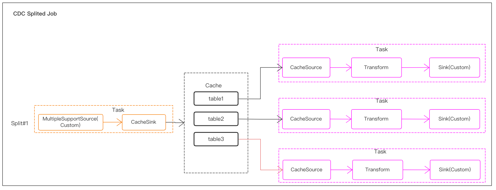
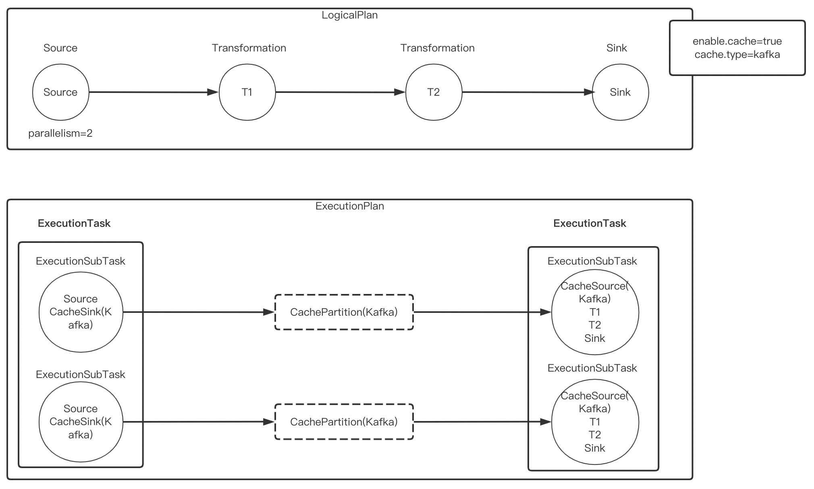
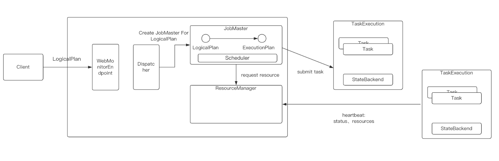
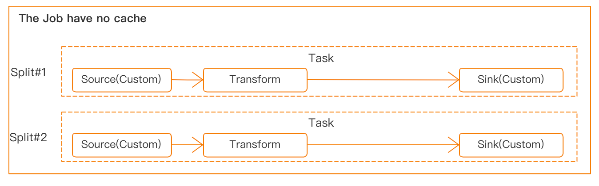
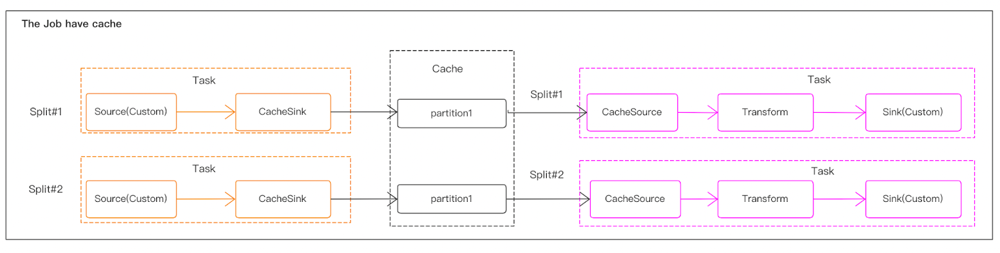
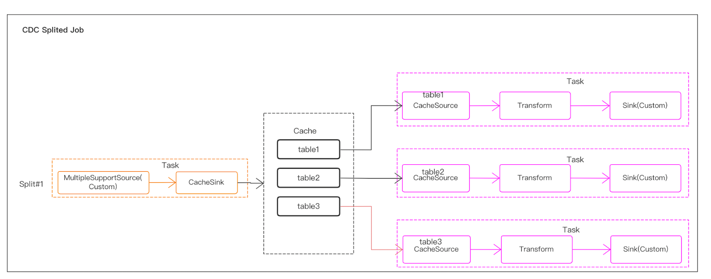
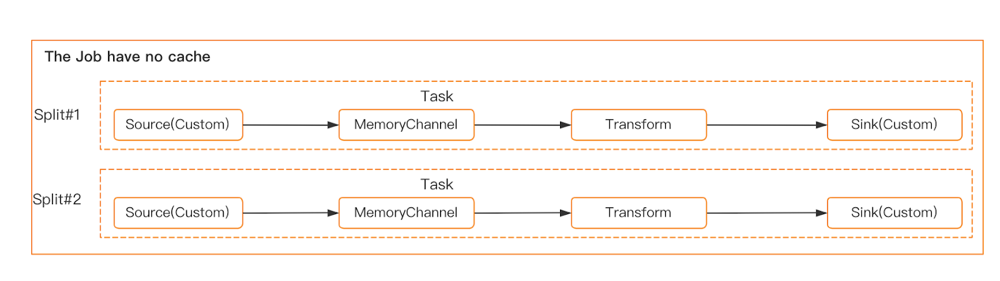
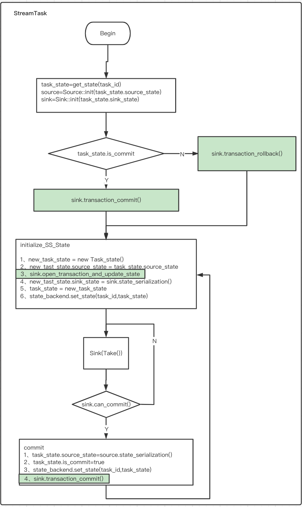
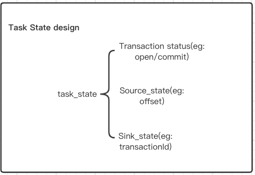

## 了解 SeaTunnel Zeta 引擎

### 背景 
发展背景 **1954 issue** `https://github.com/apache/seatunnel/issues/1954`, 更详细内容请阅读 `https://docs.google.com/document/d/e/2PACX-1vR5fJ-8sH03DpMHJd1oZ6CHwBtqfk9QESdQYoJyiF2QuGnuPM1a3lmu8m9NhGrUTvkYRSNcBWbSuX_G/pub` 

#### 为什么我们需要SeaTunnel引擎，我们要解决什么问题？  

**更好的资源利用率**       

实时数据同步是一个重要的用户场景。 有时我们需要完整数据库的实时同步。 现在，一些常见的数据同步引擎做法是每个表一个作业。 这种做法的优点是一项工作的失败不会影响另一项工作。 但当大多数表只有少量数据时，这种做法会造成更多的资源浪费。  

我们希望SeaTunnel引擎能够解决这个问题。 我们计划支持更灵活的资源共享策略。 它将允许某些作业在同一用户提交时共享资源。 用户甚至可以指定哪些作业在它们之间共享资源。 如果有人有想法，欢迎在邮件列表或github问题中讨论。   

**更少的数据库连接器**   

使用CDC进行全数据库同步的另一个常见问题是每个表都需要一个数据库连接器。 当数据库中有很多表时，这会给db服务器带来很大的压力。    

我们可以将数据库连接器设计为作业之间的共享资源吗？ 用户可以配置他们的数据库连接器池。 当作业使用连接器池时，SeaTunnel 引擎将在源/接收器连接器所在的节点处初始化连接器池。 然后将连接器池推送到源/宿连接器中。 凭借更好的资源利用率的特性，我们可以将数据库连接数减少到可接受的范围。    

减少 CDC Source Connector 使用的数据库连接器的另一种方法是在 CDC Source Connector 中支持多表读取。 然后流将在 SeaTunnel 引擎中按表名称进行拆分。    

    

这种方式减少了CDC Source Connector使用的数据库连接器，但如果同步目标也是数据库，则不能减少sink使用的数据库连接器。所以共享数据库连接器池将是解决这个问题的好方法。      

**Source和Sink之间的数据缓存**  

Flume是一个优秀的数据同步项目。 Flume Channel可以缓存数据 当sink出现故障并且无法写入数据时。这在某些场景下很有用。例如，某些用户保存数据库日志的时间有限。 CDC Source Connector 必须确保即使接收器无法写入数据，它也可以读取数据库日志。    

一个可行的解决方案是开始两份工作。其中一项作业使用 CDC Source Connector 读取数据库日志，然后使用 Kafka Sink Connector 将数据写入 kafka。而另一个作业则使用Kafka Source Connector从kafka读取数据，然后使用目标Sink Connector将数据写入目标。该方案需要用户对底层技术有深入的了解，并且两份工作会增加运维难度。因为每个工作都需要一个JobMaster，所以它会需要更多的资源。      

理想情况下，用户只知道他们将从源读取数据并将数据写入接收器，同时，在此过程中，可以缓存数据，以防接收器发生故障。同步引擎需要自动将缓存操作添加到执行计划中，并确保即使Sink发生故障，Source也能工作。在这个过程中，引擎需要保证写入缓存和从缓存读取的数据是事务性的，这样可以保证数据的一致性。      

执行计划是这样的：  

  

**模式演化**    
架构演变是一项功能，允许用户轻松更改表的当前架构以适应随时间变化的数据。最常见的是，它在执行追加或覆盖操作时使用，以自动调整架构以包含一个或多个新列。
实时数据仓库场景需要此功能。目前，flink和spark引擎不支持该功能。    

**更精细的容错能力**       
目前，大多数实时处理引擎都会在其中一项任务失败时使作业失败。主要原因是下游算子依赖于上游算子的计算结果。但在数据同步的场景下，只是简单地从Source读取数据，然后写入Sink。它不需要保存中间结果状态。因此，一项任务的失败不会影响其他任务的结果是否正确。  

新引擎应该提供更复杂的容错管理。它应该支持单个任务的失败而不影响其他任务的执行。它应该提供一个界面，以便用户可以手动重试失败的任务，而不是重试整个作业。    

**速度控制**    
在批处理作业中，我们需要支持速度控制。让用户选择自己想要的同步速度，防止对源或目标数据库造成太大影响。  

#### 整体架构设计   
我觉得我们可以借鉴Flink的架构设计。 
    

**StreamTask**  
  

     

    

1. **CacheSink**：内部Sink，将数据写入缓存。    
2. **CacheSource**：Internal Source，从缓存中读取数据。 
3. **源（自定义）**：SeaTunnel 连接器模块中定义的源连接器。 
4. **Sink（自定义）**：SeaTunnel 连接器模块中定义的 Sink 连接器。   
5. **变换（自定义）**：SeaTunnel 连接器模块中定义的变换连接器。 
6. **任务**：任务一般包括source+transform+sink操作。任务之间不存在数据依赖性或上下游关系。因此，一项任务的失败不会影响其他任务的结果是否正确。  

可以设置任务重试失败的次数。一般情况下，建议批量运行3次左右，实时场景可以较多。每个作业都支持设置任务失败时作业是否失败的策略。一般来说，离线场景下默认任务会失败，实时场景下默认任务会失败。   

实时场景下，当作业策略为任务失败且作业仍在运行时，支持对单个失败任务的“手动重试”操作，使失败的任务再次重试。    

实时场景下，作业策略为任务失败且作业仍在运行时，支持单个任务的停止、启动、重启操作。    

7. **Job**：每个Job都和Flink中的Job类似。如果任何任务失败，调度程序负责对失败的任务进行容错。由于任务之间不存在数据依赖性，因此其他任务正常运行。事务和状态的持久性也是任务粒度，而不是作业粒度。   

**BatchTask**   
BatchTask 现在不支持缓存。  

   

MemoryChannel：与dataX的通道类似，Source向通道写入数据，Sink从通道取出数据，可以支持离线场景下的限速。经过测试，在相同分片数量的情况下，内存通道相比无内存通道设计带来至少两倍的性能提升。  

**checkpoint design**   

    

**Task State Design**   

    

...etc      

### 引擎设计的总体思路  

**简单易用**，新的引擎尽量减小第三方服务的依赖，可以不依赖zookeeper，hdfs等大数据组件实现集群管理、快照存储和集群HA功能。这对于那些没有大数据平台或者不愿意依赖大数据平台进行数据同步的用户非常有用。   

**更省资源**，在CPU层面SeaTunnel Engine内部使用dynamic thread sharing技术 ，在实时同步的场景下，如果表的数量很多但每张表的数据量又很小，SeaTunnel Engine会将这些同步任务在共享线程中运行，这种方式可以减少不必要的线程创建，节省系统资源。在读取和数据写入端，SeaTunnel Engine的设计目标是尽量减少JDBC连接的个数。在CDC的场景下SeaTunnel Engine会尽量复用日志读取解析资源。 

**更稳定**，在这个版本中，SeaTunnel Engine将数据同步的任务以Pipeline做为Checkpoint和容错的最小粒度，一个task的失败只会影响到和它有上下游关系的task，尽量避免task失败造成整个Job失败或回滚。同时对于那些源端数据有存储时间限制的场景，SeaTunnel Engine支持开启数据Cache，开启Cache后SeaTunnel Engine会自动将从源端读取的数据缓存起来，然后由下游任务读取缓存数据并写入目标端。这种场景下即使目标端出现故障导致数据无法写入，也不会影响源端的正常读取，防止源端数据过期被删除。   

**更快速**，SeaTunnel Engine的执行计划优化器会以减小数据可能的网络传输为目标来做执行计划的优化，从而降低数据序列化和反序列化带来的整体同步性能的损耗，更快地完成数据同步操作。当然我们也会支持速度限制，让同步作业以一个合理的速度进行。    

**全场景数据同步支持**。SeaTunnel的目标是支持离线批量同步下的全量同步和增量同步。支持实时同步。支持CDC。    

refer   
1.https://mp.weixin.qq.com/s/Hvf7TJxMEBVyvnMXVd8E_w 
2.https://mp.weixin.qq.com/s/XeJ9jKYIZ53XcmsQpbOqbg 