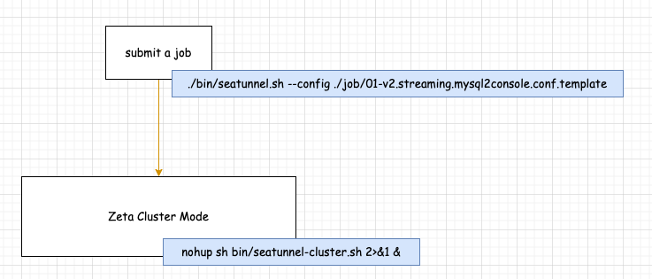
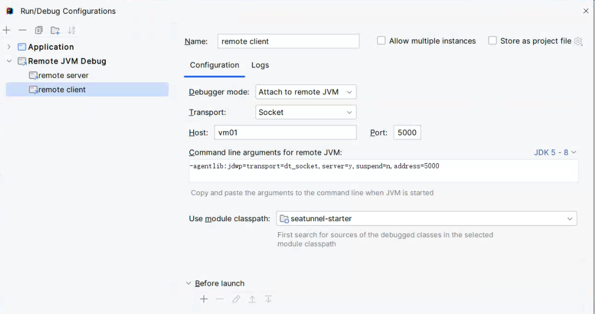

# SeaTunnel Cluster Mode 下的作业提交流程调试环境搭建           

>Seatunnel version: 2.3.4, Zeta Cluster Mode

## Job 提交结构图 
            

上图中的内容，启动 Seatunnel zeta Cluster Server，只不过，Cluster 目前是单节点，往往我们在开发和测试阶段大多时候用的是单节点，这可简化我们时间成本。 你也可以通过 `curl`工具 请求 zeta clsuter rest api `http://192.168.0.201:5801/hazelcast/rest/cluster` 查看集群 `members`。  

>注意：/hazelcast/rest/cluster 是由 hazelcast 提供的 Rest api，无需做任何处理，想了解更多，可访问 hazelcast官网。       

## 获取 ./seatunnel --config ... 完成提交 Job 命令  
修改 `bin/seatunnel.sh` 修改内容如下：      
```shell
#java ${JAVA_OPTS} -cp ${CLASS_PATH} ${APP_MAIN} ${args}   
echo "java ${JAVA_OPTS} -cp ${CLASS_PATH} ${APP_MAIN} ${args}"   
```

打印出来的结果如下：    
```bash
[root@vm01 bin]# ./seatunnel.sh --config ../job/01-v2.streaming.mysql2console.conf.template 

java  -Dhazelcast.client.config=/root/yzhou/seatunnel/apache-seatunnel-2.3.4/config/hazelcast-client.yaml -Dseatunnel.config=/root/yzhou/seatunnel/apache-seatunnel-2.3.4/config/seatunnel.yaml -Dhazelcast.config=/root/yzhou/seatunnel/apache-seatunnel-2.3.4/config/hazelcast.yaml -Dlog4j2.configurationFile=/root/yzhou/seatunnel/apache-seatunnel-2.3.4/config/log4j2_client.properties -Dseatunnel.logs.path=/root/yzhou/seatunnel/apache-seatunnel-2.3.4/logs -Dseatunnel.logs.file_name=seatunnel-starter-client -Xms256m -Xmx512m -XX:+HeapDumpOnOutOfMemoryError -cp /root/yzhou/seatunnel/apache-seatunnel-2.3.4/lib/*:/root/yzhou/seatunnel/apache-seatunnel-2.3.4/starter/seatunnel-starter.jar org.apache.seatunnel.core.starter.seatunnel.SeaTunnelClient --config ../job/01-v2.streaming.mysql2console.conf.template   
```

## 克隆 Seatunnel 并导入 Idea   
```shell
git clone git@github.com:apache/seatunnel.git  
```

导入 Idea 之后，参考官网“Set Up Develop Environment” https://seatunnel.apache.org/docs/2.3.4/contribution/setup, 执行以下命令，校验环境是否OK：     
```shell
mvn clean package -pl seatunnel-dist -am -Dmaven.test.skip=true    
```

## 配置 Idea 提交 Job 入口      
当提交作业时，执行`./seatunnel.sh --config ../job/01-v2.streaming.mysql2console.conf.template` 会启动 1个 client 服务，它会调用 Hazelcast 跨节点访问方法与 seatunnel server 进行通信（后台进程），告诉 server 启动什么样配置作业。   
       

所以，本人将 seatunnel client，server 3个不同的调试环节 配置成以下方式：    
1.seatunnel client：采用 idea 本地 main()启动      
2.seatunnel server：采用 idea 远程 debuger 启动   
3.seatunnel client：采用 idea 远程 debuger 启动     


>注意：需注意Seatunnel 官网文档介绍 `根据SeaTunnel Zeta Engine的使用要求，提交作业的SeaTunnel Client节点必须与运行作业的SeaTunnel Server节点具有相同的操作系统和安装目录结构。比如如果你想在本地IDEA中运行SeaTunnel Web，你必须在与IDEA相同的机器上安装和运行SeaTunnel Zeta引擎服务器。`  https://github.com/apache/seatunnel-web/blob/main/README_CN.md 

当 Client 部署在windows时，而 Server 部署在linux 时，那client会识别 job配置信息后，将要加载的 jar的路径通过参数传递给 Server端，它会根据传过来的参数路径，来动态加载 Source，Sink jar， 所以会出现下图内容：    
   
Job启动异常，在Server端 log 会提示找不到 source，sink相关的 class。   

接下来，我们就详细介绍 `Idea Seatunnel Client` 与 `Linux Seatunnel Server` 之间联调步骤。       

>注意：在真实场景中，Client 往往是单独部署，并不在 Server Cluster的某个节点部署，所以，接下来 我将 `Idea Seatunnel Client` 放在 `vm01`, `Linux Seatunnel Server` 放在 `vm02`。  

### 将 Linux Seatunnel Server 安装包分别放入 vm01,vm02 相同路径下  & 启动
1）首先在 vm01 节点上 安装 Seatunnel Server, 执行 bin/install-plugin.sh 拉取 connectors/connector-*-2.3.4.jar,  将必要数据驱动包放入 lib/ 目录下 
```bash
[root@vm02 apache-seatunnel-2.3.4]# cd lib/
[root@vm02 lib]# ls
mysql-connector-j-8.3.0.jar  seatunnel-hadoop3-3.1.4-uber.jar  seatunnel-transforms-v2.jar
```

2）配置 config/hazelcast.yaml，将`member-list` 修改为 vm01的 ip地址。              
3）配置 SEATUNNEL_HOME 环境变量，保证 vm01,vm02 是一致的。            
```bash
export SEATUNNEL_HOME=/root/yzhou/seatunnel/apache-seatunnel-2.3.4
export PATH=$SEATUNNEL_HOME/bin:$PATH
```

4）在 seatunnel server 根目录下，创建 start.sh, 内容如下： 
```bash 
[root@vm02 apache-seatunnel-2.3.4]# cat start.sh 
nohup sh bin/seatunnel-cluster.sh 2>&1 &
```

5）然后根据 “SeaTunnel Server 开启远程调试端口” Blog，配置 Seatunnel 脚本的远程调试端口。      

此时，执行`sh start.sh` 启动 server。       

### vm01 安装 JetBrains Gateway        
1）在 vm01 上克隆 Seatunnel 源码。      

2）vm01 是 linux 操作系统，可安装 `JetBrains Gateway` 实现远程开发，请访问 `https://www.jetbrains.com/remote-development/gateway/` 自行了解， 它的作用是 远程开发 vm01 上的 Seatunnel 源码。  

3）在 Seatunnel 源码根目录下，创建 `debug-config`,`job`,`lib` 3个文件夹。   
* debug-config: 存放 Client启动时指定的 Seatunnel配置文件   
修改`hazelcast-client.yaml`，内容如下： 
```bash
  network:
    cluster-members:
      - 192.168.0.201:5801
```

修改`hazelcast.yaml`, 内容如下：    
```bash 
    member-list:
        - 192.168.0.201
```

* job：存放 Client 启动时指定的 Job配置文件      
示例的job 配置内容如下：    
```bash
env {
  parallelism = 1
  job.mode = "STREAMING"
  checkpoint.interval = 2000
}

source {
  Jdbc {
    url = "jdbc:mysql://192.168.0.202:3306/yzhou_test?serverTimezone=GMT%2b8"
    driver = "com.mysql.cj.jdbc.Driver"
    connection_check_timeout_sec = 100
    user = "root"
    password = "123456"
    query = "select * from yzhou_test01"
  }
}

sink {
  Console {
  }
}
```

* lib：将 vm01或者vm02 Seatunnel Server 目录下的lib/ 拷贝到 源码目录下  


### 配置 Gateway Idea 的启动参数
    

**1）Application Submit Job**  

`VM Options：`              
```bash
-Dhazelcast.client.config=/root/yzhou/Code/seatunnel-all/seatunnel234/debug-config/hazelcast-client.yaml
-Dseatunnel.config=/root/yzhou/Code/seatunnel-all/seatunnel234/debug-config/seatunnel.yaml
-Dhazelcast.config=/root/yzhou/Code/seatunnel-all/seatunnel234/debug-config/hazelcast.yaml
-Dlog4j2.configurationFile=/root/yzhou/Code/seatunnel-all/seatunnel234/debug-config/log4j2_client.properties
-Dseatunnel.logs.path=/root/yzhou/Code/seatunnel-all/seatunnel234/logs
-Dseatunnel.logs.file_name=seatunnel-starter-client
-Xms256m
-Xmx512m
-XX:+HeapDumpOnOutOfMemoryError
```

`Program arguments: `   
```bash
--config /root/yzhou/Code/seatunnel-all/seatunnel234/job/01-v2.streaming.mysql2console.conf.template
```

`配置 Modify classpath` 
将 lib/ 目录下的jar 加载到 Idea中   
            

完成配置图如下：    
            

**2）Remote JVM Debug remote server**    
            

**3）Remote JVM Debug remote client**       
    

refer   
1.https://seatunnel.apache.org/docs/2.3.4/connector-v2/sink/Socket     


