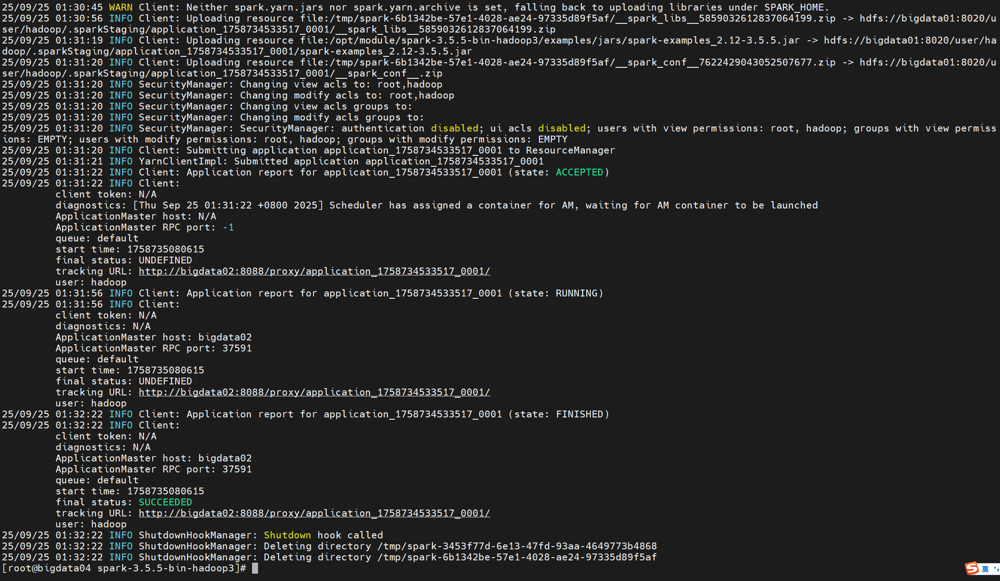
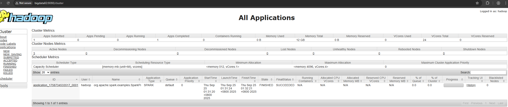

# Spark - Spark on Yarn Job 示例  

>Spark version: 3.5.5  


## 安装 Spark on Yarn 环境   
访问 `https://archive.apache.org/dist/spark/spark-3.5.5/spark-3.5.5-bin-hadoop3.tgz` 下载 Spark 3.5.5 安装包   

### 修改 conf/spark-env.sh 配置文件  
```bash
# 重命名 spark-env.sh.template 为 spark-env.sh  
mv conf/spark-env.sh.template conf/spark-env.sh

# 修改 spark-env.sh 文件 
vim conf/spark-env.sh 
# 内容如下：  
export JAVA_HOME=/opt/module/jdk1.8.0_451
export HADOOP_CONF_DIR=/opt/module/hadoop-3.2.0/etc/hadoop
```  

### 启动 on Yarn Job 
在 spark 目录下执行以下命令提交 Spark Job   
```bash
./bin/spark-submit \
    --class org.apache.spark.examples.SparkPi \
    --master yarn \
    --deploy-mode cluster \
    examples/jars/spark-examples_2.12-3.5.5.jar \
    2
```

输出结果如下：  
  

在 访问 Yarn WEB UI (`http://bigdata02:8088`)，查看作业运行情况。    
       

## Spark History 部署  

```bash 
# 重命名 spark-defaults.conf.template 为 spark-defaults.conf   
mv conf/spark-defaults.conf.template conf/spark-defaults.conf
``` 

### 修改 conf/spark-defaults.conf 配置文件  
vim conf/spark-defaults.conf 
```bash
# 内容如下：
spark.eventLog.enabled=true
spark.eventLog.compress=true
spark.eventLog.dir=hdfs://bigdata01:8020/tmp/logs/spark/logs
spark.history.fs.logDirectory=hdfs://bigdata01:8020//tmp/logs/spark/logs
spark.yarn.historyServer.address=http://bigdata04:18080
```

### 修改 conf/spark-env.sh 配置文件 
vim conf/spark-env.sh
```bash
export SPARK_HISTORY_OPTS="-Dspark.history.ui.port=18080 -Dspark.history.fs.logDirectory=hdfs://bigdata01:8020/tmp/logs/spark/logs"
```

### 启动 Spark History  
使用 hdfs 命令创建好 `/tmp/logs/spark/logs` 目录，命令如下：  
```bash
[hadoop@bigdata01 hadoop-3.2.0]$ hdfs dfs -mkdir -p /tmp/logs/hadoop/logs     
``` 

执行 `sbin/start-history-server.sh` 命令，启动 Spark History。           

TODO 添加一个 Spark Job 示例 