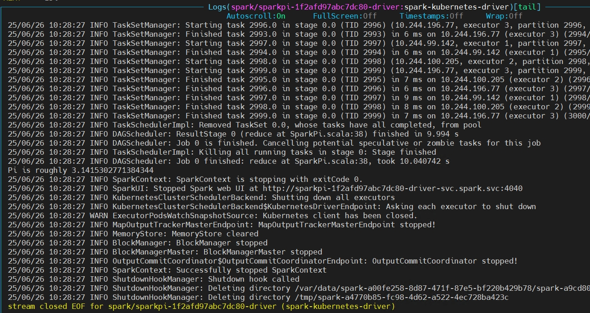

# Spark - Native Kubernetes - Spark on Kubernetes 环境准备  

>spark version: 3.5.5 

## 环境准备  

### 创建 Spark namespace
vim spark-namespace.yaml

```yaml
apiVersion: v1
kind: Namespace
metadata:
  name: spark
  labels:
    app.kubernetes.io/name: spark
    app.kubernetes.io/instance: spark
```  

### 创建 Spark service account 
vim spark-service-account.yaml

```yaml
apiVersion: v1
kind: ServiceAccount
metadata:
  namespace: spark
  name: spark-service-account
  labels:
    app.kubernetes.io/name: spark
    app.kubernetes.io/instance: spark
    app.kubernetes.io/version: v3.5.5
```

### 创建 Spark role 
vim spark-role.yaml  

```yaml
apiVersion: rbac.authorization.k8s.io/v1
kind: Role
metadata:
  labels:
    app.kubernetes.io/name: spark
    app.kubernetes.io/instance: spark
    app.kubernetes.io/version: v3.5.5
  namespace: spark
  name: spark-role
rules:
  - apiGroups: [""]
    resources: ["pods"]
    verbs: ["get", "watch", "list", "create", "delete", "deletecollection"]
  - apiGroups: ["extensions", "apps"]
    resources: ["deployments"]
    verbs: ["get", "watch", "list", "create", "delete", "deletecollection"]
  - apiGroups: [""]
    resources: ["configmaps"]
    verbs: ["get", "create", "update", "delete", "deletecollection"]
  - apiGroups: [""]
    resources: ["secrets"]
    verbs: ["get"]
  - apiGroups: [""]
    resources: ["services"]
    verbs: ["get", "list", "create", "delete", "deletecollection"]
  - apiGroups: [""]
    resources: ["persistentvolumeclaims"]
    verbs: ["get", "list", "create", "delete", "deletecollection"]
---
apiVersion: rbac.authorization.k8s.io/v1
kind: RoleBinding
metadata:
  labels:
    app.kubernetes.io/name: spark
    app.kubernetes.io/instance: spark
    app.kubernetes.io/version: v3.5.5
  name: spark-role-binding
  namespace: spark
roleRef:
  apiGroup: rbac.authorization.k8s.io
  kind: Role
  name: spark-role
subjects:
  - kind: ServiceAccount
    name: spark-service-account
    namespace: spark
```

### 创建 Spark cluster role 
vim cluster-role.yaml

```yaml
apiVersion: rbac.authorization.k8s.io/v1
kind: ClusterRole
metadata:
  labels:
    app.kubernetes.io/name: spark
    app.kubernetes.io/instance: spark
    app.kubernetes.io/version: v3.5.5
  name: spark-clusterrole
rules:
  - apiGroups:
      - ''
    resources:
      - configmaps
      - endpoints
      - nodes
      - pods
      - secrets
      - namespaces
    verbs:
      - list
      - watch
      - get
  - apiGroups:
      - ''
    resources:
      - services
    verbs:
      - get
      - list
      - watch
  - apiGroups:
      - ''
    resources:
      - events
    verbs:
      - create
      - patch
---
apiVersion: rbac.authorization.k8s.io/v1
kind: ClusterRoleBinding
metadata:
  labels:
    app.kubernetes.io/name: spark
    app.kubernetes.io/instance: spark
    app.kubernetes.io/version: v3.5.5
  name: spark-clusterrole-binding
roleRef:
  apiGroup: rbac.authorization.k8s.io
  kind: ClusterRole
  name: spark-clusterrole
subjects:
  - kind: ServiceAccount
    name: spark-service-account
    namespace: spark
```  

## 使用 Spark Example 验证环境  
下载 spark-3.5.5-bin-hadoop3.tgz 安装包  

`执行 Spark 自带的 Example`
```shell
/root/yzhou/spark/spark-3.5.5-bin-hadoop3/bin/spark-submit \
 --name SparkPi \
 --verbose \
 --master k8s://https://192.168.0.137:6443 \
 --deploy-mode cluster \
 --conf spark.network.timeout=300 \
 --conf spark.executor.instances=3 \
 --conf spark.driver.cores=1 \
 --conf spark.executor.cores=1 \
 --conf spark.driver.memory=1024m \
 --conf spark.executor.memory=1024m \
 --conf spark.kubernetes.namespace=spark \
 --conf spark.kubernetes.container.image.pullPolicy=IfNotPresent \
 --conf spark.kubernetes.container.image=192.168.0.134:5000/apache/spark:3.5.5 \
 --conf spark.kubernetes.authenticate.driver.serviceAccountName=spark-service-account \
 --conf spark.kubernetes.authenticate.executor.serviceAccountName=spark-service-account \
 --conf spark.driver.extraJavaOptions="-Dio.netty.tryReflectionSetAccessible=true" \
 --conf spark.executor.extraJavaOptions="-Dio.netty.tryReflectionSetAccessible=true" \
 --class org.apache.spark.examples.SparkPi \
 local:///opt/spark/examples/jars/spark-examples_2.12-3.5.5.jar \
 3000
``` 

`查看 driver pod log`  
    

refer   
1.https://spark.apache.org/docs/3.5.5/running-on-kubernetes.html   