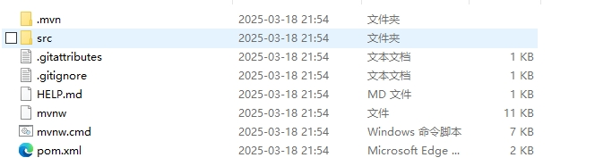

# Java - 给 Spring Boot 服务配置通用脚本     

## 背景   
在学习和工作中接触了一些开源的 Java 项目，它们绝大多数在部署服务的根目录下存在 `bin` 子目录用来存放一些`sh`脚本对服务进行`启停操作`，存在 `conf` 子目录用来存放一些配置文件对服务进行配置参数管理, 例如 kafka,flink,rocketmq,streampark 等项目， 用起来确实很方便，下面列举一些示例：             

下面是 `RocketMQ` 的部署目录截图:         
      

下面是 `Kafka` 的部署目录截图    
      

该篇 Blog 主要介绍的内容是基于 `Spring Boot` 框架开发的服务如何也像上面优秀的开源项目一样，有 `bin` 目录提供脚本进行服务启停，有 `conf` 目录提供配置参数管理。   

## 有 与 没有 之间   
从 `https://start.spring.io/` 网站构建 Spring Boot `jar` 项目时，并不存在 `bin`,`conf`目录，下面是初始化项目的目录结构：      
  

这部分与 `Playframework for Scala` 框架非常不同，博主的 Blog (http://xinzhuxiansheng.com/) 是使用 Play for Scala 开发的，下面是它的目录结构：           

   

这部分 `Play for Scala` 做的比 Spring Boot 好太多，好的习惯是成功的一部分。   

在 Spring Boot `jar` 项目中，若不做特殊处理，配置文件会在打包项目时集成到 `jar` 文件中， 这不利于我们去手动调整配置参数，可能我们会重新打包服务再部署，或者你将服务的配置参数集成到`配置中心`这样的服务中，或者集成到 MySQL，这些也能简化我们调整参数的成本，但并不是所有项目都需要这些的。          

>当你通过某些手段提高一些事情的效率时，你可以比别人有更多的时间做其他事。       

## Spring Boot 集成 bin, conf   

