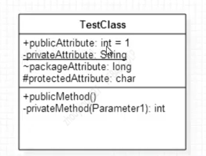
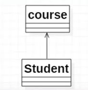

## 类

* 首先看矩形框，它代表一个类。该类分为三层
    1. 第一层显示类的名称
    2. 第二层是类的特性，通常就是成员变量和属性
    3. 第三层是类的操作，通常就是方法或者函数

* 修饰属性和方法
* 访问权限
    1. '+'表示public
    2. '-'表示private
    3. '#'表示protected
    4. '~'表示package
* 其他关键字
    1. 下划线表示static
    2. 斜体代表abstract

* 冒号(:)
    1. 表示成员变量类型
    2. 表示方法返回值
* 等号(=)
    1. 表示默认值
* 方法的参数表示与类成员变量表示方法完全相同

## 接口

* 接口的两种表现形式
    1. 圆圈，比较直观，不方便表示接口内的方法
    2. 名字上带有《interface》，方便表示接口方法
   

## 类与继承泛化(Generalization)

* [泛化关系]：是一种继承关系，表示一般与特殊的关系，它指定了子类如何特化父类的所有特征和行为。例如鸭子是鸟的一种，即有鸭子的特性也有鸟的共性。
* [箭头指向]：带三角箭头的实现，箭头指向父类
* [代码表现]：最典型的就是extends

## 接口与实现(Realization)

* [实现关系]：是一种类与接口的关系，表示类是接口所有特征和行为的实现
* [箭头指向]：带三角箭头的虚线，箭头指向接口或者是直线连接圆圈
* [代码表现]：最典型的就是implements
  

## 依赖(Dependency)

* [依赖关系]：是一种使用的关系，即一个类的实现需要另一个类的协助，所以要尽量不使用双向的互相依赖
* [代码表现]：最典型的就是import

## 关联(Association)

* [关联关系]：是一种拥有的关系，它使一个类知道另一个类的属性和方法；如：老师与学生，丈夫与妻子关联可以是双向的，也可以使单向的
* [代码体现]：成员变量
* [箭头及指向]：带普通箭头的实心线，指向被拥有者

## 聚合(Aggregation)

* [聚合关系]：是整体与部分的关系，且部分可以离开整体而单独存在。如车和轮胎是整体和部分的关系，轮胎离开车仍然可以存在
* [代码体现]：成员变量
* [箭头及指向]：带空心菱形的实心线，菱形指向整体

## 组合(Composition)

* [组合关系]：是整理与部分的关系，但部分不能离开整体而单独存在
* [代码体现]：成员变量
* [箭头及指向]：带实心菱形的实线，菱形指向整体

