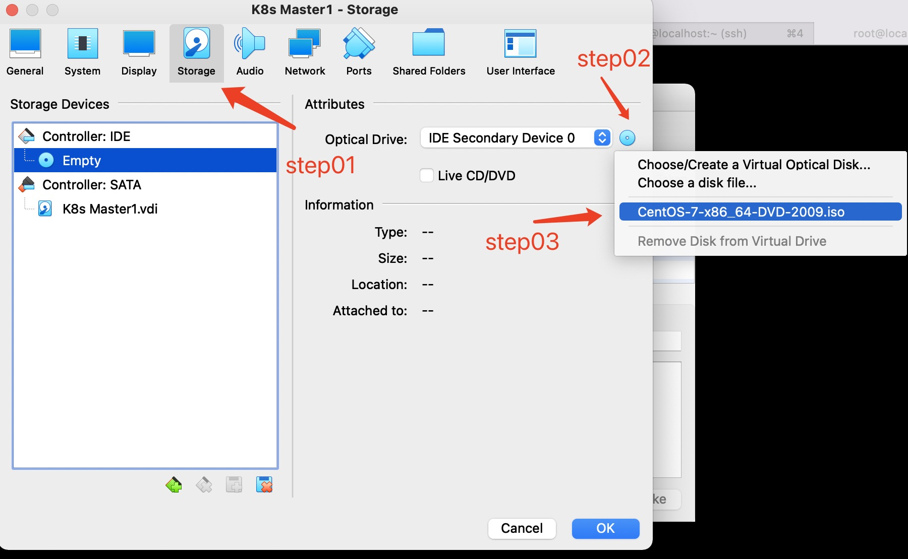
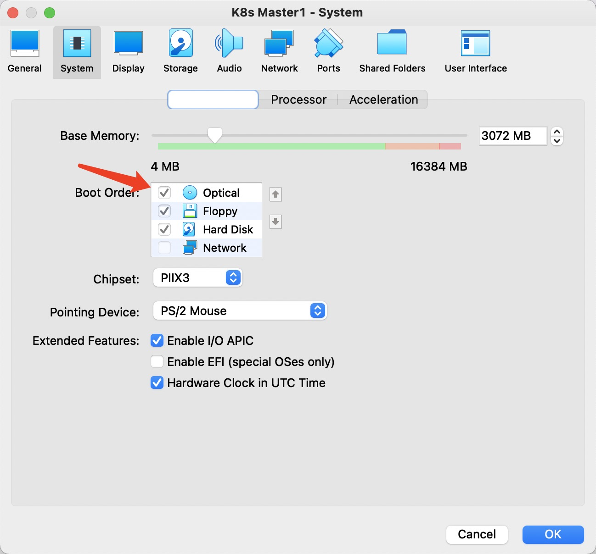
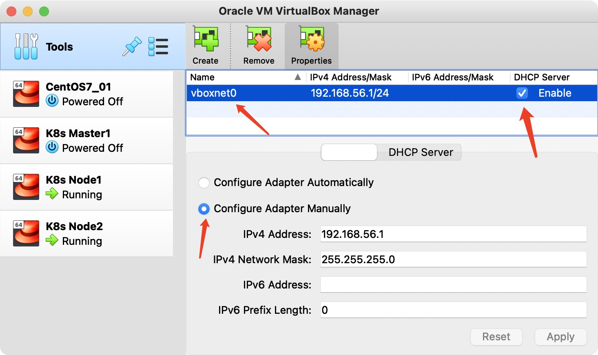
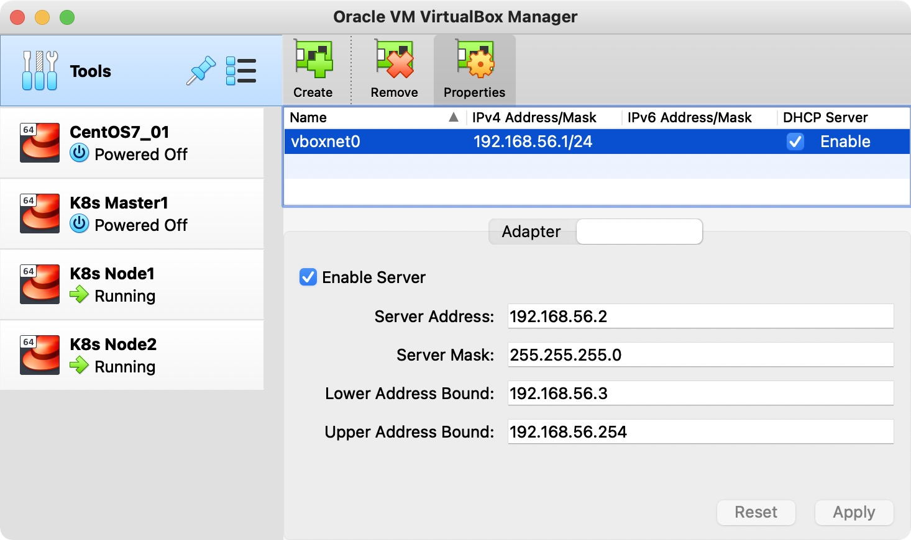
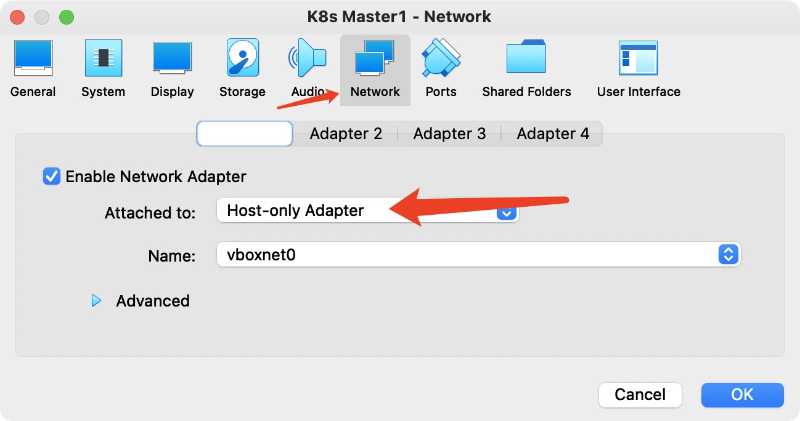
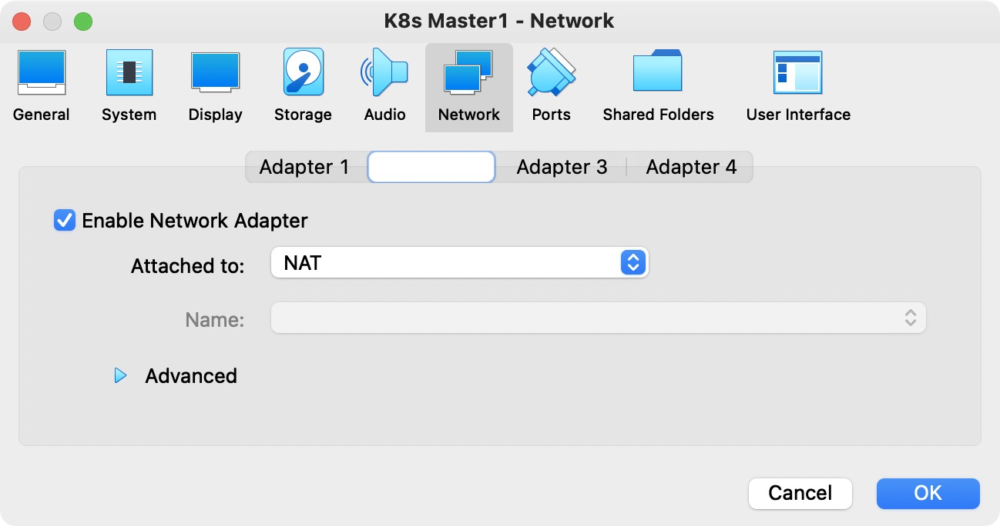
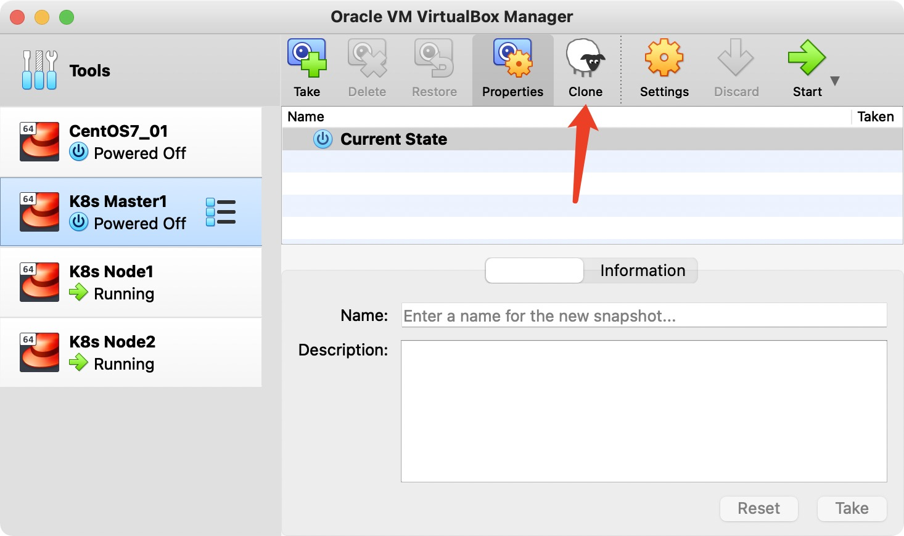

## 使用virtualbox构建虚机部署环境

>在开发过程中，我们经常需要多节点的集群环境

* 虚机能访问宿主机
* 虚机能访问网络
* 宿主机能访问虚机
* 固定虚机IP


### VirtualBox安装Centos7系统
centos7的安装过程较简单，以下仅指出3点

1. 通过Storage指定centos7镜像


2. 调整Boot Order,将Optical置顶


3. 系统最小化安装

### 配置VirtualBox的网络
在Tools创建虚拟机网络 
* Adapter 选择“Configure Adapter Manually”, “IPv4 Address”的地址一定要在宿主机生效，才能确保宿主机可以访问虚机


下面是在宿主机中操作:
```shell
➜  ~ ifconfig |grep 192
	inet 192.168.199.155 netmask 0xffffff00 broadcast 192.168.199.255
	inet 192.168.56.1 netmask 0xffffff00 broadcast 192.168.56.255
```

需要确保`ifconfig` 宿主的vboxnet0有ip(**若暂时没有，可以等虚机启动之后再查看，若长时间获取不到，将虚拟网卡删除，重新创建**)：

> 这里需要特别注意，此处有坑，会影响宿主机无法访问虚拟机

```
vboxnet0: flags=8943<UP,BROADCAST,RUNNING,PROMISC,SIMPLEX,MULTICAST> mtu 1500
	ether 0a:00:27:00:00:00
	inet 192.168.56.1 netmask 0xffffff00 broadcast 192.168.56.255
```


* 开启“DHCP Server”，需要注意的是 DHCP Server中的“Lower Address Bound”与“Upper Address Bound” IP池的边界。



### 虚机配置网卡（固定IP）
网卡1： 选择"host-only Adapter" (注意第一个网卡必须要选择host-only)


网卡2： 选择“NAT”


* 重启虚拟机，此时在虚机执行“ping www.baidu.com”判断是否可以访问网络    

* 配置固定虚机ip
```shell
vi /etc/sysconfig/network-scripts/ifcfg-enp0s3  
```
修改以下内容
```
ONBOOT=yes
BOOTPROTO=static
IPADDR=192.168.56.103（主要参考DHCP边界设值）
``` 

完整的config案例：
```
TYPE=Ethernet
PROXY_METHOD=none
BROWSER_ONLY=no
BOOTPROTO=static
DEFROUTE=yes
IPV4_FAILURE_FATAL=no
IPV6INIT=yes
IPV6_AUTOCONF=yes
IPV6_DEFROUTE=yes
IPV6_FAILURE_FATAL=no
IPV6_ADDR_GEN_MODE=stable-privacy
NAME=enp0s3
UUID=10de0ce7-df67-4f49-81f2-4f0c9688560f
DEVICE=enp0s3
ONBOOT=yes
IPADDR=192.168.56.103
``` 

* 重启网络
```shell
systemctl restart network
```

* 查看enp0s3网卡ip
```shell
ip addr |grep 192
```

此时虚机可以访问外网，也能够和宿主机进行互相通信

### 虚机克隆
关闭虚机，执行Clone操作


"MAC Address Policy" 选择“Generate new MAC addresses for all network adapters”  

