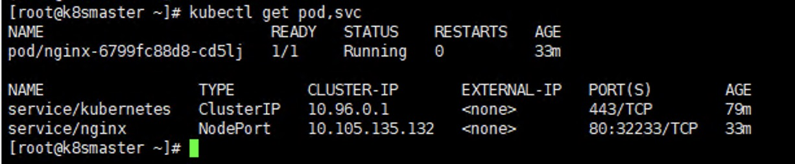

## kubeadmin搭建kubernetes集群 - 详细版


### 部署目标
- 在所有节点上安装Docker和kubeadm
- 部署Kubernetes Master
- 部署容器网络插件
### 部署架构
|   ip  |  域名  | 备注| 安装软件|
|  ----  | ----  |----  |----  |
|  192.168.56.101 | master | 主节点 |Docker Kubeadm kubelet kubectl flannel |
|  192.168.56.102 | node1 |从节点 1 |Docker Kubeadm kubelet kubectl |
|  192.168.56.103 | node2 |从节点 2 |Docker Kubeadm kubelet kubectl|

### 环境准备
- 3台虚拟机CentOS7.x-86_x64
- 硬件配置：2GB或更多RAM，2个CPU或更多CPU，硬盘30GB或更多
- 集群中所有机器之间网络互通
- 可以访问外网，需要拉取镜像
- 禁止swap分区

### 5-5 Virtualbox 虚拟机配置双网卡实现固定IP

>这里详细操作请参考 Virtualbox的虚机环境搭建的文档(https://github.com/xinzhuxiansheng/blog-notes/blob/master/VirtualBox/%E4%BD%BF%E7%94%A8virtualbox%E6%9E%84%E5%BB%BA%E8%99%9A%E6%9C%BA%E9%83%A8%E7%BD%B2%E7%8E%AF%E5%A2%83.md)

- Virtualbox安装 CentOS
- 配置虚机双网卡,实现固定 IP，且能访问外网
网卡 1： 仅主机host-only
网卡 2： 网络转换地址NAT
查看虚拟机网络，点击管理—>主机网络管理器，记住ip地址（192.168.99.1），并选择“手动配置网卡”。
- 重启虚拟机，此时在虚拟机 ping www.baidu.com 是返回成功的。
- 设置外部网络访问虚拟机
设置静态ip地址，编辑网络配置文件，编辑网络设置文件
```
vi /etc/sysconfig/network-scripts/ifcfg-enp0s3
TYPE=Ethernet
PROXY_METHOD=none
BROWSER_ONLY=no
#BOOTPROTO=dhcp
DEFROUTE=yes
IPV4_FAILURE_FATAL=no
IPV6INIT=yes
IPV6_AUTOCONF=yes
IPV6_DEFROUTE=yes
IPV6_FAILURE_FATAL=no
IPV6_ADDR_GEN_MODE=stable-privacy
NAME=enp0s3
UUID=08012b4a-d6b1-41d9-a34d-e0f52a123e7a
DEVICE=enp0s3
ONBOOT=yes
BOOTPROTO=static
IPADDR=192.168.56.101
```
- 重启网络
```
systemctl restart network
```

- 查看 enp0s3 网卡的 ip
```
[root@localhost Final]#ip addr |grep 192
inet 192.168.56.101/24 brd 192.168.56.255 scope global noprefixroute enp0s3
```
- 此时虚拟机既可以访问外网，也能够和宿主机( 192.168.31.178)进行通信
```
ping 192.168.31.178
PING 192.168.31.178 (192.168.31.178): 56 data bytes
64 bytes from 192.168.31.178: icmp_seq=0 ttl=64 time=0.060 ms
```
- 使用iTerm2 连接虚拟机


### 升级内核(每台机器 - 在多次实践过程中，这步不是强制)
```
内核版本升级
1.操作系统版本选择：centOS 7.9，内核选择5.4
2.导入ELRepo公钥
rpm --import https://www.elrepo.org/RPM-GPG-KEY-elrepo.org
3.安装ELRepo
yum install https://www.elrepo.org/elrepo-release-7.el7.elrepo.noarch.rpm
4.查看ELRepo提供的内核版本
yum --disablerepo="*" --enablerepo="elrepo-kernel" list available
5.安装kernel-lt内核
yum --disablerepo='*' --enablerepo=elrepo-kernel install kernel-lt
6.查看启动器
awk -F\' '$1=="menuentry " {print i++ " : " $2}' /etc/grub2.cfg
7.设置默认启动器为新内核
grub2-set-default 0      # grub2-set-default & grub2-editenv & grub2-mkconfig 测试一下这几个命令

8.生成grub文件
grub2-mkconfig -o /boot/grub2/grub.cfg

9.移除旧版本的内核包 #注意下这里(先忽略)
yum remove kernel-tools-libs.x86_64 kernel-tools.x86_64

8.重启后进行验证
reboot
uname -r
9.检查可更新的rpm包
yum check-update
10.更新软件包
yum update -y 
11.重启机器
``` 

### 环境配置(每台机器)
```
# 关闭防火墙
systemctl stop firewalld
systemctl disable firewalld

# 关闭selinux
# 永久关闭
sed -i 's/enforcing/disabled/' /etc/selinux/config  
# 临时关闭
setenforce 0  

# 关闭swap
# 临时
swapoff -a 
# 永久关闭
sed -ri 's/.*swap.*/#&/' /etc/fstab

# 根据规划设置主机名【master节点上操作】
hostnamectl set-hostname master
# 根据规划设置主机名【node1节点操作】
hostnamectl set-hostname node1
# 根据规划设置主机名【node2节点操作】
hostnamectl set-hostname node2

# 在master添加hosts
cat >> /etc/hosts << EOF
192.168.56.101 master
192.168.56.102 node1
192.168.56.103 node2
EOF

# 将桥接的IPv4流量传递到iptables的链
cat > /etc/sysctl.d/k8s.conf << EOF
net.bridge.bridge-nf-call-ip6tables = 1
net.bridge.bridge-nf-call-iptables = 1
EOF
# 生效
sysctl --system 
```

## 时间同步配置(每台机器)
```
# ntp的安装配置
# 安装ntp
$ yum -y install ntp

# 启动ntp服务器
$ systemctl start ntpd

# 配置计划任务，使用ntpdate同步时间
# 启动并开机启动计划任务cron
$ systemctl start crond
$ systemctl enable crond

# 配置计划任务，每5分钟同步一次
$ crontab -e
*/5 * * * * /usr/sbin/ntpdate ntp1.aliyun.com
```

## 安装Docker/kubeadm/kubelet/kubectl(每台机器)

### 安装Docker
首先配置一下Docker的阿里yum源   

```
cat >/etc/yum.repos.d/docker.repo<<EOF
[docker-ce-edge]
name=Docker CE Edge - \$basearch
baseurl=https://mirrors.aliyun.com/docker-ce/linux/centos/7/\$basearch/edge
enabled=1
gpgcheck=1
gpgkey=https://mirrors.aliyun.com/docker-ce/linux/centos/gpg
EOF
```

然后yum方式安装docker   

```
# yum安装
yum -y install docker-ce

# 查看docker版本
docker --version  

# 启动docker
systemctl enable docker
systemctl start docker
```

配置docker的镜像源  
exec-opts参数一定要配置

mkdir /etc/docker
vim /etc/docker/daemon.json
```
{
  "registry-mirrors": ["https://b9pmyelo.mirror.aliyuncs.com"],
  "exec-opts": ["native.cgroupdriver=systemd"]
}
```
然后重启Docker

```shell
systemctl restart docker
``` 

### 添加kubernetes软件源
然后我们还需要配置一下yum的k8s软件源    

```
cat > /etc/yum.repos.d/kubernetes.repo << EOF
[kubernetes]
name=Kubernetes
baseurl=https://mirrors.aliyun.com/kubernetes/yum/repos/kubernetes-el7-x86_64
enabled=1
gpgcheck=0
repo_gpgcheck=0
gpgkey=https://mirrors.aliyun.com/kubernetes/yum/doc/yum-key.gpg https://mirrors.aliyun.com/kubernetes/yum/doc/rpm-package-key.gpg
EOF
```     

### 安装kubeadm，kubelet和kubectl(指定版本)
```
# 安装kubelet、kubeadm、kubectl
# 如果需要指定版本, yum install -y kubelet-1.18.0 kubeadm-1.18.0 kubectl-1.18.0
yum install -y kubelet kubeadm kubectl
# 设置开机启动
systemctl enable kubelet
```

## 部署Kubernetes Master(Master节点)
针对 service-cidr,pod-network-cidr的参数，是遵循 Flannel网络组件的要求设置
```
kubeadm init --v=6 --kubernetes-version=1.20.11 \
--apiserver-advertise-address=192.168.56.102 \
--image-repository registry.aliyuncs.com/google_containers \
--service-cidr=10.1.0.0/16 \
--pod-network-cidr=10.244.0.0/16
```

配置Kubectl工具   
```
mkdir -p $HOME/.kube
cp -i /etc/kubernetes/admin.conf $HOME/.kube/config
chown $(id -u):$(id -g) $HOME/.kube/config
``` 

执行完成后，我们使用下面命令，查看我们正在运行的节点    
```
kubectl get nodes
```
能够看到，目前有一个master节点已经运行了，但是还处于未准备状态
下面我们还需要在Node节点执行其它的命令，将node1和node2加入到我们的master节点上。


## 加入Kubernetes Node(2个node节点)
下面我们需要到 node1 和 node2服务器，执行下面的代码向集群添加新节点
执行在kubeadm init输出的kubeadm join命令：      

>注意，以下的命令是在master初始化完成后，每个人的都不一样！！！需要复制自己生成的   
```
kubeadm join 192.168.56.101:6443 --token igwt4e.6zorqgh5uj8c6as6 \
	--discovery-token-ca-cert-hash sha256:e8e6caf69f74fefd02cfbf3fd551f2ba880b8dc1db8874efb7030f74a425f1e9 
```

默认token有效期为24小时，当过期之后，该token就不可用了。这时就需要重新创建token，操作如下： 
```
kubeadm token create --print-join-command
```
当我们把两个节点都加入进来后，我们就可以去Master节点 执行下面命令查看情况   
```
kubectl get node
```     

## 部署CNI网络插件
安装Flannel网络     
```
kubectl apply -f https://raw.githubusercontent.com/coreos/flannel/master/Documentation/kube-flannel.yml
``` 

## 集群验证 
注：以下操作只需要在master节点上进行即可
1.检查集群状态  
```
kubectl get nodes
``` 
观察STATUS,如果为Ready时，则说明集群状态正常。  

2.创建Pod验证
```
kubectl create deployment nginx --image=nginx
kubectl expose deployment nginx --port=80 --type=NodePort
kubectl get pod,svc
``` 
执行结果如下，则集群健康        
  

>此时 宿主机访问 10.4.7.151:32233   
Welcome to nginx!