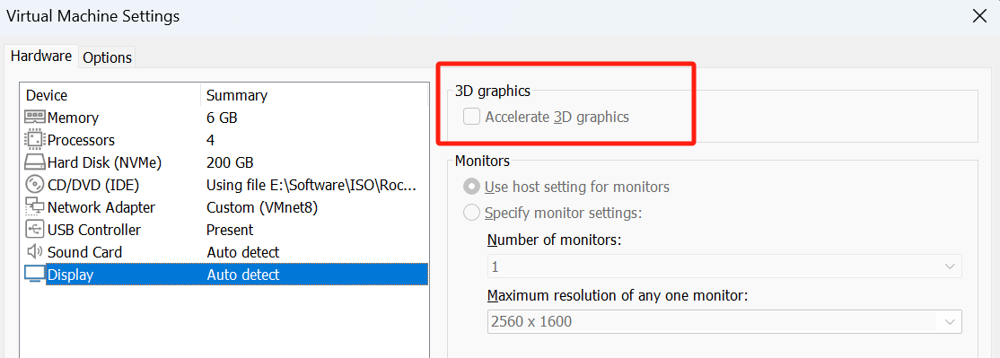

# RockyLinux - Kubernetes 集群搭建 - 二进制搭建Kubernetes v1.29.3-docker    

## 集群规划  
192.168.0.137 vip
192.168.0.138 ha1
192.168.0.139 ha2
192.168.0.140 master01  kube-apiserver,kube-controller-manager,kube-scheduler 
192.168.0.141 master02  kube-apiserver,kube-controller-manager,kube-scheduler 
192.168.0.142 master03  kube-apiserver,kube-controller-manager,kube-scheduler 

192.168.0.143 worker01  kube-proxy,kubectl,cri-dockerd,docker  
192.168.0.144 worker02  kube-proxy,kubectl,cri-dockerd,docker   
192.168.0.145 worker03  kube-proxy,kubectl,cri-dockerd,docker   
192.168.0.146 worker04  kube-proxy,kubectl,cri-dockerd,docker   
192.168.0.147 worker05  kube-proxy,kubectl,cri-dockerd,docker  
192.168.0.148 worker06  kube-proxy,kubectl,cri-dockerd,docker   

>下面命令中换行符后面不能有空格       

## 1.RockyLinux 虚拟机环境配置    

### 1.1 取消图形加速   
在 VMWare 通过 ISO 安装 Rocky Linux 时，需要将 `Display#3D graphics` 去掉勾选。    
     

### 1.2 手动设置分区    
虚机分区设置如下：
```bash
1. 配置"/boot"区，大小为 1024M 点击"Add mount point" -> Standard Partition 磁盘类型   

2. 配置"/"区，不指定磁盘空间大小，即剩下所有磁盘空间全部分配给根目录，点击"Add mount point"  -> LVM 磁盘类型    
即不单独分配swap，var等目录的空间，都公用根目录空间。
```

>注意 Rocky Linux 安装时会显示 `downloading...`, 此时只需要等待。     

## 2.RockyLinux 设置 Static IP （所有节点）  
```bash
vi /etc/NetworkManager/system-connections/ens160.nmconnection
```

内容如下：  
```bash
[connection]
id=ens160
uuid=fc94e303-d1b5-3dcc-bfdf-1e5226959fa9
type=ethernet
autoconnect-priority=-999
interface-name=ens160

[ethernet]

# 只需修改该项 
[ipv4]   
method=manual
address=192.168.0.140/24,192.168.0.1
dns=192.168.0.1

[ipv6]
addr-gen-mode=eui64
method=auto

[proxy]
```

生效：
```bash
nmcli c reload  
nmcli c up ens160
```

## 3.RockyLinux 初始化系统参数（所有节点）

### 3.1 设置 hostname 
```shell
hostnamectl set-hostname master01            # 使用这个命令会立即生效且重启也生效
```  

### 3.2 关闭防火墙  
```shell
systemctl stop firewalld.service
systemctl disable firewalld.service
```

### 3.3 设置 /etc/hosts   
```bash
192.168.0.138 ha1
192.168.0.139 ha2
192.168.0.140 master01
192.168.0.141 master02
192.168.0.142 master03

192.168.0.143 worker01
192.168.0.144 worker02
192.168.0.145 worker03
192.168.0.146 worker04
192.168.0.147 worker05
192.168.0.148 worker06       
```  

### 3.4 关闭 SeLinux
```shell
# 执行 getenforce 指令查看 selinux 状态，如果输出为：enforcing，则需要处理一下，否则可以跳过这一步。  
$ getenforce    

# 修改 `/etc/selinux/config` 文件，将`SELINUX=enforcing` 修改为 SELINUX=disabled。更新配置之后要重启服务器生效，或者执行：`setenforce 0`，使其立即生效。  
$ vi /etc/selinux/config    
SELINUX=disabled    

$ setenforce 0 // 立即生效  
# 再次执行getenforce指令查看selinux状态   
$ getenforce    
```

### 3.5 关闭 Swap 分区 和 关闭大页面
```shell
# 设置swap分区、关闭大页面压缩——性能考虑
# Linux中Swap分区（即：交换分区），类似于Windows的虚拟内存，就是当内存不足的时候，把一部分硬盘空间虚拟成# 内存使用，从而解决内存容量不足的情况。
# 在大数据应用中，使用Swap分区会降低性能，通常需要关闭掉。

（1）swap分区设置
swappiness=0：表示最大限度使用物理內存，之后才是swap分区；
swappiness=100：表示积极使用swap分区，並且把內存上的数据及时转移到swap分区；

$ vi /etc/sysctl.conf
vm.swappiness = 0

（2）关闭swap分区
$ vi /etc/fstab 

# 注释掉swap那一行 永久关闭
# /dev/mapper/centos-swap swap                    swap    defaults        0 0

（3）如果启用透明大页面压缩，可能会导致重大性能问题，建议禁用此设置。
$ vi /sys/kernel/mm/transparent_hugepage/defrag
[always] madvise never

$ vi /sys/kernel/mm/transparent_hugepage/enabled
[always] madvise never
```

以上是永久关闭，重启后才生效，还需执行 `swapoff -a` 临时生效。                  

### 3.6 设置时间同步 

使用 `timedatectl` 命令查看时间和时区   
```shell
[root@k8s01 ~]# timedatectl
      Local time: Sun 2024-03-24 23:17:30 CST
  Universal time: Sun 2024-03-24 15:17:30 UTC
        RTC time: Sun 2024-03-24 15:17:30
       Time zone: Asia/Shanghai (CST, +0800)
     NTP enabled: yes
NTP synchronized: no
 RTC in local TZ: no
      DST active: n/a
```

若时区不对，通过以下方式设置时区
设置时区：  
```shell
# 检查亚洲S开头的时区
[root@localhost ~]# timedatectl list-timezones |  grep  -E "Asia/S.*"

# output:
[root@localhost ~]# timedatectl list-timezones |  grep  -E "Asia/S.*"
Asia/Sakhalin
Asia/Samarkand
Asia/Seoul
Asia/Shanghai
Asia/Singapore
Asia/Srednekolymsk

通过 ` timedatectl set-timezone "Asia/Shanghai" ` 命令将时区设置为 `Asia/Shanghai`   
```

安装 chrony     
```shell
yum install chrony -y 

# 启动chrony服务
systemctl start chronyd

# 设置开机自启
systemctl enable chronyd

# 查看chrony服务状态
systemctl status chronyd
```

其他相关命令：
```shell
# 若需要手动同步系统时钟：    
# 手动同步系统时钟
chronyc -a makestep

# 查看时间同步源
chronyc sources -v
```

### 3.7 配置 ulimit  
```shell
cat >> /etc/security/limits.conf << EOF
* soft nproc 655360
* hard nproc 655360
* soft nofile 655360
* hard nofile 655360
* seft memlock unlimited
* hard memlock unlimited
EOF
``` 
>记得 重启。  

### 3.8 内核开启网络支持（ha节点不操作）   
```shell
cat >  /etc/sysctl.d/k8s.conf << EOF
net.bridge.bridge-nf-call-ip6tables = 1
net.bridge.bridge-nf-call-iptables = 1
net.ipv4.ip_forward = 1
net.ipv4.ip_nonlocal_bind = 1
net.ipv4.neigh.default.gc_thresh1 = 80000
net.ipv4.neigh.default.gc_thresh2 = 90000
net.ipv4.neigh.default.gc_thresh3 = 100000
EOF
```  

```shell
modprobe br_netfilter
sysctl --system  
```


### 3.9 安装基础软件包  
```shell
yum install vim net-tools unzip dos2unix telnet sysstat iotop pciutils lsof tcpdump psmisc bc wget socat -y
```

## 4. 安装 ipvsadm (k8s节点)    
```shell
yum install ipvsadm ipset sysstat conntrack libseccomp -y
```

```shell
cat > /etc/modules-load.d/ipvs.conf <<EOF 
ip_vs
ip_vs_rr
ip_vs_wrr
ip_vs_sh
nf_conntrack
ip_tables
ip_set
xt_set
ipt_set
ipt_rpfilter
ipt_REJECT
ipip
EOF
```

```shell
systemctl restart systemd-modules-load.service
lsmod | grep -e ip_vs -e nf_conntrack
```

## 5. 设置 k8s 节点间免密登录配置   
>在 master01 节点上创建即可，复制公钥到其他节点。    

master01 节点 执行 `ssh-keygen`，再通过以下命令分发到其他 k8s 节点中去。   

```shell
# 以下命令，分开执行 
ssh-copy-id root@master02
ssh-copy-id root@master03
ssh-copy-id root@worker01
ssh-copy-id root@worker02
ssh-copy-id root@worker03
ssh-copy-id root@worker04
ssh-copy-id root@worker05
ssh-copy-id root@worker06
```

## 6. 安装 haproxy，keepalived （ha节点）  

```shell
yum -y install haproxy keepalived 
```

### 6.1 安装 haproxy

#### 在 ha1 节点上操作  
> 注意 IP 修改 
```shell
vim /etc/haproxy/haproxy.cfg
```

```bash
#---------------------------------------------------------------------
# Global settings
#---------------------------------------------------------------------
global
    # to have these messages end up in /var/log/haproxy.log you will
    # need to:
    # 1) configure syslog to accept network log events.  This is done
    #    by adding the '-r' option to the SYSLOGD_OPTIONS in
    #    /etc/sysconfig/syslog
    # 2) configure local2 events to go to the /var/log/haproxy.log
    #   file. A line like the following can be added to
    #   /etc/sysconfig/syslog
    #
    #    local2.*                       /var/log/haproxy.log
    #
    log         127.0.0.1 local2

    chroot      /var/lib/haproxy
    pidfile     /var/run/haproxy.pid
    maxconn     4000
    user        haproxy
    group       haproxy
    daemon

    # turn on stats unix socket
    stats socket /var/lib/haproxy/stats
#---------------------------------------------------------------------
# common defaults that all the 'listen' and 'backend' sections will
# use if not designated in their block
#---------------------------------------------------------------------
defaults
    mode                    http
    log                     global
    option                  httplog
    option                  dontlognull
    option http-server-close
    option forwardfor       except 127.0.0.0/8
    option                  redispatch
    retries                 3
    timeout http-request    10s
    timeout queue           1m
    timeout connect         10s
    timeout client          1m
    timeout server          1m
    timeout http-keep-alive 10s
    timeout check           10s
    maxconn                 3000
#---------------------------------------------------------------------
# kubernetes apiserver frontend which proxys to the backends
#---------------------------------------------------------------------
frontend kubernetes-apiserver
    mode                 tcp
    bind                 *:6443
    option               tcplog
    default_backend      kubernetes-apiserver
#---------------------------------------------------------------------
# round robin balancing between the various backends
#---------------------------------------------------------------------
backend kubernetes-apiserver
    mode        tcp
    balance     roundrobin
    server      master01   192.168.0.140:6443 check
    server      master02   192.168.0.141:6443 check
    server      master03   192.168.0.142:6443 check
#---------------------------------------------------------------------
# collection haproxy statistics message
#---------------------------------------------------------------------
listen stats
    bind                 *:1080
    stats auth           admin:awesomePassword
    stats refresh        5s
    stats realm          HAProxy\ Statistics
    stats uri            /admin?stats
```

#### 在 ha2 节点上操作  
> 注意 IP 修改 
```shell
vim /etc/haproxy/haproxy.cfg
```

```bash
#---------------------------------------------------------------------
# Global settings
#---------------------------------------------------------------------
global
    # to have these messages end up in /var/log/haproxy.log you will
    # need to:
    # 1) configure syslog to accept network log events.  This is done
    #    by adding the '-r' option to the SYSLOGD_OPTIONS in
    #    /etc/sysconfig/syslog
    # 2) configure local2 events to go to the /var/log/haproxy.log
    #   file. A line like the following can be added to
    #   /etc/sysconfig/syslog
    #
    #    local2.*                       /var/log/haproxy.log
    #
    log         127.0.0.1 local2

    chroot      /var/lib/haproxy
    pidfile     /var/run/haproxy.pid
    maxconn     4000
    user        haproxy
    group       haproxy
    daemon

    # turn on stats unix socket
    stats socket /var/lib/haproxy/stats
#---------------------------------------------------------------------
# common defaults that all the 'listen' and 'backend' sections will
# use if not designated in their block
#---------------------------------------------------------------------
defaults
    mode                    http
    log                     global
    option                  httplog
    option                  dontlognull
    option http-server-close
    option forwardfor       except 127.0.0.0/8
    option                  redispatch
    retries                 3
    timeout http-request    10s
    timeout queue           1m
    timeout connect         10s
    timeout client          1m
    timeout server          1m
    timeout http-keep-alive 10s
    timeout check           10s
    maxconn                 3000
#---------------------------------------------------------------------
# kubernetes apiserver frontend which proxys to the backends
#---------------------------------------------------------------------
frontend kubernetes-apiserver
    mode                 tcp
    bind                 *:6443
    option               tcplog
    default_backend      kubernetes-apiserver
#---------------------------------------------------------------------
# round robin balancing between the various backends
#---------------------------------------------------------------------
backend kubernetes-apiserver
    mode        tcp
    balance     roundrobin
    server      master01   192.168.0.140:6443 check
    server      master02   192.168.0.141:6443 check
    server      master03   192.168.0.142:6443 check
#---------------------------------------------------------------------
# collection haproxy statistics message
#---------------------------------------------------------------------
listen stats
    bind                 *:1080
    stats auth           admin:awesomePassword
    stats refresh        5s
    stats realm          HAProxy\ Statistics
    stats uri            /admin?stats
```

#### 启动 haproxy 
```bash
# 设置开机启动
$ systemctl enable haproxy
# 开启haproxy
$ systemctl start haproxy
# 查看启动状态
$ systemctl status haproxy
```


### 6.2 安装 Keepalive   

#### 在 ha1 节点上操作 
注意： 系统网卡的名称，

注意此处内容全部替换成以下内容，且注意`VIP的IP`
```bash 
$ vim /etc/keepalived/keepalived.conf # 内容如下： 

! Configuration File for keepalived

global_defs {
   router_id k8s
}

vrrp_script check_haproxy {
    script "killall -0 haproxy"
    interval 3
    weight -2
    fall 10
    rise 2
}

vrrp_instance VI_1 {
    state MASTER
    interface ens160 # 需注意该参数，要与系统网卡名称保持一致
    virtual_router_id 51
    priority 250
    advert_int 1
    authentication {
        auth_type PASS
        auth_pass ceb1b3ec013d66163d6ab
    }
    virtual_ipaddress {
        192.168.0.137
    }
    track_script {
        check_haproxy
    }
}
```

#### 在 ha2 节点上操作 
注意此处内容全部替换成以下内容，且注意`VIP的IP` 
```bash
$ vim /etc/keepalived/keepalived.conf

! Configuration File for keepalived

global_defs {
   router_id k8s
}

vrrp_script check_haproxy {
    script "killall -0 haproxy"
    interval 3
    weight -2
    fall 10
    rise 2
}

vrrp_instance VI_1 {
    state BACKUP
    interface ens160
    virtual_router_id 51
    priority 200
    advert_int 1
    authentication {
        auth_type PASS
        auth_pass ceb1b3ec013d66163d6ab
    }
    virtual_ipaddress {
        192.168.0.137
    }
    track_script {
        check_haproxy
    }
}
```

#### 启动 keepalived
```bash
# 设置开机启动
$ systemctl enable keepalived.service
# 启动keepalived
$ systemctl start keepalived.service
# 查看启动状态
$ systemctl status keepalived.service
```

#### 启动后查看 ha1 的网卡信息，在 ha2 也执行相同命令，查看vip在哪台 ha 上 
```shell
ip a s ens160 (机器网卡) 
```

对比 ha1，ha2 两边输出的结果，若包含 192.168.0.149 ip 则说明 vip落在哪台 ha 上。   


## 7. 部署 ETCD 集群   

### 7.1 工作目录 （k8s节点）
```shell
mkdir -p /data/k8s-work
```

### 7.2 获取cfssl工具 （master01节点）   
访问 `https://github.com/cloudflare/cfssl`  

* 下载 `cfssl_1.6.5_linux_amd64`, 将下载后的文件 授权并放入 `/usr/local/bin/cfssl` 目录下   
```shell
chmod +x cfssl_1.6.5_linux_amd64  
mv cfssl_1.6.5_linux_amd64 /usr/local/bin/cfssl  
```

* 下载 `cfssljson_1.6.5_linux_amd64`, 将下载后的文件 授权并放入 `/usr/local/bin/cfssljson` 目录下  
```shell
chmod +x cfssljson_1.6.5_linux_amd64 
mv cfssljson_1.6.5_linux_amd64 /usr/local/bin/cfssljson  
```

* 下载 `cfssl-certinfo_1.6.5_linux_amd64`, 将下载后的文件 授权并放入 `/usr/local/bin/cfssl-certinfo` 目录下  
```shell
chmod +x cfssl-certinfo_1.6.5_linux_amd64
mv cfssl-certinfo_1.6.5_linux_amd64 /usr/local/bin/cfssl-certinfo  
```

### 7.3 创建CA证书 （master01节点）      
```shell
cat > ca-csr.json <<"EOF"
{
  "CN": "kubernetes",
  "key": {
    "algo": "rsa",
    "size": 2048
  },
  "names": [
    {
      "C": "CN",
      "ST": "Beijing",
      "L": "Beijing",
      "O": "kubemsb",
      "OU": "CN"
    }
  ],
  "ca": {
    "expiry": "87600h"
  }
}
EOF
```

创建证书   
```
cfssl gencert -initca ca-csr.json | cfssljson -bare ca  
```

输出结果： 
```bash
[root@master01 k8s-work]# cfssl gencert -initca ca-csr.json | cfssljson -bare ca
2025/04/14 03:45:38 [INFO] generating a new CA key and certificate from CSR
2025/04/14 03:45:38 [INFO] generate received request
2025/04/14 03:45:38 [INFO] received CSR
2025/04/14 03:45:38 [INFO] generating key: rsa-2048
2025/04/14 03:45:38 [INFO] encoded CSR
2025/04/14 03:45:38 [INFO] signed certificate with serial number 690428669185337474784097831441187999309886400423
```

创建 CA 证书策略  
```shell
cat > ca-config.json <<"EOF"
{
	"signing": {
		"default": {
			"expiry": "87600h"
		},
		"profiles": {
			"kubernetes": {
				"usages": ["signing", "key encipherment", "server auth", "client auth"],
				"expiry": "87600h"
			}
		}
	}
}
EOF
```

### 7.4 创建ETCD证书 （master01节点）     

#### 7.4.1 配置 etcd 请求文件     

```shell 
cat > etcd-csr.json <<"EOF"
{
  "CN": "etcd",
  "key": {
    "algo": "rsa",  
    "size": 2048  
  },
  "names": [
    {
      "C": "CN",      
      "ST": "Beijing",
      "L": "Beijing", 
      "O": "kubemsb", 
      "OU": "CN" 
    }
  ],
  "hosts": [
    "localhost",
    "127.0.0.1",
    "192.168.0.140",
    "192.168.0.141",
    "192.168.0.142"
  ]
}
EOF
```

生成证书
```shell
cfssl gencert -ca=ca.pem -ca-key=ca-key.pem -config=ca-config.json -profile=kubernetes etcd-csr.json | cfssljson -bare etcd 
```
输出结果：      
```bash
[root@master01 k8s-work]# cfssl gencert -ca=ca.pem -ca-key=ca-key.pem -config=ca-config.json -profile=kubernetes etcd-csr.json | cfssljson -bare etcd
2025/04/14 04:00:43 [INFO] generate received request
2025/04/14 04:00:43 [INFO] received CSR
2025/04/14 04:00:43 [INFO] generating key: rsa-2048
2025/04/14 04:00:44 [INFO] encoded CSR
2025/04/14 04:00:44 [INFO] signed certificate with serial number 494834428446495983757555394790838417397596298573
```

### 7.5 ETCD部署  
访问 `https://github.com/etcd-io` 下载 etcd。   
```shell
[root@master01 etcd-v3.6.0-rc.3-linux-amd64]# ls
Documentation  etcd  etcdctl  etcdutl  README-etcdctl.md  README-etcdutl.md  README.md  READMEv2-etcdctl.md   
```

将 安装包下的 etcd开头的执行文件拷贝到 /usr/local/bin 目录下            
```shell
cp -p etcd-v3.6.0-rc.3-linux-amd64/etcd* /usr/local/bin/
```  

使用 `scp -p etcd-v3.6.0-rc.3-linux-amd64/etcd* master02:/usr/local/bin/` 命令分发到其他 master 节点。   

#### 创建 /etc/etcd 目录
```shell
mkdir /etc/etcd  
```

#### 创建 etcd 配置    

**master01**

```shell  
cat > /etc/etcd/etcd.conf <<"EOF"
# [Member]
ETCD_NAME="etcd1"
ETCD_DATA_DIR="/var/lib/etcd/default.etcd"
ETCD_LISTEN_PEER_URLS="https://192.168.0.140:2380"
ETCD_LISTEN_CLIENT_URLS="https://192.168.0.140:2379,http://127.0.0.1:2379"

# [Clustering]
ETCD_INITIAL_ADVERTISE_PEER_URLS="https://192.168.0.140:2380" 
ETCD_ADVERTISE_CLIENT_URLS="https://192.168.0.140:2379"
ETCD_INITIAL_CLUSTER="etcd1=https://192.168.0.140:2380,etcd2=https://192.168.0.141:2380,etcd3=https://192.168.0.142:2380"

ETCD_INITIAL_CLUSTER_TOKEN="etcd-cluster"
ETCD_INITIAL_CLUSTER_STATE="new"
EOF
```

**master02**

```shell  
cat > /etc/etcd/etcd.conf <<"EOF"
# [Member]
ETCD_NAME="etcd2"
ETCD_DATA_DIR="/var/lib/etcd/default.etcd"
ETCD_LISTEN_PEER_URLS="https://192.168.0.141:2380"
ETCD_LISTEN_CLIENT_URLS="https://192.168.0.141:2379,http://127.0.0.1:2379"

# [Clustering]
ETCD_INITIAL_ADVERTISE_PEER_URLS="https://192.168.0.141:2380" 
ETCD_ADVERTISE_CLIENT_URLS="https://192.168.0.141:2379"
ETCD_INITIAL_CLUSTER="etcd1=https://192.168.0.140:2380,etcd2=https://192.168.0.141:2380,etcd3=https://192.168.0.142:2380"

ETCD_INITIAL_CLUSTER_TOKEN="etcd-cluster"
ETCD_INITIAL_CLUSTER_STATE="new"
EOF
```

**master03**

```shell  
cat > /etc/etcd/etcd.conf <<"EOF"
# [Member]
ETCD_NAME="etcd3"
ETCD_DATA_DIR="/var/lib/etcd/default.etcd"
ETCD_LISTEN_PEER_URLS="https://192.168.0.142:2380"
ETCD_LISTEN_CLIENT_URLS="https://192.168.0.142:2379,http://127.0.0.1:2379"

# [Clustering]
ETCD_INITIAL_ADVERTISE_PEER_URLS="https://192.168.0.142:2380" 
ETCD_ADVERTISE_CLIENT_URLS="https://192.168.0.142:2379"
ETCD_INITIAL_CLUSTER="etcd1=https://192.168.0.140:2380,etcd2=https://192.168.0.141:2380,etcd3=https://192.168.0.142:2380"

ETCD_INITIAL_CLUSTER_TOKEN="etcd-cluster"
ETCD_INITIAL_CLUSTER_STATE="new"
EOF
```

#### 准备证书文件 & 创建 etcd服务配置文件  
所有 etcd 节点创建以下目录    
```shell
mkdir -p /etc/etcd/ssl
mkdir -p /var/lib/etcd/default.etcd   
``` 

**master01操作** 

准备证书文件  
```shell
cd /data/k8s-work
cp ca*.pem /etc/etcd/ssl
cp etcd*.pem /etc/etcd/ssl  
 

scp ca*.pem master02:/etc/etcd/ssl
scp etcd*.pem master02:/etc/etcd/ssl 

scp ca*.pem master03:/etc/etcd/ssl
scp etcd*.pem master03:/etc/etcd/ssl 
```

**准备服务配置文件**（ETCD 所有节点） 
```shell
cat > /etc/systemd/system/etcd.service <<"EOF"
[Unit]
Description=Etcd Server
After=network.target
After=network-online.target
Wants=network-online.target

[Service]
Type=notify
EnvironmentFile=/etc/etcd/etcd.conf 
WorkingDirectory=/var/lib/etcd/
ExecStart=/usr/local/bin/etcd \
  --cert-file=/etc/etcd/ssl/etcd.pem \
  --key-file=/etc/etcd/ssl/etcd-key.pem \
  --trusted-ca-file=/etc/etcd/ssl/ca.pem \
  --peer-cert-file=/etc/etcd/ssl/etcd.pem \
  --peer-key-file=/etc/etcd/ssl/etcd-key.pem \
  --peer-trusted-ca-file=/etc/etcd/ssl/ca.pem \
  --peer-client-cert-auth \
  --client-cert-auth
Restart=on-failure
RestartSec=5  
LimitNOFILE=65536  

[Install]
WantedBy=multi-user.target  
EOF
```

#### 启动 etcd  

```shell
systemctl daemon-reload
systemctl enable --now etcd 
``` 

```shell
[root@master01 k8s-work]# etcdctl member list
4744090d32d62b14, started, etcd3, https://192.168.0.142:2380, https://192.168.0.142:2379, false
5d36a0ae0bb08bc0, started, etcd1, https://192.168.0.140:2380, https://192.168.0.140:2379, false
ff44f0163fd2a515, started, etcd2, https://192.168.0.141:2380, https://192.168.0.141:2379, false
```

```shell
[root@master01 k8s-work]# etcdctl member list -w table
+------------------+---------+-------+----------------------------+----------------------------+------------+
|        ID        | STATUS  | NAME  |         PEER ADDRS         |        CLIENT ADDRS        | IS LEARNER |
+------------------+---------+-------+----------------------------+----------------------------+------------+
| 4744090d32d62b14 | started | etcd3 | https://192.168.0.142:2380 | https://192.168.0.142:2379 |      false |
| 5d36a0ae0bb08bc0 | started | etcd1 | https://192.168.0.140:2380 | https://192.168.0.140:2379 |      false |
| ff44f0163fd2a515 | started | etcd2 | https://192.168.0.141:2380 | https://192.168.0.141:2379 |      false |
+------------------+---------+-------+----------------------------+----------------------------+------------+
```

```shell
ETCDCTL_API=3 /usr/local/bin/etcdctl --write-out=table --cacert=/etc/etcd/ssl/ca.pem --cert=/etc/etcd/ssl/etcd.pem --key=/etc/etcd/ssl/etcd-key.pem --endpoints=https://192.168.0.140:2379,https://192.168.0.141:2379,https://192.168.0.142:2379 endpoint health

[root@master01 k8s-work]# ETCDCTL_API=3 /usr/local/bin/etcdctl --write-out=table --cacert=/etc/etcd/ssl/ca.pem --cert=/etc/etcd/ssl/etcd.pem --key=/etc/etcd/ssl/etcd-key.pem --endpoints=https://192.168.0.140:2379,https://192.168.0.141:2379,https://192.168.0.142:2379 endpoint health
{"level":"warn","ts":"2025-04-14T05:10:03.309079+0800","caller":"flags/flag.go:94","msg":"unrecognized environment variable","environment-variable":"ETCDCTL_API=3"}
{"level":"warn","ts":"2025-04-14T05:10:03.309668+0800","caller":"flags/flag.go:94","msg":"unrecognized environment variable","environment-variable":"ETCDCTL_API=3"}
+----------------------------+--------+-------------+-------+
|          ENDPOINT          | HEALTH |    TOOK     | ERROR |
+----------------------------+--------+-------------+-------+
| https://192.168.0.140:2379 |   true | 17.455158ms |       |
| https://192.168.0.141:2379 |   true | 17.773829ms |       |
| https://192.168.0.142:2379 |   true | 17.457137ms |       |
+----------------------------+--------+-------------+-------+
```


```shell
ETCDCTL_API=3 /usr/local/bin/etcdctl --write-out=table --cacert=/etc/etcd/ssl/ca.pem --cert=/etc/etcd/ssl/etcd.pem --key=/etc/etcd/ssl/etcd-key.pem --endpoints=https://192.168.0.140:2379,https://192.168.0.141:2379,https://192.168.0.142:2379 endpoint status

[root@master01 k8s-work]# ETCDCTL_API=3 /usr/local/bin/etcdctl --write-out=table --cacert=/etc/etcd/ssl/ca.pem --cert=/etc/etcd/ssl/etcd.pem --key=/etc/etcd/ssl/etcd-key.pem --endpoints=https://192.168.0.140:2379,https://192.168.0.141:2379,https://192.168.0.142:2379 endpoint status
{"level":"warn","ts":"2025-04-14T05:09:02.036047+0800","caller":"flags/flag.go:94","msg":"unrecognized environment variable","environment-variable":"ETCDCTL_API=3"}
+----------------------------+------------------+------------+-----------------+---------+--------+-----------------------+-------+-----------+------------+-----------+------------+--------------------+--------+--------------------------+-------------------+
|          ENDPOINT          |        ID        |  VERSION   | STORAGE VERSION | DB SIZE | IN USE | PERCENTAGE NOT IN USE | QUOTA | IS LEADER | IS LEARNER | RAFT TERM | RAFT INDEX | RAFT APPLIED INDEX | ERRORS | DOWNGRADE TARGET VERSION | DOWNGRADE ENABLED |
+----------------------------+------------------+------------+-----------------+---------+--------+-----------------------+-------+-----------+------------+-----------+------------+--------------------+--------+--------------------------+-------------------+
| https://192.168.0.140:2379 | 5d36a0ae0bb08bc0 | 3.6.0-rc.3 |           3.6.0 |   20 kB |  16 kB |                   20% |   0 B |      true |      false |         2 |          9 |                  9 |        |                          |             false |
| https://192.168.0.141:2379 | ff44f0163fd2a515 | 3.6.0-rc.3 |           3.6.0 |   20 kB |  16 kB |                   20% |   0 B |     false |      false |         2 |          9 |                  9 |        |                          |             false |
| https://192.168.0.142:2379 | 4744090d32d62b14 | 3.6.0-rc.3 |           3.6.0 |   20 kB |  16 kB |                   20% |   0 B |     false |      false |         2 |          9 |                  9 |        |                          |             false |
+----------------------------+------------------+------------+-----------------+---------+--------+-----------------------+-------+-----------+------------+-----------+------------+--------------------+--------+--------------------------+-------------------+
```  

## 8. K8s 集群二进制部署  

### 8.1 下载 kubernetes-server （master01操作） 
访问 `http://dl.k8s.io/v1.30.8/kubernetes-server-linux-amd64.tar.gz` 下载二进制包  

```shell
cp kube-apiserver kube-controller-manager kube-scheduler kubectl /usr/local/bin   

# 拷贝其他 master 节点
scp kube-apiserver kube-controller-manager kube-scheduler kubectl master02:/usr/local/bin   
```

对于 worker 节点 
```shell
scp kubelet kube-proxy worker01:/usr/local/bin
```

### 8.2 创建目录 （master节点）
```shell
mkdir -p /etc/kubernetes
mkdir -p /etc/kubernetes/ssl
mkdir -p /var/log/kubernetes
```

### 8.3 kube apiserver 部署  

#### 创建 apiserver 证书请求文件   
```shell  
cat > kube-apiserver-csr.json <<"EOF"
{
  "CN": "kubernetes", 
  "key": {
    "algo": "rsa",        
    "size": 2048          
  },
  "names": [
    {
      "C": "CN",          
      "ST": "Beijing",  
      "L": "Beijing",
      "O": "kubemsb",   
      "OU": "CN" 
    }
  ],
  "hosts": [  
    "127.0.0.1",
    "192.168.0.137",
    "192.168.0.140",
    "192.168.0.141",
    "192.168.0.142",
    "192.168.0.143",
    "192.168.0.144",
    "192.168.0.145",
    "192.168.0.146",
    "192.168.0.147",
    "192.168.0.148",
    "192.168.0.149",
    "192.168.0.150",
    "192.168.0.151",
    "192.168.0.152",
    "192.168.0.153",
    "192.168.0.154",
    "192.168.0.155",
    "10.96.0.1",                  
    "kubernetes",          
    "kubernetes.default",
    "kubernetes.default.svc",
    "kubernetes.default.svc.cluster",
    "kubernetes.default.svc.cluster.local"
  ]
}
EOF
```

生成证书 
```shell
cfssl gencert -ca=ca.pem -ca-key=ca-key.pem -config=ca-config.json -profile=kubernetes kube-apiserver-csr.json | cfssljson -bare kube-apiserver
```
输出结果： 
```bash
[root@master01 k8s-work]# cfssl gencert -ca=ca.pem -ca-key=ca-key.pem -config=ca-config.json -profile=kubernetes kube-apiserver-csr.json | cfssljson -bare kube-apiserver
2025/04/14 06:03:08 [INFO] generate received request
2025/04/14 06:03:08 [INFO] received CSR
2025/04/14 06:03:08 [INFO] generating key: rsa-2048
2025/04/14 06:03:08 [INFO] encoded CSR
2025/04/14 06:03:08 [INFO] signed certificate with serial number 462581878008939025830712999486522444583778078522
```

#### 创建 TLS机制所需的TOKEN  
```shell
cat > token.csv << EOF 
$(head -c 16 /dev/urandom | od -An -t x | tr -d ' '),kubelet-bootstrap,10001,"system:kubelet-bootstrap"
EOF
```  

#### 创建 apiserver 服务配置文件 (master节点)      
注意，不同 master ip不同，需要替换。

`下面命令中换行符后面不能有空格`
```shell 
cat > /etc/kubernetes/kube-apiserver.conf << "EOF"
KUBE_APISERVER_OPTS="--enable-admission-plugins=NamespaceLifecycle,NodeRestriction,LimitRanger,ServiceAccount,DefaultStorageClass,ResourceQuota \
  --anonymous-auth=false \
  --bind-address=192.168.0.140 \
  --advertise-address=192.168.0.140 \
  --secure-port=6443 \
  --authorization-mode=Node,RBAC \
  --runtime-config=api/all=true \
  --enable-bootstrap-token-auth=true \
  --service-cluster-ip-range=10.96.0.0/16 \
  --token-auth-file=/etc/kubernetes/token.csv \
  --service-node-port-range=30000-32767 \
  --tls-cert-file=/etc/kubernetes/ssl/kube-apiserver.pem \
  --tls-private-key-file=/etc/kubernetes/ssl/kube-apiserver-key.pem \
  --client-ca-file=/etc/kubernetes/ssl/ca.pem \
  --kubelet-client-certificate=/etc/kubernetes/ssl/kube-apiserver.pem \
  --kubelet-client-key=/etc/kubernetes/ssl/kube-apiserver-key.pem \
  --service-account-key-file=/etc/kubernetes/ssl/ca-key.pem \
  --service-account-signing-key-file=/etc/kubernetes/ssl/ca-key.pem \
  --service-account-issuer=api \
  --etcd-cafile=/etc/etcd/ssl/ca.pem \
  --etcd-certfile=/etc/etcd/ssl/etcd.pem \
  --etcd-keyfile=/etc/etcd/ssl/etcd-key.pem \
  --etcd-servers=https://192.168.0.140:2379,https://192.168.0.141:2379,https://192.168.0.142:2379 \
  --allow-privileged=true \
  --apiserver-count=3 \
  --audit-log-maxage=30 \
  --audit-log-maxbackup=3 \
  --audit-log-maxsize=100 \
  --audit-log-path=/var/log/kube-apiserver-audit.log \
  --event-ttl=1h \
  --v=4"
```

#### 创建 apiserver 服务管理配置文件  
```shell
cat > /etc/systemd/system/kube-apiserver.service << "EOF"
[Unit]
Description=Kubernetes API Server
Documentation=https://github.com/kubernetes/kubernetes
After=etcd.service
Wants=etcd.service

[Service]
EnvironmentFile=/etc/kubernetes/kube-apiserver.conf
ExecStart=/usr/local/bin/kube-apiserver $KUBE_APISERVER_OPTS
Restart=on-failure
RestartSec=5
Type=notify
LimitNOFILE=65536

[Install]
WantedBy=multi-user.target
EOF
```

#### 分发证书及 token 文件到各个 master 节点  
```shell
cp ca*.pem kube-apiserver*.pem /etc/kubernetes/ssl/
cp token.csv /etc/kubernetes/   
```

```shell
scp ca*.pem kube-apiserver*.pem master02:/etc/kubernetes/ssl/
scp token.csv master02:/etc/kubernetes/   
```  

```shell
scp ca*.pem kube-apiserver*.pem master03:/etc/kubernetes/ssl/
scp token.csv master03:/etc/kubernetes/   
```  

#### 启动 apiserver 服务
>所有的 master 节点全部执行。    

```shell
systemctl daemon-reload 
systemctl enable --now kube-apiserver
systemctl status kube-apiserver
```

#### 验证 apiserver 访问  
```shell
curl --insecure https://192.168.0.140:6443
```
 
```shell
[root@master01 kubernetes]# curl --insecure https://192.168.0.140:6443
{
  "kind": "Status",
  "apiVersion": "v1",
  "metadata": {},
  "status": "Failure",
  "message": "Unauthorized",
  "reason": "Unauthorized",
  "code": 401
}[root@master01 kubernetes]#
[root@master01 kubernetes]# curl --insecure https://192.168.0.141:6443
{
  "kind": "Status",
  "apiVersion": "v1",
  "metadata": {},
  "status": "Failure",
  "message": "Unauthorized",
  "reason": "Unauthorized",
  "code": 401
}[root@master01 kubernetes]#
[root@master01 kubernetes]#
[root@master01 kubernetes]#
[root@master01 kubernetes]# curl --insecure https://192.168.0.142:6443
{
  "kind": "Status",
  "apiVersion": "v1",
  "metadata": {},
  "status": "Failure",
  "message": "Unauthorized",
  "reason": "Unauthorized",
  "code": 401
}[root@master01 kubernetes]#
[root@master01 kubernetes]#
[root@master01 kubernetes]# curl --insecure https://192.168.0.137:6443
{
  "kind": "Status",
  "apiVersion": "v1",
  "metadata": {},
  "status": "Failure",
  "message": "Unauthorized",
  "reason": "Unauthorized",
  "code": 401
}
```

### 8.4 kubectl 部署     

#### 创建kubectl证书请求文件
后续 kube-apiserver 使用 RBAC 对客户端(如 kubelet、kube-proxy、Pod)请求进行授权；    
kube-apiserver 预定义了一些 RBAC 使用的 RoleBindings，如 cluster-admin 将 Group system:masters 与 Role cluster-admin 绑定，该 Role 授予了调用kube-apiserver 的所有 API的权限；   

O指定该证书的 Group 为 system:masters，kubelet 使用该证书访问 kube-apiserver 时 ，由于证书被 CA 签名，所以认证通过，同时由于证书用户组为经过预授权的 system:masters，所以被授予访问所有 API 的权限；    

```shell
cat > admin-csr.json << "EOF"
{
  "CN": "admin",
  "hosts": [],
  "key": {
    "algo": "rsa",
    "size": 2048
  },
  "names": [
    {
      "C": "CN",
      "ST": "Beijing",
      "L": "Beijing",
      "O": "system:masters",             
      "OU": "system"
    }
  ]
}
EOF
```

#### 生成 admin 证书文件  
```shell
cfssl gencert -ca=ca.pem -ca-key=ca-key.pem -config=ca-config.json -profile=kubernetes admin-csr.json | cfssljson -bare admin
```

输出结果：      
```bash
[root@master01 k8s-work]# cfssl gencert -ca=ca.pem -ca-key=ca-key.pem -config=ca-config.json -profile=kubernetes admin-csr.json | cfssljson -bare admin
2025/04/14 20:55:23 [INFO] generate received request
2025/04/14 20:55:23 [INFO] received CSR
2025/04/14 20:55:23 [INFO] generating key: rsa-2048
2025/04/14 20:55:23 [INFO] encoded CSR
2025/04/14 20:55:23 [INFO] signed certificate with serial number 416218417365254080251791693049351371773305214065
2025/04/14 20:55:23 [WARNING] This certificate lacks a "hosts" field. This makes it unsuitable for
websites. For more information see the Baseline Requirements for the Issuance and Management
of Publicly-Trusted Certificates, v.1.1.6, from the CA/Browser Forum (https://cabforum.org);
specifically, section 10.2.3 ("Information Requirements").     
```

#### 分发证书  
```shell
cp admin*.pem /etc/kubernetes/ssl/
```

#### 生成admin配置文件 kubeconfig  
kube.config 为 kubectl 的配置文件，包含访问 apiserver 的所有信息，如 apiserver 地址、CA 证书和自身使用的证书   
```shell
kubectl config set-cluster kubernetes --certificate-authority=ca.pem --embed-certs=true --server=https://192.168.0.137:6443 --kubeconfig=kube.config
```

```shell
kubectl config set-credentials admin --client-certificate=admin.pem --client-key=admin-key.pem --embed-certs=true --kubeconfig=kube.config  
``` 

```shell
kubectl config use-context kubernetes --kubeconfig=kube.config
```

#### 准备kubectl配置文件并进行角色绑定  
```shell
mkdir ~/.kube  
cp kube.config ~/.kube/config
```

```shell
kubectl create clusterrolebinding kube-apiserver:kubelet-apis --clusterrole=system:kubelet-api-admin --user kubernetes --kubeconfig=/root/.kube/config
```  

#### 查看集群状态  
```shell
kubectl cluster-info
```  

输出结果：      
```bash
[root@master01 k8s-work]# kubectl cluster-info
Kubernetes control plane is running at https://192.168.0.137:6443

To further debug and diagnose cluster problems, use 'kubectl cluster-info dump'.
```

```shell
kubectl get componentstatuses
```

输出结果：  
```bash
[root@master01 k8s-work]# kubectl get componentstatuses
Warning: v1 ComponentStatus is deprecated in v1.19+
NAME                 STATUS      MESSAGE                                                                                        ERROR
controller-manager   Unhealthy   Get "https://127.0.0.1:10257/healthz": dial tcp 127.0.0.1:10257: connect: connection refused
etcd-0               Healthy     ok
scheduler            Healthy     ok
```

#### 同步kubectl配置文件到其它master节点 
在其他 master 节点创建 `mkdir /root/.kube`   

```shell
scp /root/.kube/config master02:/root/.kube/config
scp /root/.kube/config master03:/root/.kube/config
```   

#### 配置kubectl命令补全功能（可选）  
```shell
yum install -y bash-completion
source /usr/share/bash-completion/bash_completion
source <(kubectl completion bash)
kubectl completion bash > ~/.kube/completion.bash.inc
source '/root/.kube/completion.bash.inc'  
source $HOME/.bash_profile
```

### 8.5 kube-controller-manager 部署   

#### 创建kube-controller-manager证书请求文件  
```shell
cat > kube-controller-manager-csr.json << "EOF"
{
    "CN": "system:kube-controller-manager",
    "key": {
        "algo": "rsa",
        "size": 2048
    },
    "hosts": [
      "127.0.0.1",
      "192.168.0.140",
      "192.168.0.141",
      "192.168.0.142"
    ],
    "names": [
      {
        "C": "CN",
        "ST": "Beijing",
        "L": "Beijing",
        "O": "system:kube-controller-manager",
        "OU": "system"
      }
    ]
}
EOF
```  

#### 创建kube-controller-manager证书文件  
```shell
cfssl gencert -ca=ca.pem -ca-key=ca-key.pem -config=ca-config.json -profile=kubernetes kube-controller-manager-csr.json | cfssljson -bare kube-controller-manager
```

输出结果：      
```bash
[root@master01 k8s-work]# cfssl gencert -ca=ca.pem -ca-key=ca-key.pem -config=ca-config.json -profile=kubernetes kube-controller-manager-csr.json | cfssljson -bare kube-controller-manager
2025/04/14 21:11:11 [INFO] generate received request
2025/04/14 21:11:11 [INFO] received CSR
2025/04/14 21:11:11 [INFO] generating key: rsa-2048
2025/04/14 21:11:12 [INFO] encoded CSR
2025/04/14 21:11:12 [INFO] signed certificate with serial number 622812441503832403115528021568376678529495717198
```

#### 创建kube-controller-manager的config文件  
```shell
kubectl config set-cluster kubernetes --certificate-authority=ca.pem --embed-certs=true --server=https://192.168.0.137:6443 --kubeconfig=kube-controller-manager.kubeconfig
``` 

```shell
kubectl config set-credentials system:kube-controller-manager --client-certificate=kube-controller-manager.pem --client-key=kube-controller-manager-key.pem --embed-certs=true --kubeconfig=kube-controller-manager.kubeconfig
```

```shell
kubectl config set-context system:kube-controller-manager --cluster=kubernetes --user=system:kube-controller-manager --kubeconfig=kube-controller-manager.kubeconfig
``` 

```shell
kubectl config use-context system:kube-controller-manager --kubeconfig=kube-controller-manager.kubeconfig
```  

#### 创建kube-controller-manager服务配置文件    
```shell
cat > /etc/kubernetes/kube-controller-manager.conf << "EOF"
KUBE_CONTROLLER_MANAGER_OPTS=" \
  --secure-port=10257 \
  --bind-address=127.0.0.1 \
  --kubeconfig=/etc/kubernetes/kube-controller-manager.kubeconfig \
  --service-cluster-ip-range=10.96.0.0/16 \
  --cluster-name=kubernetes \
  --cluster-signing-cert-file=/etc/kubernetes/ssl/ca.pem \
  --cluster-signing-key-file=/etc/kubernetes/ssl/ca-key.pem \
  --allocate-node-cidrs=true \
  --cluster-cidr=10.244.0.0/16 \
  --root-ca-file=/etc/kubernetes/ssl/ca.pem \
  --service-account-private-key-file=/etc/kubernetes/ssl/ca-key.pem \
  --leader-elect=true \
  --feature-gates=RotateKubeletServerCertificate=true \
  --controllers=*,bootstrapsigner,tokencleaner \
  --tls-cert-file=/etc/kubernetes/ssl/kube-controller-manager.pem \
  --tls-private-key-file=/etc/kubernetes/ssl/kube-controller-manager-key.pem \
  --use-service-account-credentials=true \
  --v=2"
EOF
```  

#### 创建kube-controller-manager服务启动配置文件  
```shell
cat > /usr/lib/systemd/system/kube-controller-manager.service << "EOF"
[Unit]
Description=Kubernetes Controller Manager
Documentation=https://github.com/kubernetes/kubernetes

[Service]
EnvironmentFile=-/etc/kubernetes/kube-controller-manager.conf
ExecStart=/usr/local/bin/kube-controller-manager $KUBE_CONTROLLER_MANAGER_OPTS
Restart=on-failure
RestartSec=5

[Install]
WantedBy=multi-user.target
EOF
```

#### 同步kube-controller-manager证书文件到集群master节点  

master01
```shell
cp kube-controller-manager*.pem /etc/kubernetes/ssl/
cp kube-controller-manager.kubeconfig /etc/kubernetes/
```

master02
```shell
scp kube-controller-manager*.pem master02:/etc/kubernetes/ssl/
scp kube-controller-manager.kubeconfig master02:/etc/kubernetes/
```

master03
```shell
scp kube-controller-manager*.pem master03:/etc/kubernetes/ssl/
scp kube-controller-manager.kubeconfig master03:/etc/kubernetes/
```

#### 查看证书   
```shell
openssl x509 -in /etc/kubernetes/ssl/kube-controller-manager.pem -noout -text
```

#### 启动kube-controller-manager服务  
```shell
systemctl daemon-reload 
systemctl enable --now kube-controller-manager
systemctl status kube-controller-manager
```  

```shell
[root@master01 k8s-work]# kubectl get cs
Warning: v1 ComponentStatus is deprecated in v1.19+
NAME                 STATUS    MESSAGE   ERROR
scheduler            Healthy   ok
controller-manager   Healthy   ok
etcd-0               Healthy   ok
```

### 8.6 kube-scheduler 部署  
```shell
cat > kube-scheduler-csr.json << "EOF"   
{
  "CN": "system:kube-scheduler", 
  "key": {
    "algo": "rsa",        
    "size": 2048          
  },
  "names": [
    {
      "C": "CN",          
      "ST": "Beijing",  
      "L": "Beijing",
      "O": "kubemsb",   
      "OU": "CN" 
    }
  ],
  "hosts": [
    "127.0.0.1",
    "192.168.0.140",
    "192.168.0.141",
    "192.168.0.142"
  ]
}
EOF
```  

#### 生成 kube-scheduler 证书  
```shell
cfssl gencert -ca=ca.pem -ca-key=ca-key.pem -config=ca-config.json -profile=kubernetes kube-scheduler-csr.json | cfssljson -bare kube-scheduler 
```

输出结果：  
```bash
[root@master01 k8s-work]# cfssl gencert -ca=ca.pem -ca-key=ca-key.pem -config=ca-config.json -profile=kubernetes kube-scheduler-csr.json | cfssljson -bare kube-scheduler
2025/04/14 20:02:47 [INFO] generate received request
2025/04/14 20:02:47 [INFO] received CSR
2025/04/14 20:02:47 [INFO] generating key: rsa-2048
2025/04/14 20:02:47 [INFO] encoded CSR
2025/04/14 20:02:47 [INFO] signed certificate with serial number 578124987628136124649396113212534723620253667771
```


#### 创建 kube-scheduler 的 kubeconfig  
```shell
kubectl config set-cluster kubernetes --certificate-authority=ca.pem --embed-certs=true --server=https://192.168.0.137:6443 --kubeconfig=kube-scheduler.kubeconfig    

kubectl config set-credentials system:kube-scheduler --client-certificate=kube-scheduler.pem --client-key=kube-scheduler-key.pem --embed-certs=true --kubeconfig=kube-scheduler.kubeconfig  

kubectl config set-context system:kube-scheduler --cluster=kubernetes --user=system:kube-scheduler --kubeconfig=kube-scheduler.kubeconfig  

kubectl config use-context system:kube-scheduler --kubeconfig=kube-scheduler.kubeconfig   
```

#### 创建 kube-scheduler 服务配置文件 （master节点）  
```shell
cat > /etc/kubernetes/kube-scheduler.conf << "EOF"
KUBE_SCHEDULER_OPTS=" \
--kubeconfig=/etc/kubernetes/kube-scheduler.kubeconfig \
--leader-elect=true \
--v=2"
EOF
```

#### 创建 kube-scheduler 服务启动配置文件（master节点）     
```shell
cat > /usr/lib/systemd/system/kube-scheduler.service << "EOF"
[Unit]
Description=Kubernetes Scheduler
Documentation=https://github.com/kubernetes/kubernetes

[Service]
EnvironmentFile=/etc/kubernetes/kube-scheduler.conf
ExecStart=/usr/local/bin/kube-scheduler $KUBE_SCHEDULER_OPTS
Restart=on-failure
RestartSec=5

[Install]
WantedBy=multi-user.target
EOF
```

#### 同步证书文件到 master 节点 （master01节点） 
```shell
cp kube-scheduler*.pem /etc/kubernetes/ssl/
cp kube-scheduler.kubeconfig /etc/kubernetes   
```

```shell
scp kube-scheduler*.pem master02:/etc/kubernetes/ssl/
scp kube-scheduler.kubeconfig master02:/etc/kubernetes 
```

```shell
scp kube-scheduler*.pem master03:/etc/kubernetes/ssl/
scp kube-scheduler.kubeconfig master03:/etc/kubernetes 
```

#### 启动 kube-scheduler 服务 (master节点)  
```shell
systemctl daemon-reload 
systemctl enable --now kube-scheduler  
systemctl status kube-scheduler   
```  

### 8.7 Worker 节点部署   

#### 容器运行时 Docker部署（worker节点）
```shell
wget -O /etc/yum.repos.d/docker-ce.repo https://mirrors.aliyun.com/docker-ce/linux/centos/docker-ce.repo   

yum -y install docker-ce    

systemctl enable --now docker    
```

#### 修改Docker配置  
```shell
cat <<EOF | sudo tee /etc/docker/daemon.json
{
  "exec-opts": ["native.cgroupdriver=systemd"]
}
EOF
```  

```shell
systemctl restart docker  
``` 

#### cri-dockerd安装   
```shell
wget https://github.com/Mirantis/cri-dockerd/releases/download/v0.3.17/cri-dockerd-0.3.17.amd64.tgz 

tar -zxf cri-dockerd-0.3.17.amd64.tgz 

cp cri-dockerd/cri-dockerd /usr/bin
```

创建服务配置文件 cri-docker.service 和 cri-docker.socket    
```shell
cat > /usr/lib/systemd/system/cri-docker.service << EOF
[Unit]
Description=CRI Interface for Docker Application Container Engine
Documentation=https://docs.mirantis.com
After=network-online.target firewalld.service docker.service
Wants=network-online.target
Requires=cri-docker.socket

[Service]
Type=notify
ExecStart=/usr/bin/cri-dockerd --container-runtime-endpoint fd://
ExecReload=/bin/kill -s HUP \$MAINPID
TimeoutSec=0
RestartSec=2
Restart=always

# Note that StartLimit* options were moved from "Service" to "Unit" in systemd 229.
# Both the old, and new location are accepted by systemd 229 and up, so using the old location
# to make them work for either version of systemd.
StartLimitBurst=3

# Note that StartLimitInterval was renamed to StartLimitIntervalSec in systemd 230.
# Both the old, and new name are accepted by systemd 230 and up, so using the old name to make
# this option work for either version of systemd.
StartLimitInterval=60s

# Having non-zero Limit*s causes performance problems due to accounting overhead
# in the kernel. We recommend using cgroups to do container-local accounting.
LimitNOFILE=infinity
LimitNPROC=infinity
LimitCORE=infinity

# Comment TasksMax if your systemd version does not support it.
# Only systemd 226 and above support this option.
TasksMax=infinity
Delegate=yes
KillMode=process

[Install]
WantedBy=multi-user.target
EOF
```

```shell
cat > /usr/lib/systemd/system/cri-docker.socket << EOF
[Unit]
Description=CRI Docker Socket for the API
PartOf=cri-docker.service

[Socket]
ListenStream=%t/cri-dockerd.sock
SocketMode=0660
SocketUser=root
SocketGroup=root

[Install]
WantedBy=sockets.target
EOF
```

启动 cri-docker 并设置开机自启  
```shell
systemctl daemon-reload
systemctl enable --now cri-docker.socket
systemctl enable cri-docker.service
systemctl start cri-docker.socket
systemctl start cri-docker.service
systemctl status cri-docker.socket
systemctl status cri-docker.service
```

### 8.8 kubelet 部署
>在k8s-master01节点上执行  

#### 创建kubelet-bootstrap的kubeconfig（master01节点）  
```shell
BOOTSTRAP_TOKEN=$(awk -F "," '{print $1}' /etc/kubernetes/token.csv)

kubectl config set-cluster kubernetes --certificate-authority=ca.pem --embed-certs=true --server=https://192.168.0.137:6443 --kubeconfig=kubelet-bootstrap.kubeconfig

kubectl config set-credentials kubelet-bootstrap --token=${BOOTSTRAP_TOKEN} --kubeconfig=kubelet-bootstrap.kubeconfig

kubectl config set-context default --cluster=kubernetes --user=kubelet-bootstrap --kubeconfig=kubelet-bootstrap.kubeconfig

kubectl config use-context default --kubeconfig=kubelet-bootstrap.kubeconfig
```

```shell
kubectl create clusterrolebinding cluster-system-anonymous --clusterrole=cluster-admin --user=kubelet-bootstrap

kubectl create clusterrolebinding kubelet-bootstrap --clusterrole=system:node-bootstrapper --user=kubelet-bootstrap --kubeconfig=kubelet-bootstrap.kubeconfig
```

```shell
kubectl describe clusterrolebinding cluster-system-anonymous

kubectl describe clusterrolebinding kubelet-bootstrap
```

#### 创建kubelet配置文件（worker节点） 
```shell
mkdir -p  /etc/kubernetes/ssl
```

```shell
cat >  /etc/kubernetes/kubelet.json << "EOF"
{
  "kind": "KubeletConfiguration",
  "apiVersion": "kubelet.config.k8s.io/v1beta1",
  "authentication": {
    "x509": {
      "clientCAFile": "/etc/kubernetes/ssl/ca.pem"
    },
    "webhook": {
      "enabled": true,
      "cacheTTL": "2m0s"
    },
    "anonymous": {
      "enabled": false
    }
  },
  "authorization": {
    "mode": "Webhook",
    "webhook": {
      "cacheAuthorizedTTL": "5m0s",
      "cacheUnauthorizedTTL": "30s"
    }
  },
  "address": "192.168.0.144",
  "port": 10250,
  "readOnlyPort": 10255,
  "cgroupDriver": "systemd",                    
  "hairpinMode": "promiscuous-bridge",
  "serializeImagePulls": false,
  "clusterDomain": "cluster.local.",
  "clusterDNS": ["10.96.0.2"]
}
EOF
```

#### 创建kubelet服务配置文件（worker节点）  

```shell
cat > /usr/lib/systemd/system/kubelet.service << "EOF"
[Unit]
Description=Kubernetes Kubelet
Documentation=https://github.com/kubernetes/kubernetes
After=docker.service
Requires=docker.service

[Service]
WorkingDirectory=/var/lib/kubelet
ExecStart=/usr/local/bin/kubelet \
  --bootstrap-kubeconfig=/etc/kubernetes/kubelet-bootstrap.kubeconfig \
  --cert-dir=/etc/kubernetes/ssl \
  --kubeconfig=/etc/kubernetes/kubelet.kubeconfig \
  --config=/etc/kubernetes/kubelet.json \
  --rotate-certificates \
  --container-runtime-endpoint=unix:///run/cri-dockerd.sock \
  --pod-infra-container-image=registry.k8s.io/pause:3.9 \
  --v=2
Restart=on-failure
RestartSec=5

[Install]
WantedBy=multi-user.target
EOF
```

关于容器运行时的说明：
如果使用的是containerd，则--container-runtime-endpoint设置为：unix:///run/containerd/containerd.sock


#### 分布CA证书及kubelet-bootstrap.kubeconfig文件  

```shell
scp kubelet-bootstrap.kubeconfig worker02:/etc/kubernetes
scp ca.pem worker02:/etc/kubernetes/ssl
```

```shell
for i in worker01 worker02;do scp kubelet-bootstrap.kubeconfig $i:/etc/kubernetes;done
```

```shell
for i in k8s-worker01 k8s-worker02;do scp ca.pem $i:/etc/kubernetes/ssl;done
```

#### 创建目录及启动kubelet服务  
```shell
mkdir -p /var/lib/kubelet
```

```shell
systemctl daemon-reload
systemctl enable --now kubelet
systemctl status kubelet
```

```shell
[root@master01 bin]# kubectl get nodes
NAME           STATUS     ROLES    AGE     VERSION
worker01   NotReady   <none>   2m35s   v1.28.0
worker02   NotReady   <none>   2m9s    v1.28.0
```

### 8.9 kube-proxy 部署         

#### 创建kube-proxy证书请求文件  
```shell
cat > kube-proxy-csr.json << "EOF"
{
  "CN": "system:kube-proxy",
  "key": {
    "algo": "rsa",
    "size": 2048
  },
  "names": [
    {
      "C": "CN",
      "ST": "Beijing",
      "L": "Beijing",
      "O": "kubemsb",
      "OU": "CN"
    }
  ]
}
EOF
```

#### 生成 kube-proxy 证书  
```shell
cfssl gencert -ca=ca.pem -ca-key=ca-key.pem -config=ca-config.json -profile=kubernetes kube-proxy-csr.json | cfssljson -bare kube-proxy
```

输出结果：  
```bash
[root@master01 k8s-work]# cfssl gencert -ca=ca.pem -ca-key=ca-key.pem -config=ca-config.json -profile=kubernetes kube-proxy-csr.json | cfssljson -bare kube-proxy
2025/04/15 00:42:19 [INFO] generate received request
2025/04/15 00:42:19 [INFO] received CSR
2025/04/15 00:42:19 [INFO] generating key: rsa-2048
2025/04/15 00:42:19 [INFO] encoded CSR
2025/04/15 00:42:19 [INFO] signed certificate with serial number 118451390132389759984312136106740652236802282352
2025/04/15 00:42:19 [WARNING] This certificate lacks a "hosts" field. This makes it unsuitable for
websites. For more information see the Baseline Requirements for the Issuance and Management
of Publicly-Trusted Certificates, v.1.1.6, from the CA/Browser Forum (https://cabforum.org);
specifically, section 10.2.3 ("Information Requirements").
```

#### 生成kube-proxy的kubeconfig文件  
```shell
kubectl config set-cluster kubernetes --certificate-authority=ca.pem --embed-certs=true --server=https://192.168.0.137:6443 --kubeconfig=kube-proxy.kubeconfig

kubectl config set-credentials kube-proxy --client-certificate=kube-proxy.pem --client-key=kube-proxy-key.pem --embed-certs=true --kubeconfig=kube-proxy.kubeconfig

kubectl config set-context default --cluster=kubernetes --user=kube-proxy --kubeconfig=kube-proxy.kubeconfig

kubectl config use-context default --kubeconfig=kube-proxy.kubeconfig
```

#### 创建kube-proxy服务配置文件（worker节点）  
```shell
cat > /etc/kubernetes/kube-proxy.yaml << "EOF"
apiVersion: kubeproxy.config.k8s.io/v1alpha1
bindAddress: 192.168.10.143
clientConnection:
  kubeconfig: /etc/kubernetes/kube-proxy.kubeconfig
clusterCIDR: 10.244.0.0/16
healthzBindAddress: 192.168.10.143:10256
kind: KubeProxyConfiguration
metricsBindAddress: 192.168.10.143:10249
mode: "ipvs"
EOF
```

#### 创建kube-proxy服务启动配置文件（worker节点）
```shell
cat >  /usr/lib/systemd/system/kube-proxy.service << "EOF"
[Unit]
Description=Kubernetes Kube-Proxy Server
Documentation=https://github.com/kubernetes/kubernetes
After=network.target

[Service]
WorkingDirectory=/var/lib/kube-proxy
ExecStart=/usr/local/bin/kube-proxy \
  --config=/etc/kubernetes/kube-proxy.yaml \
  --v=2
Restart=on-failure
RestartSec=5
LimitNOFILE=65536

[Install]
WantedBy=multi-user.target
EOF
```

#### 同步kube-proxy文件到worker节点  
```shell
scp kube-proxy*.pem worker01:/etc/kubernetes/ssl/
scp kube-proxy.kubeconfig worker01:/etc/kubernetes/

scp kube-proxy*.pem worker02:/etc/kubernetes/ssl/
scp kube-proxy.kubeconfig worker02:/etc/kubernetes/
```

#### kube-proxy服务启动  
```shell
mkdir -p /var/lib/kube-proxy
systemctl daemon-reload
systemctl enable --now kube-proxy

systemctl status kube-proxy
```

## 9. K8S集群网络插件 Calico部署  
使用calico部署集群网络   
安装参考网址：https://projectcalico.docs.tigera.io/about/about-calico   

```shell
cd /root/
wget https://raw.githubusercontent.com/projectcalico/calico/v3.27.2/manifests/tigera-operator.yaml
kubectl create -f /root/tigera-operator.yaml
```

```shell
cd /root/
wget https://raw.githubusercontent.com/projectcalico/calico/v3.27.2/manifests/custom-resources.yaml
```

```shell
kubectl apply -f /root/custom-resources.yaml
```

查看 Calico 的 pod 创建情况，待所有 pod 都处于 Running 状态后表示 CNI 部署完成    

```shell
watch kubectl get pods -n calico-system
watch kubectl get pods -n calico-apiserver
```

## 10. coredns 部署（master01）      
```shell
cat >  coredns.yaml << "EOF"
apiVersion: v1
kind: ServiceAccount
metadata:
  name: coredns
  namespace: kube-system
---
apiVersion: rbac.authorization.k8s.io/v1
kind: ClusterRole
metadata:
  labels:
    kubernetes.io/bootstrapping: rbac-defaults
  name: system:coredns
rules:
  - apiGroups:
    - ""
    resources:
    - endpoints
    - services
    - pods
    - namespaces
    verbs:
    - list
    - watch
  - apiGroups:
    - discovery.k8s.io
    resources:
    - endpointslices
    verbs:
    - list
    - watch
---
apiVersion: rbac.authorization.k8s.io/v1
kind: ClusterRoleBinding
metadata:
  annotations:
    rbac.authorization.kubernetes.io/autoupdate: "true"
  labels:
    kubernetes.io/bootstrapping: rbac-defaults
  name: system:coredns
roleRef:
  apiGroup: rbac.authorization.k8s.io
  kind: ClusterRole
  name: system:coredns
subjects:
- kind: ServiceAccount
  name: coredns
  namespace: kube-system
---
apiVersion: v1
kind: ConfigMap
metadata:
  name: coredns
  namespace: kube-system
data:
  Corefile: |
    .:53 {
        errors
        health {
          lameduck 5s
        }
        ready
        kubernetes cluster.local  in-addr.arpa ip6.arpa {
          fallthrough in-addr.arpa ip6.arpa
        }
        prometheus :9153
        forward . /etc/resolv.conf {
          max_concurrent 1000
        }
        cache 30
        loop
        reload
        loadbalance
    }
---
apiVersion: apps/v1
kind: Deployment
metadata:
  name: coredns
  namespace: kube-system
  labels:
    k8s-app: kube-dns
    kubernetes.io/name: "CoreDNS"
spec:
  # replicas: not specified here:
  # 1. Default is 1.
  # 2. Will be tuned in real time if DNS horizontal auto-scaling is turned on.
  strategy:
    type: RollingUpdate
    rollingUpdate:
      maxUnavailable: 1
  selector:
    matchLabels:
      k8s-app: kube-dns
  template:
    metadata:
      labels:
        k8s-app: kube-dns
    spec:
      priorityClassName: system-cluster-critical
      serviceAccountName: coredns
      tolerations:
        - key: "CriticalAddonsOnly"
          operator: "Exists"
      nodeSelector:
        kubernetes.io/os: linux
      affinity:
         podAntiAffinity:
           preferredDuringSchedulingIgnoredDuringExecution:
           - weight: 100
             podAffinityTerm:
               labelSelector:
                 matchExpressions:
                   - key: k8s-app
                     operator: In
                     values: ["kube-dns"]
               topologyKey: kubernetes.io/hostname
      containers:
      - name: coredns
        image: coredns/coredns:1.10.1
        imagePullPolicy: IfNotPresent
        resources:
          limits:
            memory: 170Mi
          requests:
            cpu: 100m
            memory: 70Mi
        args: [ "-conf", "/etc/coredns/Corefile" ]
        volumeMounts:
        - name: config-volume
          mountPath: /etc/coredns
          readOnly: true
        ports:
        - containerPort: 53
          name: dns
          protocol: UDP
        - containerPort: 53
          name: dns-tcp
          protocol: TCP
        - containerPort: 9153
          name: metrics
          protocol: TCP
        securityContext:
          allowPrivilegeEscalation: false
          capabilities:
            add:
            - NET_BIND_SERVICE
            drop:
            - all
          readOnlyRootFilesystem: true
        livenessProbe:
          httpGet:
            path: /health
            port: 8080
            scheme: HTTP
          initialDelaySeconds: 60
          timeoutSeconds: 5
          successThreshold: 1
          failureThreshold: 5
        readinessProbe:
          httpGet:
            path: /ready
            port: 8181
            scheme: HTTP
      dnsPolicy: Default
      volumes:
        - name: config-volume
          configMap:
            name: coredns
            items:
            - key: Corefile
              path: Corefile
---
apiVersion: v1
kind: Service
metadata:
  name: kube-dns
  namespace: kube-system
  annotations:
    prometheus.io/port: "9153"
    prometheus.io/scrape: "true"
  labels:
    k8s-app: kube-dns
    kubernetes.io/cluster-service: "true"
    kubernetes.io/name: "CoreDNS"
spec:
  selector:
    k8s-app: kube-dns
  clusterIP: 10.96.0.2
  ports:
  - name: dns
    port: 53
    protocol: UDP
  - name: dns-tcp
    port: 53
    protocol: TCP
  - name: metrics
    port: 9153
    protocol: TCP
 
EOF
```

```shell
kubectl apply -f coredns.yaml

kubectl get pods -n kube-system
```

在 worker 执行
```bash
[root@worker01 ~]# dig -t a www.baidu.com @10.96.0.2

; <<>> DiG 9.16.23-RH <<>> -t a www.baidu.com @10.96.0.2
;; global options: +cmd
;; Got answer:
;; ->>HEADER<<- opcode: QUERY, status: NOERROR, id: 19007
;; flags: qr rd ra; QUERY: 1, ANSWER: 3, AUTHORITY: 0, ADDITIONAL: 1

;; OPT PSEUDOSECTION:
; EDNS: version: 0, flags:; udp: 4096
; COOKIE: ae0f5ed6ce4120a1 (echoed)
;; QUESTION SECTION:
;www.baidu.com.                 IN      A

;; ANSWER SECTION:
www.baidu.com.          5       IN      CNAME   www.a.shifen.com.
www.a.shifen.com.       5       IN      A       110.242.70.57
www.a.shifen.com.       5       IN      A       110.242.69.21

;; Query time: 11 msec
;; SERVER: 10.96.0.2#53(10.96.0.2)
;; WHEN: Tue Apr 15 12:41:32 CST 2025
;; MSG SIZE  rcvd: 161
```

## 11. K8S集群可用性验证
```shell
cat >  nginx.yaml  << "EOF"
---
apiVersion: v1
kind: ReplicationController
metadata:
  name: nginx-web
spec:
  replicas: 2
  selector:
    name: nginx
  template:
    metadata:
      labels:
        name: nginx
    spec:
      containers:
        - name: nginx
          image: nginx:1.19.6
          ports:
            - containerPort: 80
---
apiVersion: v1
kind: Service
metadata:
  name: nginx-service-nodeport
spec:
  ports:
    - port: 80
      targetPort: 80
      nodePort: 30001
      protocol: TCP
  type: NodePort
  selector:
    name: nginx
EOF
```

kubectl apply -f nginx.yaml  
kubectl get pods -o wide  
kubectl get svc    

curl http://10.244.69.196  


## 设置 docker 代理  
```shell
vim /etc/docker/daemon.json

# 覆盖下面内容
{
  "exec-opts": ["native.cgroupdriver=systemd"],
  "registry-mirrors": ["https://docker.1panel.live"]
}
```

```shell
systemctl daemon-reload
systemctl restart docker
```  


## namespace 

```shell
kubectl get ns

kubectl get namespace ingress-nginx -o json > ns.json

{
  "spec": {
    "finalizers": []  # 删除这一行或置空 []
  }
}

kubectl replace --raw "/api/v1/namespaces/ingress-nginx/finalize" -f ns.json

kubectl get ns
```

```shell
# nfs 是域名
showmount -e nfs
mkdir -p /nfs/data
# nfs: 也是域名
mount -t nfs nfs:/nfs/data /nfs/data   
```


refer           
1.https://www.bilibili.com/video/BV1hF41167jH/?spm_id_from=333.1387.homepage.video_card.click     
2.https://www.koenli.com/cbd1a9b2.html     
3.https://www.cnblogs.com/boradviews/p/18369653      
