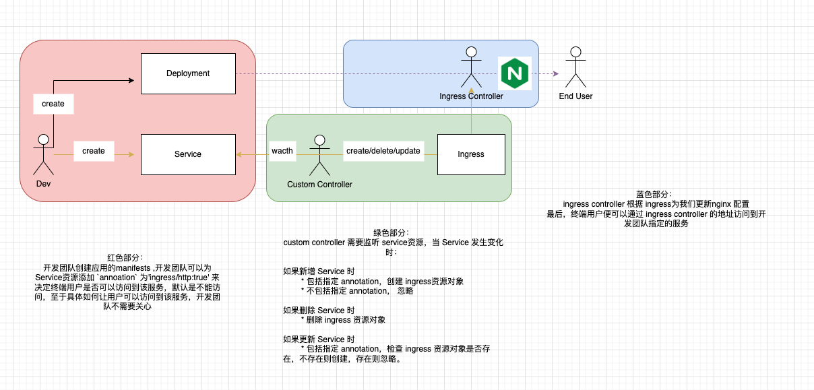
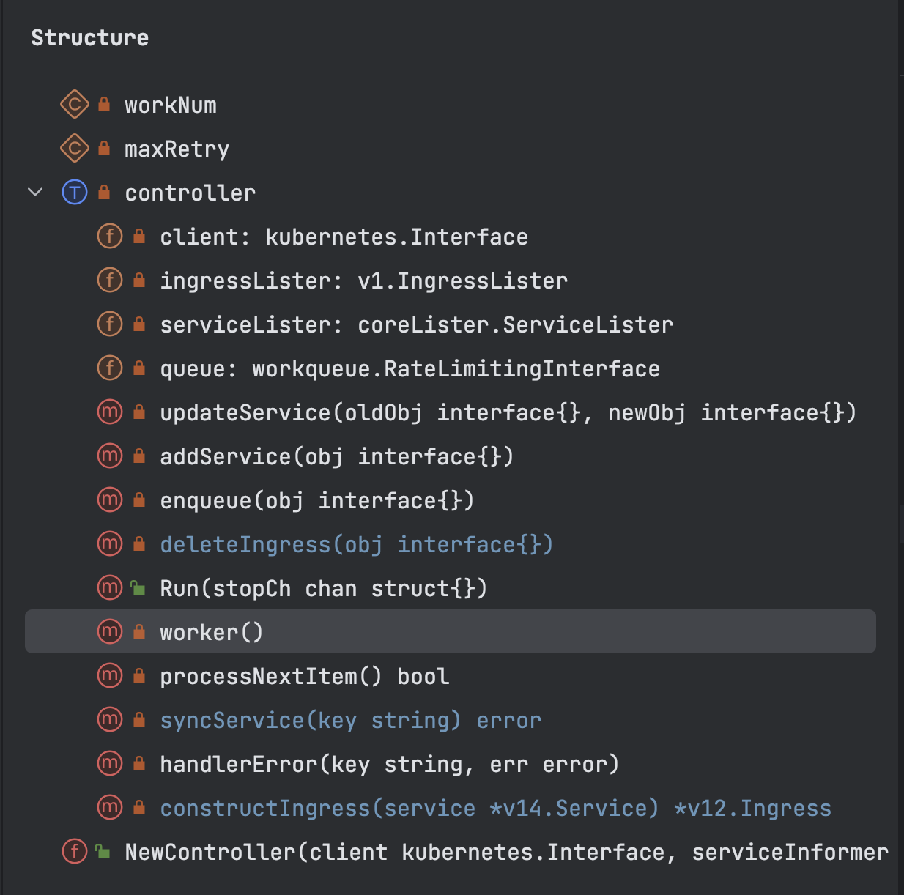
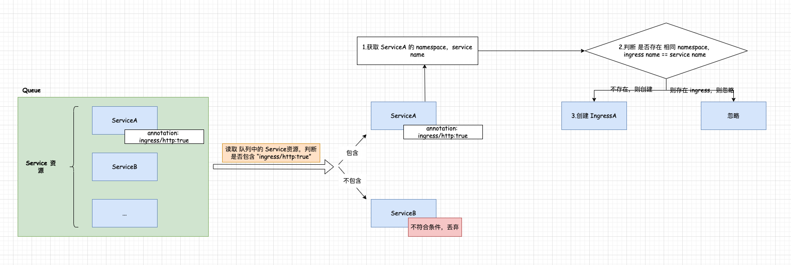

# Kubernetes Operator 入门实践 - 开发 Operator 案例1    

## 背景 
如下图所示：    
      

开发团队开发完新应用，将服务部署到Kubernetes，再配置 Service，最后创建 ingress 来实现服务访问，为了减少开发人员对 ingress的管控，现在开发一个 Operator 来做 ingress的管理。      

## 管理规则描述 
### 1.创建 Service
若 Service资源可自动创建 ingress，需提前添加 `ingress/http: "true"`参数到 Service的 annotation中， 示例如下：     
例如：      
```yaml
# Please edit the object below. Lines beginning with a '#' will be ignored,
# and an empty file will abort the edit. If an error occurs while saving this file will be
# reopened with the relevant failures.
#
apiVersion: v1
kind: Service
metadata:
  annotations:
    ingress/http: "true" # 该参数
    kubectl.kubernetes.io/last-applied-configuration: |
      {"apiVersion":"v1","kind":"Service","metadata":{"annotations":{},"name":"bar-service","namespace":"default"},"spec":{"ports":[{"port":8080}],"selector":{"app":"bar"}}}
  creationTimestamp: "2024-03-31T14:49:37Z"
  name: bar-service
  namespace: default
``` 

### 2.更新 Service
检查 Service的 annotation是否包含`ingress/http: "true"`,若存在则忽略，若不存在创建。        

### 3.删除 Service  
删除 Service时，同时也自动删除 Ingress  

## client-go 实战   
目录结构：  
```bash     
➜  11 git:(main) ✗ tree .
.
├── go.mod
├── go.sum
├── main.go
└── pkg
    └── controller.go
``` 

### main.go 
```go
package main

import (
	"github.com/xinzhuxiansheng/client-go-demo/11/pkg"
	"k8s.io/client-go/informers"
	"k8s.io/client-go/kubernetes"
	"k8s.io/client-go/rest"
	"k8s.io/client-go/tools/clientcmd"
	"log"
)

func main() {
	// 1.config
	// 2.client
	// 3.informer
	// 4.add event hanlder
	// 5.informer.Start

	config, err := clientcmd.BuildConfigFromFlags("", clientcmd.RecommendedHomeFile)
	if err != nil {
		inClusterConfig, err := rest.InClusterConfig()
		if err != nil {
			log.Fatalln("can't get config")
		}
		config = inClusterConfig
	}

	clientset, err := kubernetes.NewForConfig(config)
	if err != nil {
		log.Fatalln("can't create client")
	}

	factory := informers.NewSharedInformerFactory(clientset, 0)
	serviceInformer := factory.Core().V1().Services()
	ingressInformer := factory.Networking().V1().Ingresses()

	controller := pkg.NewController(clientset, serviceInformer, ingressInformer)
	stopCh := make(chan struct{})
	factory.Start(stopCh)
	factory.WaitForCacheSync(stopCh)

	controller.Run(stopCh)
}

```

### pkg/controller.go           
      
```go
package pkg

import (
	"context"
	v14 "k8s.io/api/core/v1"
	v12 "k8s.io/api/networking/v1"
	"k8s.io/apimachinery/pkg/api/errors"
	v13 "k8s.io/apimachinery/pkg/apis/meta/v1"
	"k8s.io/apimachinery/pkg/util/runtime"
	"k8s.io/apimachinery/pkg/util/wait"
	informer "k8s.io/client-go/informers/core/v1"
	netInformer "k8s.io/client-go/informers/networking/v1"
	"k8s.io/client-go/kubernetes"
	coreLister "k8s.io/client-go/listers/core/v1"
	v1 "k8s.io/client-go/listers/networking/v1"
	"k8s.io/client-go/tools/cache"
	"k8s.io/client-go/util/workqueue"
	"reflect"
	"time"
)

const (
	workNum  = 5
	maxRetry = 10
)

type controller struct {
	client        kubernetes.Interface
	ingressLister v1.IngressLister
	serviceLister coreLister.ServiceLister
	queue         workqueue.RateLimitingInterface
}

func (c *controller) updateService(oldObj interface{}, newObj interface{}) {
	if reflect.DeepEqual(oldObj, newObj) {
		return
	}
	c.enqueue(newObj)
}

func (c *controller) addService(obj interface{}) {
	c.enqueue(obj)
}

func (c *controller) enqueue(obj interface{}) {
	key, err := cache.MetaNamespaceKeyFunc(obj)
	if err != nil {
		runtime.HandleError(err)
	}

	c.queue.Add(key)
}

func (c *controller) deleteIngress(obj interface{}) {
	ingress := obj.(*v12.Ingress)
	ownerReference := v13.GetControllerOf(ingress)
	if ownerReference == nil {
		return
	}
	if ownerReference.Kind != "Service" {
		return
	}
	c.queue.Add(ingress.Namespace + "/" + ingress.Name)
}

func (c *controller) Run(stopCh chan struct{}) {
	for i := 0; i < workNum; i++ {
		go wait.Until(c.worker, time.Minute, stopCh)
	}
	<-stopCh
}

func (c *controller) worker() {
	for c.processNextItem() {

	}
}

func (c *controller) processNextItem() bool {
	item, shutdown := c.queue.Get()
	if shutdown {
		return false
	}
	key := item.(string)

	err := c.syncService(key)
	if err != nil {
		c.handlerError(key, err)
	}
	return true
}

func (c *controller) syncService(key string) error {
	namespaceKey, name, err := cache.SplitMetaNamespaceKey(key)
	if err != nil {
		return err
	}

	// 删除
	service, err := c.serviceLister.Services(namespaceKey).Get(name)
	if errors.IsNotFound(err) {
		return nil
	}
	if err != nil {
		return err
	}

	// 新增 和 删除
	_, ok := service.GetAnnotations()["ingress/http"]
	ingress, err := c.ingressLister.Ingresses(namespaceKey).Get(name)
	if err != nil && !errors.IsNotFound(err) {
		return err
	}

	if ok && errors.IsNotFound(err) {
		// 创建 ingress
		ig := c.constructIngress(service)
		_, err := c.client.NetworkingV1().Ingresses(namespaceKey).Create(context.TODO(), ig, v13.CreateOptions{})
		if err != nil {
			return err
		}
	} else if !ok && ingress != nil {
		// 删除 ingress
		c.client.NetworkingV1().Ingresses(namespaceKey).Delete(context.TODO(), name, v13.DeleteOptions{})
		if err != nil {
			return err
		}
	}
	return nil
}

func (c *controller) handlerError(key string, err error) {
	if c.queue.NumRequeues(key) <= maxRetry {
		c.queue.AddRateLimited(key)
	}
	runtime.HandleError(err)
	c.queue.Forget(key)
}

func (c *controller) constructIngress(service *v14.Service) *v12.Ingress {
	ingress := v12.Ingress{}

	ingress.ObjectMeta.OwnerReferences = []v13.OwnerReference{
		*v13.NewControllerRef(service, v14.SchemeGroupVersion.WithKind("Service")),
	}

	ingress.Name = service.Name
	ingress.Namespace = service.Namespace
	pathType := v12.PathTypePrefix
	icn := "nginx"
	ingress.Spec = v12.IngressSpec{
		IngressClassName: &icn,
		Rules: []v12.IngressRule{
			{
				Host: "example.com",
				IngressRuleValue: v12.IngressRuleValue{
					HTTP: &v12.HTTPIngressRuleValue{
						Paths: []v12.HTTPIngressPath{
							{
								Path:     "/",
								PathType: &pathType,
								Backend: v12.IngressBackend{
									Service: &v12.IngressServiceBackend{
										Name: service.Name,
										Port: v12.ServiceBackendPort{
											Number: 80,
										},
									},
								},
							},
						},
					},
				},
			},
		},
	}

	return &ingress
}

func NewController(client kubernetes.Interface, serviceInformer informer.ServiceInformer,
	ingressInformer netInformer.IngressInformer) controller {
	c := controller{
		client:        client,
		ingressLister: ingressInformer.Lister(),
		serviceLister: serviceInformer.Lister(),
		queue:         workqueue.NewNamedRateLimitingQueue(workqueue.DefaultControllerRateLimiter(), "ingressManager"),
	}
	serviceInformer.Informer().AddEventHandler(cache.ResourceEventHandlerFuncs{
		AddFunc:    c.addService,
		UpdateFunc: c.updateService,
	})
	ingressInformer.Informer().AddEventHandler(cache.ResourceEventHandlerFuncs{
		DeleteFunc: c.deleteIngress,
	})
	return c
}
```

## 测试 
上面代码的处理部分，本人入门go不久，也可了解（这里会涉及到 client-go 的API的熟悉程度差异），上面的代码并没有什么特殊处理，几乎所有的方法都是基于 client-go 对 Kubernetes 资源的操作（增删改查）。   

### 1.利用 kind 搭建本地 Kubernetes 开发环境            
可访问Blog `http://xinzhuxiansheng.com/articleDetail/115` 利用 kind 搭建本地 Kubernetes开发环境。       

### 2.使用官网案例，测试 ingress    
若你苦于没有测试示例的yaml，可直接使用 kind的ingress示例，可访问官网 `https://kind.sigs.k8s.io/docs/user/ingress/#using-ingress`   

若你执行完yaml, 可检查 svc，ingress 资源；     
```bash
# 查看 POD 资源
➜  ~ kubectl get pod -A
NAMESPACE            NAME                                                  READY   STATUS      RESTARTS        AGE
default              bar-app                                               1/1     Running     1 (2d23h ago)   3d11h
default              foo-app                                               1/1     Running     1 (2d23h ago)   3d11h
......


# 查看 Service 资源
➜  ~ kubectl get svc -A
NAMESPACE       NAME                                 TYPE        CLUSTER-IP      EXTERNAL-IP   PORT(S)                      AGE
default         bar-service                          ClusterIP   10.96.136.229   <none>        8080/TCP                     3d11h
default         foo-service                          ClusterIP   10.96.240.64    <none>        8080/TCP                     3d11h
......


# 查看 Ingress 资源
➜  ~ kubectl get ingress -A
NAMESPACE   NAME              CLASS    HOSTS         ADDRESS     PORTS   AGE
default     example-ingress   <none>   *             localhost   80      3d11h
......  
```

### 3.梳理测试流程  
      

>注意，该案例并不需要注意 ingress的创建是否有效可用，只要达到我们理解的预期即可。       

在 `controller.go` 代码片段：   
```go
_, ok := service.GetAnnotations()["ingress/http"]
ingress, err := c.ingressLister.Ingresses(namespaceKey).Get(name)
if err != nil && !errors.IsNotFound(err) {
    return err
}
```
判断 service 是否包含 `ingress/http`,  不存在且 ingress已存在，则忽略。    


refer   
1.https://www.bilibili.com/video/BV1NF411x7Qw/?spm_id_from=333.788&vd_source=89b3f4bd088c6355f40a00df74cf8ffd             
2.https://github.com/kevinlisr/baidingtech/blob/main/11/pkg/controller.go           

