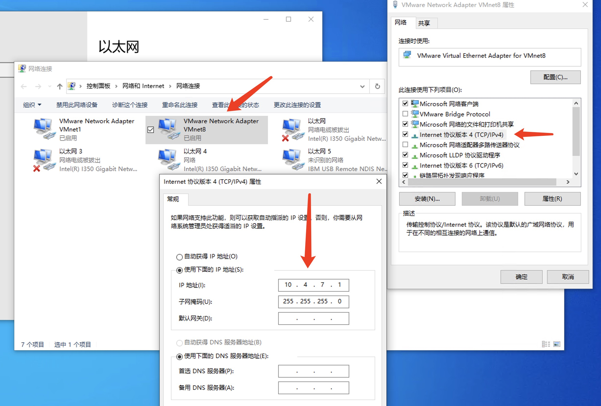
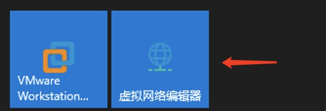
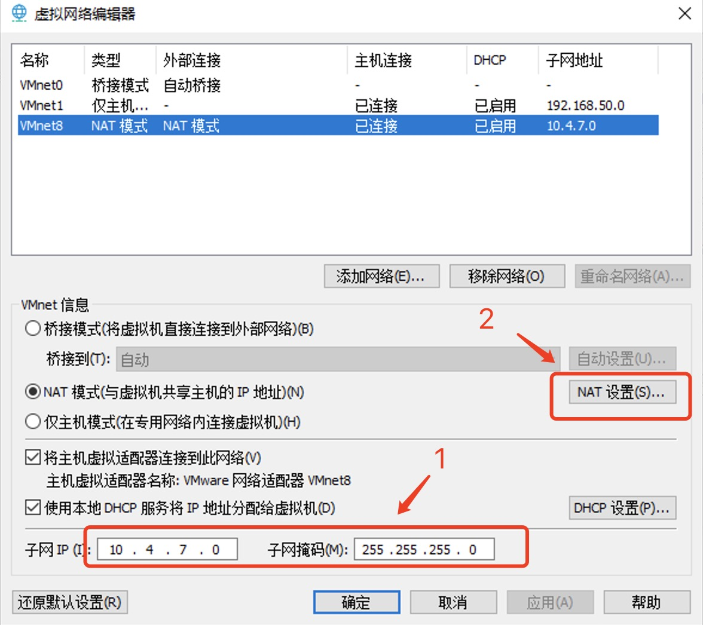

> 以下操作，参考 https://github.com/ben1234560/k8s_PaaS/blob/master/%E7%AC%AC%E4%BA%8C%E7%AB%A0%E2%80%94%E2%80%94%E4%BC%81%E4%B8%9A%E9%83%A8%E7%BD%B2%E5%AE%9E%E6%88%98_K8S.md  
以Windows操作系统为宿主机系统 

# VMware Wrokstation配置虚拟机的静态IP

## VMware Workstation相关配置
VM配置静态IP

`步骤`

### 1. VMware Network Adapter VMnet8配置 
```
IP地址： 10.4.7.1
子网掩码： 255.255.255.0
``` 


### 2. VMware 虚拟网络编辑器配置
打开VMware的虚拟网络编辑器  


虚拟网络编辑器配置  
```
#DHCP配置
子网IP： 10.4.7.0
子网掩码： 255.255.255.0

#NAT配置
网关IP： 10.4.7.254
```



### 3. 虚拟机设置

`网络适配器`
```
NAT模式： 用于共享主机的IP地址
```


`克隆虚拟机，重新生成Mac地址` 
```
虚拟机设置  -->  高级(button)  -->  生成(button)
```
  

>特别注意：克隆虚拟机，一定要重新生成MAC地址  


## 虚拟机安装

### 最小化安装
```
# 忽略虚拟机创建
CentOS 选择最小化Minimal安装
```

>在进入CentOS安装界面时，无需选择网络 

### 网络配置
```
#根据自身系统环境
vi /etc/sysconfig/network-scripts/ifcfg-xxx
#like ifcfg-ens33

#修改内容：
BOOTPROTO=static
ONBOOT=yes
IPADDR=10.4.7.11
GATEWAY=10.4.7.254
NETMASK=255.255.255.0
DNS1=10.4.7.254
``` 
  
>注意：DNS1的配置，这个需要根据自己环境测试，若不能联网，配置成114.114.114.114
